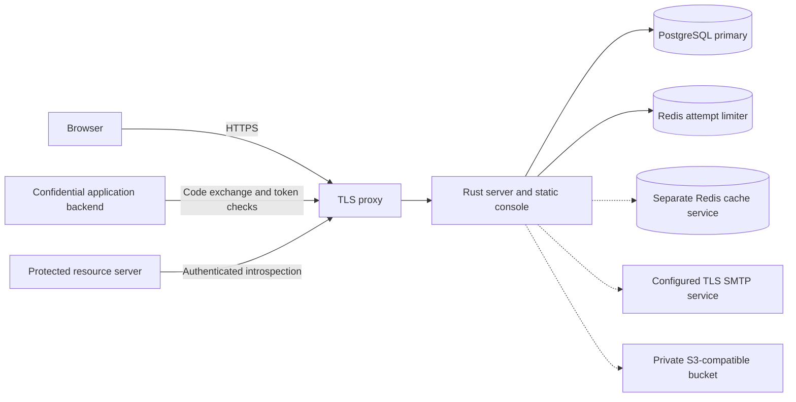

# Darkhorse

<p>
  
</p>

Darkhorse centralizes identity and access for one organization and its applications.
Rust owns the server, protocol endpoints, sessions, background workers, and local CLI.
SvelteKit supplies a static TypeScript console. PostgreSQL stores authoritative
security state. Separate Redis services support shared attempt limits and cache isolation.

**Development status:** Darkhorse has no qualified production release. The project
license remains undecided. Read the [implementation status](docs/implementation-status.md),
[release requirements](docs/release-readiness.md), and [third-party notices](docs/third-party-notices.md).

## System at a glance



The dashed edges describe optional facilities or reserved cache infrastructure.
Redis does not supply positive authorization decisions. Each new authorization
check reads current primary state, including committed revocation and permission changes.

## Implemented capabilities

| Area              | Current behavior                                                                                                            |
| ----------------- | --------------------------------------------------------------------------------------------------------------------------- |
| Authentication    | Password login, Rust-owned opaque browser sessions, shared login attempt limits                                             |
| OpenID Connect    | Confidential clients, authorization code with S256 PKCE, discovery, JWKS, signed RS256 ID tokens                            |
| Credentials       | Opaque access tokens, rotating session-bound refresh tokens, personal API keys                                              |
| Authorization     | Application-scoped roles, explicit capabilities, resource scope limits, immutable credential ceilings                       |
| Token checks      | Scoped UserInfo, client and resource-server introspection, client-bound revocation                                          |
| Account lifecycle | Invitation-only onboarding, current-email verification, individual session termination, account deactivation and revoke-all |
| Console           | User directory, client and access catalogs, extended profiles, private pictures, login branding                             |
| Operations        | Rust CLI, separate database roles, durable limiter activation records, Compose and Kubernetes packaging                     |

Back-channel logout has persisted relying-party session references and signed
`sid` claims. Notification delivery remains unimplemented. Password recovery,
email changes, passkeys, delegated administration, and authorization computation
caching remain open work. The [status reference](docs/implementation-status.md)
links each boundary to its guide and issue.

## Quick start

Install Rust through rustup, Node **24.19.0**, pnpm **11.19.0**, and GNU Make
**3.81 or newer**. The repository pins Rust **1.97.1**. macOS and Linux are the
intended development platforms.

```sh
make help
make deps-install
make check
make build
```

Dependency installation uses the network. Installed dependencies suffice for unit
tests. Those tests require no settings, private files, Docker, databases, Redis,
certificates, or browser installation. Rust checks use locked offline dependencies.

To run the management portal, install Docker with Compose and Caddy **2.11.4**.
Then follow [the password-portal setup](docs/development.md#run-the-password-portal).
It provisions local secrets, applies migrations, creates the first administrator,
and establishes the limiter generation. The recovery wait is **904 seconds**.
Open [https://localhost:8443](https://localhost:8443) after `make dev-login` starts.

`make dev` runs the unauthenticated foundation preview. `make dev-login` runs the
prepared login and management stack. `make dev-provider` adds the configured OIDC
provider. `make dev-media` adds the prepared object store. The [development guide](docs/development.md)
explains these commands and their prerequisites.

## Documentation

Start with the [documentation index](docs/README.md).

| Goal                                                      | Guide                                                                                                |
| --------------------------------------------------------- | ---------------------------------------------------------------------------------------------------- |
| Understand trust, dependencies, and transaction ownership | [Architecture](docs/architecture.md)                                                                 |
| Integrate an application                                  | [OIDC provider](docs/provider.md), [registration](docs/registration.md)                              |
| Protect an API                                            | [Resource introspection](docs/resource-introspection.md), [authorization](docs/authorization.md)     |
| Configure a deployment                                    | [Configuration](docs/configuration.md), [Compose](docs/compose.md), [Kubernetes](docs/kubernetes.md) |
| Operate the server from a terminal                        | [CLI](docs/cli.md), [operator authority](docs/operator-authority.md)                                 |
| Review evidence and unresolved risks                      | [Verification](docs/verification.md), [release qualification](docs/release-readiness.md)             |
| Contribute                                                | [Contributing](CONTRIBUTING.md), [engineering rules](docs/engineering.md)                            |

## Repository structure

| Directory            | Responsibility                                                          |
| -------------------- | ----------------------------------------------------------------------- |
| `crates/domain`      | Typed identities, policy computations, lifecycle rules                  |
| `crates/application` | Project-owned ports and use-case coordination                           |
| `crates/adapters`    | Axum, Serde, Clap, SQLx, Redis, cryptography, SMTP, and object storage  |
| `apps/server`        | Runtime construction, HTTP serving, shutdown, and maintenance workers   |
| `apps/console`       | Static SvelteKit application, TypeScript, and shadcn-svelte components  |
| `scripts`            | Development, deployment, measurement, and verification commands         |
| `config`             | Local HTTPS and dependency configuration                                |
| `deploy`             | Container packaging, Kubernetes manifests, and reviewed database grants |

Tests mirror source paths under `tests/unit`. Dependencies point toward the domain.
Framework types remain in adapters and the composition root.

## Work tracking and security reports

Contributions use an issue, a feature branch or fork, and a reviewed pull request.
Each commit references its issue. [GitHub issues](https://github.com/OneTesseractInMultiverse/darkhorse-identity/issues)
record implementation and qualification work separately.

Report suspected vulnerabilities through the private channel in [SECURITY.md](SECURITY.md).
