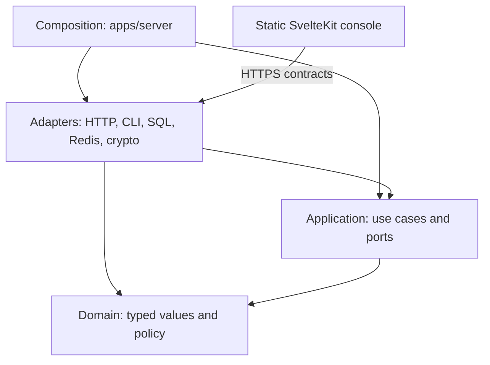
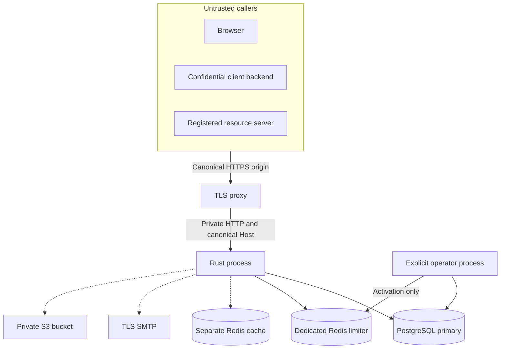
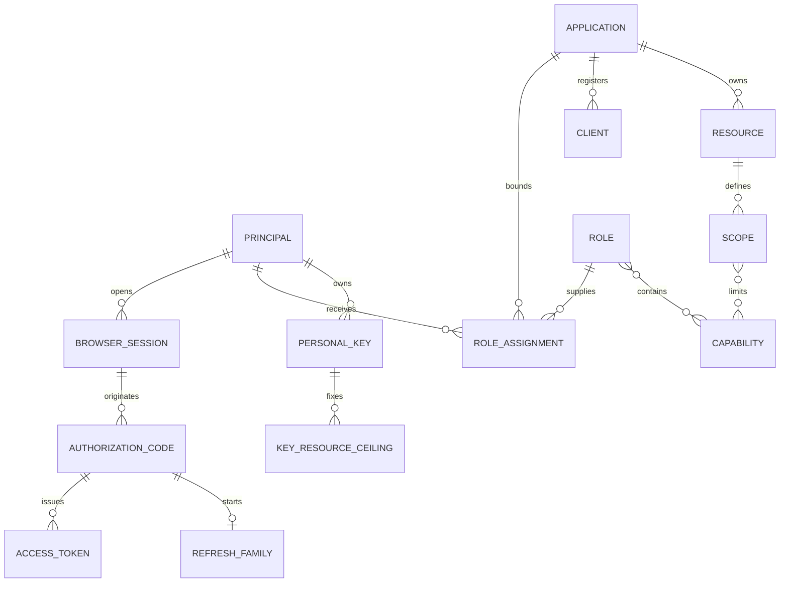
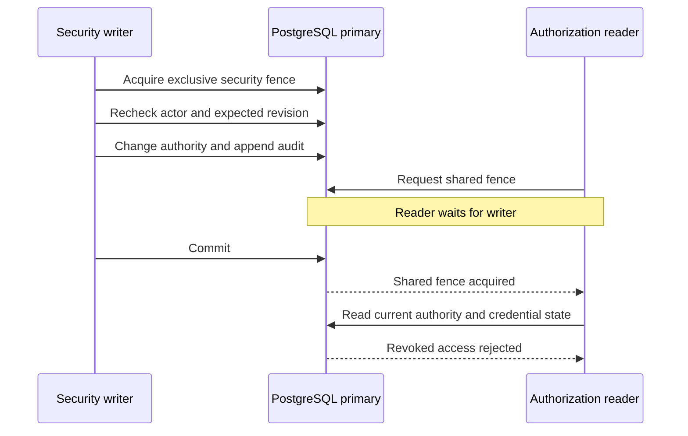

# Architecture and security boundaries

Darkhorse serves one organization per deployment. It separates identity, delegated
access, application policy, and deployment authority. PostgreSQL holds their current
state. Every new authorization check reads the primary database.

The implementation favors explicit consistency over cached positive decisions.
A completed revocation changes subsequent checks. A previously completed check
cannot retract work already accepted by another service.

## Code dependencies



Arrows represent source dependencies, except the labeled browser connection.
Dependencies point inward. The domain has no framework or infrastructure dependency.
The application declares project-owned ports for effects required by actual use cases.
Adapters implement those ports and translate library-specific types.

| Layer       | Responsibility                                                                  | Source                                                |
| ----------- | ------------------------------------------------------------------------------- | ----------------------------------------------------- |
| Domain      | Validate values, compute transitions, intersect authority, reject invalid state | [`crates/domain/src`](../crates/domain/src)           |
| Application | Coordinate ports and computations using explicit inputs                         | [`crates/application/src`](../crates/application/src) |
| Adapters    | Enforce transport bounds, implement storage and cryptography, map errors        | [`crates/adapters/src`](../crates/adapters/src)       |
| Composition | Select commands, load settings, construct dependencies, supervise workers       | [`apps/server/src`](../apps/server/src)               |
| Console     | Present state, collect input, call Rust APIs, handle uncertain outcomes         | [`apps/console/src`](../apps/console/src)             |

Functions follow one of two roles. A computation transforms explicit inputs without
external effects. A coordinator sequences effects and calls computations. Review
must inspect transaction ownership and policy placement, not just crate imports.

Identifiers have distinct domain types. A principal identifier cannot substitute
for a client identifier. Their UUID representation supplies a reference, not authority.
The [engineering rules](engineering.md) define these constraints and their test structure.

## Runtime and trust



Dashed edges describe optional services or reserved cache infrastructure. The cache
service has no positive authorization role. SMTP and object storage require explicit
configuration. The browser never connects directly to PostgreSQL, Redis, or private objects.

Rust owns all server behavior. SvelteKit produces static assets with TypeScript and
Svelte 5. Node serves development assets and builds the console. It is absent from
the production application runtime.

The proxy terminates TLS and preserves the canonical `Host`. Rust does not trust
forwarded headers as proof of origin, scheme, or caller identity. Network isolation
must prevent public access to the plain HTTP listener.

## Different forms of authority

| Subject                | Authority source                                                 | Boundary                                                             |
| ---------------------- | ---------------------------------------------------------------- | -------------------------------------------------------------------- |
| Browser user           | Live session, active account, credential epoch                   | Owner operations or explicit platform administrator membership       |
| Platform administrator | Current membership and recent password authentication for writes | Directory and catalog administration, no resource-access bypass      |
| OAuth client           | Registered confidential client and secret verifier               | Its callbacks, flow policy, resource allowances, and token ownership |
| Resource server        | Separate resource credential                                     | Introspection for one registered audience                            |
| Personal API key       | Live user authority intersected with its issuance ceiling        | One application and selected resources                               |
| Operator command       | Deployment credentials and command-specific checks               | See the [authority matrix](operator-authority.md)                    |
| Database owner         | Schema ownership                                                 | Trusted authority outside ordinary runtime restrictions              |

Application ownership records a contact. It grants no administrator membership or
resource permission. An ID token authenticates an OIDC event to its client. It is
not a protected API access token.

## Conceptual data model



This diagram describes logical relationships, not literal table names or every
foreign key. Explicit bindings attach shared role and capability definitions to
applications. [Authorization](authorization.md) defines the permitted graph and set operations.

## Transactions and revocation

Security writers take an exclusive lock on the singleton security state. Relevant
readers take a shared fence, then read current facts in the transaction. A writer
cannot commit through that fence. A reader starting after a committed change sees
the changed authority.



Expected revisions detect stale administrative edits. Credential epochs invalidate
previously issued user credentials. Immutable issuance ceilings prevent later policy
expansion from increasing an existing credential's authority. These mechanisms
solve different problems and remain separate.

A global fence simplifies reasoning but creates a contention point. Current loads
require measurement against the [performance methodology](performance.md). A policy
revision alone does not prove that a cached decision remains valid.

A resource server must introspect each request under the immediate-revocation
contract. Caching an active response introduces a stale-access interval. A successful
check does not make the resource server's later database write atomic with Darkhorse.

## Consistency assumptions

Let `C` be a committed revocation and `Q` a new authorization check. The contract is:

```text
commit(C) precedes start(Q)  =>  Q evaluates the state containing C
```

For a revoked credential, that state denies access. An overlapping reader can
finish first under its shared fence. The writer then commits after the reader
releases the protected state. This ordering defines the local consistency boundary.
It does not promise cancellation of responses already in transit.

Read Committed transactions take a new statement snapshot. The adapter acquires
the security fence in a preceding statement, then loads policy. Combining both
operations into one statement could retain a snapshot from before a lock wait.
The [projection implementation](../crates/adapters/src/postgres/resource_authority/projection.sql)
and its callers preserve the separate-read ordering.

| Invariant                                   | Mechanism                                               | Assumption                                                   |
| ------------------------------------------- | ------------------------------------------------------- | ------------------------------------------------------------ |
| Credential authority cannot exceed issuance | Immutable ceilings and set intersection                 | Stored facts satisfy the validated graph                     |
| Committed reductions affect new checks      | Primary reads and matching reader/writer fences         | All supported mutations follow the same lock discipline      |
| Expired credentials cannot authorize        | Database time checked after blocking reads              | Database time remains within the supported clock contract    |
| Successful security changes retain audit    | State and audit commit in one transaction               | Audit storage is available and schema controls remain intact |
| Lost limiter continuity rejects attempts    | PostgreSQL generation binding and Redis identity checks | Recovery uses fencing and the complete wait                  |

These are implementation contracts with targeted tests. They are not a formal
proof against arbitrary privileged SQL, compromised hosts, or a restored stale
database. A restored snapshot can resurrect old authority. Returning it to service
requires an explicit revocation reconciliation or credential invalidation design.

## Effects outside PostgreSQL

| Effect             | Commit boundary                                             | Failure handling                                                |
| ------------------ | ----------------------------------------------------------- | --------------------------------------------------------------- |
| Password hashing   | Outside the security transaction                            | Recheck the exact credential and actor after hashing            |
| Media upload       | Pending record, object write, final publication transaction | Recheck authorization and revision, then clean orphaned objects |
| Email delivery     | Durable queue followed by SMTP                              | Leases and bounded retries, possible duplicate delivery         |
| Limiter activation | Durable intent, Redis initialization, PostgreSQL receipt    | Inspect durable evidence, then follow waited recovery           |
| ID-token signing   | Bounded local signing inside code-exchange transaction      | Signing failure rolls back code consumption and issuance        |

No distributed transaction covers Redis, SMTP, or object storage. Their protocols
record enough state to detect uncertainty or retry a defined effect. A transport
failure after commit does not prove rollback. Administrative clients must reread
state before choosing another mutation.

## Resource bounds and overload

Each transport defines limits for bytes, fields, concurrency, and time. Expensive
password and image work has separate admission permits. Saturation rejects work
instead of creating an unbounded queue. Database and Redis pools have explicit limits.

Pool limits apply per process. Replica counts and parallel operator commands multiply
the total connection budget. Kubernetes reports conservative namespace budgets through
`make kube-budgets`. Limits constrain resource use. They do not establish a throughput guarantee.

## Evidence and residual risks

The code includes isolated policy tests, real database races, dependency failures,
HTTPS browser checks, and packaged deployment fixtures. [Verification](verification.md)
states their measured scope.

Production qualification remains open. Major concerns include privileged MFA,
recovery assurance, broad runtime DML, audit retention, cross-service restoration,
external protocol conformance, and sustained multi-host load. The
[release requirements](release-readiness.md) track those boundaries without treating
functional implementation as certification.

## Source reference

[composition](../apps/server/src/authentication.rs),
[workspace dependencies](../Cargo.toml),
[bounded policy projection](../crates/adapters/src/postgres/resource_authority/projection.sql).
