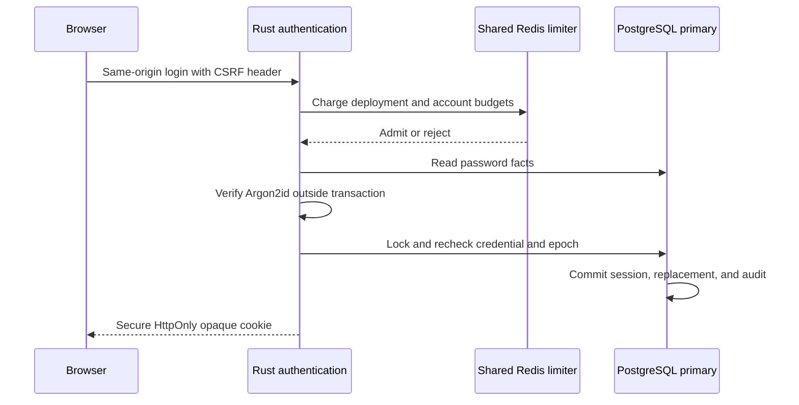

# Password login and browser sessions

Darkhorse verifies an active account's password and creates a Rust-owned browser
session. That session supports the console and OIDC authorization. Authentication
currently uses passwords only. Privileged MFA, password screening, operational
qualification, and independent review remain release requirements.
[Back-channel notification delivery](backchannel-logout.md) remains incomplete.



The charge precedes account lookup. Successful hashing alone cannot create a session.
The committing transaction must accept the current credential facts.

## Browser contract

| Endpoint                | Result                                                                     |
| ----------------------- | -------------------------------------------------------------------------- |
| `POST /api/auth/login`  | JSON email/password. Fresh cookie and public display name on success.      |
| `GET /api/auth/session` | Current display name after an authoritative session check.                 |
| `POST /api/auth/logout` | Revoke the current handle and clear its cookie. Repeat logout is harmless. |

Unsafe browser methods require the exact configured HTTPS `Origin`, `X-Darkhorse-CSRF: 1`, and a
canonical `Host`. Login accepts only JSON. No CORS permission is granted. A supplied
Fetch Metadata site must be `same-origin`. Missing/duplicate security headers,
query strings and ambiguous session cookies are rejected. The custom header plus
strict origin checking protects this first-party JSON interface from CSRF. It is
not an OAuth protocol endpoint or a secret authentication credential.

The `__Host-darkhorse` cookie contains 256 random bits, with `Secure`, `HttpOnly`,
`Path=/`, `SameSite=Lax`, and no Domain. The browser never receives application
tokens or a password verifier. Nothing is put in local/session storage or URLs.
Only SHA-256 of the random session handle is persisted. Encrypting this opaque
handle would add no confidentiality for a payload: there is no payload in it.

Sessions have a 15-minute idle limit and an eight-hour absolute limit, checked
using primary database time. The current-session endpoint updates the idle timestamp transactionally. Session
directory reads do not.
Clock regression fails closed. Login replaces a known prior handle atomically.
Concurrent replacements have one winner. Independent initial sign-ins can create
independent sessions. A losing simultaneous login can clear the browser cookie.
Retry sign-in after concurrent requests finish. Unknown handles never select a
session identity. Expired/revoked handles never authenticate.

Session checks consult current account activation, credential status and epoch.
Deactivation and revoke-all invalidate earlier epochs. Reactivation cannot revive
them. Issuance rechecks the exact verified credential/hash and epoch under database
locks after password work. Future password-change and privilege-change workflows
must advance the epoch/re-authenticate, and enqueue required logout delivery.
This endpoint performs local session logout. The [session security page](sessions.md)
lets a live owner view and end individual sessions, invalidating their
associated code/access/refresh checks. Logout notification delivery is unfinished.

Credential failures return the same `401` body for unknown users, wrong passwords
and inactive accounts. Both unknown and inactive accounts perform a policy-matched
hash verification. `429` includes Retry-After. Unavailable dependencies/overload
return `503`. Failed logout does not report success or discard the cookie.

## Password work and limits

- Argon2id v19, 64 MiB, three iterations, one lane, 16-byte random salt and 32-byte
  output. Stored PHC parameters must match exactly before verification can run.
  Only this policy exists today. Accepting an older policy requires an explicit
  bounded verification and upgrade design.
- Password bytes are preserved. Login accepts at most 512 UTF-8 bytes. Enrollment
  retains its separate length policy. HTTP bodies are limited to 4 KiB.
- One hashing slot per process with immediate rejection when occupied. No
  application hash queue. The blocking worker owns its permit through completion,
  even after cancellation. At most one 64 MiB Argon2 operation is scheduled by the
  HTTP password service at a time. This is not a claim that total process memory
  is 64 MiB. Thirty-two in-flight authentication HTTP requests and a ten-second
  request deadline bound application work ahead of hashing.
- Redis atomically charges 120 attempts/minute across the deployment, five/minute
  per canonical account and 30/15 minutes per canonical account. These are initial
  conservative server-owned limits, not measured capacity promises. No account
  existence lookup precedes charging. The fixed windows can admit bursts at a
  boundary. Limits permit denial-of-service against a known account. Recovery
  and further abuse controls need deployment-specific evaluation.
- HMAC-SHA256 keys hide account identifiers in Redis. All replicas require the
  same randomly generated deployment key. Startup pins its SHA-256 fingerprint in
  PostgreSQL and rejects a different key. Do not replace this key: supported key
  rotation needs an explicit coordinated recovery workflow. A lost/mismatched
  key requires operator recovery, never silent creation of fresh budgets.
- The [Redis continuity and recovery contract](redis.md) applies. A fenced,
  unavailable, full or untrusted limiter denies login. Redis holds no reusable
  positive session or authorization result.

These choices follow the [OWASP password storage guidance](https://cheatsheetseries.owasp.org/cheatsheets/Password_Storage_Cheat_Sheet.html),
[authentication guidance](https://cheatsheetseries.owasp.org/cheatsheets/Authentication_Cheat_Sheet.html),
[session guidance](https://cheatsheetseries.owasp.org/cheatsheets/Session_Management_Cheat_Sheet.html),
and [CSRF guidance](https://cheatsheetseries.owasp.org/cheatsheets/Cross-Site_Request_Forgery_Prevention_Cheat_Sheet.html).

## Configuration and development

Login defaults to disabled (`503` at authentication endpoints). Activate it with
`DARKHORSE_LOGIN_ENABLED=true`, a 64-character lowercase hexadecimal random
`DARKHORSE_LOGIN_LIMIT_KEY`, and the existing database/Redis settings. Migrate
explicitly before starting the server. Runtime needs SELECT/INSERT on
`login_budget_policy`, SELECT/INSERT/UPDATE on `browser_sessions`, and existing
read/limiter permissions, plus the [session audit and security fence permissions](sessions.md#upgrade-and-operations).
Use the complete [reviewed grant policy](database-authority.md) for packaged deployments.
Migration ownership remains separate. Private deployment
secret distribution must give all replicas the same key.

Local setup, preserving existing credentials:

```sh
make db-setup redis-setup login-setup https-setup
make db-up redis-up db-migrate
make bootstrap
make limiter-fence
make limiter-status
# Wait the full recovery interval shown by status (at least 904 seconds).
make limiter-activate
make dev-login
```

An already active limiter does not need fencing for ordinary server restarts.
`make dev-login` reads private local credentials, strips Redis operator secrets,
and starts Rust, frontend HMR and Caddy at `https://localhost:8443`. It never
bypasses recovery. `make dev` remains a dependency-free foundation preview.
Authentication requires explicit configuration.

The production Rust listener speaks HTTP behind a TLS-terminating proxy. Keep it
private and reachable only through trusted deployment networking. Preserve the
canonical Host. Reject public plaintext traffic at the proxy. Forwarded and
X-Forwarded-* headers never establish origin, scheme or rate-limit identity.
There is no per-IP policy in this milestone. Account and deployment budgets apply.
Do not log credential bodies/cookies at a proxy. Static output has a hash-based
script CSP. Rust adds frame restrictions, nosniff, no-referrer and no-store headers.
The HMR server is a local development tool, never a production session server.

Expiry is enforced without a cleanup job. Operators must plan bounded deletion of
expired session rows, monitoring, backup/restore, session
retention and pool sizing before a long-running deployment. Session audit and token/code foreign keys must be included in that retention design.
Session checks make
primary database round trips and serialize concurrent checks for the same handle.
Load qualification is still required. No high-throughput SLO is claimed yet.

## Verification

`make check` runs service-free tests and static checks. `make test-postgres` checks
real session transitions and races. `make test-redis` verifies actual password
login, replica-wide limits and fail-closed behavior. For the complete static portal:

```sh
make browser-install
make test-browser
```

The browser suite owns disposable PostgreSQL/Redis fixtures, a private temporary
CA and Rust process. An independent HTTPS probe verifies the certificate chain
and localhost hostname and rejects an untrusted chain. Chromium pins only that
fixture's leaf public key for its process. No global certificate-error bypass or
host trust change is used. Tests cover actual form input, generic denial, cookie
attributes, reload, rotation, CSRF, logout, revocation and limiter fencing. Local
screenshots omit passwords and tokens. No traces/videos are captured. This is
Chromium evidence, not cross-browser or full accessibility certification.

The 100% authored-code target remains. Pure-core, unit, combined Rust and browser
reports have different denominators. Do not equate passing these functional
checks with complete whole-system coverage or production readiness.

## Recorded evidence

[Verification](verification.md#recorded-implementation-baseline) records the current
consolidated baseline and coverage limits. Historical login-only counts do not
describe the current repository.

## Source reference

[application ports](../crates/application/src/authentication.rs),
[password and session policy](../crates/domain/src/authentication.rs).
