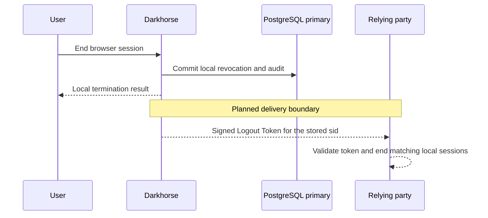

# Back-channel logout

## Implemented: application session references

New ID tokens include a signed `sid` identifying the relying party (RP) session.
An RP is the client application relying on Darkhorse for sign-in. The reference
is a random UUID, bound to the exact issuer, registered client, principal and
Darkhorse browser session. It is independent of the secret cookie handle and the
public identifier used by the account's session directory.

Repeated successful code exchanges for the same issuer, client and browser session
reuse the same `sid`. Another client or a fresh Darkhorse login gets a different
one. A client should retain the validated `(iss, aud, sub, sid)` alongside its own
server-side session. The value is a reference, never an authentication credential.
All application sessions created from the same Darkhorse session for that client
share the reference, including separate authorizations in different tabs.

Code redemption creates the association, signs the ID token, persists opaque
credentials and records the association in the immutable redemption audit in one
transaction. Signing, persistence or audit failure rolls everything back. A lost
response may leave a committed association, just as it may leave committed tokens.
The existing code replay rules apply. Concurrent redemptions converge on one
association through a unique database constraint. Each lookup uses current primary
state. No Redis authorization cache is introduced.

Existing ID tokens remain unchanged. An upgrade cannot recover session references
that were never sent to clients, so historical associations and audit fields are
not fabricated. Clients needing a session reference must complete another valid
authorization-code exchange. Refresh responses continue to omit ID tokens.

Discovery lists `sid` in `claims_supported`. **Back-channel notification delivery
is not implemented or advertised yet.** Adding this claim alone does not notify
applications or terminate their local sessions. Access and refresh tokens remain
opaque. This is the session-binding prerequisite for
[issue #14](https://github.com/OneTesseractInMultiverse/darkhorse-identity/issues/14).

Solid messages describe implemented local termination. Dashed messages below
the note describe planned notification behavior, not an available endpoint.

## Planned termination contract

The notification implementation will use the session-specific profile from the
[OpenID Connect Back-Channel Logout specification](https://openid.net/specs/openid-connect-backchannel-1_0.html).
Every notification will identify an already-selected `sid`. Subject-wide messages
without a `sid` will not be used. A delayed notification must not terminate a newer
Darkhorse login, which has a different reference.

| Trigger                                                                     | Local effect                                                                | Planned notification targets                           |
| --------------------------------------------------------------------------- | --------------------------------------------------------------------------- | ------------------------------------------------------ |
| Application-local sign-out                                                  | The application ends its own session. No Darkhorse transition               | None                                                   |
| Darkhorse sign-out, login replacement or owner-selected session termination | End exactly that browser session. Its code/access/refresh checks fail       | Participating clients bound to that session            |
| Account revoke-all or deactivation                                          | Existing credential epochs become invalid. Reactivation cannot restore them | Participating clients of the affected earlier sessions |
| Password credential revocation                                              | Sessions bound to that credential fail live checks                          | Participating clients of those affected sessions       |
| Access-token revocation or refresh-family revocation                        | Only the selected credential/family is invalidated                          | None. The browser session remains live                 |

Password recovery/change, broader administrator session controls, and expiry
notifications need separate trigger integration. [Personal API keys](personal-api-keys.md)
are implemented and survive ordinary browser logout. Account epoch changes
invalidate them. Offline grants remain unsupported.

Remaining #14 work includes registered HTTPS destinations, signed `logout+jwt`
messages and receiver validation, atomic revocation/audit/outbox intent, bounded
delivery/retry/retention, protected network destinations and DNS handling, separate
local/remote status, and a reference receiver. Notification failure must never
reverse local revocation. RP-initiated browser logout is still a separate pending
profile decision.

## Upgrade and verification

Stop application writers and apply migration `0016` before running the updated
provider. It adds immutable `relying_party_sessions` and a nullable reference on
historical `token_audit` records. New redemption audit inserts require a matching
reference. The provider runtime needs SELECT/INSERT on the association table and
its existing audit privileges. No browser or HTTP management endpoint exposes this
table. Migration privileges remain separate from runtime privileges.

Associations and audits are retained. The future retention design must account for
their foreign keys before deleting browser sessions or clients. The unique index
and browser-session index bound individual lookups. Total storage growth, delivery
fan-out limits and production capacity remain unqualified. No throughput increase
is claimed for this change.

`make test-unit` checks typed identifiers, signed claim construction and the
reference client's signature/session validation. `make test-postgres` covers
concurrent convergence, persistence across independent pools, client/principal/
new-login isolation, local revocation, rollback, immutable constraints and upgrade
preservation. `make test-browser` checks the claim through real HTTPS issuance,
independent signature verification and repeated authorization. These checks do not
establish completed logout delivery, conformance or production readiness.

## Source reference

[relying-party references](../crates/adapters/src/postgres/tokens/relying_party.rs).
