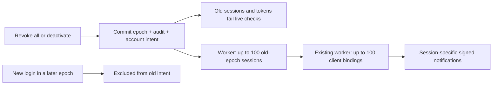
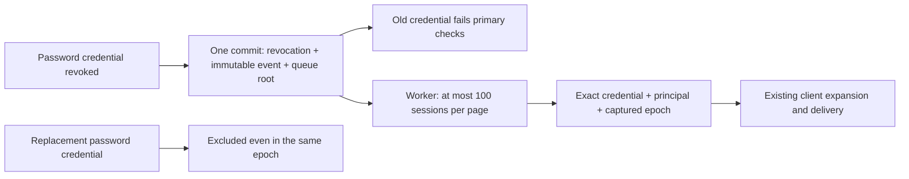

# Back-channel logout

## Implemented: application session references

New ID tokens include a signed `sid` identifying the relying party (RP) session.
An RP is the client application relying on Darkhorse for sign-in. The reference
is a random UUID, bound to the exact issuer, registered client, principal and
Darkhorse browser session. It is independent of the secret cookie handle and the
public identifier used by the account's session directory.

Repeated successful code exchanges for the same issuer, client and browser session
reuse the same `sid`. Another client or a fresh Darkhorse login gets a different
one. A client should retain the validated `(iss, aud, sub, sid)` alongside its own
server-side session. The value is a reference, never an authentication credential.
All application sessions created from the same Darkhorse session for that client
share the reference, including separate authorizations in different tabs.

Code redemption creates the association, signs the ID token, persists opaque
credentials and records the association in the immutable redemption audit in one
transaction. Signing, persistence or audit failure rolls everything back. A lost
response may leave a committed association, just as it may leave committed tokens.
The existing code replay rules apply. Concurrent redemptions converge on one
association through a unique database constraint. Each lookup uses current primary
state. No Redis authorization cache is introduced.

Existing ID tokens remain unchanged. An upgrade cannot recover session references
that were never sent to clients, so historical associations and audit fields are
not fabricated. Clients needing a session reference must complete another valid
authorization-code exchange. Refresh responses continue to omit ID tokens.

Discovery lists `sid` in `claims_supported`. Registered clients can now receive
notifications for individual browser-session termination and account-wide
revocation or deactivation. The persistence layer also records password-credential
revocation for the credential's current account epoch. Provider-wide
`backchannel_logout_supported` metadata remains unadvertised until the remaining
triggers and receiver qualification are complete. Access and refresh tokens remain
opaque. This is an incremental implementation of
[issue #14](https://github.com/OneTesseractInMultiverse/darkhorse-identity/issues/14).

## Implemented: Logout Token signing

The Rust signing adapter can now produce session-specific Logout Tokens through
the separate `LogoutSigner` application port. The background delivery worker calls
it after claiming a committed notification. Signing itself does not authorize a
logout or select recipients.

Each message contains the exact issuer, one client audience, principal subject,
RP session reference, token identifier and issuance time supplied by the caller.
The domain computes expiration at 120 seconds after issuance and rejects overflow
or dates that cannot be represented exactly by JavaScript receivers. The payload
contains the back-channel logout event and cannot carry a nonce or authentication
time through this port. The protected header fixes `RS256`, `logout+jwt` and the
existing signing key's identifier.

The adapter reuses issuer-bound encrypted signing keys and AWS-LC signing. ID
tokens and Logout Tokens share the same four-worker admission budget on a signer
instance. Saturation fails immediately; the blocking operation owns its permit
until it finishes, including after its waiting caller is cancelled. The HTTP token
router and delivery worker share that signer instance. No additional key storage
or Redis authorization cache is introduced.

Every attempt selects the current active signing key and primary database time,
and generates a fresh random `jti`. The same notification ID and `sid` survive
retries; the signed message and its `jti` change. The existing 600-second public-key
verification overlap exceeds the token's 120-second lifetime. A missing key pauses
delivery without losing the committed intent. No throughput or production signing
capacity is claimed.

The test-only reference client validates the signature using Node's cryptography,
the exact issuer/audience, required subject/session/token references, integral
timestamps, the two-minute lifetime and expiry, the event object and absence of
nonce. Its deterministic profile uses an explicit clock with zero skew allowance.
It rejects ID tokens as logout messages and Logout Tokens as ID tokens. The
[reference receiver](#reference-receiver-and-application-integration) now combines
that validation with atomic replay handling and matching-session termination.
It is test tooling, not a deployed application endpoint or a general OIDC SDK.

## Destination registration

Open a client in the management console and select **Configure logout**. Each
client has one optional `backchannel_logout_uri`, independent of its authorization
callback URLs. Register the exact canonical HTTPS URL. Credentials and fragments
are prohibited; query parameters are supported but must not contain secrets.
Saving validates syntax and records the configuration; it does not contact or
prove ownership of the endpoint. An administrator must have authenticated within
the preceding five minutes to change it.

Darkhorse always requires `backchannel_logout_session_required: true`. An endpoint
must accept a form-encoded POST containing `logout_token`, verify the signature
and session binding, and end only sessions associated with that `sid`. Returning
HTTP 200 or 204 acknowledges acceptance. An application that already ended the
matching session should still acknowledge a valid duplicate. An unknown or newer
session must not be terminated.

The protected management API supports GET and PUT at
`/api/admin/applications/{application}/clients/{client}/logout`. The GET response
contains `configuration` and the latest 20 `deliveries`. Send the returned decimal
revision unchanged in a PUT; stale writes return conflict. A null URI disables
notifications. The write requires the browser cookie, same-origin checks and
`X-Darkhorse-CSRF: 1`, just like other management operations.

```json
{
  "revision": "0",
  "backchannel_logout_uri": "https://application.example/oidc/logout",
  "backchannel_logout_session_required": true
}
```

These are private management routes, not OAuth Dynamic Client Registration.
Client-secret authentication does not authorize configuration changes. Configuration
history and its audit are retained. Updating a URI or disabling it cancels pending
notifications tied to an older revision, including work not yet expanded into
individual deliveries. It never redirects old notifications to the new URI. A
request already in flight can finish after the change commits.

## Durable delivery

```mermaid
sequenceDiagram
    participant U as User
    participant D as Darkhorse
    participant P as PostgreSQL primary
    participant W as Delivery worker
    participant A as Application
    U->>D: End browser session
    D->>P: Revoke session + audit + one logout intent
    P-->>D: Commit
    D-->>U: Local session ended
    W->>P: Expand up to 100 client bindings; claim one delivery
    P-->>W: Commit lease, target, time and current key
    W->>W: Sign fresh Logout Token; resolve and approve addresses
    W->>A: HTTPS POST logout_token
    A-->>W: HTTP result or transport failure
    W->>P: Record acceptance, retry or terminal failure
```

Local revocation, session audit and the durable intent commit together. If intent
persistence fails, the transaction reports failure and rolls back. After commit,
network failure cannot reverse local revocation. Sign-out does not wait for DNS,
cryptography or the application. The intent stores one browser-session reference,
so a session with many clients does not create unbounded work in the sign-out
transaction.

A worker expands at most 100 persisted client associations per transaction using
an indexed cursor and a bulk insert. Registration history and termination intents
share a sequence allocated under the existing security writer fence. This gives
the worker the destination revision that existed when logout committed, regardless
of later edits or wall-clock changes. Cursor progress and delivery inserts commit
together; a crash cannot skip a partially expanded page.

### Account-wide transitions

Account **revoke-all** and **deactivation** use the same persistence path from the
management console and authenticated account CLI. The domain transition identifies
the exact previous credential epoch. An epoch is the account's credential generation:
advancing it makes previously issued sessions and tokens fail their existing live
checks. The transaction holds the exclusive security fence while committing the
account change, required audit and one `logout_account_intents` row. Failure or
suppression of that insert rolls back the change. Reactivation and unchanged status
requests create no notification intent.


```mermaid
flowchart LR
    Change["Revoke all or deactivate"] --> Commit["Commit epoch + audit + account intent"]
    Commit --> Local["Old sessions and tokens fail live checks"]
    Commit --> Sessions["Worker: up to 100 old-epoch sessions"]
    Sessions --> Clients["Existing worker: up to 100 client bindings"]
    Clients --> Delivery["Session-specific signed notifications"]
    New["New login in a later epoch"] --> Excluded["Excluded from old intent"]
```

Account expansion uses an index on principal, epoch and session identifier. A
saved cursor advances through at most 100 sessions per transaction, including
sessions without an RP binding. Only bound sessions need child intents. The request
that revokes the account does not enumerate sessions or contact applications.
Independent workers lock different roots; child inserts and cursor advancement
commit together. Existing per-session intents prevent duplicate work when a browser
also signs out. A subsequent sign-out of an old-epoch session uses the pending
account snapshot, rather than a later destination registration.

Every child retains the account transition's registration ordering and termination
time. Destination edits cancel old work; they cannot redirect it. Delayed expansion
does not restart the 24-hour delivery window. Sessions from another account or a
later epoch are excluded even if created before expansion starts. The selected old
epoch can contain sessions already expired or independently ended; receivers must
acknowledge valid duplicate session notifications without affecting newer sessions.
No pre-upgrade account changes are backfilled.

Fully expanded account roots become eligible for seven-day retention cleanup, in
batches of at most 100. Each child retains its own snapshot after root removal.
Unexpanded roots are retained until their bounded expansion completes. Account and
delivery audit remain immutable. This implementation bounds each database batch;
it does not establish production queue throughput or a maximum delivery delay.

The [dated query-plan evidence](measurements/account-logout-2026-10-26.json)
compares the first and a deep page with 10,001 target sessions and 10,000 unrelated
sessions. Both generic plans seek through the epoch index and select 100 sessions.
The regression test keeps the security fence and rolls back each measured insert.
Those two fixture samples are not a load benchmark or a runtime speedup claim.
The new index also adds storage and an index write when a browser session is
created. Sign-in cost and mixed-workload contention still need representative
capacity measurements before production sizing.

### Password-credential revocation

Migration `0044` records the first `revoked: false → true` transition of a password
credential. A statement trigger acquires the common security writer fence before
credential rows are locked. The row trigger then appends an immutable
`credential_logout_events` record and one `logout_credential_intents` queue root.
The event records the credential, principal, current account epoch, original
ordering/time and database role. Event or intent failure rolls back revocation;
the last-eligible-administrator constraint remains effective at commit.

This is a persistence invariant, not a new password-management API or authorization
path. Password change/recovery and authenticated credential-administration workflows
remain pending. Future workflows must authorize their action and atomically revoke
the replaced credential; changing or deleting a verifier alone does not produce
this event. Existing deployment-operator grants still cannot revoke credentials.
Direct database maintenance remains trusted administrative work, not a substitute
for an authenticated management workflow.


```mermaid
flowchart LR
    Revoke["Password credential revoked"] --> Commit["One commit: revocation + immutable event + queue root"]
    Commit --> Local["Old credential fails primary checks"]
    Commit --> Page["Worker: at most 100 sessions per page"]
    Page --> Match["Exact credential + principal + captured epoch"]
    Match --> Clients["Existing client expansion and delivery"]
    Replacement["Replacement password credential"] --> Excluded["Excluded even in the same epoch"]
```

Expansion selects the exact credential, principal and captured epoch through a
compound cursor index. A closed range over the index prefix keeps the credential,
epoch and principal fixed, while its final UUID component advances the page.
This avoids a generic plan that scans unrelated sessions in public-ID order.
Cursor advancement and child intents commit together. Independent workers cannot
skip a page or duplicate a session intent. Repeated revocation, non-revoking updates
and personal API-key revocation produce no password event. Old account epochs,
replacement credentials and other principals are outside the target set; expired
or independently ended sessions within the selected set can still receive an
idempotent notification.

Account-wide expansion and later individual sign-out retain an earlier credential
event's destination ordering and time. A changed destination cancels the original
work rather than sending it to a new endpoint. The original 24-hour delivery window
is never restarted. Expanded credential roots become eligible for seven-day cleanup
in batches of 100. The immutable event remains after queue cleanup, so a later
overlapping operation cannot lose that original snapshot. This retained history
adds one audit row per revoked password credential.

The new session index adds storage and one index write per browser session. The
worker also checks one credential root per pass. Notification recording adds a
constant number of writes per credential rather than enumerating sessions. The generic-plan regression
uses 10,001 matching sessions and 20,000 sessions in another epoch or belonging to
another credential/principal; it checks the first page, a deep page and the final
partial page. The [matched query-plan comparison](measurements/credential-logout-2026-11-10.json)
records both forms under the same security fence and population. On the final
partial page, the scalar cursor examined 20,000 unrelated rows; the prefix range
read only its five matching entries. These fixtures verify query shape and isolation, not production
throughput or mixed-workload contention. Representative capacity measurements
remain required.

### Delivery attempts

Each process sends one notification at a time. Workers claim due rows with
`FOR UPDATE SKIP LOCKED`, increment the attempt number, and commit a 30-second
lease before signing or network access. The claim checks the current destination
revision and application/client status. Old registrations and inactive clients are
cancelled. Completion is fenced by the attempt number, so a worker that outlives
its lease cannot overwrite a later attempt's result.

Delivery is **at least once**, within a bounded retry window. If an application
accepts a request but the response or completion commit is lost, another attempt
may send a fresh token for the same `sid`. There are at most eight attempts over
24 hours from local termination. Network errors, HTTP 408, HTTP 429 and HTTP 5xx
retry after 5, 30, 120, 600, 1800, 3600 and 7200 seconds. Redirects and other HTTP
responses are terminal failures. Retries never extend the 24-hour deadline.
A process interruption leaves its lease recoverable by another process.

The console distinguishes queued/retrying, accepted, failed and cancelled states.
Acceptance records an HTTP acknowledgment; it cannot prove that the remote
application destroyed its session. The worker deletes terminal delivery payloads
and fully expanded, empty intents after seven days, in batches of at most 100.
Immutable delivery audits, destination history and RP associations remain retained.
Failed notifications have no automatic administrative replay mechanism.

## Network policy

Public HTTPS destinations are allowed. Every attempt resolves the hostname again,
rejects empty or excessive address sets, checks **all** returned addresses, and
pins the accepted addresses to that request while preserving hostname verification.
The policy conservatively rejects special-purpose IPv4 ranges and IPv6 transition,
translation, documentation and non-global ranges. A mixed public/private DNS answer
is rejected unless every address matches an explicit private exception.

Private exceptions are deployment configuration, separate from console privileges:

```text
DARKHORSE_LOGOUT_PRIVATE_DESTINATIONS={"https://internal.example:8443":["10.20.30.40","fd00::40"]}
```

The key is the exact HTTPS origin, including a non-default port; values are exact
IP addresses. No wildcard, CIDR or subdomain matching applies. At most 16 origins
and 16 addresses per origin are accepted. RFC1918, IPv6 ULA and explicitly approved
loopback addresses are eligible. Link-local metadata addresses, mapped IPv6,
unspecified, multicast and other special ranges cannot be allowed. An approved
origin must resolve exclusively to its approved addresses, even if another answer
is public. DNS changes therefore require an explicit configuration review.

TLS certificate and hostname verification are mandatory. Use
`DARKHORSE_LOGOUT_CA_PEM` or its file-backed
`DARKHORSE_LOGOUT_CA_PEM_FILE` alternative for an internal CA. Both at once are
invalid. The usual protected-file rules apply. The CA bundle is limited to 32 KiB
and eight certificates. It augments the trust store; it does not disable checks.

The HTTP client ignores proxy environment variables, follows no redirects, performs
no implicit retries, and reuses no connections across attempts. DNS, connect, TLS
and HTTP headers share a five-second deadline, with a two-second connect limit.
HTTP/1 has a 32-header limit and the HTTP library's bounded parsing buffer. Response
bodies are dropped without consumption. A 25-second worker deadline also bounds
waiting for signing and persistence. OS DNS cancellation retains one of four
resolver permits until that resolver actually exits, preventing an unbounded
accumulation of blocked resolver tasks. Deployment egress controls remain a useful
additional boundary for network-specific routing and public-address hairpinning.

## Reference receiver and application integration

The receiver fixture exposes two client-specific HTTPS endpoints and validates
real ID and Logout Tokens produced by Darkhorse. Its transport coordinator lives in
[`reference-logout-receiver.mjs`](../scripts/lib/reference-logout-receiver.mjs);
its session and replay adapter uses Node's built-in SQLite module in
[`reference-logout-store.mjs`](../scripts/lib/reference-logout-store.mjs).
Neither becomes part of the console, Rust server, or confidential-client example.
The fixture demonstrates an application contract; it does not supply a production
session service. Production applications should use a maintained OIDC/JWT library
and their own authoritative session store.

```mermaid
sequenceDiagram
    participant D as Darkhorse delivery worker
    participant R as Application logout endpoint
    participant S as Application session primary
    D->>R: POST signed logout_token
    R->>R: Validate signature, purpose, issuer, client, time and event
    R->>S: Begin exclusive writer transaction
    R->>S: Recheck expiry; check issuer/client/jti replay record
    R->>S: Record token fingerprint and ended-session tombstone
    R->>S: Delete sessions with exact issuer/client/subject/sid
    S-->>R: Commit
    R-->>D: 204, including an already accepted exact duplicate
    Note over R,S: Login callbacks use the same transaction boundary and tombstones
```

The fixture requires one `logout_token` form field, a POST, and the form media
type. It bounds the body at 16 KiB and the compact token below 8 KiB. Invalid input
returns 400 without reaching the session writer. Store failure, lock contention or
capacity exhaustion returns 503. Success returns 204 only after commit. Responses
are non-cacheable and contain no token or storage details. The endpoint authenticates
the signed message; it does not require a user's browser cookie or CSRF token.

Replay records are keyed by `(issuer, client, jti)` and retain a SHA-256 fingerprint
of the accepted compact token through its expiry. An exact, still-valid duplicate
is acknowledged without repeating session mutation. Reusing a `jti` with different
signed content fails. A retry with a fresh `jti` can succeed after the sessions have
already ended. The operation removes **every local session** with the matching
`(issuer, client, subject, sid)` and preserves unrelated subjects, clients, issuers
and newer session references. The application's normal requests must consult this
authoritative session state; an independently valid cookie or cached session must
not bypass its deletion.

A logout can arrive before an authorization callback has created its local session.
The transaction therefore also records an ended-session tombstone, even when no
matching session exists. Callback writers check that tombstone and recheck ID-token
expiry while holding the same writer boundary. The fixture retains tombstones for
300 seconds after receipt, covering Darkhorse's maximum five-minute ID-token
lifetime with zero clock skew. Each fresh valid notification extends that interval.
Afterward an earlier ID token is expired and cannot create a session. A production
integration that permits clock skew or longer callback admission must adjust this
bound and prove that delayed callbacks cannot restore ended sessions.

The SQLite adapter is deliberately bounded: 10,000 records per table, at most 100
expired records removed per table per operation, indexed binding/expiry lookups,
and a 250 ms writer-lock wait. Live replay and tombstone records are never evicted
to admit new work. The local test sessions expire after one hour. These are fixture
limits, not deployment defaults or capacity measurements. SQLite synchronous calls
and one local file do not model a distributed application store. All production
replicas and callback writers need one coherent transactional authority.

The PostgreSQL boundary test drives actual code exchanges, persisted RP bindings,
logout registration, local revocation, queue claims, signing and verified HTTPS
delivery. It demonstrates two registered applications, multiple sessions for one
binding, a newer login, an unrelated principal, receiver unavailability, a lost
acknowledgment after commit, reopening the receiver store, a new provider connection
pool, and a retry after prepublished signing-key rotation. Separate SQLite tests
exercise rollback, process restart, concurrent connections, expiry and full-store
behavior. No new PostgreSQL migration, Redis use or production dependency is needed.

### Trusted JWKS retrieval and rotation

The test-only receiver now obtains keys over HTTPS from an explicitly configured
JWKS URL bound to the exact issuer. Both application endpoints and ID-token callback
validation share that issuer's cache. The fixture accepts one trust configuration
and at most two application contexts. Configuration is private test setup; an
incoming token cannot select or change the issuer, URL, TLS trust or algorithm.
There is no discovery lookup. Protected headers containing `jku`, `jwk`, `x5u`,
`x5c` or `crit` are rejected before retrieval. Invalid purpose, issuer, audience,
session claims or time bounds also fail before network access. An invalid signature
under a known key never forces a refresh.

The authority boundary is the configured HTTPS endpoint with certificate and
hostname verification enabled. A fixture CA is supplied explicitly. It is not an
address chosen by a delivery sender or an assertion of public-network reachability;
deployment configuration must select an appropriate trusted endpoint. The transport
uses no proxy configuration, redirects, retries or shared HTTP agent. Its policy,
cache coordinator and HTTPS coordinator live in `reference-jwks-policy.mjs`,
`reference-jwks.mjs` and `reference-jwks-https.mjs` respectively.

| Bound          | Fixture policy                                                                                                             |
| -------------- | -------------------------------------------------------------------------------------------------------------------------- |
| Fetch deadline | 2 seconds total, including DNS, connection, TLS, headers and body                                                          |
| Response       | HTTP 200 JSON/JWK-set JSON only; no compression; at most 64 KiB, 8 KiB of headers and 32 headers                           |
| Key set        | 1–8 distinct `kid` values; RSA public signing keys, RS256, 2048–4096-bit modulus and exponent 65537                        |
| Trust input    | HTTPS issuer/URL strings at most 2048 characters each; optional CA PEM at most 32 KiB                                      |
| Cache          | One immutable snapshot; 60 seconds from fetch start, without stale fallback or sliding extension                           |
| Refresh        | One in-flight fetch; at most 32 waiting validations; 5-second cooldown after every completed attempt, successful or failed |

An unknown `kid` triggers a refresh only after the cooldown. A missing `kid` is
invalid and cannot trigger retrieval. Concurrent
requests join the same fetch, including requests for different unknown IDs; there
is no per-ID retry map or queue. Requests beyond the waiter limit fail immediately.
A timed-out OS DNS lookup retains the transport's sole permit until its callback
and the request have both finished, while callers are released at the deadline.
Repeated input therefore cannot accumulate outstanding DNS work. A fresh known key
remains usable while a refresh is in progress or the publisher is unavailable.

Every successful response replaces the entire cache. Overlapping keys remain
usable only while present in that trusted response; removed keys are not merged
back from an older snapshot. Invalid JSON, duplicate JSON members, duplicate key
IDs, private key material, unsupported metadata, inappropriate key operations and
malformed or unusable RSA keys reject the entire response. Failure never advances
the prior snapshot's expiry. HTTP cache headers cannot extend the fixed lifetime.
Claims and expiry are validated again after retrieval, then the existing store
transaction rechecks expiry and commits replay handling and session removal.

An unavailable, expired or refresh-suppressed key source returns 503 without session
mutation. A successful fetch with no matching key, or a bad signature/claim, returns 400. After an outage, a later delivery can refresh and succeed once the cooldown
has elapsed. This bounds outbound fetch starts to at most 12 per minute per source,
with at most one active transport; it does not establish adversarial request CPU
capacity, event-loop latency or production throughput.

The private fixture pipe now updates a separate simulated provider JWKS publisher
using the provider's published-key projection. It never installs keys into the
receiver cache. The receiver fetches that publisher over verified local HTTPS.
Focused Node integration checks exercise two applications through rotation,
publisher outage/recovery, shared refresh, retained overlapping keys, replay,
store restart and delayed callbacks, preserving newer and unrelated sessions.
Separate HTTPS checks cover CA/hostname failures, redirects, header/body bounds,
truncation, stalled headers and a trickling body. The PostgreSQL scenario also exercises this path with actual provider-issued
tokens. It verifies the shared initial cache, an unavailable publisher, continued
validation with a fresh overlapping key, and a successful rotated-key retry after
the cooldown. Broader independent-client interoperability, adversarial
load and operational capacity remain qualification work. Provider-wide discovery
support remains unadvertised.

## Termination contract

The notification implementation uses the session-specific profile from the
[OpenID Connect Back-Channel Logout specification](https://openid.net/specs/openid-connect-backchannel-1_0.html).
Every notification identifies an already-selected `sid`. Subject-wide messages
without a `sid` are not used. A delayed notification must not terminate a newer
Darkhorse login, which has a different reference.

| Trigger                                                                     | Local effect                                                                | Notification targets                                                                                           |
| --------------------------------------------------------------------------- | --------------------------------------------------------------------------- | -------------------------------------------------------------------------------------------------------------- |
| Application-local sign-out                                                  | The application ends its own session. No Darkhorse transition               | None                                                                                                           |
| Darkhorse sign-out, login replacement or owner-selected session termination | End exactly that browser session. Its code/access/refresh checks fail       | Implemented: participating clients bound to that session                                                       |
| Account revoke-all or deactivation                                          | Existing credential epochs become invalid. Reactivation cannot restore them | Implemented: clients bound to the exact invalidated epoch                                                      |
| Password credential revocation                                              | Sessions bound to that credential fail live checks                          | Implemented persistence invariant: exact credential and captured current epoch; authenticated workflow pending |
| Access-token revocation or refresh-family revocation                        | Only the selected credential/family is invalidated                          | None. The browser session remains live                                                                         |

Password recovery/change, broader administrator session controls, and expiry
notifications need separate trigger integration. [Personal API keys](personal-api-keys.md)
are implemented and survive ordinary browser logout. Account epoch changes
invalidate them. Offline grants remain unsupported.

Remaining #14 work includes authenticated password/credential lifecycle workflows and other account-security triggers,
provider-backed qualification of automatic receiver key refresh, broader independent-client interoperability
and failure qualification, and production capacity measurements. RP-initiated
browser logout remains a separate pending profile decision. Provider-wide discovery
support is not advertised until that work is complete.

## Upgrade, rollback and verification

Stop application writers, back up PostgreSQL, apply migrations through `0044`, and reapply
`deploy/grant-runtime.sql` as the schema owner before starting this version. It adds
logout history, intent, delivery and audit tables, a sequence and supporting indexes.
Migration `0043` adds account intents, the session-epoch paging index and an optional
original destination ordering on child intents. Existing child records retain their
own ordering; destination configuration and pending work are preserved.
Migration `0044` adds credential events, disposable credential queue roots, the
credential/epoch cursor index and invoker-rights revocation triggers. It preserves
existing sessions and registrations and does not reconstruct past revocations.
The runtime receives only the reviewed grants; destination history and audits are
append-only. Existing registrations remain disabled until explicitly configured.
Historical logouts are not backfilled. Migration `0016` remains the prerequisite
for RP associations and their immutable redemption audit.

Do not mix old and new server writers or workers. Prior workers cannot expand
credential roots or preserve their snapshots during overlapping account changes.
For a code rollback, stop writers and delivery workers first, then keep the additive
schema and queued work. The old binary cannot deliver these notifications and may
reject a schema newer than its migration manifest. Restore the matching pre-upgrade
backup only under the database recovery procedure, accounting for intervening
identity changes. Prefer repairing forward; do not drop queue/history tables as a
routine rollback. Restarting this version resumes committed leases and intents.

`make test-logout` covers the separate signing profile, expiry, shared signing
admission and independent reference validation. `make test-unit` also checks
transport inputs, destination policy, delivery outcomes and console decoding.
`make test-postgres` exercises migration preservation, atomic intent persistence,
revision conflicts, audit suppression, exclusive claims, stale completion, lease
recovery, bounded fan-out, cancellation and expiry against real PostgreSQL.
It also runs the two-application receiver scenario and the SQLite transaction
checks; the host needs the pinned Node version and OpenSSL in addition to Docker.
`make test-logout-receiver` runs receiver/JWKS validation, verified local HTTPS
rotation/outage and SQLite persistence, concurrency and process-restart checks
without Docker. It requires the pinned Node version and OpenSSL. Its unit portion uses
source-defined keys and fake storage; filesystem and process checks are kept under
`scripts/tests/integration`.
The JWKS slice has focused commands, independent of Docker:

```sh
node --test scripts/tests/unit/reference-jwks*.test.mjs scripts/tests/unit/reference-client.test.mjs scripts/tests/unit/reference-logout*.test.mjs
node --test scripts/tests/integration/reference-jwks*.test.mjs scripts/tests/integration/reference-logout-store.test.mjs
```

The latter uses temporary loopback HTTPS listeners, OpenSSL and explicit fixture CA
trust. `make test-logout` includes the JWKS unit checks. `make test-postgres` runs
each local receiver/JWKS integration file once before the provider-backed tests.

`make test-logout-https` creates a temporary CA and HTTPS server to verify TLS trust,
hostnames, proxy/redirect rejection, private-address approval, acknowledgment
handling and timeouts. It removes its temporary files and creates no Docker volumes.
`make test-browser-focused` verifies the existing management and login workflows.
These checks do not establish full OIDC conformance or production readiness.

## Source reference

[relying-party references](../crates/adapters/src/postgres/tokens/relying_party.rs).
