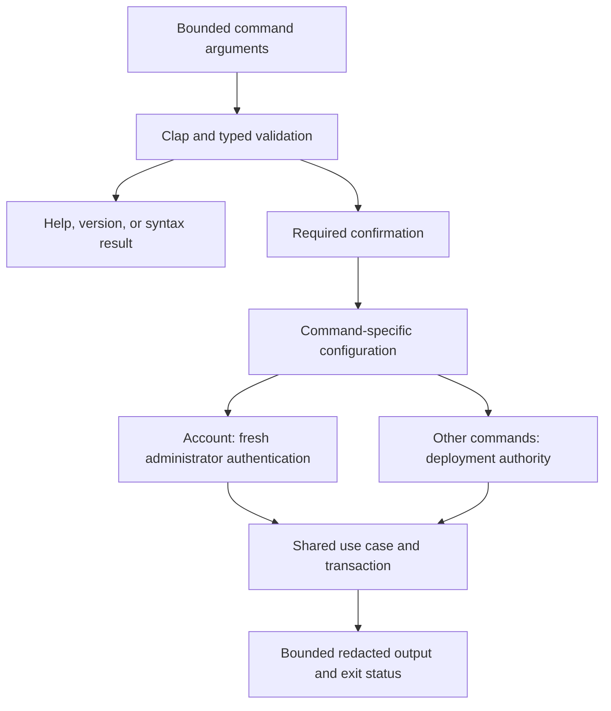

# Rust command-line interface

The same `darkhorse-server` binary serves HTTP and runs local operator commands.
Clap handles syntax in the adapter layer. Existing application use cases retain
their transaction ownership and domain invariants. Read the
[authority matrix](operator-authority.md) before granting access: this interface
uses deployment credentials and, for account operations, a fresh administrator
password. See [account authentication](operator-accounts.md). Future `admin` user/application groups are tracked in #25/#26 and are
not exposed as placeholder commands.



Parsing and confirmation precede service access. A confirmation flag records
intent and grants no authority. Operator dispatch starts no HTTP listener.

## Discover commands

```sh
make cli-help
make cli-version
cargo run --locked --offline -p darkhorse-server -- operator account --help
```

No arguments and `serve` both start the normal HTTP server. Help, version and
invalid syntax are processed before constructing the async runtime, reading
settings, prompting or connecting to services. Operator dispatch starts no HTTP
listener or unrelated server worker. Output is always uncolored. `--no-color`
is accepted. Neither `NO_COLOR` nor any terminal setting activates color.

| Canonical command                          | Compatibility spelling                                |
| ------------------------------------------ | ----------------------------------------------------- |
| `operator migrate`                         | `migrate`                                             |
| `operator bootstrap [--stdin]`             | `bootstrap [--stdin]`                                 |
| `operator account show ID`                 | `account ID`                                          |
| `operator account deactivate ID REVISION`  | `deactivate ID REVISION`                              |
| `operator account reactivate ID REVISION`  | `reactivate ID REVISION`                              |
| `operator account revoke-all ID REVISION`  | `revoke-all ID REVISION`                              |
| `operator signing status`                  | `signing-status`                                      |
| `operator signing generate REVISION`       | `signing-generate REVISION`                           |
| `operator signing import --stdin REVISION` | `signing-import --stdin REVISION`                     |
| `operator signing activate KID REVISION`   | `signing-activate KID REVISION`                       |
| `operator signing retire KID REVISION`     | `signing-retire KID REVISION`                         |
| `operator signing inspect OPERATION_ID`    | None                                                  |
| `operator limiter status/fence/activate`   | `limiter-status`, `limiter-fence`, `limiter-activate` |
| `operator limiter inspect OPERATION_ID`    | None                                                  |
| `operator redis status`                    | `redis-status`                                        |

`ID` is a nonzero principal UUID, `KID` a public URL-safe unpadded 32-byte key ID,
and `REVISION` a nonnegative integer no larger than PostgreSQL's signed bigint.
`OPERATION_ID` is a nonzero operation UUID. See [activation inspection](limiter-activation.md)
and [signing inspection](signing-operations.md). Signing mutations reserve one revision
increment, so the largest signed bigint is not a valid expected mutation revision.
Service/domain checks still validate current state. Legacy spellings are hidden
from top-level help and use the same typed conversion and dispatch.

## Confirmations and compatibility

Mutations require `--yes` for automation, or an interactive `yes` response on a
terminal. Refusal/EOF cancels before settings or service access. Protected-stdin
operations always require `--yes`, so a confirmation cannot consume secret input.
Signing inspection requires no confirmation or wrapping key.
Signing status requires confirmation. The implementation can initialize the provider binding before reading its inventory.

JSON mode never prompts: mutations require `--yes`, and bootstrap requires `--stdin`. Account operations require `--auth-stdin`. This keeps its stdout/stderr records machine-readable even
when launched from a terminal.

```sh
darkhorse-server operator migrate --yes
darkhorse-server --output json --auth-stdin operator account show <principal-id> < protected-account.json
darkhorse-server operator account revoke-all <principal-id> <revision> --yes
darkhorse-server operator bootstrap --stdin --yes < protected-input.json
darkhorse-server operator signing import --stdin <revision> --yes < private-key.der
```

Create/protect input files through your secret-management process. The names above
are examples. Do not commit them. `--yes` confirms the requested operation and
never grants authority or bypasses bootstrap single use, expected revisions,
last-administrator protection, signing retention or limiter recovery waits.

**Transition for automation:** direct noninteractive invocations using the old
spellings must add `--yes` for these operations. The existing explicit
database/signing/limiter Make operations, Compose operator wrappers, and rendered
Kubernetes Jobs supply that flag as part of their named operation. Invoking such
a target or applying the reviewed Job is the caller's confirmation. Inspect its
target, credentials and revisions first. Server startup still uses `serve`
without that flag. Raw aliases do not bypass confirmation.

## Output and exit contract

Default `--output human` preserves existing concise success messages and compact
JSON records for account, signing and diagnostic results. Names/data are treated
as untrusted: JSON escaping neutralizes C1 controls, line separators and
bidirectional overrides, retaining valid JSON and Unicode values for consumers.
Prompts/diagnostics use stderr. No command prints password, verifier, wrapping
key, private key or database URL values.

`--output json` emits one success envelope on stdout:

```json
{ "schema_version": 1, "ok": true, "data": { "migrated": true } }
```

Execution/confirmation failures emit one error envelope on stderr, with a stable
`error.code`, a redacted message, and optional public diagnostic `data`. Stdout is
empty on such JSON failures. In human mode, a failed Redis diagnostic preserves
its per-role JSON observation on stdout and a failure message on stderr. Inspect
the exit code. Help/version always remain readable text. Syntax failures use a
fixed human diagnostic. Parsing has not established a valid output mode.

| Exit | Meaning                                                                                                                                                                      |
| ---- | ---------------------------------------------------------------------------------------------------------------------------------------------------------------------------- |
| `0`  | Successful command or help/version output                                                                                                                                    |
| `1`  | Execution failure: invalid configuration/input, unavailable service, conflict, domain rejection or unknown commit outcome. Inspect the redacted diagnostic and current state |
| `2`  | Invalid, oversized, conflicting or malformed command arguments                                                                                                               |
| `3`  | Required confirmation absent or declined                                                                                                                                     |
| `74` | Bounded rendering or output write/flush failed. The operation may already have committed                                                                                     |

Interactive bootstrap and interactive account operations catch `SIGINT`, `SIGTERM`, `SIGHUP`, `SIGQUIT`, `SIGTSTP`,
`SIGTTIN` and `SIGTTOU` during input collection and application execution, returning exit `1` with
`operation_interrupted`. Ctrl-Z cancels this operation instead of suspending it.
Protected-stdin calls and other command groups retain their ordinary OS signal behavior (shells commonly report
`130` for SIGINT). An interrupted process or lost response is not proof of rollback. Do not
automatically retry mutations after execution/output failures. Inspect revisions,
bootstrap state, key inventory or limiter state first. A closed stdout/stderr pipe
produces a failing status without a printing panic. Consumers must require a
complete valid record and successful exit status.

## Input boundaries and remaining qualification

- At most 32 arguments, 1,024 UTF-8 bytes per argument and 4,096 bytes in total.
  Non-UTF-8/control-bearing arguments are rejected. Input is never executed as a
  shell string. Raw Clap errors, suggestions and user-supplied program names are
  never printed. Invalid values cannot be reflected into diagnostics.
- Bootstrap JSON remains bounded to 16,384 bytes, rejects unknown/duplicate fields
  and malformed/deeply nested data, and preserves password bytes. Signing import
  remains bounded to 8,192 DER bytes through protected stdin. No secret-valued
  command options are accepted.
- Rendered operator records/errors are bounded to 65,536 bytes. A failed write
  can expose a partial record but cannot return success. Help is generated from
  the fixed bounded command tree. Human prompts are fixed text on stderr.
- Interactive bootstrap requires a foreground terminal. It reopens the concrete
  stdin terminal with independent nonblocking flags and verifies its device
  identity and foreground process group. No stdin flags are changed in the
  calling shell. Prompts remain fixed text on stderr.
- Each terminal field uses a fixed 1,024-byte input buffer. Password collection
  rejects the first excess byte without waiting for Enter. Editing cannot grow
  that buffer. Completed strings are bounded too. Owned secret buffers are
  zeroized, without claiming erasure of every compiler or OS copy. The shared
  password policy still requires 15–128 characters without control characters.
- Password echo is disabled and verified before displaying the password prompt,
  and stays disabled through confirmation. Enter completes a line. Backspace/Delete
  removes a Unicode character, Ctrl-U clears the line, and Ctrl-W removes the last
  space-delimited word. Ctrl-D cancels even after partial password input. Escape
  sequences (including arrow keys and bracketed paste) and malformed UTF-8 are
  rejected. Password bytes are not trimmed or normalized.
- Completion, input failure, mismatched confirmation and supported cancellation
  flush pending input and restore the original terminal settings. Successful
  cleanup is read back and checked before bootstrap can access the database.
  A drop guard attempts cleanup when the input future is cancelled. Cleanup
  failures return a failing status and a fixed diagnostic. Input readiness yields
  during continuous editing so it cannot starve cancellation.
- `SIGKILL`, `SIGSTOP`, fatal process aborts, loss of the terminal device and host
  failure cannot offer this cleanup guarantee. After abnormal termination, verify
  or restore terminal settings before entering more input. Cancellation after
  database work begins still has the uncertain-commit rules above.

`make test-cli` builds the real binary and runs subprocess plus POSIX
pseudo-terminal/pipe tests (Node, Python 3 and Linux/macOS. No database or Redis).
They verify oversized input before Enter, exact mode restoration at both password
prompts, the seven catchable signals, EOF, background refusal, Unicode editing,
malformed input, output failures and redacted failure after terminal loss.
These integration tests are separate from service-free source-defined unit tests.
`make test-postgres`, `make test-redis`, browser and image smoke suites verify the
actual operator business effects and wrapper compatibility. Hosted source CI runs `test-cli`. Complete authored-code coverage and #23 authority qualification
remain separate gates. These tests do not establish production readiness.

## Container launchers

The [container account runbook](container-accounts.md) provides Compose exec,
Compose one-shot and explicitly selected Kubernetes exec targets for protected
stdin and JSON output. Use `make test-account-launcher` for their service-free
process checks. Deployment checks run separately.

## Source reference

[command tree](../crates/adapters/src/operator/cli/tree.rs),
[terminal handling](../crates/adapters/src/operator/terminal/mod.rs),
[bounded output](../crates/adapters/src/operator/output.rs).
