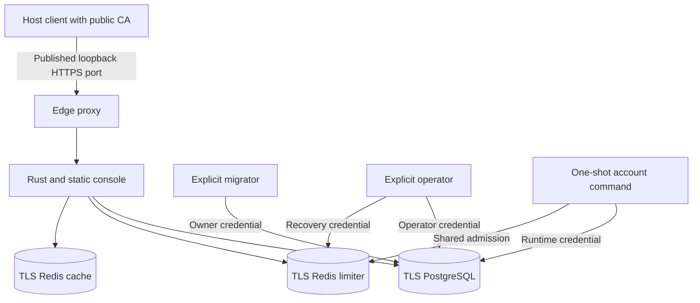

# Integrated Compose qualification stack

The `deploy/` topology packages the Rust service and static console with Percona PostgreSQL, separate Redis cache and limiter services, and a TLS proxy. It serves one organization at one canonical HTTPS origin. This is an initial **local qualification topology** for [issue #19](https://github.com/OneTesseractInMultiverse/darkhorse-identity/issues/19), with short-lived test certificates and loopback-only ingress. Production certificate lifecycle, upgrades, external SMTP/object storage, full operator isolation, load qualification, and restoration to a serving identity system remain open.

The existing [development portal](development.md) remains a separate workflow with reload support. Stack commands never consume its credentials or volumes. Docker, Compose v2, Node 24.19, OpenSSL with `req -addext`, and the repository's normal build prerequisites are required. Node runs host-side management scripts only. Rust owns every application server function.

## Topology and authority

| Service    | Exposure and state                                                         | Authority                                                              |
| ---------- | -------------------------------------------------------------------------- | ---------------------------------------------------------------------- |
| `edge`     | Only published port. Bound to `127.0.0.1`. HTTPS with canonical hostname   | Proxy only, no application/database credentials                        |
| `api`      | Static frontend and API on private port 3001                               | Nonowner database login and runtime Redis credentials                  |
| `postgres` | TLS only over private database network. Named persistent volume            | Separate superuser, schema owner, runtime and operator logins          |
| `cache`    | Separate internal network. TLS. Disposable memory. Eviction allowed        | Diagnostic-only runtime ACL until cache implementation is qualified    |
| `limiter`  | Separate internal network. TLS. Persistent AOF. No eviction                | Bounded runtime script/hash ACL. Independent recovery credential       |
| `operator` | Explicit one-shot container. No HTTP listener or published port            | Nonowner operator login and limiter recovery credential                |
| `account`  | Explicit one-shot authenticated account command. No HTTP or published port | Runtime database and limiter credentials. Fresh administrator password |
| `migrator` | Explicit one-shot container. Database network only                         | Schema-owner login and public CA only                                  |

Infrastructure images are pinned by digest. Setup resolves the locally built application and proxy to immutable image IDs and records them in a private manifest. The proxy image removes the upstream executable's port-binding capability so it can run with all capabilities dropped. Application/proxy/cache containers use nonroot users, read-only root filesystems, bounded writable temporary mounts, and no new privileges. PostgreSQL and limiter entrypoints initialize volume ownership before dropping to their database users. Every service has memory, CPU, and process limits. The database/cache/limiter networks are marked internal. No Docker socket or repository tree is mounted.

Application, account, operator and migrator share the same binary. Only the migrator receives the owner URL. Only the operator receives the operator URL and limiter recovery credential. `stack-migrate` selects the migrator. Other stack operator commands select the nonowner operator. Runtime cannot create schema, inspect migration history, insert administrator membership, change signing keys, or update limiter authority. The runtime grant script is reapplied explicitly after reviewed migrations. Runtime still has broad DML access required by existing application workflows. This is **partial privilege separation**, not containment of every action a compromised runtime could take. The complete authenticated/operator authority contract remains in [#23](https://github.com/OneTesseractInMultiverse/darkhorse-identity/issues/23) and [#27](https://github.com/OneTesseractInMultiverse/darkhorse-identity/issues/27). Host/Docker administrators remain trusted.

The [database authority policy](database-authority.md) uses named runtime/operator grants,
append/read audit privileges, and default denial for new objects. Unsafe nonowner
role memberships, elevated attributes or ownership abort grant application.
Reapply the reviewed script to existing stacks with serving stopped.
Rebuilding the application image alone does not update database permissions.



Private networks separate database, cache, and limiter traffic. Only the edge
publishes a port. Host and Docker administrators remain trusted.

## Prepare and initialize

Choose a unique stack name (lowercase letters, digits and hyphens, starting with a letter, at most 32 characters) and a canonical HTTPS DNS origin. Use a high, unused port for local qualification. All subsequent commands must use that same `STACK`.

```sh
make docker-build IMAGE=darkhorse:local
make stack-setup STACK=trial STACK_ORIGIN=https://darkhorse.localhost:9443 IMAGE=darkhorse:local
make stack-infra STACK=trial
make stack-migrate STACK=trial
make stack-bootstrap STACK=trial
make stack-signing-status STACK=trial
make stack-signing-generate STACK=trial REVISION=0
```

Setup generates independent credentials and certificates under `.local/stacks/trial`, never installs host trust, and preserves an existing matching manifest. An incomplete directory or different origin/image fails instead of replacing identity material. Keep manifests and credentials together with their volumes. Rebuilding an image does not select it for an existing stack.

Bootstrap runs interactively in a one-shot operator container. Password input is hidden and never passed in arguments. For protected automation, pipe the bounded JSON described in [bootstrap input](persistence.md#bootstrap-input-and-password-storage) to `node scripts/deployment.mjs operator trial bootstrap --stdin`. Never put credentials in shell literals, history or trace logs.

After generating a signing key, wait at least 60 seconds before activation. Read the returned `kid` and current inventory revision, then use those values:

```sh
make stack-signing-activate STACK=trial KID=<returned-key-id> REVISION=<current-revision>
make stack-limiter-fence STACK=trial
make stack-limiter-status STACK=trial
```

The limiter must complete its **904-second recovery wait** before activation, including first initialization. Wait until status reports the recorded deadline has passed, then:

```sh
make stack-limiter-activate STACK=trial
make stack-up STACK=trial
make stack-check STACK=trial
```

Do not bypass publication/recovery waits. `stack-up` never migrates, bootstraps, activates keys, or recovers limiter state. A started container is not proof that sign-in is available. Sign in at `https://darkhorse.localhost:9443`. The console is served by Rust from the image's static assets. This topology disables outbound email and object storage, so workflows requiring those services need their separately qualified integration.

## TLS and secret files

Setup creates a private 30-day CA and separate seven-day server certificates for the canonical hostname, `postgres`, `cache`, and `limiter`. The CA key stays host-side and is never mounted into running services. This lifetime is for disposable qualification, with no automatic certificate renewal. Repeated setup preserves certificates. It does not extend their expiry.

Clients must resolve the canonical hostname to the loopback address and trust the matching public CA. `stack-check` does both within its own request without changing system trust. For a host diagnostic:

```sh
curl --cacert .local/stacks/trial/secrets/ca.pem \
  --resolve darkhorse.localhost:9443:127.0.0.1 \
  https://darkhorse.localhost:9443/.well-known/openid-configuration
```

Browser access requires explicitly importing that public CA into a dedicated test trust store/profile and removing it when finished. Do not bypass certificate errors. Container clients on the edge network use the same canonical hostname via its network alias, and must receive only the public CA. Internal service names are never additional issuers. The proxy preserves the request hostname **and port** and removes forwarded headers. Rust validates the canonical origin. PostgreSQL and Redis verify their server certificates and DNS names. Neither insecure TLS option is active.

The Rust configuration adapter supports `NAME_FILE` for these settings:

- `DARKHORSE_DATABASE_URL`, `DARKHORSE_LOGIN_LIMIT_KEY`, `DARKHORSE_SIGNING_WRAP_KEY`.
- `DARKHORSE_REDIS_CACHE_URL`, `DARKHORSE_REDIS_LIMITER_URL`, their `*_ADMIN_URL` variants, and `DARKHORSE_REDIS_CACHE_CA_PEM` / `DARKHORSE_REDIS_LIMITER_CA_PEM`.
- `DARKHORSE_EMAIL_KEY`, `DARKHORSE_SMTP_USERNAME`, `DARKHORSE_SMTP_PASSWORD`, `DARKHORSE_OBJECTS_ACCESS_KEY`, and `DARKHORSE_OBJECTS_SECRET_KEY`.

Specify either the direct value or its `_FILE` path. Specifying both fails. Paths must be absolute, control-free and at most 4096 bytes. Files must be regular, not group/other-writable, valid UTF-8, nonempty and at most 32 KiB, with no NUL. One terminal LF or CRLF is removed. Other whitespace is preserved. The setting's existing format and size constraints still apply. Controlled secret-volume symlinks are followed. Errors omit secret values and paths. No process environment is mutated. Secret files are read during configuration. Replacing a mount is not a live reload mechanism.

Stack directories are owner-only (`0700`), manifests and host CA keys are `0600`. Files mounted as Compose secrets are read-only (`0444`) inside those private host directories so the distinct container users can read their explicitly granted mounts. The private parent directory restricts readers: never copy those files into a shared directory. Compose file secrets are host bind mounts, not an encrypted secret manager, and their `uid`/`gid` remapping is unavailable. See [Docker's secrets behavior](https://docs.docker.com/compose/how-tos/use-secrets/) and [service secret options](https://docs.docker.com/reference/compose-file/services/#secrets). Application environment variables contain file paths, not credential values. Production secret-manager delivery and rotation still require qualification.

## Health, outages and shutdown

- `make stack-status STACK=trial` shows service state. API `/health/live` only proves the process responds. It remains live during a database outage. The edge check verifies local HTTPS and upstream liveness.
- `make stack-check STACK=trial` separately verifies canonical discovery over trusted HTTPS, PostgreSQL-backed signing inventory, and the currently active limiter generation. It is a point-in-time operator observation, not a replacement for request-time authorization or continuous monitoring.
- Cache loss does not disable login or authorize stale permissions. Cache capacity is currently reserved for later qualified computation caching. This stack introduces no positive authorization cache.
- Limiter restart or lost continuity rejects sign-in. Repair the service, fence, wait the full deadline, then explicitly activate. Persistent AOF alone is not continuity proof. Automatic failover/recovery is unsupported. Existing token checks still follow their own authoritative-state contracts.
- Database failure rejects authorization checks. A healthy liveness endpoint must not be interpreted as permission to continue accepting credentials.
- `make stack-stop STACK=trial` stops ingress and then the API, retaining dependencies. Rust handles termination gracefully. Docker permits 20 seconds for API drain before forced termination. This does not establish uninterrupted service or safe automatic retries for uncertain writes.
- `make stack-down STACK=trial` removes only that stack's containers/networks and preserves named volumes, manifests and secrets. Restarting the limiter requires the recovery procedure again. `make clean` preserves stack state. There is no public volume-deletion target.

## Backup and quarantined restoration

```sh
make stack-stop STACK=trial
make stack-backup STACK=trial
```

Migration and backup commands reject a running API, proxy, account, operator or migrator job. The operator must exclude other writers and concurrent stack commands. Backup writes an owner-only directory containing a custom-format logical PostgreSQL dump, the immutable-image manifest, and secret/certificate material. A `RECOVERY.txt` file is written only after those copies succeed. A directory without it is incomplete. The archive contains password verifiers, credential state and private keys: encrypt it before transferring it and enforce restricted storage/access and retention. Backups are not exported into images or Git.

The Compose integration test restores the archive into a separate **quarantined database** and checks its contents. It never attaches that restored database to an HTTP server. Restoring an older identity database can resurrect revoked tokens, sessions, API keys or client secrets. Before a supported restore-to-service command can be added, the recovery design must independently preserve/reconcile revocations or invalidate the restored credential generations, fence limiter state for the full wait, reconcile signing material and external assets, and test that revoked credentials remain rejected. Do not restore over a serving database. `stack-backup` is not a supported disaster-recovery or rollback procedure by itself.

## Rotation, migrations and upgrades

Signing rotation uses the existing stage → publication wait → activation → retirement lifecycle. Use `stack-signing-status`, `stack-signing-generate`, `stack-signing-activate` and `stack-signing-retire` with observed revisions and key IDs. Retirement preserves the verification window. See the [signing contract](provider.md) for overlap and emergency-compromise limitations.

There is no automatic upgrade, credential rotation, CA renewal, down-migration, or image rollback command in this increment. Schema migration is explicit with HTTP serving stopped. It applies embedded checksummed migrations and then reviewed runtime/operator grants. Never edit an applied migration or replace live database credentials merely by rewriting a file. Future upgrades must preserve the canonical issuer and compatible identity material, qualify old/new schema compatibility, restore into quarantine to verify backups, and document irreversible transitions. A previous image is not automatically compatible with a newer schema, and an old database snapshot is not a safe authorization rollback.

### Existing stack role transition

New stacks use manifest version 2. Version 1 stacks are refused with their files
and data preserved. Setup does not generate replacement credentials or fall back
to the old shared owner credential. Initialization SQL runs only on empty database
volumes, so restarting PostgreSQL will not create the new role on an existing one.

For a retained qualification stack, use a reviewed offline maintenance window:

1. With the previous checkout, stop HTTP serving, finish all operator processes,
   exclude other writers and create a protected backup. Keep the recorded issuer,
   database volume, image identities, keys and existing credentials.
2. Using trusted database-administrator access, create `darkhorse_operator` with
   LOGIN, NOSUPERUSER, NOCREATEDB, NOCREATEROLE, NOREPLICATION, NOBYPASSRLS,
   no memberships or owned objects. Set an independent random 32-byte hexadecimal
   password through protected input, never command arguments or logs. Grant only
   CONNECT to the application database before the reviewed policy is applied.
3. Provision matching read-only `operator-password` and `operator-db` files in the
   existing owner-only secrets directory. The URL uses `darkhorse_operator` at
   `postgres:5432/darkhorse`. TLS verification remains mandatory. Preserve every
   existing secret. Review permissions and test this login over verified TLS.
4. Apply `deploy/grant-runtime.sql` using the schema owner or database administrator
   with writers stopped. Review failures. Never substitute the owner URL
   for operator access. Confirm both nonowner roles and their denials as described
   in [database authority](database-authority.md).
5. Review the new Compose configuration and change only the private manifest's
   version to 2 once provisioning is complete. Recreate operator containers so
   old owner mounts are gone. Verify operator status and runtime readiness before
   resuming. Owner credentials now belong only to explicit migration/maintenance.

A changed manifest is not evidence that database provisioning succeeded. An
interrupted transition stays offline until grants and secret delivery are checked.
This is a manual transition for the qualification topology, not an automatic
production upgrade or secret-rotation procedure. Do not delete retained volumes
or re-bootstrap identity as an upgrade shortcut.

## Verification and remaining qualification

```sh
make ci
make test-postgres
make docker-build
make docker-smoke
make test-compose
```

`test-compose` uses its own randomly named stack, generated users/credentials and port, then removes only its disposable containers, volumes and files. It verifies internal DNS and trusted TLS from host/container clients. Rejects an untrusted CA and wrong hostname. Checks separate runtime/operator/migration secret mounts and denied nonowner migrations. Performs real PKCE authorization, independent ID-token signature validation, opaque introspection and UserInfo. Exercises cache loss, limiter restart/recovery, database loss, application restart and durable state. And restores a dump into quarantine. Recovery/publication tests use explicit clock fixtures in their disposable database after checking premature activation fails. They do not establish a 904-second elapsed-wall-clock soak. Service-free unit tests cover configuration source selection and deployment policy. Real file-boundary failures run in `test-postgres`.

These checks do not yet qualify sustained capacity, memory exhaustion, concurrent deploy operations, production certificates, internet exposure, complete CLI security, secret rotation, upgrade/rollback, SMTP/object-service recovery or restoration to service. Track those criteria in #19 and its linked issues. The unchanged 100% authored-line coverage target remains separately tracked in [#2](https://github.com/OneTesseractInMultiverse/darkhorse-identity/issues/2). Passing deployment smoke tests does not meet that target.

## Authenticated administration launchers

Use `stack-account-exec` for a running API and `stack-account-run` for a one-shot
account command, with HTTP running or stopped. See the [container account
runbook](container-accounts.md) for protected input, explicit confirmation, exit
status, dependency requirements and interrupted-operation reconciliation.

`stack-catalog-exec` and `stack-catalog-run` list applications or clients through
the same runtime workloads, protected-input transport and resource limits. See the
[catalog selectors and examples](operator-catalog.md#make-launchers). The disposable
suite exercises both public targets, including denial after administrator demotion
and restored catalog audit records.
