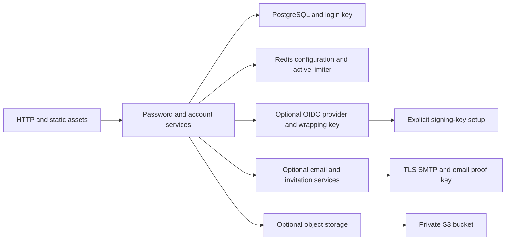

# Configuration reference

Rust reads validated settings through `envbind`. Settings belong to the selected
command or feature. Missing credentials never trigger automatic account creation,
migration, key replacement, or limiter recovery.

The source contracts live in
[`configuration.rs`](../crates/adapters/src/configuration.rs),
[`authentication.rs`](../apps/server/src/authentication.rs), and each adapter's
configuration module. Deployment wrappers supply settings through protected files.
Errors redact supplied values.

## Feature dependencies

Arrows identify prerequisites or optional additions. Login defaults to off. Provider
or email configuration without login causes startup failure. With login active,
Rust mounts directory, catalog, profile, session, personal-key, and registration APIs.
The provider flag adds protocol routes and refresh maintenance. Email adds verification,
invitations, and delivery. Object storage adds image storage and cleanup.

Object settings are loaded through the login composition path. Setting the object
flag alone does not start an image service. Profiles remain available without
object storage, using the default portrait.

## HTTP and database

| Setting                        | Default                          | Contract                                                                              |
| ------------------------------ | -------------------------------- | ------------------------------------------------------------------------------------- |
| `DARKHORSE_HTTP_HOST`          | `127.0.0.1`                      | Listener address                                                                      |
| `DARKHORSE_HTTP_PORT`          | `3001`                           | Listener port                                                                         |
| `DARKHORSE_PUBLIC_ORIGIN`      | `https://localhost:8443`         | Canonical HTTPS origin without credentials, path, query, or fragment                  |
| `DARKHORSE_STATIC_DIR`         | `apps/console/build`             | Static console directory                                                              |
| `DARKHORSE_DATABASE_URL`       | Required for database operations | Explicit TCP host, user, password, database, no query or fragment, at most 4096 bytes |
| `DARKHORSE_DATABASE_POOL_SIZE` | `5`                              | Range 1–32 connections per process                                                    |
| `DARKHORSE_DATABASE_INSECURE`  | `false`                          | Explicit local plaintext database mode                                                |

Database TLS verifies the certificate and hostname. Private CA deployments use
SQLx's PostgreSQL trust configuration, including `PGSSLROOTCERT`. The adapter sets
a five-second statement limit, three-second lock limit, ten-second idle-transaction
limit, and five-second pool-acquisition limit. SQL statement logging is off.

The public origin becomes the provider issuer and participates in persistent
bindings. Changing proxy routes alone does not migrate those bindings. See
[persistence](persistence.md), [provider](provider.md), and [Compose](compose.md).

## Authentication and signing

| Setting                      | Default                | Contract                                                                   |
| ---------------------------- | ---------------------- | -------------------------------------------------------------------------- |
| `DARKHORSE_LOGIN_ENABLED`    | `false`                | Starts password and account services                                       |
| `DARKHORSE_LOGIN_LIMIT_KEY`  | Required with login    | Random nonzero 32-byte key, encoded as 64 lowercase hexadecimal characters |
| `DARKHORSE_PROVIDER_ENABLED` | `false`                | Requires login and signing settings                                        |
| `DARKHORSE_SIGNING_WRAP_KEY` | Required with provider | Independent random nonzero 32-byte key in lowercase hexadecimal            |

All replicas share the same deployment keys. Login pins a key fingerprint in
PostgreSQL. Provider setup binds the issuer and wrapping-key fingerprint. A changed
key causes rejection, not a fresh security namespace. Keep backups of these keys
with their corresponding database state.

Signing key generation, publication, activation, and retirement are explicit
operator commands. Starting the HTTP server does not generate a signing key.
Discovery returns `503` without a usable active key.

## Redis

| Setting                               | Default                         | Contract                                                         |
| ------------------------------------- | ------------------------------- | ---------------------------------------------------------------- |
| `DARKHORSE_REDIS_CACHE_URL`           | Required by Redis configuration | Authenticated cache connection                                   |
| `DARKHORSE_REDIS_LIMITER_URL`         | Required by Redis configuration | Independent authenticated limiter connection                     |
| `DARKHORSE_REDIS_CACHE_CONNECTIONS`   | `2`                             | Range 1–16                                                       |
| `DARKHORSE_REDIS_LIMITER_CONNECTIONS` | `4`                             | Range 1–16, bounds concurrent limiter work                       |
| `DARKHORSE_REDIS_TIMEOUT_MS`          | `250`                           | Range 10–1000, per operation                                     |
| `DARKHORSE_REDIS_INSECURE`            | `false`                         | Explicit local plaintext mode, no downgrade of `rediss://`       |
| `DARKHORSE_REDIS_CACHE_CA_PEM`        | Empty                           | Optional private PEM roots, at most 16 KiB, TLS only             |
| `DARKHORSE_REDIS_LIMITER_CA_PEM`      | Empty                           | Optional independent private PEM roots, at most 16 KiB, TLS only |
| `DARKHORSE_REDIS_LIMITER_ADMIN_URL`   | Operator only                   | Required for protected activation                                |
| `DARKHORSE_REDIS_CACHE_ADMIN_URL`     | Deployment tooling only         | Cache administration, absent from runtime configuration          |

URLs require named nondefault ACL users, explicit distinct passwords, and database
zero. Queries, fragments, and encoded socket hosts are rejected. A supplied private
trust bundle replaces public roots for that connection. The adapter has no option
to bypass TLS verification. Read the [continuity contract](redis.md) before recovery.

## Email

| Setting                   | Default             | Contract                                                      |
| ------------------------- | ------------------- | ------------------------------------------------------------- |
| `DARKHORSE_EMAIL_ENABLED` | `false`             | Requires login                                                |
| `DARKHORSE_EMAIL_KEY`     | Required with email | Independent random 32-byte proof key in lowercase hexadecimal |
| `DARKHORSE_SMTP_HOST`     | Required with email | ASCII DNS-style host, at most 253 bytes                       |
| `DARKHORSE_SMTP_PORT`     | `465`               | Nonzero port with implicit TLS                                |
| `DARKHORSE_SMTP_FROM`     | Required with email | Valid address, at most 254 bytes                              |
| `DARKHORSE_SMTP_USERNAME` | Empty               | At most 1024 bytes, no control characters                     |
| `DARKHORSE_SMTP_PASSWORD` | Empty               | At most 4096 bytes, paired with username                      |
| `DARKHORSE_SMTP_CA_FILE`  | Empty               | Optional private CA file, at most 256 KiB                     |

Username and password must both be present or both absent. The transport requires
implicit TLS. It does not implement a plaintext-to-STARTTLS upgrade on port 587.
The proof key and canonical origin have persistent bindings. Uncoordinated replacement
invalidates the deployment contract. See [email verification](email-verification.md).

## Object storage

| Setting                        | Default               | Contract                                                   |
| ------------------------------ | --------------------- | ---------------------------------------------------------- |
| `DARKHORSE_OBJECTS_ENABLED`    | `false`               | Activates storage through the login composition path       |
| `DARKHORSE_OBJECTS_ENDPOINT`   | Required with storage | HTTPS origin, at most 2048 bytes                           |
| `DARKHORSE_OBJECTS_BUCKET`     | Required with storage | 3–63 lowercase letters, digits, or hyphens, no edge hyphen |
| `DARKHORSE_OBJECTS_REGION`     | `us-east-1`           | Letters, digits, and hyphens, at most 100 bytes            |
| `DARKHORSE_OBJECTS_ACCESS_KEY` | Required with storage | Nonempty, control-free, at most 256 bytes                  |
| `DARKHORSE_OBJECTS_SECRET_KEY` | Required with storage | Nonempty, control-free, at most 4096 bytes                 |
| `DARKHORSE_OBJECTS_LOCAL_HTTP` | `false`               | Allows HTTP only for literal loopback hosts                |

Endpoint, bucket, and region form a persistent storage identity. Credentials can
rotate within that identity. Storage-identity migration remains unsupported.
Objects use the private `darkhorse/media/` prefix. See [profiles and media](profiles-and-media.md).

## File-backed secret delivery

The deployment environment accepts `_FILE` variants for a fixed allowlist:

- Database URL and login limiter key.
- Signing wrapping key and email proof key.
- SMTP username and password.
- Cache and limiter runtime URLs and administrator URLs.
- Cache and limiter PEM trust bundles.
- Object access key and secret key.

For example, `DARKHORSE_DATABASE_URL_FILE` names a file containing the URL. Supplying
both the direct setting and its `_FILE` counterpart fails. Other configuration
names do not acquire file support from this convention.

The loader requires an absolute path, a regular file, and at most 32 KiB of content.
It rejects group-writable or world-writable files. It does not require owner-only
read access for container-mounted secrets. Platform secret permissions must restrict
readers. Mount symlinks are supported through filesystem resolution.

Content must be nonempty UTF-8 without NUL bytes. The loader removes one trailing
LF or CRLF and performs no other trimming. Each setting's own smaller bound still
applies. Local setup helpers use stricter owner-only permissions and reject partial
or unsafe existing settings. The exact implementation is
[`deployment_environment.rs`](../crates/adapters/src/deployment_environment.rs).

## Health and startup

`/health/live` reports process liveness. `/health/ready` performs a bounded primary
database probe with one slot and a one-second deadline. It rejects a replica in
recovery and returns unavailable without configured login services.

Readiness does not verify the entire schema, active signing keys, Redis continuity,
SMTP, object storage, or a successful login. Use deployment checks and a controlled
end-to-end probe for those claims. Health responses never replace an authorization check.
