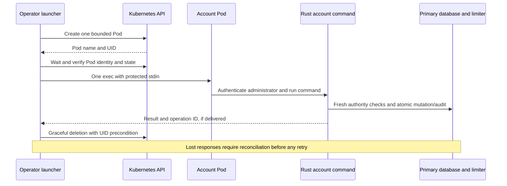

# Container account commands

The host-side launchers run the existing Rust `operator account` commands inside
the selected deployment: `list`, `show`, `deactivate`, `reactivate` and `revoke-all`.
They require a fresh platform-administrator password on every invocation. Container
access alone does not identify or authenticate an application actor. Read the
[account authority and audit contract](operator-accounts.md) first.

These targets are for protected stdin and JSON output. They never allocate a TTY,
start HTTP, migrate, repair the limiter or retry a command. Node runs only the
host launcher. The packaged Rust binary performs authentication and all account
logic. Use the repository's pinned Node toolchain, Docker Compose v2 or kubectl.

## Input and selection

Deliver a JSON object containing `email`, `password` and, for mutations, `reason`
through your secret manager or an owner-only file outside the repository. Protect
the containing directory, use file mode `0600`, avoid symlinks/untrusted writers,
and remove the input according to your secret-handling policy afterward. The
launcher passes stdin directly to the transport. Rust validates the 16 KiB limit
and input schema. It does not create or inspect a credential file. Never put a
password in Make variables, environment variables, arguments, shell history or
reason text. Do not use shell tracing or a terminal/session recorder with secret
input. Output can contain profile data and must be protected.

Only nonsecret command selectors are accepted:

| Setting             | Meaning                                                            |
| ------------------- | ------------------------------------------------------------------ |
| `ACCOUNT_OPERATION` | `show` (default), `list`, `deactivate`, `reactivate`, `revoke-all` |
| `ACCOUNT_ID`        | Nonzero, hyphenated principal UUID; omit for `list`                |
| `ACCOUNT_REVISION`  | Required current revision for changes. Omit for `show` and `list`  |
| `ACCOUNT_CONFIRM`   | `yes` explicitly confirms a reviewed mutation. Defaults to `no`    |

Read the target first and review its current revision, intended operation and
reason. Do not automatically confirm or fetch a newer revision to retry a failed
mutation. `--yes` is confirmation, not authorization. A protected input file is
represented below by `/private/path/account-input.json`. The commands do not
create it. Replace the UUID/revision placeholders with observed values.

### Directory listing

For `list`, also accept `ACCOUNT_SEARCH` (literal prefix, up to 100 characters),
`ACCOUNT_STATUS` (`active` or `inactive`), `ACCOUNT_AFTER` (continuation UUID) and
`ACCOUNT_LIMIT` (1–25, default 25). Omit `ACCOUNT_ID` and `ACCOUNT_REVISION` and
provide protected JSON with only `email` and `password`, without `reason`.
The launcher rejects conflicting single-target and listing options.

```sh
make stack-account-run STACK=trial ACCOUNT_OPERATION=list ACCOUNT_LIMIT=25 ACCOUNT_STATUS=active < /private/path/list-input.json
make kube-account-run KUBE_CONFIG=/absolute/path/identity.json KUBE_ACCESS=/absolute/path/access.yaml KUBE_CONTEXT=reviewed-context ACCOUNT_OPERATION=list ACCOUNT_LIMIT=25 < /private/path/list-input.json
```

The same options work with `stack-account-exec` and `kube-account-exec` (with an
explicit `ACCOUNT_POD`). Consume `data.next` as `ACCOUNT_AFTER` on a subsequent
freshly authenticated invocation. There is no automatic pagination. Arguments
may appear in process lists or orchestration audit metadata, so a search value
must never contain credentials. Application read audits omit the search text.
See [directory read semantics](operator-accounts.md#bounded-directory-listing).

### Running Compose application

Use an existing initialized [qualification stack](compose.md):

```sh
make stack-account-exec STACK=trial ACCOUNT_ID=<principal-uuid> < /private/path/account-input.json
make stack-account-exec STACK=trial ACCOUNT_OPERATION=revoke-all ACCOUNT_ID=<principal-uuid> ACCOUNT_REVISION=<observed-revision> ACCOUNT_CONFIRM=yes < /private/path/account-input.json
```

The launcher selects the stack's explicit project/Compose file and runs the
absolute binary path in `api` as UID/GID `10001:10001`, with `exec -T`.
[Compose exec disables its default TTY with `-T`](https://docs.docker.com/reference/cli/docker/compose/exec/).
An absent/stopped application container is an error. This target never starts it.

### Compose with HTTP stopped

```sh
make stack-stop STACK=trial
make stack-account-run STACK=trial ACCOUNT_ID=<principal-uuid> < /private/path/account-input.json
```

The operations-profile `account` service uses the manifest's immutable application
image, a nonroot user, a read-only filesystem, dropped capabilities, bounded
temporary storage, and no published ports. Its projected secrets are the runtime
database URL, shared login-limit key, runtime cache/limiter URLs and public CA.
It receives no migration, operator, signing-wrap or limiter-recovery credential.
Its networks are limited to the database and limiter.
The cache configuration is required by the shared configuration loader. Account
authentication connects to the primary database and shared limiter.

`compose run --rm --no-deps -T` creates one named container and normally removes it
on exit. It does not start dependency services. See [Compose run semantics](https://docs.docker.com/reference/cli/docker/compose/run/).
The database and active limiter must remain available, with the same login key and
reviewed schema/grants. A stopped HTTP server does not remove these dependencies.
The generated `darkhorse-account-…` container name is printed on stderr so an
operator can inspect an interrupted attachment. Do not bulk-prune containers or
repeat an uncertain mutation to determine whether it succeeded.

### Explicit Kubernetes Pod

```sh
make kube-account-exec KUBE_CONFIG=/absolute/path/identity.json KUBE_ACCESS=/absolute/path/access.yaml KUBE_CONTEXT=reviewed-context ACCOUNT_POD=<reviewed-pod-name> ACCOUNT_ID=<principal-uuid> < /private/path/account-input.json
```

`KUBE_CONFIG` is the reviewed [deployment configuration](kubernetes.md), not a
kubeconfig. `KUBE_ACCESS` is the kubeconfig. Both paths must be absolute. The
context, configured namespace, exact Pod name and `api` container are explicit.
No ambient current context, deployment selector or automatic Pod replacement is
used. `kubectl exec -i` forwards stdin without a TTY. A 30-second API request
timeout and 15-second running-Pod wait bound connection setup. See
[kubectl exec](https://kubernetes.io/docs/reference/kubectl/generated/kubectl_exec/).
Pod names are trusted selectors, not a UID or image-attestation guarantee. Confirm
the cluster, namespace and workload/image before execution. Namespace and
kubeconfig administrators remain trusted. Stopped-container Kubernetes account
recovery is not provided by this target.

### Kubernetes with HTTP stopped

Prepare the namespace with the current `make kube-prepare` manifests before using
this path. This installs the account service account and network policy without
starting the serving Deployment. Existing runtime secrets, database grants and an
active shared limiter must already be provisioned. Both serving replicas may remain
stopped throughout the operation.

```sh
make kube-account-run KUBE_CONFIG=/absolute/path/identity.json KUBE_ACCESS=/absolute/path/access.yaml KUBE_CONTEXT=reviewed-context ACCOUNT_ID=<principal-uuid> < /private/path/account-input.json
```

The launcher creates a randomly named, standalone Pod using the deployment's
immutable application image. Its only container waits for up to 180 seconds. After
a bounded readiness wait and UID/image/state check, the launcher executes the Rust
account command once in `api`, forwarding protected stdin without a TTY. The Pod
has `restartPolicy: Never`, a 180-second active deadline and a five-second
termination grace period. It has no replacement controller, HTTP process, proxy,
ports or service-account token. The host starts no dependency or serving workload.
See [Pod lifecycle](https://kubernetes.io/docs/concepts/workloads/pods/pod-lifecycle/)
and the [Pod API](https://kubernetes.io/docs/reference/kubernetes-api/core/pod-v1/).

The account workload projects only `runtime-db`, `login-key`, `cache-url`,
`limiter-url` and `ca` from `darkhorse-runtime-secrets`. It receives no signing-wrap,
owner, operator or limiter-recovery credential. Its network policy permits DNS,
PostgreSQL and the limiter, with no ingress or cache egress. The cache URL remains
required configuration, but account operations do not open a cache connection.
These credentials are the existing deployment credentials. Creating a short-lived
Pod does not make its database credential temporary or narrowly scoped.
The local kind fixture previously admitted cache connections briefly after Pod
creation with application egress policy alone. It now installs the separate
[backend ingress policies](kubernetes.md#backend-ingress-policies) and requires
forbidden connections to time out from the first attempt. Review and install those
policies with the backend operator before using this topology. The regression
covers new clients against already protected backends; reused addresses, backend
startup and CNI failures remain qualification gates in #20. Account operations
themselves open no cache connection.



The Pod name and validated UID are printed on stderr. Normal completion or a
handled interruption requests graceful deletion with a UID precondition and waits
up to 15 seconds for deletion. A replacement Pod with the same name cannot satisfy
that deletion precondition. A creation response that is lost or malformed supplies
no verified UID, so the launcher does not adopt or delete an object by name.
Inspect the printed name in that case. Cleanup failures are reported explicitly.
The [kubectl deletion API](https://kubernetes.io/docs/reference/kubectl/generated/kubectl_delete/)
is used without force deletion.

Readiness waits up to 25 seconds. Each setup/cleanup subprocess has a 35-second
host deadline and 30-second API request timeout. The command attachment retains its
120-second deadline. Captured control responses are limited to 1 MiB. Cancellation
terminates the owned subprocess group, with up to two additional seconds before
forced termination. These phases are separate, so the entire launcher can take
longer than 120 seconds. A node partition, killed launcher or unavailable control
plane can leave a Pod or process behind. Reconcile its outcome before deleting
remaining resources. Neither cleanup nor the active deadline proves rollback.

Kubernetes exec addresses a Pod by name. The UID/image check is a preflight check,
and an authorized cluster administrator could replace the Pod between that check
and exec. The control plane, kubelet, admission controllers and namespace
administrators remain trusted. No exactly-once or compromised-cluster guarantee is
claimed. The launcher does not install RBAC grants or mint emergency credentials.

## Exit behavior and uncertain outcomes

Invoke the launcher directly when automation needs the child's exact exit code:

```sh
STACK=trial ACCOUNT_ID=<principal-uuid> node scripts/account.mjs compose-exec < /private/path/account-input.json
```

The other modes are `compose-run`, `kube-exec` and `kube-run`, with the same environment
selectors. Successful Rust results are JSON on stdout. Application failures are
JSON on stderr. Docker/kubectl and launcher diagnostics can appear on stderr,
so do not parse the entire stderr stream as one JSON document.

The launcher preserves normal transport exit codes, including Rust's `0` success,
`1` operation/input failure, `2` invalid arguments, `3` missing confirmation and
`74` output failure when the transport forwards them. Docker/kubectl can return their own failure codes. A status alone cannot prove remote rollback.
Make reports a failed recipe using its own nonzero status (normally `2`). Make does
**not** preserve the recipe's exact code. No operation is retried by any path.
For `kube-run`, cleanup failure after command success changes the launcher status
to `1`, with a separate diagnostic. A nonzero command status is preserved when
cleanup also fails. A successful account JSON result can therefore accompany a
nonzero launcher status. Reconcile the reported operation instead of retrying it.

The host attachment has a 120-second deadline. Timeout returns `124`. Host `SIGINT`,
`SIGTERM` and `SIGHUP` return `130`, `143` and `129`. The launcher terminates only its
owned local process group, allowing up to two seconds before forced termination.
These controls cannot cancel or roll back a remote transaction. A dropped exec
connection, killed host process, failed output pipe or lost response may leave
remote work running or already committed. Inspect the selected container/Pod,
current account revision and authoritative operation audit before any deliberate
retry. Preserve the operation correlation ID if received. For a one-shot run,
inspect the printed container name and remove an abandoned owned container only
after reconciling the outcome. Automatic cleanup on disconnection is not assured.

## Authority and capacity

Restrict Docker daemon access, Kubernetes `pods/exec`, workload creation and Secret
access to trusted deployment operators. Exec can run arbitrary binaries in a
container and expose its runtime secrets. These permissions are much broader than
one account command. Kubernetes API/exec metadata exposes nonsecret command
selectors. Daemons, kubelets, credential plugins and session-recording infrastructure
can observe the stream. Protected stdin avoids arguments/manifests. It does not
hide credentials from those trusted components.

Every account command caps its own database pool at two connections and its
limiter pool at one, including running-container exec. A configured database
limit of one remains one. Exec processes create additional pools and share the
serving container's resource limits. The Compose one-shot service has 512 MiB
memory, two CPUs and 128 processes. The Kubernetes one-shot Pod has 512 MiB
memory, one CPU and a 16 MiB memory-backed temporary
directory. It consumes one of the namespace quota's four Pod slots. The existing
connection envelope remains conservative for mixtures of serving and one-shot
Pods, but extra processes started through exec must be budgeted separately.
Account commands take the security fence in exclusive mode for single-target
operations and shared mode for listing. Both can delay waiting security writes.
Existing database query/lock and authentication-proof limits still apply.

Run one administrative operation at a time and reserve backend/container capacity.
There is no distributed operator-concurrency limit in these launchers. Shared
password-attempt budgets apply across CLI and HTTP. The account service's runtime
DML credential remains broad. Fresh password verification does not contain a
compromised workload or database credential. Production privileged assurance,
emergency access and protected audit evidence remain in #23. Load/capacity
qualification with maximum replicas and concurrent operators remains in #10/#27.

## Validation matrix

`make test-account-launcher` uses disposable local subprocesses, without services.
`make test-compose` and `make test-kubernetes` use disposable deployments and the
public launcher entrypoint, without changing developer stacks or ambient cluster
contexts. They exercise the current image, schema and runtime grants. See their
prerequisites and remaining deployment limits in the linked guides.

| Mode / scenario                                                                   | Required authority                                                  | State and audit expectation                                                                           | Exit / evidence                                               |
| --------------------------------------------------------------------------------- | ------------------------------------------------------------------- | ----------------------------------------------------------------------------------------------------- | ------------------------------------------------------------- |
| Protected stdin transport, no TTY                                                 | Host test process only                                              | Exact stdin forwarded. Marker absent from arguments, environment and diagnostics                      | Process suite preserves `0/1/2/3/74/125`                      |
| Invalid selectors                                                                 | None                                                                | No remote launch or target access                                                                     | `2`. Pure and process suites                                  |
| Compose exec / Kubernetes exec, authenticated show                                | Deployment exec plus active administrator password                  | Read with verified actor and runtime-role audit                                                       | JSON, `0`. Both deployment suites                             |
| Wrong password / stale revision                                                   | Exec plus supplied credentials                                      | Generic authentication denial or audited conflict. No target change                                   | `1`. Both suites                                              |
| Missing mutation confirmation                                                     | Exec. Confirmation absent                                           | No mutation                                                                                           | `3`. Both suites                                              |
| Last administrator deactivation                                                   | Exec plus administrator password                                    | Directory invariant rejects change                                                                    | `1`. Compose suite                                            |
| Compose exec with stopped API                                                     | Deployment exec                                                     | No application start                                                                                  | Nonzero. Compose suite                                        |
| Compose one-shot list/show/deactivate/reactivate/revoke-all, HTTP stopped         | Workload creation, runtime secrets and administrator password       | Expected revisions and runtime-role audit. No HTTP listener. Ordinary container removed               | JSON, `0`. Compose suite                                      |
| Lost limiter continuity                                                           | Exec/run plus valid password                                        | Reject account access until separate recovery                                                         | `1`. Both suites                                              |
| Kubernetes revoke-all across serving replicas                                     | Exec plus administrator password and observed revision              | Committed revocation immediately invalidates token checks on both replicas                            | `0`. Kubernetes suite                                         |
| Local timeout / signal                                                            | Host process control                                                | Stop owned child/descendant processes, preserve unrelated process. No retry. Remote outcome uncertain | `124` / `143`. Process suite, other signal mapping unit tests |
| Backup/migration during account run                                               | Deployment operations                                               | Reject maintenance during an active account command                                                   | Nonzero. Compose suite                                        |
| Kubernetes one-shot list/show/deactivate/reactivate/revoke-all, zero serving Pods | Workload creation, exec, runtime secrets and administrator password | Expected revisions and runtime-role audit. No serving workload. Owned Pod removed                     | JSON, `0`. Kubernetes suite                                   |
| One-shot Kubernetes authority loss / database network outage                      | Same deployment permissions, revoked actor or unavailable database  | No target mutation. Fresh authority and required dependency checks reject access                      | `1`. Kubernetes suite                                         |
| One-shot creation/replacement/cleanup failure                                     | Host fixture or controlled cluster                                  | No command retry, no execution after failed preflight, UID-conditional deletion                       | Process suite and actual wrong-UID deletion rejection         |

Native interactive commands inside a running container can use
`docker exec --interactive --tty --user 10001:10001 <reviewed-api-container-id> /usr/local/bin/darkhorse-server operator account show <principal-uuid>`
or the corresponding Kubernetes command:

```sh
kubectl --kubeconfig /absolute/path/access.yaml --context reviewed-context --namespace <reviewed-namespace> exec -it pod/<reviewed-pod-name> --container api -- /usr/local/bin/darkhorse-server operator account show <principal-uuid>
```

They use Rust's hidden password prompt. These manual terminal paths are separate
from the protected-stdin targets. End-to-end remote PTY, disconnect and terminal
restoration qualification remains open. The native CLI's existing POSIX terminal
suite alone does not establish remote PTY behavior.

The broader account suite covers transaction/audit failures, actor reductions and
lost commit responses at the database boundary. Container-specific termination
mid-transaction, interrupted output, simultaneous operators/SSO load, incompatible
binary/schema versions, temporary-credential Kubernetes recovery,
credentials, independent security review and release artifact qualification remain
open. This increment does not complete #27 or establish production readiness.
Full authored-code coverage remains open in #2.
