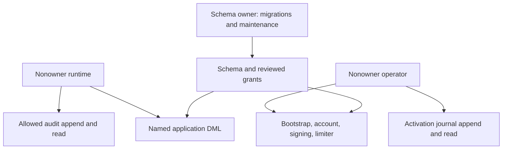

# Database authority and audit retention

The deployment grants in [grant-runtime.sql](../deploy/grant-runtime.sql) use an
explicit allowlist for the dedicated application database and its independent
`darkhorse_runtime` and `darkhorse_operator` logins. Apply them with HTTP
serving stopped, after reviewed migrations, as `darkhorse_owner` or the cluster
administrator. Compose `make stack-migrate` applies this script. Kubernetes
operators apply it explicitly after migration. It is a deployment policy, not a
schema migration or an individually authenticated CLI authorization mechanism.

Arrows describe selected privileges, not complete compromise containment.
Owners remain trusted. Nonowner roles cannot edit existing audit records.

## Runtime boundary

| State                                                                                 | Runtime privileges                                                                                                                          |
| ------------------------------------------------------------------------------------- | ------------------------------------------------------------------------------------------------------------------------------------------- |
| Named application tables                                                              | Existing SELECT, INSERT, UPDATE and DELETE privileges needed by application workflows. Application checks and database triggers still apply |
| Application audit tables                                                              | SELECT and INSERT. No UPDATE, DELETE, TRUNCATE, trigger changes, direct sequence access or grant option                                     |
| Administrator membership, signing keys, limiter authority and provider/limiter audit  | SELECT only                                                                                                                                 |
| Personal-key lifetime policy                                                          | SELECT only. Changes require trusted deployment authority                                                                                   |
| Security fence                                                                        | SELECT and UPDATE of `policy_revision`. Cannot change the bootstrap flag                                                                    |
| Authorization capacity fence                                                          | SELECT and UPDATE of `singleton`, sufficient for PostgreSQL row locks                                                                       |
| Provider binding                                                                      | SELECT, INSERT and UPDATE of `last_ms`. Cannot change issuer, wrapping fingerprint or key revision                                          |
| Login-budget, email-delivery and object-storage bindings                              | SELECT and INSERT for existing startup validation. Immutable-record triggers preserve existing bindings                                     |
| Four named pure constraint validators                                                 | EXECUTE with invoker privileges. No elevated rights                                                                                         |
| Migration history, unlisted tables, sequences and other callable application routines | No runtime privileges                                                                                                                       |

Existing trigger functions still execute with the invoking transaction's
privileges. CHECK constraints need execution of `oidc_identity_scopes`,
`oidc_identity_claims`, `capability_ceiling_valid` and `resource_token_scopes`.
These are the only routine grants.
Identity columns allocate audit identifiers without direct sequence grants.
No runtime operation receives schema/database creation, temporary tables,
ownership, role-management or permission-delegation authority from this script.

The script rebuilds direct and PUBLIC grants in one transaction, including prior
column grants. It clears global and `public`-schema default grants for
objects created by `darkhorse_owner`, including PostgreSQL's default PUBLIC
routine execution. A later table, sequence or routine receives no runtime access
from reapplying the script. Review migrations and their explicit grant
changes together. Migrations must use the designated owner and must not introduce
unreviewed grants, other schemas or elevated routines.

Unsafe runtime role attributes, role memberships (including membership that only
allows `SET ROLE`), and database/schema/relation/routine ownership cause the script
to fail. Resolve the deployment configuration with serving stopped. Do
not work around it by sharing the owner credential. Missing required relations
or dependent grants abort the transaction. An interrupted connection can
leave the commit outcome unknown: inspect privileges and reapply the reviewed
script before restarting. Never infer successful application from a lost reply.

Directory listing also requires SELECT/INSERT on `operator_directory_audit` from
migration `0025`. Reapply the reviewed grants after migration. Runtime cannot
update, delete or truncate this append-only read audit. The nonowner deployment
operator role receives no access to this new table; use the runtime account-command
configuration with fresh administrator authentication.

Catalog listing additionally requires SELECT/INSERT on `operator_catalog_audit`
from migration `0026`, with the same append/read-only runtime boundary. No grants
are added for the nonowner deployment operator. Detail reads add the same explicit
SELECT/INSERT grants on `operator_catalog_detail_audit` from migration `0027`.
Apply the migration and refreshed grants with serving stopped. Neither ledger
permits runtime updates, deletes or truncation. See [catalog reads](operator-catalog.md).

Application writes add SELECT/INSERT on `operator_application_audit` from migration
`0028`, and reuse the existing application and registration-audit grants. The
nonowner deployment operator receives no access. Reapply the grant policy with
serving stopped. See [application writes](operator-applications.md).
Client configuration updates add SELECT/INSERT on `operator_client_audit` in
migration `0029`; the nonowner operator receives no access. Reapply grants after
migrating. The command reuses client/binding DML and requires no client-secret
reads. See [client updates](operator-clients.md).

## Operator and migration boundary

`darkhorse_operator` is a nonowner login with no memberships. It receives only
these existing command requirements:

- Bootstrap: SELECT/INSERT on principals, credentials, password verifiers and
  administrator membership. UPDATE of the bootstrap flag and security revision.
- Account commands: principal status/epoch/revision changes, eligible-administrator
  reads, credential recheck locks, login-budget binding and security/account audit
  INSERT/SELECT. The principal trigger can cancel invitations using only its
  required columns. Password-verifier replacement and credential revocation are
  not granted. Fixed `kind` columns permit credential row locks.
- Signing: provider binding, revision/time changes, key insertion and lifecycle
  updates. Provider audit INSERT/SELECT. [Operation journal](signing-operations.md)
  SELECT and column-scoped INSERT, with database-owned role and timestamps.
  Runtime receives no signing journal grants.
- Limiter: authority insertion/updates and limiter audit INSERT/SELECT.
  [Activation journal](limiter-activation.md): SELECT and column-scoped INSERT.
  Database role and timestamps are supplied by PostgreSQL. Runtime receives no
  journal grants. Neither nonowner can edit/delete/truncate records.

There are no operator grants on migration history, browser sessions, OAuth/client
secrets, access/refresh tokens, personal-key verifiers, unrelated audit records or
future objects. Neither nonowner role can alter schema, disable triggers, edit or
truncate audits, create temporary tables, delegate permissions or switch roles.
The same topology guards and atomic grant reset apply to both roles. A missing
role fails before grants change. Provision both logins before applying this policy.

The database and schema owner `darkhorse_owner` is reserved for migrations and trusted database
maintenance. [Migration inspection](migration-operations.md) uses the same owner login
and reads the private `darkhorse_migration_v1` journal. Neither nonowner role has access.
Compose's `migrator` service and Kubernetes's `darkhorse-migrator`
service account/secret receive only its database URL and the public CA. They have
no signing, login or Redis secret mounts and only database network access (plus
cluster DNS in Kubernetes). The ordinary operator receives its independent
`operator-db` credential and the existing recovery material. Kubernetes projects
only the listed secret keys into each workload. This does not restrict a host,
database owner or cluster administrator who can change mounts, labels or grants.

Bootstrap needs sensitive INSERT privileges: a stolen operator credential can
still create accounts/administrator membership, read password verifiers, change
account status, and append misleading evidence. These are **trusted deployment
credentials**, not individually authenticated or scoped emergency credentials.
Application bootstrap remains one-time. SQL grants do not enforce that lifecycle
against direct SQL. Account CLI commands still require fresh administrator
passwords, shared admission and transaction-time authority rechecks. The role
split does not add administrative assurance to other command groups.

## Audit access and limitations

There is no automatic audit deletion, retention deadline or public export
endpoint. Runtime reads remain necessary for existing bounded admission queries.
Its credential can read personal audit data. Restrict secret mounts, exec
access and backups accordingly. Owner-operated exports need protected storage,
explicit recipients and a deployment retention policy. Ordinary console or CLI
access does not grant an audit export capability.

Audit-edit privileges are denied independently of existing immutable-row
triggers. When an account operation cannot insert its audit record, its state
change rolls back. This does **not** establish tamper-proof evidence: database
owners and host administrators remain trusted. A compromised runtime can append
misleading records and alter the application tables it can write. A stored
database role identifies a credential boundary, not an authenticated human, and
caller-supplied fields are not independent provenance.

This remains partial separation. Runtime credentials still permit broad credential/session writes.
Account CLI operations require a fresh administrator password and
transactional actor audit, described in [the account contract](operator-accounts.md).
Runtime-compromise containment, protected emergency
credentials, independent audit evidence, and broader recovery reconciliation
remain in [#23](https://github.com/OneTesseractInMultiverse/darkhorse-identity/issues/23).
Limiter activation has a [durable intent and receipt](limiter-activation.md).
Signing mutations have [correlated intent and completion](signing-operations.md).
Migration reconciliation remains incomplete. No audit-bypass or
emergency-access mechanism is implemented.

## Verification

`make test-db-authority` creates its own disposable Percona database and uses real
password-authenticated owner/runtime/operator connections. It rejects a wrong password,
checks SQLSTATE permission failures independently of row triggers, denies new
objects and role escalation, verifies grant reapplication/rollback, and exercises
direct SQL transactions with allowed and denied audit insertion, plus account CLI
refusal without authentication. Operator checks exercise actual bootstrap,
signing and limiter commands, audit-failure rollback, migration refusal, future-object
denial, unsafe topology and atomic grant reapplication. Actual authenticated account operations and
transactional audit failures are covered by `make test-operator-accounts`. It runs
inside `make test-postgres` and hosted source verification. These are integration
tests. `make test-unit` remains service-free.

Compose and Kubernetes qualification exercise the same grant script with the
packaged runtime. Local development uses separate trusted credentials and does
not establish this restricted-role boundary. SQL/process evidence is separate
from Rust/frontend line coverage. It does not complete the authored-coverage gate.

The policy follows PostgreSQL's [privilege model](https://www.postgresql.org/docs/18/ddl-priv.html)
and [revocation rules](https://www.postgresql.org/docs/18/sql-revoke.html), and
OWASP's [logging protection guidance](https://cheatsheetseries.owasp.org/cheatsheets/Logging_Cheat_Sheet.html).
