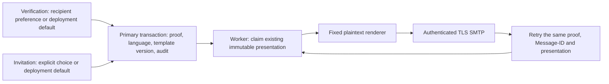

# Email language and delivery versions

Verification and invitation emails support English and Spanish. Language changes
presentation only. Their recipients, proof purposes, lifetimes, admission budgets,
confirmation rules and audit events remain the contracts described in
[email verification](email-verification.md) and [invitations](invitations.md).

## Choosing and retaining a language

Verification uses the authenticated recipient's saved profile language, falling
back to `DARKHORSE_DEFAULT_LOCALE` and its English default. The current browser's
anonymous or temporary choice does not silently change an account preference or
future email. The existing primary-state transaction reads the preference, stores
the resolved language alongside the new proof, and commits its audit atomically.

An invitation has no enrolled recipient preference. Administrators can send
`{"email":"recipient@example.com","locale":"es"}` to
`POST /api/admin/invitations`. `locale` accepts only `en`, `es`, `null`, or omission;
`null`/omission use the deployment default. Regional or unsupported values are
rejected with the existing generic invalid-invitation error. The body remains
bounded to 4 KiB. This is an administrative API option; a paginated invitation
management console is still outstanding. The issuer's own language and the
recipient's email domain never select the delivery language.

Each queue row stores `delivery_locale` and `template_version`. SQL rejects a
change to either value for the same proof identity. Preference or deployment
changes affect subsequent issuance only. Retries preserve creation/expiry times,
proof seed, language and template version. A new verification proof may replace
an older one through the existing cooldown and transition checks. Neither language
choice nor a failed delivery refunds an admission charge.

## Upgrade and template compatibility

Migration `0033` adds the presentation fields. Existing messages receive English
and version `0`; the original subject, plaintext and link format remain available
for those messages. New issuance explicitly stores version `1`. Database defaults
remain version `0` for legacy insertions. No queued proof is regenerated and no
expiry is extended during migration.

For this upgrade, stop the application and delivery workers, apply the migration,
then start the new binaries with consistent deployment settings. Mixed-version
workers are not qualified: an older worker does not know the new presentation
fields. The existing database migration journal records and reconciles each step.
There is no automatic schema downgrade or template substitution.

Keep every referenced template version and language until its pending deliveries
have completed or expired. Future template edits need a new version; changing a
version's text in place would change retries. Unknown versions or invalid persisted
languages fail without sending fallback content. A deliberate future language
removal therefore needs an explicit queue migration policy.

## Rendering and link handling

The renderer is a pure adapter computation over fixed, bundled plaintext. It
validates a canonical HTTPS origin of at most 1,024 bytes, the exact proof-purpose
encoding, the pinned template version, and the stored issuance/expiry interval.
Version `1` interpolates the actual interval as minutes for verification and hours
for invitations. Current values remain 15 minutes and 24 hours. The body is bounded
to 4 KiB before MIME encoding. Subjects are fixed strings; recipient names and email
addresses are not template variables. Lettre validates the single recipient,
encodes Unicode/MIME, and performs the existing authenticated TLS submission.
There is no HTML template, external translation service or remote template download.

Version `1` links use `/security/email#token=…&lang=es` or
`/invitation#token=…&lang=es`. The browser accepts the exact bounded grammar, removes
the complete fragment from history, and keeps the proof only in component memory.
Legacy links without `lang` still work. The language hint is scoped to that page;
leaving the page clears it without overwriting a newer page's hint. Explicit user
choice, saved preference and anonymous preference retain their documented priority
over the hint. A hint never saves a profile preference, confirms an email, accepts
an invitation, or moves a proof into a query parameter or persistent storage.

Opening a link still requires explicit confirmation and the correct account for
verification. Invitation acceptance still creates an ordinary account and requires
normal sign-in afterwards. Password recovery messages are outside this feature.

## Verification and measured cost

Source-defined tests cover canonical fragments, scoped hint cleanup, template
bounds, MIME recipient injection rejection, purpose isolation and stable output
across attempts. PostgreSQL tests cover explicit/default/saved precedence, changed
preferences, replacement workers, retries, immutable presentation and a schema-32
queue upgrade. Verified-HTTPS browser tests consume Spanish email through the
actual authenticated TLS SMTP fixture, including accented text, link removal,
explicit confirmation, enrollment and replay rejection.

No new SQL statement or join is required to select the delivery language. The
existing verification actor projection adds `preferred_locale`; existing queue
reads already project the whole row. Each new row adds a two-character language and
a small integer version. Those scalar values occupy 3 and 2 bytes respectively in
PostgreSQL, excluding tuple alignment, page effects and existing-row default
storage. New links add eight fragment characters (`&lang=es`). Audit and token
formats are unchanged, and no language read enters token introspection.

Run `make benchmark-email` for the same pure renderer used by delivery. The
[recorded release-build observations](measurements/email-localization-2026-09-26.json)
contain five alternately ordered English/Spanish samples of 100,000 renders each,
with 1,000 warm-up renders per sample. They include input validation, formatting
and allocation, and exclude HMAC derivation, MIME, database, SMTP and network costs.
Body sizes for the fixture are 425/451 bytes for English/Spanish verification and
413/442 bytes for invitations, before MIME encoding. These small in-process samples
do not establish delivery throughput or production capacity. Fluent translation
review, full coverage and broader delivery operations remain qualification work.

The [landing-page presentation sample](measurements/email-link-localization-2026-09-26.json)
records 134,355 summed gzip JavaScript bytes, 25,202 above the original English-only
build and within the unchanged 36 KiB localization budget. It uses the same static,
loopback presentation fixture as the earlier localization samples; it measures no
SMTP or authentication capacity.
