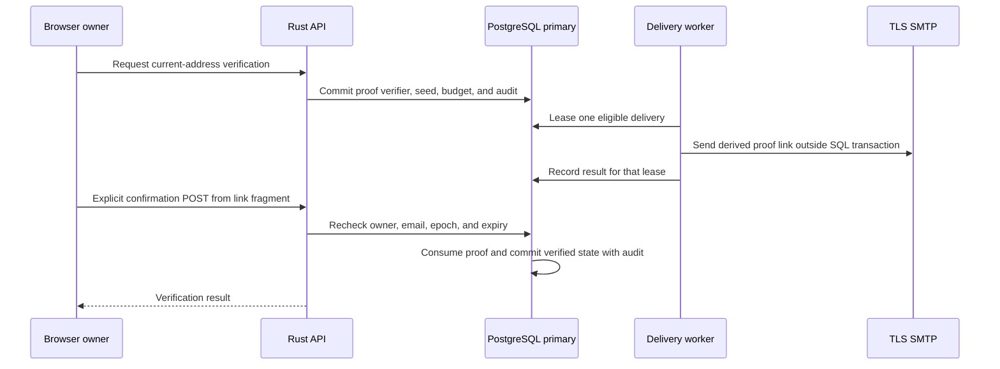

# Current-email verification

Issue [#13](https://github.com/OneTesseractInMultiverse/darkhorse-identity/issues/13) adds opt-in proof of control of the email already attached to a principal. The account page is `/security/email`. It supports an explicit request, an emailed confirmation link, and an explicit confirmation button. It never activates an account, changes its email or password, grants permissions, or changes its stable subject identifier.

## Authority and proof

Both request and confirmation require a live browser session for the owner. Possession of a verification link alone cannot establish a session. A signed-out user can sign in on the same page. The proof stays in component memory. The page shows the signed-in account's email before confirmation and allows switching accounts. No extra password prompt is required for this current-address proof. Password recovery, email changes and privileged-account assurance need separate contracts.

Proofs expire exactly 15 minutes after request, work once, and bind the principal, exact current email, and credential epoch. A changed email invalidates a pending proof. Restoring the address does not restore that proof. Credential epoch changes invalidate pending proofs. An already verified address remains verified across credential changes. Deactivated accounts and expired or revoked sessions cannot confirm. New accounts start unverified. An email change clears verified state. UserInfo projects the current verification flag only with an approved `email` scope. Tokens, roles and capability ceilings do not expand.

A dedicated random 32-byte key and a fresh OS-random 32-byte seed produce an HMAC-SHA-256 proof under the `darkhorse:email-verification:v1` purpose label. The browser value is `ev1_` followed by 64 lowercase hexadecimal digits. SHA-256 of that complete value is the lookup verifier. PostgreSQL stores the verifier and the delivery seed. The seed cannot reproduce a proof without the separate deployment key. The server regenerates the same proof for delivery retries. It never stores the raw proof or complete link in PostgreSQL. Key material is zeroized where supported. This is not a guarantee that all process or mail-library buffers can be erased.

Links use the fixed configured HTTPS origin and `/security/email#token=...&lang=en` (legacy messages omit the language). No client redirect is accepted. The fragment is removed with history replacement before fetching account status. The proof stays in memory until confirmation or navigation. It is never put in browser storage or an HTTP request URL. Confirmation is a same-origin POST with CSRF protection, not a GET or an automatic page-load action. Mail scanners cannot consume the proof simply by fetching the link. Reopening the original email restores a link lost on reload. A lost mutation response requires a fresh status read before another mutation.

SMTP acceptance confirms transport handoff. It does not prove inbox delivery.
An uncertain SMTP response can produce duplicate messages with the same proof.

## Persistence and delivery

Apply all current migrations explicitly before starting this version. Migration **0014** introduced the proof store; **0033** adds [pinned delivery language and template versions](email-localization.md). Existing data starts unverified. Historical verification is never inferred. SQL transitions retain ownership, proof bindings, terminal consumption and completed delivery state. One current proof row is retained per principal. Requested, verified and delivery-result events append to an immutable audit table without addresses, proof digests, seeds or URLs. Historical audit records and their session references currently have no automatic retention policy.

State-changing operations take the existing exclusive security fence in a separate first statement and recheck the original actor after work. Invalid proof preflight uses a shared fence. Confirmation, principal revision, consumption and audit commit atomically. Audit failure rolls everything back. Directory reads do not extend session idle time. Redis stores no positive verification or authorization decision.

Request limits persist across restarts and replicas: one message request per 15 minutes, at most five in a rolling 24-hour window, and at most 10,000 unexpired queued jobs. Verified accounts do not enqueue another message. Requests cannot nominate a recipient. They use the authenticated account's current email. Limits bound authenticated mailbox abuse but do not establish a production capacity target.

Each process delivers one job at a time, drains ready work immediately and waits two seconds only when idle or the queue is unavailable. There is one SMTP operation in flight per process. Claims use `FOR UPDATE SKIP LOCKED`, a lease of at most 60 seconds, and an attempt number. A stale acknowledgement cannot modify a replacement request or a newer attempt. No network call holds a SQL transaction. The worker checks current account/email/epoch and expiry before claiming. A subsequent account change can race with mail already in flight. Confirmation still checks current authority and rejects stale proofs.

Delivery has a maximum of five claims, a five-second transport timeout and ten-second total operation deadline. Transient or ambiguous failures retry after 60, 120, 240 and 480 seconds, only within proof expiry. Permanent SMTP rejection ends delivery. Expired, stale and exhausted queued payloads are cleared in batches of at most 100 per pass. Completed deliveries clear their seed. An expired lease after process death can retry the same Message-ID and proof. An uncertain SMTP result can produce duplicate mail. “Accepted” means the SMTP server accepted the message, not that it reached an inbox. The UI reports queued delivery, never guaranteed receipt. Events record completed attempt results. A crashed attempt can lack a result event.

## Configuration

Email is disabled by default and requires active password authentication. It does not require the OIDC provider to be active. Configure these through the deployment's secret/configuration mechanism before starting the Rust server:

| Setting                                              | Meaning                                                                                                       |
| ---------------------------------------------------- | ------------------------------------------------------------------------------------------------------------- |
| `DARKHORSE_EMAIL_ENABLED`                            | `true` to activate routes and the delivery worker                                                             |
| `DARKHORSE_EMAIL_KEY`                                | Separate random 32-byte secret as 64 lowercase hex digits. Do not reuse login/signing keys                    |
| `DARKHORSE_SMTP_HOST`                                | Operator-selected DNS hostname of the submission service                                                      |
| `DARKHORSE_SMTP_PORT`                                | Implicit TLS port, default `465`. STARTTLS on port 587 is not supported in this increment                     |
| `DARKHORSE_SMTP_FROM`                                | Single sender email address authorized by the SMTP service                                                    |
| `DARKHORSE_SMTP_USERNAME`, `DARKHORSE_SMTP_PASSWORD` | Supply both for authenticated submission, or neither for a trusted relay                                      |
| `DARKHORSE_SMTP_CA_FILE`                             | Optional single PEM root certificate (at most 256 KiB) for a private CA. Hostname validation remains required |

Implicit TLS is mandatory with trusted chain and hostname verification. There is no insecure delivery mode. The configured SMTP service and mailbox necessarily receive message contents and must be trusted. Configure relay restrictions, SPF/DKIM/DMARC and mail retention with the provider. Only fixed, redacted failure messages enter server logs. Never activate request-body or SMTP-content logging around these routes. Restrict outbound network access to the chosen service.

Origin and key fingerprint bind immutably to the database on first startup with email configured, preventing a mismatched replica from sending unusable or wrong-origin links. Store the key with the database backup and preserve it across restarts. Automatic key rotation, origin migration and emergency replacement are not implemented. Changing either setting causes startup to fail. Database-owner and root access remain outside application enforcement.
[Runtime, operator, and migration roles](database-authority.md) are separate.
Broader operator assurance remains in #23.

For development, first prepare the database, Redis and HTTPS login setup in [authentication](authentication.md), apply migrations, then run `make email-setup`. Inject SMTP settings into the environment and use `make dev-email`. The command reads the owner-only `.local/email-verification.key`, preserves existing keys and starts the login development stack. It does not change local database state or install a mail server. Set SMTP configuration through a protected environment or secret manager, keeping credentials out of command history and tracked files.

## Verification and remaining work

`make test-email` runs source-defined, service-free policy, application, transport and UI tests. `make test-postgres` checks actual constraints, audit rollback, ownership, expiry, replacement, request budgets, concurrent confirmation and delivery claims, stale acknowledgements, origin/key binding and scope-limited live UserInfo. `make test-browser` runs real HTTPS Chromium and authenticated implicit-TLS SMTP against disposable infrastructure. Messages remain in the test receiver's memory. `make ci` supplies the ordinary engineering checks and production builds.

[Invitation-only onboarding](invitations.md) is implemented. Password recovery,
email changes, security notifications, privileged recovery assurance, delivery
operations, retention, and production qualification remain open in #13. Email verification does not itself establish MFA or recovery assurance. See [OWASP's verification guidance](https://cheatsheetseries.owasp.org/cheatsheets/Email_Validation_and_Verification_Cheat_Sheet.html).

## Recorded evidence

See [verification](verification.md) for the latest consolidated results, coverage
denominators, and unqualified boundaries.

## Related onboarding

[Invitation-only onboarding](invitations.md) shares the configured email key and TLS transport with a separate proof purpose and distinct authority rules. Both request paths count against the same queued-message ceiling.

## Source reference

[proof policy](../crates/domain/src/email_verification.rs),
[delivery transport](../crates/adapters/src/email_verification/smtp.rs),
[queue claims](../crates/adapters/src/postgres/email_queue.rs).
