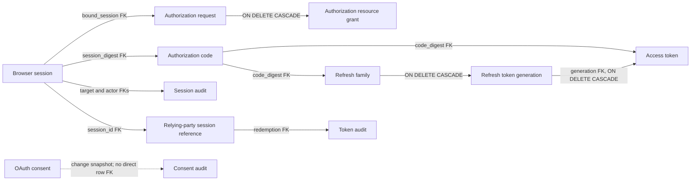

# Identity record lifecycle and retention

This inventory is the policy boundary for [issue #33](https://github.com/OneTesseractInMultiverse/darkhorse-identity/issues/33). It records primary-database authority, foreign-key relationships, and the bounded cleanup now implemented for authorization requests, legacy access tokens and terminal authorization codes. Session, consent, audit and relying-party reference retention remain separate work.

Logical expiry and physical row retention are separate policies. A row past its protocol expiry must already fail authorization checks; deletion additionally follows credential dependencies. Cleanup uses protocol expiries and existing refresh-family retention, without adding a guessed universal grace period.

## Dependency map



Solid arrows show foreign keys; a relationship without an explicit cascade blocks parent deletion while the child exists. The dotted line marks an audit snapshot by principal/client, not a direct consent-row foreign key. Audit references are retained; they are not cleanup cascades. Source contracts are in migrations [0004](../crates/adapters/migrations/0004_browser_sessions.sql), [0007](../crates/adapters/migrations/0007_authorization_requests.sql), [0008](../crates/adapters/migrations/0008_code_exchange.sql), [0012](../crates/adapters/migrations/0012_refresh_rotation.sql), [0013](../crates/adapters/migrations/0013_session_management.sql), [0016](../crates/adapters/migrations/0016_relying_party_sessions.sql), [0035](../crates/adapters/migrations/0035_authorization_expiry_order.sql) and [0037](../crates/adapters/migrations/0037_identity_credential_cleanup.sql).

## Current records and future eligibility

| Record class                     | Current authority and expiry                                                                                                                                             | References and evidence                                                                                                                                                                  | Current physical cleanup                                                                                                                                                                                                                                                                                                                                                                           | Future deletion eligibility                                                                                                                                                                                                                                               |
| -------------------------------- | ------------------------------------------------------------------------------------------------------------------------------------------------------------------------ | ---------------------------------------------------------------------------------------------------------------------------------------------------------------------------------------- | -------------------------------------------------------------------------------------------------------------------------------------------------------------------------------------------------------------------------------------------------------------------------------------------------------------------------------------------------------------------------------------------------- | ------------------------------------------------------------------------------------------------------------------------------------------------------------------------------------------------------------------------------------------------------------------------- |
| Browser sessions                 | `expires_ms` is fixed at creation and bounded to eight hours. Revocation is terminal. Live checks also evaluate the account, credential epoch and current primary state. | Authorization requests, authorization codes, immutable session audit target/actor references, and immutable relying-party session references.                                            | No session-row cleanup.                                                                                                                                                                                                                                                                                                                                                                            | Only after the stored expiry or revocation, dependent requests/codes/credential families are handled, and audit and relying-party references have a reviewed retention representation. Existing session cookies and tokens must remain rejected throughout.               |
| Authorization requests           | Five-minute lifetime; approval, binding and terminal state are monotonic.                                                                                                | Optional resource grants reference the request and cascade with its removal. A bound browser session is a child-to-parent foreign key; deleting the request does not delete the session. | Authentication-enabled server instances run a sweep every 60 seconds, including while OIDC endpoints are disabled. Each database transaction deletes at most 100 expired rows, skips rows locked by active transactions or another worker, and has a 500 ms lock timeout and 2 s statement timeout. A sweep stops after ten full batches. New authorization requests also prune one bounded batch. | Expired rows are eligible at `expires_ms <=` primary database time. The existing five-minute protocol expiry is sufficient because authorization requests have no replay/audit foreign keys; resource-grant children are removed by their declared cascade.               |
| Authorization codes              | Sixty-second lifetime and one-use consumption. A consumed row supplies the current replay path while a dependent credential exists.                                      | Access tokens and refresh families reference the code. Token audit records retain principal/client/event, but not the code digest.                                                       | A scheduled sweep runs after refresh-family and legacy access-token cleanup. It deletes at most 100 rows per transaction and 1,000 per minute, skipping locked rows. It removes a code only after expiry and only when no access-token or refresh-family child remains. Lock timeout is 500 ms; statement timeout is 2 s.                                                                          | Eligible at `expires_ms <=` primary database time after all credential children are gone. Replay evidence remains while an access token or refresh family can still be active; once all such credentials are terminal, retries receive the generic invalid-grant outcome. |
| Access tokens                    | At most five minutes; revocation is terminal. Introspection checks current primary authority, grant and expiry.                                                          | Each row references an authorization code. Refresh-issued access rows also reference a refresh generation and cascade when that generation is removed.                                   | Legacy rows (`refresh_generation IS NULL`) are removed in a scheduled sweep after refresh-family cleanup. At most 100 rows per transaction and 1,000 per minute; locked rows are skipped. Rows bound to refresh generations are retained for the existing family sweep. Lock timeout is 500 ms; statement timeout is 2 s.                                                                          | Legacy rows are eligible at `expires_ms <=` primary database time. Refresh-bound rows remain until the family cleanup removes them with their generation.                                                                                                                 |
| Refresh families and members     | A family ends no later than eight hours after original authentication. A member lasts at most 15 minutes and cannot outlive the family.                                  | The family references its root code. Family deletion cascades to refresh members and their access rows.                                                                                  | Existing sweep waits until 24 hours after family expiry, removes at most ten families per batch, skips busy roots and attempts at most ten batches per minute while the provider is active. The root authorization code remains.                                                                                                                                                                   | Retain the current rule unless a separately measured and reviewed policy change is made. Coordinate any code cleanup after the family has been removed. See [refresh maintenance](refresh-tokens.md#migration-and-maintenance).                                           |
| Consent grants                   | No time-based expiry is defined. Current grant changes are authoritative policy transitions.                                                                             | Consent rows reference principal and client. Immutable consent audit records retain grant-change history.                                                                                | No generic consent cleanup.                                                                                                                                                                                                                                                                                                                                                                        | Only under explicit consent-revocation semantics, while preserving the audit trail and avoiding resurrection after restore.                                                                                                                                               |
| Relying-party session references | Immutable mapping of issuer, client, principal and browser session to the `sid` included in new ID tokens.                                                               | References the browser session and client; new redemption audit rows reference the mapping.                                                                                              | No deletion path. Back-channel notification delivery is not implemented yet.                                                                                                                                                                                                                                                                                                                       | Defer until issue #14 defines durable delivery, terminal delivery outcomes and retention of notification context. Do not infer delivery completion from local browser-session revocation.                                                                                 |
| Audit records                    | Historical evidence; not an authorization cache.                                                                                                                         | Session, token, consent and policy audit records have immutable update/delete protections. Session audit and new token-redemption audit rows also have restrictive foreign keys.         | No audit deletion or archival worker is part of this issue.                                                                                                                                                                                                                                                                                                                                        | Retention, export and any archival representation remain under [issue #23](https://github.com/OneTesseractInMultiverse/darkhorse-identity/issues/23). Any schema change must keep audit records immutable and preserve their meaning.                                     |

Principals, credentials, applications, OAuth clients and access-catalog records are outside a generic expiry sweep. They carry durable ownership, policy or audit relationships and use their own deactivation/revision contracts.

## Cleanup rules

1. Compute eligibility from explicit database time and category-specific cutoffs. Do not use a process clock or infer retention from protocol token lifetime alone.
2. Sweep in dependency order: expired refresh families first (their generation-bound access rows cascade), then expired legacy access tokens, then expired authorization codes with no remaining child. Use bounded batches and skip-on-contention behavior.
3. Keep current authorization checks on the primary. Cleanup state never grants access, changes consent or reduces the immediate effect of a committed revocation.
4. Preserve audit rows and necessary replay evidence. Do not disable immutable triggers, cascade through audit tables, reuse identifiers or reset bootstrap state to make rows deletable.
5. Treat cancellation, shutdown, uncertain command outcomes and backup restoration as first-class cases. A later sweep must recompute eligibility against restored primary state; a partial batch must not remove its audit or replay dependencies.
6. Add only aggregate, bounded backlog/age/deletion/failure metrics. Do not label metrics with principals, clients, identifiers, queries or credentials.

## Retention work still open

- How session audit keeps its immutable target and actor references if the browser-session row eventually becomes eligible for deletion.
- How `sid` associations remain available through any future signed logout delivery, retry and terminal-failure window.
- Which consent snapshots remain in the live table versus an approved immutable archive.
- Backup/restore qualification and organization-specific retention for audit, consent and session references. Credential sweeps recompute eligibility against restored primary database time; stale metrics or pre-restore sweep state is never an authority.

The authorization-request, legacy access-token and terminal authorization-code sweeps check primary database time while holding the shared primary-authority fence. A delay or failure in cleanup never extends a credential's protocol lifetime or grants access. Lock contention, statement failure and shutdown leave the batch retryable. Credential removal follows refresh-family dependencies; a family or token row that could still affect authorization blocks code deletion. The queries emit no per-record logs or metric labels.

Migration 35 replaces the single-column authorization-expiry index with a B-tree
on `(expires_ms, digest)`. The second key matches the cleanup query's stable
tie-breaking order. On a large synthetic set with identical expiry times, the
single-column index made PostgreSQL read and incrementally sort the entire
expired set to obtain each 100-row batch. The composite key lets the bounded
scan follow both ordering columns. This changes no request data or expiry
semantics. The migration is transactional and uses the repository's ordinary
index-build path, so database operators should account for its write-lock window
when upgrading a deployment with a large request table.

Migration 37 replaces the access-token expiry index with a partial composite
index on `(expires_ms, digest)` for legacy rows and adds the same ordered index
for authorization codes. This keeps refresh-generation access rows out of the
legacy-token scan and lets each bounded query read its stable expiry order.
Index creation uses the repository's transactional migration path; operators
should account for the index-build write-lock window and added index storage
when upgrading a large credential population.

When a scheduled sweep deletes rows or observes expired backlog, the server emits one structured stderr event with fixed fields:

```text
maintenance authorization_request_cleanup status=ok batches=10 deleted=1000 backlog_remaining=true oldest_expired_age_ms=... duration_ms=...
```

`batches` and `deleted` describe that scheduled sweep only; authorization-start transactions may independently remove one batch and are not included. `duration_ms` is wall time for the OIDC sweep, including its bounded database transactions, and excludes the separate refresh-family sweep. `backlog_remaining` means at least one expired row was visible after the last batch in its SQL statement snapshot. This is a lower-bound signal, not an exact queue count; another worker may have the row locked or be deleting it. `oldest_expired_age_ms` is an aggregate age derived from primary database time and the oldest expired row observed in the processed or remaining set. Failed sweeps include the same aggregate duration and a fixed `error=unavailable` field, then retry at the next interval. Empty successful sweeps are silent. These are bounded log observations, not a Prometheus/OpenTelemetry exporter or a complete count of cleanup initiated by request traffic.

The real PostgreSQL scale test seeds 20,000 expired and 20,000 live synthetic requests. One scheduled pass reports no more than ten batches and 1,000 deletions, preserves every live row, and reports aged remaining work. This demonstrates the configured work bound at that fixture size; it does not establish production latency, query-plan stability, vacuum/WAL impact, or interference with login, introspection, and security writes.

The PostgreSQL boundary suite also terminates the cleanup transaction's backend
while its delete trigger is blocked. It verifies the expired row remains after
the interrupted transaction rolls back, removes the test-only blocker, and
confirms a later sweep deletes the row. This exercises recovery from an
uncertain in-flight cleanup command; it does not simulate a database-host crash
or replace backup/restore qualification.

Credential cleanup emits fixed aggregate events such as
`maintenance legacy_access_token_cleanup status=ok batches=... deleted=...`
and `maintenance authorization_code_cleanup status=ok ...`. A failed category
is retried at the next interval; the independent categories still run. Empty
sweeps are silent. Age and backlog fields are lower-bound observations from
primary-database snapshots, not exact queue sizes.

`make benchmark-lifecycle-baseline` adds a separate restricted-runtime profile.
It provisions real browser/OIDC credentials, inserts 20,000 expired and 20,000
live synthetic requests into the disposable benchmark database, and runs the
60-second cleanup worker alongside the paced introspection, permission
reduction, and revocation phases. Reports include the aggregate cleanup event,
phase overlap and latency, the query planner's bounded-selection and deletion
plans, authorization-request table-size and vacuum-stat snapshots, and the
existing per-phase PostgreSQL statement/WAL and Rust-stage observations. The
selection plan is analyzed against the fixture; the deletion CTE is explained
without executing it. Only a bounded projection of plan nodes is kept, without
query text. The disposable benchmark owner creates fixtures; server traffic
uses the restricted `darkhorse_runtime` role.

Use the adjacent `profile-baseline` workload as a directional control for
traffic without the large expired backlog. These local, single-host runs do not
establish a deployment capacity or SLO. They do not model multiple server
instances, disk-cold behavior, prolonged autovacuum/vacuum interaction, backup
growth, or production arrival distributions. Vacuum tuple counts and relation
bytes are point-in-time snapshots, not a long-term storage-growth forecast.

## Local lifecycle profile — 2026-09-27

Two control runs and two cleanup runs were collected from clean source commit
`b20be9207d988e1d5a6588bfdc8bb342e71c3f2c` with the same five-connection
`darkhorse_runtime` profile. The full aggregate reports and bounded query plans
are in the [lifecycle measurement record](measurements/authorization-cleanup-lifecycle-2026-09-27.json).

| Run       | Authorized introspection p95 at 200/s |   800/s | 1,600/s | Scheduled sweep |
| --------- | ------------------------------------: | ------: | ------: | --------------: |
| Control 1 |                               16.2 ms | 57.7 ms | 48.0 ms |               — |
| Cleanup 1 |                               42.7 ms | 49.0 ms | 48.2 ms |           43 ms |
| Control 2 |                               10.5 ms | 44.6 ms | 42.8 ms |               — |
| Cleanup 2 |                               18.1 ms | 45.6 ms | 52.2 ms |           35 ms |

Each cleanup run deleted exactly its 1,000-row budget from the expired backlog,
left 19,000 expired rows for later passes, preserved all 20,000 live requests,
and overlapped the concurrent revocation phase. The post-migration candidate
plan used `authorization_expiry` and returned 100 rows after reading 100 index
entries in 0.106–0.132 ms. The exploratory pre-migration plan read 20,000
same-expiry rows through an incremental sort in 8.887 ms. That earlier plan
probe had dirty source and is marked as such in the record; the four workload
runs used clean source.

The relation heap measured 10.25 MB in these fixtures. Total relation and index
size was 13.24 MB before the composite index and 15.70–15.72 MB after it, a
roughly 2.47 MB increase for this 40,000-row fixture. After one cleanup pass,
PostgreSQL estimated 1,000 dead tuples and reported no autovacuum during the
short run. Treat these as local observations, not scale projections. The 200/s
authorized p95 varied by more than 20 ms within the cleanup runs, and both
profiles returned substantial `unavailable` responses at 800/s and 1,600/s.
These samples do not establish a causal latency change, supported request rate,
or production capacity; more controlled repetitions and longer vacuum/storage
measurements remain open work.

Sessions, consent, audit and relying-party references still have no deletion path. Their retention and failure boundaries remain open in #33; the credential sweeps do not imply authorization to delete those records.

## Sources

- [Session validity and management](sessions.md)
- [Refresh rotation and existing family maintenance](refresh-tokens.md#migration-and-maintenance)
- [Back-channel logout session references](backchannel-logout.md)
- [Request and code redemption transactions](../crates/adapters/src/postgres/oidc/writes.rs)
- [Refresh-family maintenance transaction](../crates/adapters/src/postgres/tokens/refresh/maintenance.rs)
