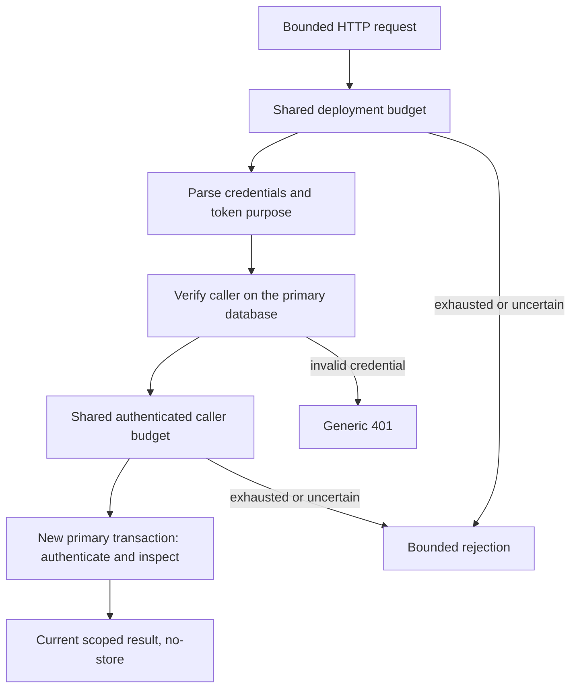

# Shared introspection admission

The provider requires shared admission for every `/introspect` request that reaches
the bounded handler. Admission counters never authorize a token.
The existing current-primary transaction remains the authority for every response.
[RFC 7662](https://www.rfc-editor.org/rfc/rfc7662.html#section-2.1) requires
endpoint authentication; the budgets below are additional deployment controls.

The primary-verification transaction has ended before the caller budget runs.
The final transaction repeats authentication; the preflight result is not a
reusable authorization proof.

## Threat and authority matrix

| Input or outcome                                           | Deployment budget | Caller budget                                  | Token lookup                        |
| ---------------------------------------------------------- | ----------------- | ---------------------------------------------- | ----------------------------------- |
| Malformed credentials or form reaching the bounded handler | Charged           | None                                           | None                                |
| Unknown client/resource or wrong secret                    | Charged           | None                                           | None                                |
| Valid confidential client                                  | Charged           | Client ID, after primary verification          | Existing client-bound transaction   |
| Valid resource credential, OAuth token or personal key     | Charged           | Resource ID, shared across both token purposes | Existing resource-bound transaction |
| Invalid, expired or revoked token with valid caller        | Charged           | Charged                                        | Generic inactive response           |
| Exhausted deployment budget                                | Rejected          | None                                           | None                                |
| Exhausted caller budget                                    | Charged           | Rejected without increment                     | None                                |
| Unavailable, fenced or uncertain limiter                   | Fail closed       | No unaccounted allowance                       | None                                |

HTTP size, origin, transport and concurrency rejection may precede the handler.
The deployment budget protects credential lookup. Client and resource namespaces
are distinct; secret rotation preserves the caller's budget. Token values, arbitrary
forwarded addresses, unverified identifiers and submitted secrets never select a
caller budget. No per-token key or durable per-request audit/usage write is added.
The authentication preflight releases its transaction before Redis work; the final
introspection transaction independently authenticates again. It therefore cannot
reuse stale authority after a concurrent deactivation, secret retirement or grant
reduction. No security fence is held while waiting on Redis.

## Bounds and fairness

Initial development settings use a fixed 60-second window: 60,000 deployment
attempts and 6,000 attempts per authenticated client/resource. Operators may set
`DARKHORSE_INTROSPECTION_GLOBAL_PER_MINUTE` and
`DARKHORSE_INTROSPECTION_CALLER_PER_MINUTE` from 1 through 1,000,000, with the caller
limit no greater than the global limit. These are unqualified development defaults,
not production capacity or fairness guarantees. Fixed windows permit boundary bursts.

All replicas must use the same policy and existing deployment-bound login limiter
key. HMAC domain separation keeps introspection counters distinct from login
counters. The deployment counter binds both configured limits: its rule stores the global
limit and a policy binding containing the caller limit. Different replica settings
therefore fail closed at the deployment check, including previously unseen callers.
Policy is excluded from counter identity: changing a limit while an
existing counter is present fails closed instead of creating a fresh allowance.
Use the explicit fenced recovery and activation procedure for a policy change;
logical window expiry alone does not remove records with the old policy. Never
mix policies.
The existing explicit fenced recovery procedure is required after state loss.

A stream of random invalid identities creates only one deployment counter. Valid
registered callers create one counter each, independent of token and secret count.
The existing Redis hash has a hard 16,384-counter ceiling and bounded pruning.
The shared ceiling, Redis service and database resources remain shared with login;
budget isolation is not memory reservation or latency isolation. A caller exhausting
its own budget does not charge another caller's budget, but all arrivals spend the
deployment budget. An unauthenticated flood can therefore make the endpoint
unavailable at the deployment limit. This is an explicit conservative boundary,
not a promise of availability under an unlimited attack. Upstream traffic controls
and measured capacity remain required deployment work.

The process permits two concurrent deployment-budget updates through a FIFO
queue with at most 16 queued or executing attempts. The one-second admission deadline includes
queue wait and consumption; cancellation releases the slot and cannot launch later
work. Other replicas still arbitrate through the shared atomic counter. This does
not reserve a quota, retry uncertain consumption or hold a database fence.

Use a separate bounded in-process Redis admission pool for introspection so its
work cannot take login's local limiter permits. Reuse the existing atomic compare/
exchange, durable generation checks, deadlines and ambiguous-failure behavior.
Successful budget consumption followed by any later failure is not refunded.
There is no retry after uncertain consumption and no automatic reset on restart.

## HTTP contract and qualification

Budget exhaustion returns HTTP 429 with `temporarily_unavailable`, `Retry-After`
rounded upward to seconds, and the existing `no-store`/`no-cache` headers. Dependency
failure returns the existing generic HTTP 503. Invalid caller authentication keeps
HTTP 401 and its Basic challenge. No response reveals remaining counters or caller
existence before successful authentication. Resource and personal-key requests use
the same caller quota. Revocation, UserInfo and token exchange retain their own
existing controls; this change does not impose this quota on those endpoints.

Required evidence includes isolated bounds/key/coordinator tests, actual primary
credential checks, real shared Redis atomicity/fencing/cardinality tests, HTTP
outcomes and post-commit denial, plus matched scheduled-load measurements with
identical protections. Production workloads, availability SLOs, multi-host behavior
and coverage qualification remain open until measured. Do not compare a protected
run against an unenforced run as an equivalent-security optimization.

## Local evidence — 2026-09-26

[Machine-readable observations](measurements/introspection-admission-2026-09-26.json)
retain source/binary hashes, topology, configured protections, latency, useful
outcomes, dropped arrivals, grouped SQL work and coarse resource snapshots. Run
`make benchmark-profile` to reproduce the delivered variant with fresh disposable
services. Raw request traces remain local; their digests identify the measured
inputs. Each measurement used a modified tree based on `041ca6d`, four clients,
five primary connections, four introspection limiter permits, verified HTTPS and
the same 60,000/6,000 quotas. No positive decision or computation cache was enabled.

The unbuffered protected baseline rejected most closed-loop bursts. A one-lane
queue recovered those bursts but reduced useful traffic in the invalid-credential
mixture. Two lanes provide the delivered compromise:

| Observation                                        | Unbuffered | One lane | Two lanes, first | Two lanes, repeated |
| -------------------------------------------------- | ---------: | -------: | ---------------: | ------------------: |
| Successful 64-request warmup                       |          5 |       64 |               46 |                  52 |
| Successful paced checks at 200/s                   |    400/400 |  400/400 |          400/400 |             400/400 |
| Scheduled p95 at 200/s                             |   13.93 ms | 11.63 ms |         12.18 ms |             9.65 ms |
| Successful checks from 2,400 arrivals at 1,200/s   |        603 |      835 |              760 |                 753 |
| Scheduled p95 for those successes                  |   21.24 ms | 44.01 ms |         38.59 ms |            38.91 ms |
| Successful healthy introspections in noisy mixture |        246 |      186 |              291 |                 281 |
| Unavailable responses in noisy mixture             |        148 |      675 |              111 |                 119 |

All observations had zero authority mismatches or transport/unexpected errors.
The first two-lane noisy phase dropped one late arrival; the repeated two-lane
1,200/s phase also dropped one. Every noisy phase completed 300 health checks.
Concurrent permission-reduction and revocation phases completed all 400 scheduled
requests, with current outcomes after acknowledgement. Follow-up bursts still
include unavailable responses: the repeated final run returned 49 explicit
inactive results and 15 unavailable responses after revocation, never stale access.
A passing security assertion is not a passing availability SLO.

The 200/s phase executes 24 measured SQL statements per accepted resource check,
including transaction, enforcement and fresh authority work. In the final run,
the limiter's observed command count increased by 117,096, current memory by
16,440 bytes, and user/system CPU by approximately 0.727/0.206 seconds across the
whole workload. Peak reported limiter memory was 1,642,528 bytes. Redis observations
include probes, script-internal commands and background work; they are not isolated
per-request costs. Earlier variants did not collect these fields. The optional
policy-binding wire field and final elapsed-deadline guard were added before the
two-lane measurements; older variants are explicitly identified in the artifact.

These short owner-role, single-host observations justify a bounded development
scheduling choice, not production throughput, stable percentiles, multi-host
fairness or a general Redis speedup. Longer matched repetitions with complete
Redis observations, runtime-role deployments and production budgets remain open.

`make ci` exercises isolated policy, configuration, wire-format, queue, HTTP and
reporting cases. `make test-postgres` verifies primary caller authentication and
existing token/permission transitions. `make test-redis` exercises actual shared
counters, independently launched processes, forged-identifier cardinality, caller
and login budget separation, policy mismatch, fencing, deadline cancellation and
revocation between preflight and final inspection. The common limiter's real
lost-reply, restart, recovery, atomicity and capacity scenarios remain active.
Whole-project coverage and release qualification remain separate open gates.
