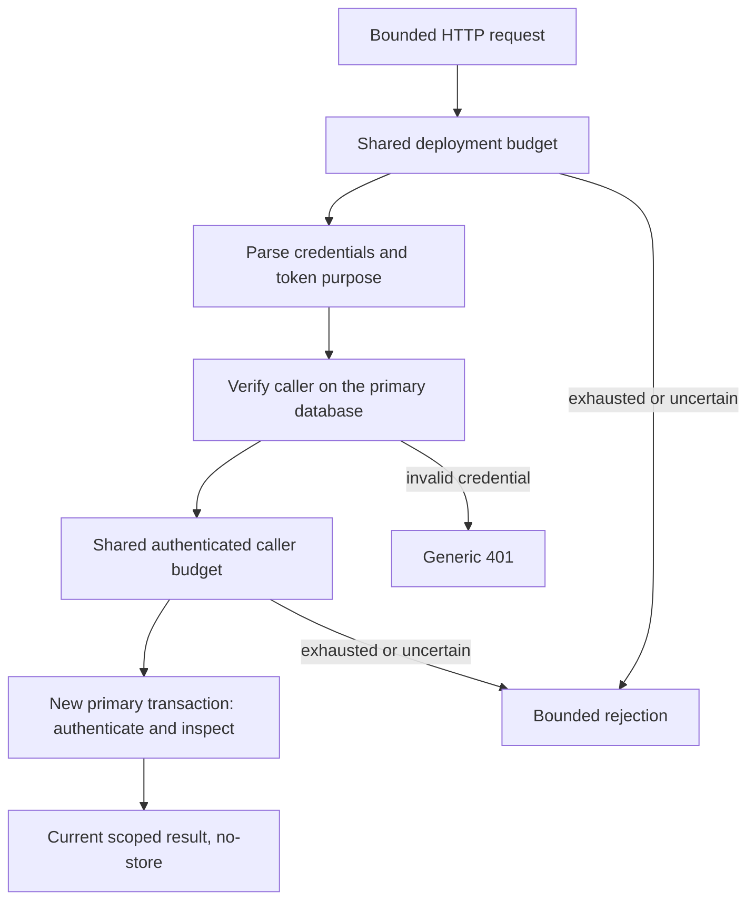

# Shared introspection admission

The provider requires shared admission for every `/introspect` request that reaches
the bounded handler. Admission counters never authorize a token.
The existing current-primary transaction remains the authority for every response.
[RFC 7662](https://www.rfc-editor.org/rfc/rfc7662.html#section-2.1) requires
endpoint authentication; the budgets below are additional deployment controls.

```mermaid
flowchart TD
  HTTP["Bounded HTTP request"] --> Global["Shared deployment budget"]
  Global --> Parse["Parse credentials and token purpose"]
  Parse --> Primary["Verify caller on the primary database"]
  Primary --> Caller["Shared authenticated caller budget"]
  Caller --> Fresh["New primary transaction: authenticate and inspect"]
  Fresh --> Result["Current scoped result, no-store"]
  Global -->|"exhausted or uncertain"| Reject["Bounded rejection"]
  Caller -->|"exhausted or uncertain"| Reject
  Primary -->|"invalid credential"| Denied["Generic 401"]
```

The primary-verification transaction has ended before the caller budget runs.
The final transaction repeats authentication; the preflight result is not a
reusable authorization proof.

## Threat and authority matrix

| Input or outcome                                           | Deployment budget | Caller budget                                  | Token lookup                        |
| ---------------------------------------------------------- | ----------------- | ---------------------------------------------- | ----------------------------------- |
| Malformed credentials or form reaching the bounded handler | Charged           | None                                           | None                                |
| Unknown client/resource or wrong secret                    | Charged           | None                                           | None                                |
| Valid confidential client                                  | Charged           | Client ID, after primary verification          | Existing client-bound transaction   |
| Valid resource credential, OAuth token or personal key     | Charged           | Resource ID, shared across both token purposes | Existing resource-bound transaction |
| Invalid, expired or revoked token with valid caller        | Charged           | Charged                                        | Generic inactive response           |
| Exhausted deployment budget                                | Rejected          | None                                           | None                                |
| Exhausted caller budget                                    | Charged           | Rejected without increment                     | None                                |
| Unavailable, fenced or uncertain limiter                   | Fail closed       | No unaccounted allowance                       | None                                |

HTTP size, origin, transport and concurrency rejection may precede the handler.
The deployment budget protects credential lookup. Client and resource namespaces
are distinct; secret rotation preserves the caller's budget. Token values, arbitrary
forwarded addresses, unverified identifiers and submitted secrets never select a
caller budget. No per-token key or durable per-request audit/usage write is added.
The authentication preflight releases its transaction before Redis work; the final
introspection transaction independently authenticates again. It therefore cannot
reuse stale authority after a concurrent deactivation, secret retirement or grant
reduction. No security fence is held while waiting on Redis.

## Bounds and fairness

Initial development settings use a fixed 60-second window: 60,000 deployment
attempts and 6,000 attempts per authenticated client/resource. Operators may set
`DARKHORSE_INTROSPECTION_GLOBAL_PER_MINUTE` and
`DARKHORSE_INTROSPECTION_CALLER_PER_MINUTE` from 1 through 1,000,000, with the caller
limit no greater than the global limit. These are unqualified development defaults,
not production capacity or fairness guarantees. Fixed windows permit boundary bursts.

All replicas must use the same policy and existing deployment-bound login limiter
key. HMAC domain separation keeps introspection counters distinct from login
counters. The deployment counter binds both configured limits: its rule stores the global
limit and a policy binding containing the caller limit. Different replica settings
therefore fail closed at the deployment check, including previously unseen callers.
Policy is excluded from counter identity: changing a limit while an
existing counter is present fails closed instead of creating a fresh allowance.
Use the explicit fenced recovery and activation procedure for a policy change;
logical window expiry alone does not remove records with the old policy. Never
mix policies.
The existing explicit fenced recovery procedure is required after state loss.

A stream of random invalid identities creates only one deployment counter. Valid
registered callers create one counter each, independent of token and secret count.
The existing Redis hash has a hard 16,384-counter ceiling and bounded pruning.
The shared ceiling, Redis service and database resources remain shared with login;
budget isolation is not memory reservation or latency isolation. A caller exhausting
its own budget does not charge another caller's budget, but all arrivals spend the
deployment budget. An unauthenticated flood can therefore make the endpoint
unavailable at the deployment limit. This is an explicit conservative boundary,
not a promise of availability under an unlimited attack. Upstream traffic controls
and measured capacity remain required deployment work.

The process permits two concurrent deployment-budget updates through a FIFO
queue with at most 16 queued or executing attempts. The one-second admission deadline includes
queue wait and consumption; cancellation releases the slot and cannot launch later
work. Other replicas still arbitrate through the shared atomic counter. This does
not reserve a quota, retry uncertain consumption or hold a database fence.
`DARKHORSE_INTROSPECTION_GLOBAL_UPDATE_LANES` may be set to `1` or `2` to tune
per-process Redis update concurrency; it defaults to `2` and does not alter shared
quota identity, policy binding, caller enforcement or authorization. Keep quota
settings equal across replicas. This scheduling setting may differ during controlled
measurements, but production values should be selected from matched workload evidence
and applied consistently to replicas.

Use a separate bounded in-process Redis admission pool for introspection so its
work cannot take login's local limiter permits. Reuse the existing atomic compare/
exchange, durable generation checks, deadlines and ambiguous-failure behavior.
Successful budget consumption followed by any later failure is not refunded.
There is no retry after uncertain consumption and no automatic reset on restart.

## HTTP contract and qualification

Budget exhaustion returns HTTP 429 with `temporarily_unavailable`, `Retry-After`
rounded upward to seconds, and the existing `no-store`/`no-cache` headers. Dependency
failure returns the existing generic HTTP 503. Invalid caller authentication keeps
HTTP 401 and its Basic challenge. No response reveals remaining counters or caller
existence before successful authentication. Resource and personal-key requests use
the same caller quota. Revocation, UserInfo and token exchange retain their own
existing controls; this change does not impose this quota on those endpoints.

Required evidence includes isolated bounds/key/coordinator tests, actual primary
credential checks, real shared Redis atomicity/fencing/cardinality tests, HTTP
outcomes and post-commit denial, plus matched scheduled-load measurements with
identical protections. Production workloads, availability SLOs, multi-host behavior
and coverage qualification remain open until measured. Do not compare a protected
run against an unenforced run as an equivalent-security optimization.

## Local evidence — 2026-09-26

[Machine-readable observations](measurements/introspection-admission-2026-09-26.json)
retain source/binary hashes, topology, configured protections, latency, useful
outcomes, dropped arrivals, grouped SQL work and coarse resource snapshots. Run
`make benchmark-profile` to reproduce the delivered variant with fresh disposable
services. Raw request traces remain local; their digests identify the measured
inputs. Each measurement used a modified tree based on `041ca6d`, four clients,
five primary connections, four introspection limiter permits, verified HTTPS and
the same 60,000/6,000 quotas. No positive decision or computation cache was enabled.

The unbuffered protected baseline rejected most closed-loop bursts. A one-lane
queue recovered those bursts but reduced useful traffic in the invalid-credential
mixture. Two lanes provide the delivered compromise:

| Observation                                        | Unbuffered | One lane | Two lanes, first | Two lanes, repeated |
| -------------------------------------------------- | ---------: | -------: | ---------------: | ------------------: |
| Successful 64-request warmup                       |          5 |       64 |               46 |                  52 |
| Successful paced checks at 200/s                   |    400/400 |  400/400 |          400/400 |             400/400 |
| Scheduled p95 at 200/s                             |   13.93 ms | 11.63 ms |         12.18 ms |             9.65 ms |
| Successful checks from 2,400 arrivals at 1,200/s   |        603 |      835 |              760 |                 753 |
| Scheduled p95 for those successes                  |   21.24 ms | 44.01 ms |         38.59 ms |            38.91 ms |
| Successful healthy introspections in noisy mixture |        246 |      186 |              291 |                 281 |
| Unavailable responses in noisy mixture             |        148 |      675 |              111 |                 119 |

All observations had zero authority mismatches or transport/unexpected errors.
The first two-lane noisy phase dropped one late arrival; the repeated two-lane
1,200/s phase also dropped one. Every noisy phase completed 300 health checks.
Concurrent permission-reduction and revocation phases completed all 400 scheduled
requests, with current outcomes after acknowledgement. Follow-up bursts still
include unavailable responses: the repeated final run returned 49 explicit
inactive results and 15 unavailable responses after revocation, never stale access.
A passing security assertion is not a passing availability SLO.

The 200/s phase executes 24 measured SQL statements per accepted resource check,
including transaction, enforcement and fresh authority work. In the final run,
the limiter's observed command count increased by 117,096, current memory by
16,440 bytes, and user/system CPU by approximately 0.727/0.206 seconds across the
whole workload. Peak reported limiter memory was 1,642,528 bytes. Redis observations
include probes, script-internal commands and background work; they are not isolated
per-request costs. Earlier variants did not collect these fields. The optional
policy-binding wire field and final elapsed-deadline guard were added before the
two-lane measurements; older variants are explicitly identified in the artifact.

These short owner-role, single-host observations justify a bounded development
scheduling choice, not production throughput, stable percentiles, multi-host
fairness or a general Redis speedup. Cross-variant before/after measurements
with complete Redis observations and production budgets remain open. A separate
single-host restricted-runtime profile is recorded below; it is not a matched
before/after comparison.

## Repeated paced baseline — 2026-09-27

Two additional `make benchmark-profile-baseline` runs used the same clean source
and release binary at commit `483b133`, the same pinned Percona/Redis images,
verified HTTPS, eight confidential test clients, five PostgreSQL connections,
and the existing 60,000/6,000 per-minute admission policy. Each ran ten-second
windows at 200, 800 and 1,600 offered requests per second, a 1,200/s invalid-client
mixture, and concurrent permission-change/revocation checks. The local host was
an Apple M5 arm64 machine; PostgreSQL used the `postgres` owner role. These are
repeatability observations on one host, not restricted-runtime or multi-replica
qualification.

| Workload | Run 1 authorized / scheduled | Run 2 authorized / scheduled | Run 1 authorized p95 | Run 2 authorized p95 |
| -------- | ---------------------------: | ---------------------------: | -------------------: | -------------------: |
| 200/s    |                1,993 / 2,000 |                1,999 / 2,000 |             11.80 ms |             10.65 ms |
| 800/s    |                3,567 / 8,000 |                3,512 / 8,000 |             42.09 ms |             43.05 ms |
| 1,600/s  |               3,595 / 16,000 |               3,618 / 16,000 |             41.09 ms |             39.83 ms |

At 800/s and 1,600/s, the bounded local admission/processing path returned many
explicit unavailable responses; the counts and full scheduled latency percentiles
are retained. The load driver had zero full-queue drops and one late arrival across
the two 1,600/s trials; the noisy 1,200/s trials had one and three late arrivals.
The noisy mix had zero authority mismatches. After revocation commit, both trials
returned zero active credentials; unavailable limiter responses are counted
separately from inactive-token denials. Concurrent revocation phases split 1,000
pre-change active and 1,000 post-change denied results in each run. No access
decision was accepted after the acknowledged revocation.

Whole-run Redis limiter observations were 689k–694k commands, about 1.58 MiB peak
memory, 4.26–4.37 seconds user CPU, and 1.56–1.66 seconds system CPU. Current
memory grew by 7.4–32.5 KiB. The separate cache Redis received two commands and
showed no current-memory growth. PostgreSQL reported about 113k–114k commits,
8.2k–8.4k rollbacks, no physical block reads, and no waiting locks. Per-phase
`pg_stat_statements` categories, statement counts, execution time, buffer hits,
WAL, Rust stage histograms, before/after Redis snapshots, and dropped-arrival
counts are retained in
[`introspection-admission-profile-baseline-2026-09-27.json`](measurements/introspection-admission-profile-baseline-2026-09-27.json).
The artifact omits request bodies, client identifiers and SQL text. Redis command,
CPU and memory deltas cover the whole workload, including probes and script work;
they are not isolated per-request costs.

This repeat narrows variability evidence but does not set a production SLO. The
rejections above 200/s require a workload target and restricted-runtime, multi-host,
larger-population and longer endurance measurements before any capacity claim or
queue/default change. This owner-role baseline remains single-host; the separate
restricted-runtime profile below does not qualify replicas or production SLOs.

`make ci` exercises isolated policy, configuration, wire-format, queue, HTTP and
reporting cases. `make test-postgres` verifies primary caller authentication and
existing token/permission transitions. `make test-redis` exercises actual shared
counters, independently launched processes, forged-identifier cardinality, caller
and login budget separation, policy mismatch, fencing, deadline cancellation and
revocation between preflight and final inspection. The common limiter's real
lost-reply, restart, recovery, atomicity and capacity scenarios remain active.
Whole-project coverage and release qualification remain separate open gates.

## Repeated restricted-runtime profile — 2026-09-27

Two more `make benchmark-profile-baseline` runs used the same clean release
binary and source revision (`9369f54`), this time running the measured HTTPS
server with the published `darkhorse_runtime` grants. Schema setup, fixture
seeding and PostgreSQL observations retained separate owner access. Each run
used eight resource clients, a five-connection pool, the existing shared
60,000/6,000 per-minute admission limits, verified HTTPS, one local server
process, Percona PostgreSQL 18.6 and separate Redis cache/limiter services. No
positive authorization or computation cache was enabled. The machine-readable
phase, PostgreSQL, Redis and host observations are in
[`introspection-admission-runtime-profile-baseline-2026-09-27.json`](measurements/introspection-admission-runtime-profile-baseline-2026-09-27.json).

|  Offered workload | Run 1 authorized / scheduled | Run 2 authorized / scheduled | Run 1 authorized scheduled p95 | Run 2 authorized scheduled p95 |
| ----------------: | ---------------------------: | ---------------------------: | -----------------------------: | -----------------------------: |
|             200/s |                1,998 / 2,000 |                1,994 / 2,000 |                       15.46 ms |                        9.24 ms |
|             800/s |                3,121 / 8,000 |                3,577 / 8,000 |                       51.85 ms |                       45.64 ms |
|           1,600/s |               3,072 / 16,000 |               3,604 / 16,000 |                       57.12 ms |                       39.99 ms |
| 1,200/s noisy mix |               1,341 / 12,000 |               1,444 / 12,000 |                       33.11 ms |                       25.66 ms |

Unavailable responses are retained: at 800/s and 1,600/s the bounded path
rejected a large share rather than granting unaccounted work. The second 1,600/s
run had four late scheduled arrivals; the first had eight. In the noisy mixture,
each run also retained 1,500 healthy probes and the expected invalid-credential
denials; the second noisy run had one late scheduled arrival. The repeated 200/s
phases had two and four unavailable responses.
Every measured phase had zero authority violations, transport errors or
unexpected HTTP errors. During acknowledged permission reduction, all 2,000
checks in each run completed without an unavailable response. After revocation
acknowledgement, both runs had zero active credentials: the remaining probes
were denied or explicitly unavailable. This confirms strict denial under the
restricted database role; it does not qualify an availability target.

Whole-run limiter observations were 636,785 and 693,320 commands, 1.58 MiB and
1.57 MiB peak memory, and 5.21/4.28 seconds user plus 1.91/1.61 seconds system
CPU. Current limiter memory grew 7.3 KiB and 16.7 KiB. PostgreSQL had no measured
physical block reads, deadlocks or temporary bytes and recorded about 104k/114k
commits and 7.6k/8.4k rollbacks. These totals include probes and benchmark
orchestration; they are not per-request costs. Run-to-run p95 variation at 200/s
also cautions against treating these short local samples as stable latency
budgets.

This closes the local restricted-role check, but leaves multi-process/host
fairness, longer endurance, deployment-specific database and Redis limits, and
production arrival/SLO qualification open. The tested machine used one server
process and one host; nothing here claims replicated deployment behavior or a
production capacity target.

## Matched local lane comparison — 2026-09-27

The [four-run artifact](measurements/introspection-admission-lanes-2026-09-27.json)
records an alternating `1, 2, 2, 1` comparison of
`DARKHORSE_INTROSPECTION_GLOBAL_UPDATE_LANES`. The same source and release-binary
digests, five-connection pool, 60,000/6,000 shared per-minute budgets, HTTPS
verification, eight resource clients and ten-second arrival phases were used in
every run. The order reduces simple warmup/order bias, but two runs per setting
are too few to establish stable performance differences.

| Workload, two runs combined  | One lane authorized / scheduled | One lane unavailable | One lane mean authorized scheduled p95 | Two lanes authorized / scheduled | Two lanes unavailable | Two lanes mean authorized scheduled p95 |
| ---------------------------- | ------------------------------: | -------------------: | -------------------------------------: | -------------------------------: | --------------------: | --------------------------------------: |
| Diverse 200/s                |                   3,993 / 4,000 |                    6 |                               13.74 ms |                    3,996 / 4,000 |                     4 |                                15.83 ms |
| Diverse 800/s                |                  7,664 / 16,000 |                8,334 |                               50.17 ms |                   6,612 / 16,000 |                 9,388 |                                45.37 ms |
| Diverse 1,600/s              |                  7,408 / 32,000 |               24,533 |                               52.37 ms |                   6,436 / 32,000 |                25,558 |                                51.09 ms |
| Noisy invalid-client 1,200/s |                  1,857 / 24,000 |                7,484 |                               34.62 ms |                   2,690 / 24,000 |                 3,053 |                                33.15 ms |

The noisy phase also completed 3,000 healthy probes at each setting. Its two-lane
runs admitted more valid resource checks and returned fewer unavailable responses,
while the one-lane runs completed more authorized checks in the diverse 800/s and
1,600/s phases. The data therefore show a hostile-traffic tolerance tradeoff,
not a universal throughput win. Two-lane whole-run limiter command deltas averaged
652k versus 598k for one lane; user CPU averaged 4.84s versus 4.00s. PostgreSQL
commit deltas averaged 106k versus 99k, with no observed physical reads, temporary
bytes, deadlocks or waiting locks. The cache Redis received two commands per run
and had no current-memory growth. These totals include fixture work and probes,
and reflect the different admitted traffic; they are not per-request costs.

All four runs reported zero authority violations and no transport or unexpected
HTTP errors. Post-commit revocation checks returned no active credentials; some
two-lane checks were conservatively unavailable. The evidence supports keeping
the existing two-lane development default for improved behavior in this noisy
mixture, while retaining the one-lane option for measured, workload-specific
tuning. The test used one local process and the PostgreSQL owner role; separate
multi-process, restricted-role, longer-duration and deployment capacity evidence
remains necessary. Do not use these figures as production SLOs.
