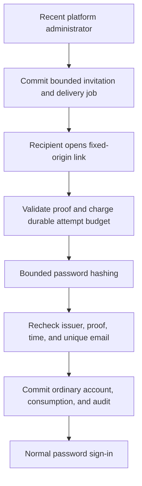

# Invitation-only onboarding

Administrators invite recipients to create ordinary accounts. Migration `0015`
provides the invitation records, audit, and persistent admission budgets. The existing `make email-setup` / `make dev-email` workflow and explicit TLS SMTP settings activate both verification and invitations. No SMTP provider or deployment secret is installed automatically.

## Authority and account creation

A current platform administrator can invite, replace, or cancel invitations. Mutations require the existing password-authenticated browser session to be less than five minutes old. Reads require a current administrator but do not extend session idle time. Creation and cancellation recheck current authority inside the committing transaction. This is the initial password-only assurance baseline. Privileged step-up and operator authority qualification remain tracked in #1 and #23.

There is no public registration request or public lookup by email. The emailed link allows its recipient to create one **new ordinary account**, using that email, required first and last names, and their own password under the existing 15–128 character policy. Email matching follows the directory's ASCII, case-insensitive uniqueness rule. The new principal has an active password credential and a verified email, with no administrator membership, roles, consent, or application grants. Acceptance never resets, reactivates, or changes an existing principal. An existing address, including an inactive account, prevents issuance and acceptance.

Acceptance consumes the invitation, inserts the principal and credential, and records the audit event atomically. The user then signs in normally. It does not establish a browser session, replace an existing session, or select a redirect destination.

An invitation remains valid only with an active administrator issuer with the same credential epoch and the original live password credential. Demotion, epoch change, and credential revocation cancel pending invitations permanently. Restoring membership does not restore those invitations. Signing out alone does not cancel invitations: the issuer's account authority, rather than the issuing browser session, governs their remaining lifetime.

Acceptance creates a new ordinary account. It cannot reset or reactivate an
existing account and does not establish a browser session.

## Proof and delivery

Invitations use an independent `iv1_` proof purpose, a 32-byte random seed, HMAC-SHA256 with the deployment email key, and a SHA-256 lookup verifier. The derivation label is `darkhorse:invitation:v1` followed by a zero byte. Current-email verification retains its separate label and `ev1_` prefix. Neither proof is accepted in the other flow. The database retains the digest and, only during queued delivery, the seed. The usable proof cannot be reconstructed from the database seed without the separately configured key.

Links use the persisted, configured HTTPS origin and a fixed `/invitation` path. The browser removes the fragment immediately, keeps it in memory, and submits it only in an explicit CSRF-protected POST body. A link visit performs no account mutation. Raw links, passwords, and proofs are absent from responses, audit events, request URLs, and browser storage. A response lost after acceptance is uncertain: the page directs the user to try normal sign-in before reopening the invitation.

An invitation expires 24 hours after issuance and is single-use. A replacement is a fresh identity and invalidates the previous link. Recipient issuance is limited to one per 15 minutes and five per rolling day. Each issuing administrator is limited to 100 per rolling day. Verification and invitation requests share a ceiling of 10,000 unexpired queued messages. These limits are checked on the primary database under the shared security write fence.

Both email purposes share the existing TLS SMTP transport, lease/retry calculations and delivery data. They retain distinct identifiers, templates, storage and policy ports. One process sends at most one message at a time, alternating between the two queues. A claim has a recoverable 60-second lease and at most five delivery attempts, with bounded exponential retries before expiry. Network operations run outside SQL transactions. Stale acknowledgements cannot alter a replacement or cancelled invitation. A message already in transit can still arrive after cancellation. Its proof will fail. SMTP acceptance is not proof of inbox delivery. An uncertain SMTP reply or worker restart can produce duplicate messages with the same proof and Message-ID.

New email supports English and Spanish with immutable per-message language and
version. Administrators can supply the optional canonical `locale` field when
issuing an invitation. See [email localization](email-localization.md) for selection,
upgrade and fragment-hint contracts.

## Abuse and consistency boundaries

Invalid or unknown proofs receive a generic public error and do not reach password hashing. A valid proof must obtain durable admission before hashing: at most five attempts for that invitation and 60 admitted attempts across the deployment per rolling minute. Hash failures, worker saturation and cancelled HTTP requests do not refund admission. A single process shares one bounded Argon2 worker permit between login and onboarding. Public requests have a 4 KiB body limit, 16 in-flight invitation requests, and the existing HTTP timeout/origin/CSRF controls.

After hashing, the committing transaction rechecks proof, issuer, recipient uniqueness and time on the primary. No Redis or local positive authority decision is used. Committed revocation prevents subsequent checks from accepting the link. The existing global write fence prioritizes this consistency baseline. Capacity qualification and a more scalable serialization design remain separate work. Edge request admission and operational capacity testing are still necessary production qualification work. These application bounds are not a network denial-of-service guarantee.

Runtime uses a nonowner role in the reviewed deployment profiles. It retains broad
application DML. Database constraints protect supported transitions, but a schema
owner can alter or disable those controls. Read [database authority](database-authority.md). Invitation records and audit history are retained. Retention, key/origin rotation and delivery operations remain unfinished qualification work.

## API

All endpoints require the configured origin/host, return `Cache-Control: no-store`, and accept no query parameters. POST requests require JSON, the same-origin CSRF header, and no unknown fields.

| Endpoint                                                                                    | Authority              | Result                                                                                       |
| ------------------------------------------------------------------------------------------- | ---------------------- | -------------------------------------------------------------------------------------------- |
| `POST /api/admin/invitations` with `email`                                                  | Recent administrator   | `201` with invitation `id`. Delivery is queued                                               |
| `GET /api/admin/invitations`                                                                | Current administrator  | Up to 100 newest records, including email, creation/expiry, closed state and delivery status |
| `POST /api/admin/invitations/revoke` with `id`                                              | Recent administrator   | Idempotent `200 {"ok":true}`                                                                 |
| `POST /api/invitations/accept` with `token`, `email`, `first_name`, `last_name`, `password` | Valid invitation proof | `200 {"ok":true}` after atomic creation                                                      |

Administrative failures distinguish missing session (`401`), missing role or recent sign-in (`403`), existing account (`409`), limits (`429`) and unavailability (`503`). Public rejection uses `400 invalid_invitation` for invalid proof or account input, `429` for admission limits and `503` for unavailable/uncertain work. Only administrators can query invitation records. The API exposes bounded recent history. It does not provide a paginated invitation
console. The browser implements invitation acceptance.

## Verification and remaining work

`make test-invitations` runs source-defined unit and component tests without services or external settings. `make test-postgres` exercises actual issuance, races, authority reductions, persistent admission, failed audits, cancellation and delivery state. `make test-browser` verifies real HTTPS issuance, authenticated TLS SMTP delivery, fragment removal, explicit acceptance, replay denial, normal sign-in, verified email and absence of administrator authority. Coverage reports retain their original authored-code denominators and 100% line targets.

Issue #13 still includes password recovery, email changes, security notifications and final assurance/failure qualification. This increment does not complete account lifecycle or production qualification. The design applies the purpose-bound, expiring, single-use secret-link and normal-sign-in guidance in the [OWASP account recovery guidance](https://cheatsheetseries.owasp.org/cheatsheets/Forgot_Password_Cheat_Sheet.html). This invitation flow has narrower account-creation authority and cannot recover an account.

## Recorded evidence

[Verification](verification.md) records the current baseline. Whole-system coverage,
account recovery assurance, and production capacity remain incomplete.

## Source reference

[invitation policy](../crates/domain/src/invitations.rs),
[transaction writes](../crates/adapters/src/postgres/invitations/writes.rs).
