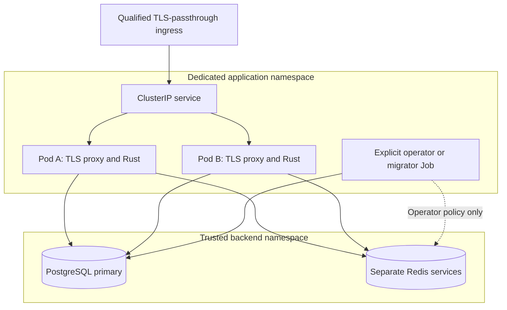
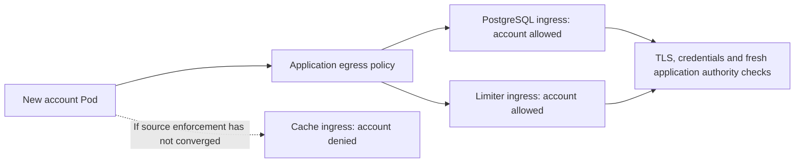

# Kubernetes application qualification

This packaging runs two Rust/static-console replicas, each with a TLS proxy, in a dedicated namespace. It is an initial increment of [#20](https://github.com/OneTesseractInMultiverse/darkhorse-identity/issues/20), **not a completed production deployment contract**. PostgreSQL, two independent Redis services, ingress, secret delivery and certificate lifecycle are operator-provisioned dependencies. No database operator, automatic failover, autoscaler or restore-to-service procedure is selected here.

The tested API baseline is Kubernetes 1.36.4. Manifests are deterministic Kubernetes JSON generated by source-defined builders. The example is nonsecret configuration, not a complete installation. Node runs host tooling only. Rust owns application server behavior.



Network policy constrains these paths under a supporting CNI. The local fixture
uses two Pods on one node and does not prove node-failure tolerance.

## Boundaries and budgets

The namespace enforces the Kubernetes [Restricted Pod Security Standard](https://kubernetes.io/docs/concepts/security/pod-security-standards/) at version 1.36. Application, proxy and operator containers use nonroot identities, read-only root filesystems, dropped capabilities, disabled privilege escalation, RuntimeDefault seccomp and bounded memory-backed writable directories. Service accounts have token automount disabled and receive no RoleBindings. Do not give untrusted users Pod creation, exec, secret access or namespace-label mutation authority. Workload labels and secret mounts are not protection against a namespace administrator.

The runtime receives nonowner database and restricted Redis credentials. Separate operator and migrator service accounts, secrets and Jobs receive a nonowner operator URL plus limiter recovery credentials, and the schema-owner URL plus public CA, respectively. This is the same **partial database privilege separation** described in [Compose](compose.md#topology-and-authority). Runtime still has broad application DML privileges. Account commands require per-command administrator authentication. Broader CLI
authority, temporary credentials, and restricted exec remain in [#23](https://github.com/OneTesseractInMultiverse/darkhorse-identity/issues/23) and [#27](https://github.com/OneTesseractInMultiverse/darkhorse-identity/issues/27).

Apply the [explicit database grant policy](database-authority.md) after reviewed
migrations with serving stopped. New relations/routines receive no implicit
runtime access, and application audit tables allow append/read only. A rolling
image update does not apply this permission policy.

| Bound                                      | Configured value                        |
| ------------------------------------------ | --------------------------------------- |
| Serving replicas                           | 2                                       |
| Rolling update                             | 1 surge, 0 unavailable                  |
| Namespace admission quota                  | 4 active/terminating Pods, 1 Job object |
| Per-server connections                     | PostgreSQL 5, limiter 4, cache 2        |
| Per-operator connections                   | PostgreSQL 2, limiter 1, cache 2        |
| Conservative namespace connection envelope | PostgreSQL 20, limiter 16, cache 8      |
| Per-server expensive work                  | 1 password worker, 4 signing workers    |
| Namespace CPU quota                        | requests 2 cores, limits 9 cores        |
| Namespace memory quota                     | requests 2 GiB, limits 3 GiB            |

Connection totals conservatively treat every admitted Pod as a runtime replica, including terminating Pods and operator work. Database administrators must reserve additional capacity for maintenance, monitoring and other clients. These are admission and pool ceilings, not measured throughput or latency guarantees. Uncontrolled additional processes via exec, altered manifests and cluster-admin overrides are outside the envelope. A Pod waiting to terminate or an operator Job can delay rollout. Do not raise quotas just to bypass a stuck mutation. Completed Job objects count toward the Job quota until explicitly removed or their one-hour TTL expires.

Preferred hostname anti-affinity and a disruption budget of one available replica aid scheduling and voluntary evictions. They do not guarantee distinct nodes, uninterrupted service, safe node failure or database availability. There is no HPA. Explicitly qualify a changed replica count, pod quota, expensive-work budget and dependency connection budget together.

## Network and TLS contract

The application namespace starts with default-deny ingress and egress. Server Pods allow TCP 8443 only from the explicitly selected ingress namespace. Migrator Pods allow only DNS and the selected PostgreSQL dependency, with no ingress or Redis access. Both server and operator Pods allow DNS TCP/UDP 53 to `kube-system` Pods labelled `k8s-app=kube-dns`, and database/cache/limiter traffic only to the selected backend namespace with both labels:

- `app.kubernetes.io/name=darkhorse`.
- `app.kubernetes.io/component=postgres`, `cache` or `limiter`, respectively.

PostgreSQL uses port 5432. Cache and limiter use 6379. The namespace selector and Pod selector are conjunctive. Backend namespace administration is trusted. No general internet, SMTP or object-service egress is active. Provision dependency services and their network controls separately. The application manifest never adopts the backend namespace. A separate ingress-policy renderer supports the dependency contract below.

The ClusterIP service accepts 443 and forwards to each Pod's TLS proxy on 8443. Use a gateway with qualified TLS passthrough and canonical DNS routing. Supply a certificate valid for the one canonical public HTTPS hostname. Rust receives the original host and port, without trusted forwarded identity headers. Port 3001 is not an ingress route. It is used by the local proxy and kubelet health probes. Node traffic, host-network gateways, source NAT and NodeLocal DNS have CNI-specific behavior and require separate qualification. Do not assume a manifest alone enforces isolation. [NetworkPolicy requires a supporting network plugin](https://kubernetes.io/docs/concepts/services-networking/network-policies/).

### Backend ingress policies

`make kube-backend-render KUBE_CONFIG=/absolute/path/identity.json` prints three
NetworkPolicies for separate review by the backend operator. It makes no cluster
calls. Each policy selects one labelled backend component and permits only these
source components in the configured application namespace:

| Destination | TCP port | Permitted source components                 |
| ----------- | -------- | ------------------------------------------- |
| PostgreSQL  | 5432     | `server`, `operator`, `migrator`, `account` |
| Cache       | 6379     | `server`, `operator`                        |
| Limiter     | 6379     | `server`, `operator`, `account`             |

Each source must carry both `app.kubernetes.io/name=darkhorse` and the listed
component label. The namespace and Pod selectors appear in the same peer, so both
must match. An account Pod therefore needs permission at the source and at the
PostgreSQL or limiter destination. A cache Pod has no account ingress rule.



The output contains only ingress policies. It creates no namespace, backend,
credential or RBAC grant, and does not restrict backend egress or unselected Pods.
Application `prepare`, `validate` and `apply` do not install it. Review existing
policy names and ownership, selectors, replication, monitoring, backup and operator
paths before applying it: those additional clients are absent from this initial
single-primary fixture. Add narrowly scoped rules for the actual stateful topology.
Kubernetes policies are additive; an existing broad allow policy can defeat these
restrictions. [NetworkPolicy isolation and allowed traffic](https://kubernetes.io/docs/concepts/services-networking/network-policies/#the-two-sorts-of-pod-isolation).

Render and inspect the output, then let the backend operator validate and apply
it to the already provisioned namespace with an explicit context:

```sh
make kube-backend-render KUBE_CONFIG=/absolute/path/identity.json > /absolute/path/backend-ingress.json
kubectl --kubeconfig /absolute/path/access.yaml --context reviewed-context apply --dry-run=server -f /absolute/path/backend-ingress.json
kubectl --kubeconfig /absolute/path/access.yaml --context reviewed-context apply -f /absolute/path/backend-ingress.json
```

### Startup findings and remaining CNI qualification

An isolated investigation reproduced 12 of 12 new account Pods connecting to
cache when only application egress policy protected that path. With cache ingress
already enforced, all 12 equivalent probes timed out. The regression now requires
18 fresh-Pod first-connection denials, including account-to-cache,
migrator-to-Redis, and correctly labelled clients from an unauthorized namespace.
Allowed operator connections verify all three targets before and after the probes.
A forbidden connection fails the suite immediately; later denial cannot erase it.

The pinned kindnet implementation learns selected Pod addresses asynchronously
and uses fail-open packet evaluation. These mechanisms are consistent with the
observed startup gap; the experiment does not establish which controller event
caused the original admission. See the pinned [kindnet configuration](https://github.com/kubernetes-sigs/kind/blob/v0.33.0/images/kindnetd/cmd/kindnetd/main.go)
and its [policy data plane](https://github.com/kubernetes-sigs/kube-network-policies/blob/f67f0fb35e2b/pkg/dataplane/controller.go).

Backend ingress adds a second enforcement point, but shares the same CNI failure
domain. The fixture tests new clients against already running, protected backends.
It does not qualify backend startup/replacement, reused Pod addresses, established
connections after policy changes, controller outage or node partitions. Readiness
and successful manifest application are not policy-enforcement acknowledgements.
Select and qualify the production CNI before exposure. The [Pod policy lifecycle](https://kubernetes.io/docs/concepts/services-networking/network-policies/#pod-lifecycle)
explains the asynchronous API boundary. TLS, dependency credentials, primary-state
authorization and application revocation checks remain required independently.

## Configuration and secret contract

Copy `deploy/kubernetes/example.json` to an operator-controlled location and replace every value. It contains exactly `namespace`, `origin`, `image`, `edgeImage`, `backendNamespace` and `ingressNamespace`. All three namespaces must be dedicated and distinct. The origin must be a canonical HTTPS DNS origin. Both image references must use the actual published repository and immutable `@sha256:` digest. The repeated-letter example digests are placeholders. Build the application with `make docker-build` and proxy with `make stack-edge-build`, then publish and verify their actual registry digests through your release process.

Provision the following Kubernetes Secrets in the application namespace through an approved secret-delivery process. They are not generated, echoed or embedded by the manifest renderer. Configure encryption at rest, restricted API access, delivery and rotation externally. Kubernetes Secret base64 encoding is not encryption.

| Secret                       | Required keys and meaning                                                                                                                                                                                                                                                   |
| ---------------------------- | --------------------------------------------------------------------------------------------------------------------------------------------------------------------------------------------------------------------------------------------------------------------------- |
| `darkhorse-runtime-secrets`  | `runtime-db`: nonowner PostgreSQL URL, with verified TLS enforced by the adapter. `login-key`: shared login-limit key. `wrap-key`: shared signing wrapping key. `cache-url` and `limiter-url`: authenticated `rediss://` URLs. `ca`: PEM bundle for verified dependency TLS |
| `darkhorse-operator-secrets` | `operator-db`: nonowner operator PostgreSQL URL, with verified TLS enforced by the adapter. The same `login-key`, `wrap-key`, `cache-url`, `limiter-url`, `ca`. Separate `limiter-admin-url` recovery credential                                                            |
| `darkhorse-migrator-secrets` | `owner-db`: schema-owner PostgreSQL URL, with verified TLS enforced by the adapter. `ca`: PEM bundle for verified PostgreSQL TLS                                                                                                                                            |
| `darkhorse-edge-tls`         | `tls.crt`: certificate chain. `tls.key`: private key for the canonical origin                                                                                                                                                                                               |

Use the formats and key-generation requirements in [authentication](authentication.md), [provider signing](provider.md) and [Redis](redis.md). Each replica must see the same canonical issuer, primary database, shared limiter generation, login key and signing material. Do not generate independent identity secrets per Pod. PostgreSQL and Redis certificate names must match their configured service DNS names. Provide service discovery in the backend namespace. Secret files are projected read-only with mode 0440 and group 10001. File configuration rules are documented in [Compose](compose.md#tls-and-secret-files). Configuration is read at startup. Changing a Secret is not a supported live rotation protocol.

## Explicit installation sequence

Every cluster command requires a kubeconfig file and context. No ambient kubeconfig/current context is selected. The file, authentication plugins and context are trusted operator inputs. Inspect the rendered manifests and cluster identity before applying them. Existing namespaces are adopted only if already labelled `app.kubernetes.io/managed-by=darkhorse`. That label is an ownership guard, not cryptographic identity or a concurrency lock.

```sh
make kube-render KUBE_CONFIG=/absolute/path/identity.json
make kube-budgets KUBE_CONFIG=/absolute/path/identity.json
make kube-prepare KUBE_CONFIG=/absolute/path/identity.json KUBE_ACCESS=/absolute/path/access.yaml KUBE_CONTEXT=reviewed-context
```

`prepare` creates namespace/security policy/configuration, without a serving Deployment, Service or disruption budget. It does not initialize identity state. Next, the trusted operator provisions backend services and secrets, reviews and installs backend ingress controls, confirms permitted and denied network paths and TLS, prepares the database roles, and initializes identity state with HTTP serving stopped. Existing [database](persistence.md), [signing](provider.md) and [limiter recovery](redis.md) invariants still apply. Provision independent `darkhorse_owner`, `darkhorse_runtime` and `darkhorse_operator` logins first. The atomic runtime/operator grants from `deploy/grant-runtime.sql` must follow reviewed migrations. Existing databases need explicit role provisioning. Initialization on an empty volume does not upgrade them. Preserve the real publication delay and full 904-second limiter recovery wait. Bootstrap must use protected interactive/stdin input. No password belongs in arguments, Job manifests or logs.

A narrow renderer supports `migrate`, `limiter-status`, `limiter-fence`, `limiter-activate`, `signing-status` and `redis-status`:

```sh
make kube-job-render KUBE_CONFIG=/absolute/path/identity.json JOB_COMMAND=migrate JOB_NAME=migration-1
```

The `migrate` command selects the migrator service account, owner-only secret projection and database-only network policy. Other commands select the operator workload. Replace existing operator secrets with `operator-db`, remove `owner-db` from them and terminate old operator Pods before resuming a deployment. Secret projections prevent accidental mounting of extra co-located keys, but do not restrict namespace administrators.

This only prints a reviewable Job. The operator applies it explicitly to the reviewed cluster and monitors its outcome. It cannot render a shell, arbitrary SQL, bootstrap password or arbitrary CLI arguments. The Job has a 120-second deadline, one completion, no configured retry, and replacement only after a Pod reaches Failed. Kubernetes still does **not guarantee exactly-once execution**, especially around node/controller failures. Inspect database/limiter state before retrying an uncertain mutation. The renderer does not enforce maintenance exclusion: stop HTTP writers and exclude concurrent operators before migration. A timeout does not prove rollback. Do not let GitOps continuously recreate completed mutation Jobs.

After dependency readiness, reviewed grants, bootstrap, signing publication/activation and limiter recovery are complete:

```sh
make kube-validate KUBE_CONFIG=/absolute/path/identity.json KUBE_ACCESS=/absolute/path/access.yaml KUBE_CONTEXT=reviewed-context
make kube-apply KUBE_CONFIG=/absolute/path/identity.json KUBE_ACCESS=/absolute/path/access.yaml KUBE_CONTEXT=reviewed-context
make kube-status KUBE_CONFIG=/absolute/path/identity.json KUBE_ACCESS=/absolute/path/access.yaml KUBE_CONTEXT=reviewed-context
```

Validation is a Kubernetes server-side dry run. Apply validates first, then applies. This is not a transactional cluster operation or a check that secrets/dependencies exist. Do not assume dry-run success makes an installation ready. There is no automatic migration, bootstrap, signing activation, limiter repair or destructive uninstall command.

## Health and lifecycle

`/health/live` is process-only liveness. `/health/ready` proves that the existing PostgreSQL pool can reach a primary at that instant. Readiness has a one-second timeout, one in-flight probe per process, no waiting queue, no security-state writes and a no-store response. Pool exhaustion or a database outage yields 503. Authentication-disabled previews are not ready. Neither probe discloses configuration or dependency errors.

Primary readiness is deliberately narrow: it does not certify schema compatibility, signing-key publication, limiter continuity or complete sign-in availability. Requests retain authoritative checks and fail conservatively when their dependencies are unavailable. No positive authorization cache is introduced. Edge probes check the listening TCP socket. Trusted HTTPS and canonical issuer checks must be part of operational monitoring. Keep liveness independent of database/Redis outages to avoid restart storms.

Rust handles termination signals. The Pod grants 30 seconds before forced termination. Rolling same-version replacement can preserve shared state, but does not establish uninterrupted request draining, mixed-version/schema compatibility or safe retries after ambiguous writes. Production upgrades, down-migrations, key/CA rotation and rollback are not supported by this initial packaging. Review schema compatibility and credential effects before selecting another image. Never restore an old database snapshot to serving replicas: it can resurrect revoked credentials. Quarantine, credential invalidation/reconciliation and independent fencing remain prerequisites for a supported restore-to-service procedure.

## Reproducible local qualification

Install Docker, kubectl and [kind 0.33.0](https://github.com/kubernetes-sigs/kind/releases/tag/v0.33.0), verifying the official release checksum. Then:

```sh
make docker-build
make test-kubernetes KIND=/absolute/path/kind
```

The test creates a random, disposable single-node kind cluster with a private kubeconfig and pinned Kubernetes 1.36.4 node image. Every command names that file and context. It uses generated test-only credentials, TLS PostgreSQL and separate cache/limiter fixtures, installs the separately rendered backend ingress policies before backend Pods, runs the real migration Job, and starts two restricted application Pods. It removes only its owned cluster, temporary credentials and fixture files. It does not use a developer's current context, volumes, accounts or host certificate trust.

The suite exercises shared sessions and consent, cross-Pod authorization-code and refresh races, independent ID-token verification, replay revocation, shared login budgets, committed account revocation, actual denied network paths, runtime/operator/migrator secret separation and operator migration refusal, database-outage readiness without liveness restarts, same-version rolling replacement, and conservative limiter restart/recovery on both replicas. The publication and limiter recovery setup first verifies premature activation fails, then advances disposable database clock fixtures. This is not an elapsed-wall-clock recovery soak. Two Pods on one node establish process replication, not node-failure tolerance.

Multi-node partitions, CNI failures, database promotion and old-primary fencing, policy revision races, limiter failover/lost state, pool exhaustion under sustained load, outbox concurrency, image/schema upgrades, complete draining and disaster recovery still require evidence. Production stateful topology, RPO/RTO and capacity SLOs remain undecided. Keep #20 open until those criteria and the full install/upgrade/restore contract are met. The unchanged 100% authored-code coverage target is separately tracked in [#2](https://github.com/OneTesseractInMultiverse/darkhorse-identity/issues/2).

## Authenticated account commands

`make kube-account-exec` runs the existing account commands in an explicitly
selected running Pod and its `api` container. It uses runtime credentials and a
fresh administrator password on protected stdin. See the [container account
runbook](container-accounts.md) for cluster selection, capacity, exit behavior and
uncertain outcomes. It does not create a recovery Pod or copy operator secrets
into a serving replica.

`make kube-account-run` creates one bounded account Pod and runs the same commands
while serving Pods are stopped. Run `make kube-prepare` with the current manifests
first to install its service account and application network policy. Review and apply
the separate backend ingress policies as described above. It projects a subset of
runtime secrets, connects only to PostgreSQL and the shared limiter, authenticates
the administrator afresh, and requests UID-conditional cleanup. It uses no
replacement controller or command retry. The existing namespace quota and
connection envelope are unchanged. The runbook describes deadlines, uncertain
outcomes, and the remaining temporary-credential and production-assurance work.

The disposable suite stops both serving replicas, exercises one-shot lifecycle and directory
commands and their audit records, rejects lost administrator authority and database
access, verifies denied cache connections and secret isolation, and checks cleanup.
These checks use the existing runtime role and do not qualify emergency access.
