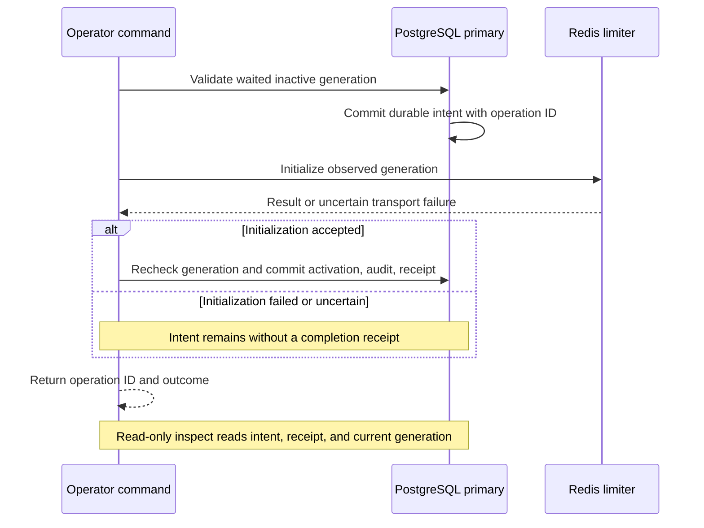

# Limiter activation evidence and inspection

Limiter activation commits a PostgreSQL intent before initializing Redis. It then
commits the active generation, existing limiter audit and completion receipt in
one PostgreSQL transaction. This makes interrupted operations inspectable. It preserves the [mandatory recovery wait and admission checks](redis.md).
PostgreSQL and Redis do not share a transaction. No command automatically retries
an uncertain activation, resets an active generation, or bypasses audit storage.



Completion runs only after accepted Redis initialization. A pending intent does
not prove rollback. PostgreSQL and Redis have separate commit boundaries.

## Commands

Use the existing protected operator database configuration and separately
provisioned Redis recovery credential for activation:

```sh
darkhorse-server --output json operator limiter activate --yes
darkhorse-server --output json operator limiter inspect <operation-id>
darkhorse-server operator limiter status
```

Activation returns a fresh nonzero UUID as `data.operation_id`. Once that ID is
allocated, failures through the activation path include it too: JSON mode uses
stderr. Human mode prints correlation data on stdout and diagnostics on stderr.
Failures before that path, interruption, or output loss may prevent delivery of
an ID. It is a reference, never an authentication secret or authorization grant.

Inspection requires PostgreSQL and journal SELECT privileges. It needs no Redis
configuration or connection, recovery secret, HTTP listener, confirmation or
administrator password. It reads one primary statement snapshot and performs no
writes, counter changes or recovery actions. Its authority is the existing trusted
operator database login, not an individually verified human administrator.

```sh
# Local development, using the existing protected .local/database.env:
make limiter-inspect OPERATION_ID=<operation-id>
# An already configured Compose stack, using its nonowner operator workload:
make stack-limiter-inspect STACK=<stack-name> OPERATION_ID=<operation-id>
```

The local target does not load Redis files. The Compose target uses the existing
operator service, which mounts recovery credentials for its other commands.
Inspection does not read them. For Kubernetes, run the same binary command in an
explicitly selected, authorized operator container with its nonowner database
configuration. Runtime server Pods have no journal privileges. No inspection Job
renderer or emergency credential issuer is added.

## Reading the result

| Observation                   | Meaning and next step                                                                                                                                                        |
| ----------------------------- | ---------------------------------------------------------------------------------------------------------------------------------------------------------------------------- |
| `recorded_outcome: activated` | This attempt's completion transaction committed. It is historical evidence. Inspect current enforcement separately.                                                          |
| `recorded_outcome: pending`   | Intent committed but no completion receipt was observed. Redis may have changed. The command may still be running. Do not infer rollback or automatically repeat activation. |
| `same_generation: false`      | The recorded attempt targets an older generation. Do not reactivate it.                                                                                                      |
| `current_phase: active`       | PostgreSQL currently marks its generation active. This does not establish Redis health or continuity.                                                                        |
| Missing record                | No matching intent was observed on this primary. Check the ID, database and any still-running process. Absence is not permission for an automatic retry.                     |
| Unavailable inspection        | No reliable result. Restore access to the authoritative database/schema/grants before deciding what to do.                                                                   |

The result includes database role, target/current epoch, recovery deadline,
preparation/completion database timestamps and observation time. Generation
nonces, Redis server identifiers, URLs, credentials and user profiles are omitted.
Output uses the existing bounded, terminal-safe CLI renderer.

If output was lost, a trusted operator can locate recent correlation IDs using a
protected database connection and this bounded read-only query:

```sql
SELECT i.operation_id, i.epoch, i.database_role, i.prepared_ms,
       r.completed_ms
FROM limiter_activation_intents i
LEFT JOIN limiter_activation_receipts r USING (operation_id)
ORDER BY i.prepared_ms DESC, i.operation_id
LIMIT 20;
```

Check the database role, epoch and execution window against deployment evidence.
Do not assume the newest row belongs to a particular invocation, especially with
concurrent operators. This is an existing database-maintenance procedure, not a
general SQL CLI command. Protect its output as operational audit metadata.

Before another recovery action, establish that earlier operator processes have
ended, inspect the record and run `operator limiter status`. A pending record is
never changed into a fabricated failure or success. If current continuity cannot
be established, follow the existing explicit fence/repair/full-wait procedure.
Fencing creates another generation and restarts the wait. Do not automate it as a
retry. A later successful attempt gets its own ID and leaves prior records intact.

## Transaction and authority boundary

Preparation locks the authoritative generation, validates the elapsed wait,
inserts intent and commits before any Redis initialization. No PostgreSQL
transaction stays open across the Redis call. Completion rechecks the same
inactive generation under its row lock and atomically writes activation, limiter
audit and receipt. An audit failure rolls back that completion. The intent remains
committed. Concurrent completions have at most one winner. A newer fence prevents
an older intent from activating its generation.

The receipt trigger binds the same database login, target generation, active
Redis identity and nondecreasing timestamps. Role/time defaults come from
PostgreSQL. The nonowner operator cannot supply those columns or update/delete/
truncate journal rows. Runtime has no journal grants. These are controls against
accidental or unauthorized paths, not tamper-proof evidence: owners can alter
schema/data, and a stolen operator credential still has powerful direct SQL
privileges. Old binaries and direct use of the lower-level recovery adapter are
outside this CLI journaling guarantee. See [database authority](database-authority.md).

Lost intent-commit responses stop before Redis but can leave a pending intent.
Lost Redis responses leave the external effect unknown. Lost completion-commit
responses can leave an activated receipt after a reported command failure.
Inspection itself is read-only. It does not complete a pending operation. These
boundaries follow [PostgreSQL statement snapshots and transaction isolation](https://www.postgresql.org/docs/18/transaction-iso.html)
and [Redis scripting semantics](https://redis.io/docs/latest/develop/programmability/eval-intro/).

No per-inspection audit write, personal identity claim, automatic retention,
export endpoint or recovery with unavailable audit storage is implemented.
Protect database access, backups and external execution evidence. Monitor journal
growth through existing database operations. Protected audit access/export,
retention, scoped emergency authority, migration/signing reconciliation and
production privileged assurance remain in [#23](https://github.com/OneTesseractInMultiverse/darkhorse-identity/issues/23).
The remaining evidence requirements follow [OWASP logging guidance](https://cheatsheetseries.owasp.org/cheatsheets/Logging_Cheat_Sheet.html).

## Upgrade and verification

Migration `0023_limiter_activation_journal.sql` adds the intent and receipt tables.
Apply it with serving and operator jobs stopped, then reapply the reviewed
[grant policy](../deploy/grant-runtime.sql) before restarting. Use `make stack-migrate`
for a prepared Compose stack, or the documented Kubernetes migration/grant
procedure. Local development uses explicit `make db-migrate`. The migration does
not activate, fence, clear counters or invent historical receipts. Existing
activation history remains in `limiter_audit`. Do not mix older operator binaries
with a deployment relying on the new journal. Missing schema/grants stop the new
activation before Redis initialization.

Source-defined unit tests verify sequencing, refusal, redaction and no retries.
`make test-postgres` exercises upgrade, restricted login grants, concurrent
completion/fencing, immutable evidence, audit rollback and actual lost PostgreSQL
commit replies. `make test-redis` exercises real initialization failure, a lost
post-effect result and successful CLI inspection. `make test-compose` and
`make test-kubernetes` exercise the migrated packaged nonowner operator path.
These tests do not complete overall coverage, release or independent security
qualification.

## Source reference

[operator journal coordinator](../crates/adapters/src/operator/limiter/journal.rs),
[journal persistence](../crates/adapters/src/postgres/limiter_activation.rs).
