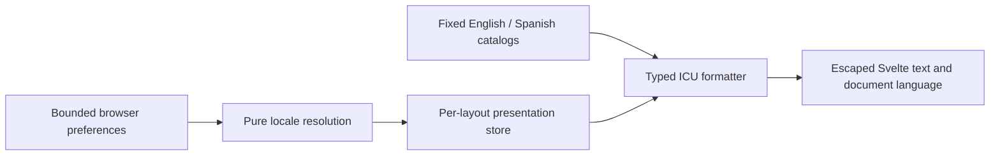

# Language and localization

Darkhorse's first supported presentation languages are English (`en`) and Spanish
(`es`). The sign-in page, account overview, profile, sessions, email verification, invitation,
consent and personal-key pages offer both. Management pages and the operator CLI still require translation. Verification and invitation
email now use [pinned delivery languages](email-localization.md). Their
translation and qualification are tracked separately. A language choice changes
presentation; it never changes identity, permissions or protocol behavior.

## Resolution policy

The first supported choice wins. External tags are parsed before entering this
policy. Language, country and time zone are separate inputs.

| Priority | Source                                 | Persistence and authority                                                      | Current integration              |
| -------- | -------------------------------------- | ------------------------------------------------------------------------------ | -------------------------------- |
| 1        | Explicit selection in the current page | Immediate presentation choice                                                  | Sign-in selector                 |
| 2        | Saved account preference               | Existing authenticated profile boundary; never inferred from a submitted email | Implemented                      |
| 3        | Anonymous browser preference           | Local storage, allowlisted language only                                       | Implemented                      |
| 4        | OIDC transaction language hints        | Transaction-local suggestion; no account write                                 | Planned in #40                   |
| 5        | Browser language list                  | First supported tag in supplied order                                          | Implemented                      |
| 6        | Deployment default                     | Validated operator setting                                                     | Implemented; defaults to English |
| 7        | Final fallback                         | English                                                                        | Implemented                      |

Explicit selection remains effective for the current page even when storage is
blocked. The page reports that it could not remember the choice. Anonymous
preference uses `darkhorse.locale.v1` in local storage and contains only `en` or
`es`; it contains no account identifier or credential and does not alter the Rust
HttpOnly session. Reload uses that preference. Other tabs do not synchronously
change language. Saved account preferences remain separate from this anonymous value. The layout
keeps them in memory and replaces them on session restoration; confirmed logout
clears them. An explicit choice lasts for the current layout visit. On reload,
a saved account preference takes precedence over anonymous storage.

The tag adapter accepts at most 64 ASCII characters and validates language-tag
syntax with the platform's `Intl.getCanonicalLocales`. It matches the primary
language: `es-CR`, `es-419` and `es-Latn-ES` resolve to `es`; `en-GB` resolves to
`en`. Unsupported or malformed values produce no preference. Lists contain at most
16 entries; larger lists are ignored. Order breaks ties and repeated matches are
removed. This is a bounded application matching policy informed by
[BCP 47](https://www.rfc-editor.org/rfc/rfc5646) and
[RFC 4647](https://www.rfc-editor.org/rfc/rfc4647), not a complete HTTP
`Accept-Language` parser. Rust will parse protocol hints at its own adapter boundary.

## Saving an account language

Open **My profile → Change language** and choose English, Español or Automatic.
Only **Save language** persists the selection. Choosing a language at sign-in,
browser detection, and OIDC hints never write an account preference. Automatic
explicitly clears the preference; it does not save the current browser language.
Country and phone settings remain independent.

Migration `0032_language_preferences.sql` adds nullable `principals.preferred_locale`
with an `en`/`es` constraint. Existing accounts retain NULL and all existing values.
The server includes `preferred_locale` in authorized profile responses and, when
set, in the existing login/session profile projection. Ordinary profile edits
preserve it. No ID-token, UserInfo or introspection claim is added.

`POST /api/profiles/me/language` accepts exactly a decimal-string `revision` and
`locale` equal to `"en"`, `"es"` or explicit `null`. A missing value is invalid.
The Rust adapter enforces origin, CSRF, body and admission bounds. The store checks
the current original browser session, five-minute recent authentication and profile
revision under the existing primary security lock. A change and its profile audit
commit together; authority is rechecked after the audit. An unchanged selection
requires the current revision but creates no new revision/audit. Credentials,
memberships and session/token expiry are unchanged. Administrators can inspect
language in an authorized profile read; this route only edits the caller's account.

Stale state requires reloading. A timeout or lost response may follow a committed
write: the form blocks further writes and offers reload, without automatic retry.
The frontend applies only confirmed/read preferences. Other devices receive the
saved value on their next session/profile read; there is no push synchronization.
Untranslated routes remain marked English even when an account prefers Spanish.

## Deployment default

Set `DARKHORSE_DEFAULT_LOCALE=en` (the default) or `es` before starting the Rust
server, for example `DARKHORSE_DEFAULT_LOCALE=es make dev-login`. The exact lowercase
allowlist rejects empty, regional, uppercase and unsupported values with a redacted
startup error. This is a presentation fallback, not a locale claim or account lookup.
The public `/api/presentation` JSON exposes only `default_locale`, uses no database,
requires no credentials and sends `Cache-Control: no-store`. A failed fetch leaves
the English final fallback; explicit/account/browser choices still take precedence.
See [Compose](compose.md) and [Kubernetes](kubernetes.md) for packaged configuration.

## Rendering and message contracts

The static artifact and its first hydration render use English. After mount, the
layout resolves the anonymous preference and browser languages, then loads the
deployment default from the bounded public `/api/presentation` response. The
existing session response supplies any saved account preference. Late configuration
responses cannot override a higher-priority choice. This permits a
brief English first paint; it avoids a second runtime server, an inline executable
preference script and a hydration mismatch. Translated routes update document `lang`
to the rendered language and `dir` to `ltr`. Routes still written in English keep
`lang="en"`. No right-to-left support is claimed. The selector uses language names,
a native keyboard-accessible select, a visible label and associated help text.

Each rendered layout owns its store and formatter instances. There is no mutable
module-level locale or process-wide user preference. Catalog imports are a fixed
allowlist. User input cannot select a module, file, remote service or URL. Switching
language changes neither route paths nor query strings/fragments; existing callback
matching, invitation tokens and authorization transactions remain untouched.

Catalogs are arrays of `[key, message]` pairs in
`apps/console/src/lib/i18n/catalogs`. This preserves duplicate keys for validation
instead of silently overwriting them during JSON parsing. The code-reviewed
`contract.ts` defines each message's allowed string/number arguments. TypeScript
rejects missing, extra or incorrectly typed call arguments. The separate catalog
check rejects missing/extra/duplicate keys, unknown placeholders, invalid ICU,
unsupported plural branches, excessive nesting and HTML/control characters.
Messages are bounded to 2,048 characters, catalogs to 512 messages and source files
to 256 KiB. Interpolated strings are bounded to 4,096 characters; numbers must be
finite and within the safe numeric range.

Messages render as ordinary Svelte text/attributes, never `{@html}`. HTML, functions,
translator-provided links and executable templates are prohibited. Links and any
future structured markup remain source-controlled components. Current ICU support
is string/number interpolation, plain number formatting, select and plural/ordinal
selection with an `other` branch. Custom number/date skeletons and plural offsets
are not enabled. Missing or invalid optional Spanish catalogs fall back as a whole
to English; an invalid English catalog fails the build. Interpolated user content
is never parsed as another template.

### Library decision

The frontend uses exact `intl-messageformat` 12.1.2 and
`@formatjs/icu-messageformat-parser` 3.5.20. The formatter carries a BSD-3-Clause notice; the parser carries an MIT notice. Both are retained in [third-party notices](third-party-notices.md). FormatJS supplies the
[ICU parser and formatter](https://formatjs.github.io/docs/intl-messageformat/).
Messages are parsed once per layout and formatted repeatedly. Browser `Intl`
supplies number and plural rules; no remote polyfill or translation service is used.
The dependencies and their transitive graph are locked and audited through the
normal dependency qualification target.

[Paraglide's static-site approach](https://paraglidejs.com/static-site-generation)
was also reviewed. Its generated typed messages and compiler optimizations are
useful, but this foundation uses the smaller integration surface of a formatter
plus an explicit per-layout store. It needs neither a localization middleware nor
URL rewriting. This is an integration decision, not a claim that one library is
universally faster. Reconsider precompiled message ASTs if measured parsing or
payload costs warrant them. Dependency maintenance, advisories and licenses remain
release review inputs.

## Translation invariants and Spanish style

Never translate or normalize permission keys, role/scope/capability identifiers,
country codes, protocol fields and error codes, database values, audit event names,
JSON schemas, passwords, tokens or secrets. API responses and machine-readable CLI
contracts retain their existing values. Translate full human-readable messages;
do not assemble sentences from translated fragments.

Spanish uses neutral vocabulary, informal singular instructions and sentence case.
Keep accents and punctuation. Security meaning must match English: an unconfirmed
logout is not a successful logout, an unavailable dependency is not an invalid
password, and registering an application does not grant access. Do not infer a
Spanish region from a user's country or telephone prefix.

| English                   | Spanish                            |
| ------------------------- | ---------------------------------- |
| Sign in / Sign out        | Iniciar sesión / Cerrar sesión     |
| Application               | Aplicación                         |
| Session                   | Sesión                             |
| Role / Scope / Capability | Rol / Ámbito / Capacidad           |
| API key / Client secret   | Clave de API / Secreto del cliente |
| Management console        | Consola de administración          |
| Unavailable               | No disponible                      |

Translation review by fluent reviewers and accessibility review remain release
gates. Adding a language requires an allowlisted locale, complete reviewed catalog,
matching plural rules, selector metadata and boundary tests. It must not duplicate
authentication or authorization logic.

## Verification and performance

- `make test-i18n`: isolated locale, formatter, storage and component behavior;
  catalog fakes are defined in test source.
- `make i18n-check`: production source catalogs, separate from unit fixtures. It
  runs in `make check`, `make ci` and `make build-web`. A build-only Vite hook also validates both catalogs for direct package and container builds.
- `make test-browser`: actual static output and verified HTTPS authentication;
  language, reload, error, keyboard and route-preservation checks run in Chromium.

The provisional foundation budget is at most 36 KiB additional summed compressed
JavaScript over the matching English-only build. It is a regression budget, not a
performance improvement claim. Fixed catalog loading adds no HTTP/API query. Deployment configuration adds one
small, credential-free GET per layout mount. Account language extends existing
session/profile projections, with no additional SQL statement on those reads and
no preference lookup added to introspection or authorization. Cold/warm browser and build
observations are recorded separately; full multilingual web/email/OIDC/CLI and
release qualification remain tracked in #36–#42.

### Foundation measurements — 2026-09-26

The [recorded presentation observations](measurements/localization-2026-09-26.json)
compare a rebuilt `f14c778` frontend with the localization working tree, using the
same Node 24.19.0 installation, dependency versions, Apple M5 host and Chromium
153.0.8010.12. Five cold/warm pairs per variant alternate execution order. Both
variants use the same loopback HTTP fixture with gzip and fixed anonymous
session/branding responses. This isolates presentation; it measures neither real
sign-in nor network/production latency. The real Rust/verified-HTTPS suite is a
separate functional check.

| Measurement                       | English-only baseline | Localized English | Localized Spanish |
| --------------------------------- | --------------------: | ----------------: | ----------------: |
| All JavaScript, summed gzip bytes |               109,153 |           123,747 |       Same bundle |
| Cold root resource transfer bytes |                 84588 |             89107 |             89107 |
| Warm root resource transfer bytes |                   333 |               333 |               333 |
| Median cold ready observation     |               71.8 ms |           71.6 ms |           71.8 ms |
| Median warm ready observation     |               55.0 ms |           55.0 ms |           56.5 ms |

The total JavaScript increase is 14,594 compressed bytes, below the provisional
36 KiB cap. The root loads two additional local chunks; both catalogs are bundled
and switching languages fetches no catalog or account preference. Warm observation
ranges overlap and the readiness probe includes two animation frames. These small
samples do not establish a speedup or stable latency percentiles. Warm rendering
cost is a follow-up measurement as the catalog grows.

To repeat, build the English-only revision in a separate source export with its
locked dependencies, build the current console, then run
`make benchmark-i18n I18N_BASELINE=/absolute/path/to/baseline/build`.
The target enforces the byte budget and writes the complete observations to
`.local/benchmarks/i18n.json`. It requires the pinned Chromium installation.

### Preference integration observations — 2026-09-26

The [preference integration sample](measurements/language-preferences-2026-09-26.json)
repeats the same five cold/warm pairs with the English-only source export and a
fixed public presentation response. All JavaScript totals 124,773 gzip bytes:
15,620 above the English-only baseline and 1,026 above the recorded foundation
artifact. The 36 KiB regression budget still passes. Root navigation makes one
additional presentation request; its JSON body is 23 bytes, with 323 observed
resource transfer bytes including the fixture's response overhead. These numbers
exclude production TLS/header variability. Saved language adds 24 JSON bytes to a
login/session response; an unset language adds none. Profiles always include the
nullable field (24 bytes for either a supported value or `null`).

The existing SQL statements project one additional nullable column. No new read
statement or join was added to login/session/profile retrieval. Explicit preference
writes reuse the profile transaction, exclusive security lock and audit; the
existing principal trigger also advances the policy revision. They are settings
writes, not an authorization-cache path. The public configuration read uses no SQL.
This source-level query accounting is separate from database load measurement.

In the presentation fixture, median cold readiness was 71.7 ms for baseline English,
71.9 ms for localized English and 72.2 ms for Spanish. Warm medians were 40.1, 56.2
and 56.4 ms respectively. This small sample does not establish stable percentiles
or a speedup. Real primary-state, shared limiter, profile mutation and HTTPS browser
checks run separately; production request-cost and capacity qualification remain
open.

## Web translation inventory

| Route or surface                                                                                        | English/Spanish state                                                                                                       |
| ------------------------------------------------------------------------------------------------------- | --------------------------------------------------------------------------------------------------------------------------- |
| `/` — login and account overview                                                                        | Translated, including current errors and logout uncertainty                                                                 |
| `/account/profile` — read/edit/language/image dialogs                                                   | Translated; names and bios remain literal text; country names/order use browser `Intl` while submitted codes stay unchanged |
| `/security/sessions` — list, pagination, confirmation, failures                                         | Translated; selected-language dates explicitly remain in UTC                                                                |
| `/security/keys` and key creation/reveal/revocation                                                     | Translated; permission identifiers, one-time reveal and uncertain-outcome handling remain unchanged                         |
| `/security/email` and confirmation/account switching                                                    | Translated; requesting, account binding, explicit confirmation and uncertainty remain unchanged                             |
| `/invitation` and enrollment failures                                                                   | Translated; switching language preserves the unsent form and never accepts the invitation                                   |
| `/authorization` and consent                                                                            | Translated; exact scopes stay visible; OIDC `ui_locales` hint/discovery support remains separate in #40                     |
| `/console/users` and directory/access dialogs                                                           | Pending                                                                                                                     |
| `/console/applications`, `/console/clients` and registration/credential dialogs                         | Pending                                                                                                                     |
| `/console/resources`, `/console/scopes`, `/console/roles`, `/console/capabilities` and bindings/pickers | Pending                                                                                                                     |
| `/console/profile`, `/console/settings` and console navigation                                          | Pending; shared profile/image dialogs already use catalog messages                                                          |
| Verification/invitation email and CLI                                                                   | Email implemented with pinned delivery metadata (#39); CLI remains #41                                                      |

Profile failures and image outcomes map typed results to catalog keys at rendering
time; a language change also updates an existing error. Language changes do not
remount an editor, discard a draft or repeat an operation. Pending and uncertain
mutations remain blocked. Image transport now returns a fixed outcome code rather
than an English message; HTTP formats and status codes remain unchanged.

Country labels use the browser's `Intl.DisplayNames`, with only the server-provided
country choices. `Intl.Collator` orders their labels with a code tie-breaker.
If platform display support is unavailable, original metadata names and code order
provide a deterministic fallback. Canonical country and calling-code values, source
versions and backend validation are unchanged. Country labels may vary with the
browser's locale-data version. Dates use an explicitly UTC `Intl.DateTimeFormat`
created once per language change, with an ISO/UTC fallback.

A direct session, personal-key, verification or consent page visit restores the account preference
with one existing session GET. The layout ignores an older response after a newer profile preference
or sign-out update. Profile pages already receive the preference through their
profile read. These reads affect presentation only and add no positive authority
cache. Client-side navigation can retain the last presentation choice until the
next session/profile read.

### Account-page observations — 2026-09-26

The [account-page presentation sample](measurements/account-localization-2026-09-26.json)
records 129,665 summed gzip JavaScript bytes: 20,512 above the English-only baseline,
within the unchanged 36 KiB budget. The added messages are currently included in the
shared catalogs; navigation still does not fetch translation files. Five cold/warm
pairs use the same presentation-only fixture as the previous measurements. Median
cold readiness was 72.1 ms baseline, 71.7 ms localized English and 71.9 ms Spanish;
warm medians were 39.9, 55.6 and 55.7 ms. These samples do not demonstrate a speedup
or qualify production latency. Reconsider route-specific catalog loading before
console translation growth consumes the remaining payload budget.

### Verification, invitation and consent

All three pages translate visible instructions, labels, errors and metadata. Language
selection preserves the invitation password fields in the current form without
persisting them. Verification proofs remain fragment-only, are removed from history,
and still require an explicit confirmation for the correct account. Creating an
account neither starts a session nor grants administrative/application access.
Outgoing email now retains its resolved language and template version through the
[durable delivery contract](email-localization.md).

Consent keeps application names, resource audiences and exact scope identifiers
verbatim, including `openid`; its explanatory text is translated and untrusted
labels remain escaped. Language switching neither approves a request nor changes
its request ID, PKCE, nonce, state or callback. A response received after leaving
the page cannot navigate the new page. Server-side `ui_locales` binding and discovery
advertisement are not implemented by this presentation increment.

The [security-flow presentation sample](measurements/security-flow-localization-2026-09-26.json)
records 131,892 summed gzip JavaScript bytes, 22,739 above the English-only baseline
and within the same 36 KiB budget. Five cold/warm pairs used the unchanged loopback
presentation fixture. Cold medians were 71.8 ms baseline, 71.8 ms localized English
and 71.6 ms Spanish; warm medians were 40.0, 55.4 and 56.8 ms. These are small
presentation samples, not production throughput or stable percentile estimates.
Actual bilingual SMTP-link confirmation, enrollment and OIDC callback validation
run in the separate verified-HTTPS browser suite.

### Personal API keys

The key directory, resource/permission selector, creation form, one-time secret
reveal and revocation confirmation now support English and Spanish. Language
switching preserves the draft and exact resource/capability selection. Identifiers,
permission meanings and secrets remain literal values. Secrets still exist only in
component memory, are cleared on concealment or acknowledgment, and never enter
catalog interpolation or persistent browser storage. An uncertain issuance remains
blocked until the operator reconciles the key list; switching language cannot retry
it. Dates are explicitly UTC.

The [personal-key presentation sample](measurements/personal-key-localization-2026-09-26.json)
records 133,937 summed gzip JavaScript bytes, 24,784 above the English-only baseline,
within the unchanged 36 KiB budget. Its five cold/warm pairs measure only the static
presentation fixture; real bilingual issuance, attenuation, current permission
reductions, lost-response reconciliation and revocation are separately exercised
through verified HTTPS. The catalogs now contain 261 typed messages per language.
