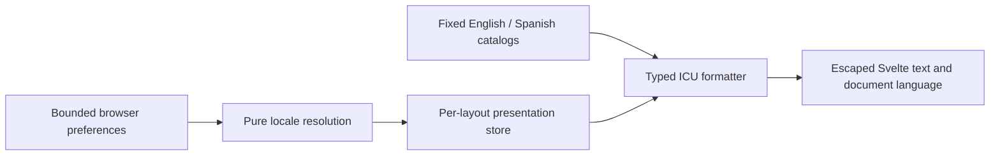

# Language and localization

Darkhorse's first supported presentation languages are English (`en`) and Spanish
(`es`). The sign-in page and account overview offer both. Other account and
management pages, email, consent and the operator CLI still use English. Their
translation and qualification are tracked separately. A language choice changes
presentation; it never changes identity, permissions or protocol behavior.

## Resolution policy

The first supported choice wins. External tags are parsed before entering this
policy. Language, country and time zone are separate inputs.

| Priority | Source                                 | Persistence and authority                                                      | Current integration               |
| -------- | -------------------------------------- | ------------------------------------------------------------------------------ | --------------------------------- |
| 1        | Explicit selection in the current page | Immediate presentation choice                                                  | Sign-in selector                  |
| 2        | Saved account preference               | Existing authenticated profile boundary; never inferred from a submitted email | Planned in #37                    |
| 3        | Anonymous browser preference           | Local storage, allowlisted language only                                       | Implemented                       |
| 4        | OIDC transaction language hints        | Transaction-local suggestion; no account write                                 | Planned in #40                    |
| 5        | Browser language list                  | First supported tag in supplied order                                          | Implemented                       |
| 6        | Deployment default                     | Validated operator setting                                                     | Planned in #37; currently English |
| 7        | Final fallback                         | English                                                                        | Implemented                       |

Explicit selection remains effective for the current page even when storage is
blocked. The page reports that it could not remember the choice. Anonymous
preference uses `darkhorse.locale.v1` in local storage and contains only `en` or
`es`; it contains no account identifier or credential and does not alter the Rust
HttpOnly session. Reload uses that preference. Other tabs do not synchronously
change language. A future saved account preference must remain separate from this
anonymous value and must be cleared from presentation state on account changes.

The tag adapter accepts at most 64 ASCII characters and validates language-tag
syntax with the platform's `Intl.getCanonicalLocales`. It matches the primary
language: `es-CR`, `es-419` and `es-Latn-ES` resolve to `es`; `en-GB` resolves to
`en`. Unsupported or malformed values produce no preference. Lists contain at most
16 entries; larger lists are ignored. Order breaks ties and repeated matches are
removed. This is a bounded application matching policy informed by
[BCP 47](https://www.rfc-editor.org/rfc/rfc5646) and
[RFC 4647](https://www.rfc-editor.org/rfc/rfc4647), not a complete HTTP
`Accept-Language` parser. Rust will parse protocol hints at its own adapter boundary.

## Rendering and message contracts

The static artifact and its first hydration render use English. After mount, the
layout resolves the anonymous preference and browser languages. This permits a
brief English first paint; it avoids a second runtime server, an inline executable
preference script and a hydration mismatch. The root page updates document `lang`
to the rendered language and `dir` to `ltr`. Routes still written in English keep
`lang="en"`. No right-to-left support is claimed. The selector uses language names,
a native keyboard-accessible select, a visible label and associated help text.

Each rendered layout owns its store and formatter instances. There is no mutable
module-level locale or process-wide user preference. Catalog imports are a fixed
allowlist. User input cannot select a module, file, remote service or URL. Switching
language changes neither route paths nor query strings/fragments; existing callback
matching, invitation tokens and authorization transactions remain untouched.

Catalogs are arrays of `[key, message]` pairs in
`apps/console/src/lib/i18n/catalogs`. This preserves duplicate keys for validation
instead of silently overwriting them during JSON parsing. The code-reviewed
`contract.ts` defines each message's allowed string/number arguments. TypeScript
rejects missing, extra or incorrectly typed call arguments. The separate catalog
check rejects missing/extra/duplicate keys, unknown placeholders, invalid ICU,
unsupported plural branches, excessive nesting and HTML/control characters.
Messages are bounded to 2,048 characters, catalogs to 512 messages and source files
to 256 KiB. Interpolated strings are bounded to 4,096 characters; numbers must be
finite and within the safe numeric range.

Messages render as ordinary Svelte text/attributes, never `{@html}`. HTML, functions,
translator-provided links and executable templates are prohibited. Links and any
future structured markup remain source-controlled components. Current ICU support
is string/number interpolation, plain number formatting, select and plural/ordinal
selection with an `other` branch. Custom number/date skeletons and plural offsets
are not enabled. Missing or invalid optional Spanish catalogs fall back as a whole
to English; an invalid English catalog fails the build. Interpolated user content
is never parsed as another template.

### Library decision

The frontend uses exact `intl-messageformat` 12.1.2 and
`@formatjs/icu-messageformat-parser` 3.5.20. The formatter carries a BSD-3-Clause notice; the parser carries an MIT notice. Both are retained in [third-party notices](third-party-notices.md). FormatJS supplies the
[ICU parser and formatter](https://formatjs.github.io/docs/intl-messageformat/).
Messages are parsed once per layout and formatted repeatedly. Browser `Intl`
supplies number and plural rules; no remote polyfill or translation service is used.
The dependencies and their transitive graph are locked and audited through the
normal dependency qualification target.

[Paraglide's static-site approach](https://paraglidejs.com/static-site-generation)
was also reviewed. Its generated typed messages and compiler optimizations are
useful, but this foundation uses the smaller integration surface of a formatter
plus an explicit per-layout store. It needs neither a localization middleware nor
URL rewriting. This is an integration decision, not a claim that one library is
universally faster. Reconsider precompiled message ASTs if measured parsing or
payload costs warrant them. Dependency maintenance, advisories and licenses remain
release review inputs.

## Translation invariants and Spanish style

Never translate or normalize permission keys, role/scope/capability identifiers,
country codes, protocol fields and error codes, database values, audit event names,
JSON schemas, passwords, tokens or secrets. API responses and machine-readable CLI
contracts retain their existing values. Translate full human-readable messages;
do not assemble sentences from translated fragments.

Spanish uses neutral vocabulary, informal singular instructions and sentence case.
Keep accents and punctuation. Security meaning must match English: an unconfirmed
logout is not a successful logout, an unavailable dependency is not an invalid
password, and registering an application does not grant access. Do not infer a
Spanish region from a user's country or telephone prefix.

| English                   | Spanish                            |
| ------------------------- | ---------------------------------- |
| Sign in / Sign out        | Iniciar sesión / Cerrar sesión     |
| Application               | Aplicación                         |
| Session                   | Sesión                             |
| Role / Scope / Capability | Rol / Ámbito / Capacidad           |
| API key / Client secret   | Clave de API / Secreto del cliente |
| Management console        | Consola de administración          |
| Unavailable               | No disponible                      |

Translation review by fluent reviewers and accessibility review remain release
gates. Adding a language requires an allowlisted locale, complete reviewed catalog,
matching plural rules, selector metadata and boundary tests. It must not duplicate
authentication or authorization logic.

## Verification and performance

- `make test-i18n`: isolated locale, formatter, storage and component behavior;
  catalog fakes are defined in test source.
- `make i18n-check`: production source catalogs, separate from unit fixtures. It
  runs in `make check`, `make ci` and `make build-web`. A build-only Vite hook also validates both catalogs for direct package and container builds.
- `make test-browser`: actual static output and verified HTTPS authentication;
  language, reload, error, keyboard and route-preservation checks run in Chromium.

The provisional foundation budget is at most 36 KiB additional summed compressed
JavaScript over the matching English-only build. It is a regression budget, not a
performance improvement claim. Fixed catalog loading adds no HTTP/API query and
no preference lookup to introspection or authorization. Cold/warm browser and build
observations are recorded separately; full multilingual web/email/OIDC/CLI and
release qualification remain in #37–#42.

### Foundation measurements — 2026-09-26

The [recorded presentation observations](measurements/localization-2026-09-26.json)
compare a rebuilt `f14c778` frontend with the localization working tree, using the
same Node 24.19.0 installation, dependency versions, Apple M5 host and Chromium
153.0.8010.12. Five cold/warm pairs per variant alternate execution order. Both
variants use the same loopback HTTP fixture with gzip and fixed anonymous
session/branding responses. This isolates presentation; it measures neither real
sign-in nor network/production latency. The real Rust/verified-HTTPS suite is a
separate functional check.

| Measurement                       | English-only baseline | Localized English | Localized Spanish |
| --------------------------------- | --------------------: | ----------------: | ----------------: |
| All JavaScript, summed gzip bytes |               109,153 |           123,747 |       Same bundle |
| Cold root resource transfer bytes |                 84588 |             89107 |             89107 |
| Warm root resource transfer bytes |                   333 |               333 |               333 |
| Median cold ready observation     |               71.8 ms |           71.6 ms |           71.8 ms |
| Median warm ready observation     |               55.0 ms |           55.0 ms |           56.5 ms |

The total JavaScript increase is 14,594 compressed bytes, below the provisional
36 KiB cap. The root loads two additional local chunks; both catalogs are bundled
and switching languages fetches no catalog or account preference. Warm observation
ranges overlap and the readiness probe includes two animation frames. These small
samples do not establish a speedup or stable latency percentiles. Warm rendering
cost is a follow-up measurement as the catalog grows.

To repeat, build the English-only revision in a separate source export with its
locked dependencies, build the current console, then run
`make benchmark-i18n I18N_BASELINE=/absolute/path/to/baseline/build`.
The target enforces the byte budget and writes the complete observations to
`.local/benchmarks/i18n.json`. It requires the pinned Chromium installation.
