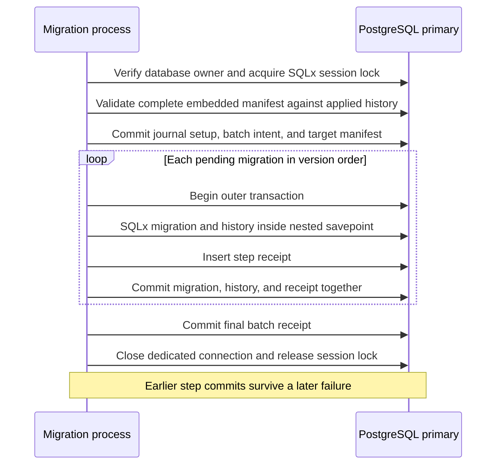

# Migration reconciliation

`operator migrate` records a batch intent before applying application migrations.
Each migration commits with its SQLx history and a step receipt. A final receipt
records completion of the batch. A lost connection can leave a completed prefix
and an unfinished suffix. The command never automatically retries.

This is an infrastructure operation. It requires a direct login as the PostgreSQL
database owner and access to the primary. Database role names identify a credential
boundary, not an individual administrator. Read [database authority](database-authority.md)
for deployment privileges and [CLI behavior](cli.md) for output and exit codes.

## Transaction boundaries



The runner uses the pinned SQLx migration-lock and apply APIs. PostgreSQL
[session advisory locks](https://www.postgresql.org/docs/current/explicit-locking.html#ADVISORY-LOCKS)
serialize cooperating migration processes. The dedicated connection closes on success,
failure, or task cancellation. It never returns a held session lock to the pool.
Direct SQL from trusted database administrators can bypass this protocol.

The first transaction creates `darkhorse_migration_v1` if it is absent. This
versioned bookkeeping schema is independent of application migrations. Its creation,
SQLx history-table initialization, intent, and target rows commit together. This
covers empty databases without inserting a new migration before published versions.
Existing application migration files retain their checksums. Missing required journal tables or columns cause failure. The runner does not
repair the journal or verify its entire DDL against the embedded creation script.
Database-owner changes remain within the trusted maintenance boundary.

The manifest contains at most 128 strictly ordered positive versions and their
SQLx SHA-384 checksums. Applied history must match a successful prefix. Dirty rows,
unknown versions, gaps, changed checksums, down migrations, and `no_tx` migrations
are rejected before intent or application changes. Embedded SQL is trusted release
content. Review must reject explicit transaction control and effects outside the
PostgreSQL transaction. No user-supplied SQL, skip option, or down-migration command
is accepted.

A step failure rolls back that migration, its history row, and its receipt. Earlier
step commits remain. The final receipt requires matching history for every target
and a receipt for every step that was pending at preparation. It does not cover
subsequent deployment grant scripts, application restarts, or readiness checks.
SQLx execution time measures work within the outer transaction. It excludes the
outer commit and receipt cost and is not a performance benchmark.

## Inspect an operation

Keep the `operation_id` from success or failure output:

```sh
darkhorse-server --output json operator migrate inspect <operation-id>
make db-migration-inspect OPERATION_ID=<operation-id>
make stack-migration-inspect STACK=<stack-name> OPERATION_ID=<operation-id>
```

Inspection requires database-owner credentials. It uses a read-only repeatable-read
transaction against the primary. It does not acquire the migration advisory lock,
create bookkeeping, apply migrations, or write an audit record. It requires no
confirmation, HTTP process, Redis access, public-origin configuration, or signing
material. An inspection can still wait for a conflicting database DDL lock and
remains subject to the configured SQL timeouts.

The local Make target reads the prepared local database settings. The Compose
target runs the dedicated `migrator` service. To render a Kubernetes inspection Job:

```sh
node scripts/kubernetes.mjs job <configuration.json> migration-inspect <unique-job-name> <operation-id>
```

Review and apply that manifest using the explicit kubeconfig and context described
in [Kubernetes deployment](kubernetes.md). The Job uses the migration service account,
owner secret, database network path, zero retries, and existing deadline. It does
not attach to a server replica or receive signing or Redis secrets. The namespace
permits one Job. Preserve the completed migration Job's result before deleting that
completed Job to free its quota slot. Do not remove an in-flight Job merely to
start another operation.

| Field                          | Meaning                                                                      |
| ------------------------------ | ---------------------------------------------------------------------------- |
| `recorded_outcome=absent`      | No intent is visible, or this database has no journal yet                    |
| `recorded_outcome=pending`     | Intent exists, but the final batch receipt is absent                         |
| `recorded_outcome=completed`   | This invocation recorded successful batch completion                         |
| `database_role`, `prepared_ms` | Database session identity and preparation time                               |
| `completed_ms`                 | Historical batch completion time, or null                                    |
| `database_ms`                  | Observation time                                                             |
| `steps[].version`, `checksum`  | The original embedded migration target                                       |
| `steps[].already_applied`      | Matching history existed before this invocation                              |
| `steps[].completed_ms`         | This invocation committed the step and its receipt, or null                  |
| `steps[].current_matches`      | Current SQLx history still matches the target checksum and successful status |

Earlier migrations receive baseline entries, never fabricated step receipts. A
no-op batch can complete with every target marked `already_applied`. A pending
batch can have all targets present if final receipt delivery or persistence failed.
A historical completion can coexist with a current checksum mismatch. History
matches do not prove that nobody later altered database objects through direct SQL.

## Recover after interrupted output

A pending or absent record cannot exclude an in-flight commit. Establish that the
original process and its database backend have stopped, or obtain their completed
result, before considering another mutation. Do not rely on the CLI exit code or
a missing Kubernetes log as proof of rollback.

If all output was lost, use a protected owner database session to find recent intent
IDs and correlate the database role, time, target versions, and deployment execution:

```sql
SELECT operation_id, database_role, prepared_ms, manifest_count, baseline_count
FROM darkhorse_migration_v1.intents
ORDER BY prepared_ms DESC, operation_id
LIMIT 20;
```

Do not assume that the newest row belongs to the failed execution. Inspect the
identified operation again after resolving any in-flight work. Review partial
progress and current checksums against the original release. Keep serving stopped.
Fix the established cause before deliberately starting a new migration invocation
with a new operation ID. It validates the complete current prefix, records a new
baseline, and applies only the missing suffix. The old record remains unchanged.
There is no automatic resume command or repair of unknown history.

Apply the reviewed runtime/operator grant script after successful migration, then
perform the deployment's checks before restarting service. Retain the full database
in backups, including `darkhorse_migration_v1`. A schema-filtered application-only
backup would lose this evidence. Restoring old evidence does not establish current
security state or authorize a restored server to resume service.

## Authority and verification

Ordinary runtime and operator roles receive no journal schema, table, or routine
access. The grant script revokes accidental grants on this schema. Append-only
triggers reject ordinary updates, deletes, and truncation. The database owner can
disable triggers, alter evidence, or run arbitrary SQL. The journal is not tamper-proof
and does not provide emergency authentication or individually verified attribution.
No retention pruning, audit export, or production privilege-assurance claim is added.

`make test-postgres` exercises fresh setup, upgrades, no-op batches, malformed
history, concurrent migrators, immutable evidence, injected audit failures, partial
progress, cancellation, and discarded real commit replies. `make test-db-authority`
checks actual authenticated owner, runtime, and operator logins. Packaged Compose
and Kubernetes checks exercise the migration workload and read-only inspection.
Unit tests cover manifest validation, typed parsing, output bounds, and launcher
selection without external services. These checks do not complete [issue #23](https://github.com/OneTesseractInMultiverse/darkhorse-identity/issues/23)
or the independent release security review.
