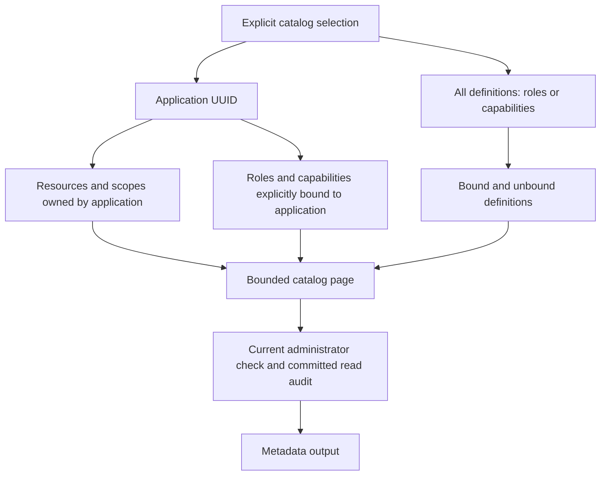

# Authenticated access-catalog listing

The Rust CLI lists protected resources, delegation scopes, roles, and capabilities
through the same primary database queries as the management console. Each invocation
requires a fresh password proof from a current platform administrator and a committed
read audit before releasing its page. Application ownership does not confer this
authority. These commands implement another part of
[#26](https://github.com/OneTesseractInMultiverse/darkhorse-identity/issues/26).

## Selection and meaning

```sh
darkhorse-server --auth-stdin --output json operator resource list <application-uuid> < /private/path/authentication.json
darkhorse-server --auth-stdin --output json operator scope list <application-uuid> < /private/path/authentication.json
darkhorse-server --auth-stdin --output json operator role list --application <application-uuid> < /private/path/authentication.json
darkhorse-server --auth-stdin --output json operator capability list --application <application-uuid> --status active < /private/path/authentication.json
darkhorse-server --auth-stdin --output json operator role list --all-definitions < /private/path/authentication.json
darkhorse-server --auth-stdin --output json operator capability list --all-definitions < /private/path/authentication.json
```

Resources and scopes require a nonzero application UUID. Scope listing includes all
of that application's resources and identifies each scope's resource in the result.
Roles and capabilities require exactly one selection: `--application UUID` or
`--all-definitions`. There is no implicit selection when both are absent.

An application selection returns only definitions explicitly bound to that
application. All-definitions includes unbound definitions and definitions bound to
any application. It does not select only unbound definitions. A definition's
presence in either view establishes neither a principal assignment nor effective
resource access. Existing [authorization rules](authorization.md) still require
explicit application bindings, role grants, resource exposure, delegation limits,
and current principal authority.



Inactive applications remain inspectable. A missing application produces a fixed
not-found error after authentication. An existing application with no matching
records returns an empty page. No command in this increment creates a definition,
changes a binding, assigns a principal, or returns effective-access decisions.
Independent delegated management permissions remain unfinished; current platform
administrators are the only supported actors.

## Input, pages and output

The protected JSON input contains `email` and `password`; `reason` is rejected for
these reads. The shared [account input contract](operator-accounts.md#inputs-and-dependencies)
limits input to 16 KiB and keeps passwords out of arguments and diagnostics.
Native human-mode commands can collect email and hidden password from the foreground
terminal. JSON output requires `--auth-stdin`. Reads need no mutation confirmation.

All lists accept `--limit 1..25` (default 25), `--after UUID`, and `--search PREFIX`.
Search is a case-insensitive literal prefix of the resource/role/scope name or
capability permission key. Its maximum is 100 Unicode characters; surrounding
whitespace and control characters are invalid. SQL wildcard characters remain
literal. Selectors can appear in process metadata and must not contain secrets.

Only capability listing accepts `--status active|inactive`: active means the
capability is not retired; inactive means it is retired. Omission includes both.
Resources, scopes and roles have no corresponding lifecycle flag and reject this
selector. The filter does not describe application, principal, or grant status.

The [CLI envelope](cli.md#output-and-exit-contract) contains `operation_id`, `items`,
`next` and a decimal-string `policy_revision`. Item fields are fixed:

| Catalog    | Fields                                        |
| ---------- | --------------------------------------------- |
| Resource   | `id`, `application_id`, `name`, `audience`    |
| Scope      | `id`, `application_id`, `resource_id`, `name` |
| Role       | `id`, `name`                                  |
| Capability | `id`, `key`, `retired`                        |

Capability descriptions are omitted from this metadata projection. The CLI's
64 KiB output limit and terminal-control escaping remain unchanged. These queries
never read client-secret values or verifiers. They do require the shared
administrator-password verifier to authenticate the actor.

Pass a non-null `next` as `--after` with the same selection and filters. UUID
ordering and an exclusive cursor bound each page; the query retrieves at most
one additional row to determine continuation. Pages are independent live reads,
not a transaction spanning multiple invocations. Concurrent edits can change page
membership, including additions behind the cursor. Each page uses another login
attempt. No automatic traversal or bulk export is provided.

## Authority, persistence and failure

The existing HTTP/CLI login budget charges every invocation. A primary shared
security fence orders the read against security writers. The transaction verifies
current principal status, password credential, credential epoch, administrator
membership and the 60-second proof lifetime after lock waits, after querying, and
after inserting a successful read audit. A change committed before a new read
therefore affects its authority and bindings. An in-flight reader already holding
the fence can finish before a waiting writer. Redis stores no positive decision.

Migration `0031` extends the existing `operator_catalog_audit` command and selector
constraints. It preserves historical rows and the append-only trigger. Resources
and scopes require an application in the audit; role/capability records use a null
application only for the explicitly selected all-definitions mode. Status filters
are permitted only for applications, clients and capabilities. Existing runtime
SELECT/INSERT grants remain sufficient; the nonowner deployment operator acquires
no catalog-audit access. Apply migrations explicitly with serving stopped under
the [database authority contract](database-authority.md).

Audit records retain command, selection, cursor, limit, status filter, whether a
search was supplied, actor/proof facts, outcome, count, time and database role.
They omit the search text, names, descriptions, email and credential material.
Audit insertion failure or suppression releases no page. Final authority failure
rolls the transaction back, including its attempted read audit.

A failed commit acknowledgement has an unknown outcome: the read audit might have
committed, but no page is returned and no retry occurs automatically. Closed stdout
can follow a committed read audit and returns exit `74`. Review the primary audit
using the operation ID when available, or the actor, command, target and time when
output was lost. Absence does not rule out an in-flight operation. Repeating a read
is an explicit new invocation with a new proof and audit; it is not recovery of the
previous response. Process connections, timeouts, signals and limiter failures
follow the shared [container execution contract](container-accounts.md).

## Compose and Kubernetes

The existing `stack-catalog-exec`, `stack-catalog-run`, `kube-catalog-exec`, and
`kube-catalog-run` targets accept these catalogs with protected stdin:

```sh
make stack-catalog-run STACK=trial CATALOG_TARGET=resource CATALOG_APPLICATION_ID=<application-uuid> < /private/path/authentication.json
make kube-catalog-exec KUBE_CONFIG=/absolute/path/identity.json KUBE_ACCESS=/absolute/path/access.yaml KUBE_CONTEXT=reviewed-context ACCOUNT_POD=<reviewed-pod> CATALOG_TARGET=capability CATALOG_ALL_DEFINITIONS=yes CATALOG_STATUS=inactive < /private/path/authentication.json
```

Set `CATALOG_TARGET` to `resource`, `scope`, `role`, or `capability`.
`CATALOG_OPERATION` must be `list` or omitted. Supply `CATALOG_APPLICATION_ID`,
or, for roles/capabilities, explicitly set `CATALOG_ALL_DEFINITIONS=yes`.
They are mutually exclusive. Optional `CATALOG_SEARCH`, `CATALOG_AFTER`,
`CATALOG_LIMIT`, and capability-only `CATALOG_STATUS` mirror native selectors.

Account selectors, client/secret IDs, mutation selectors and configuration inputs
are rejected. Other catalog commands reject `CATALOG_ALL_DEFINITIONS` so an inherited
setting cannot silently change the intended selection. Make preserves selector
values literally; authentication flows only through stdin. One-shot execution works
with HTTP stopped. GNU Make reports failed recipes as `2`; direct native and Node
launcher execution retain their documented statuses.

[Verification](verification.md) records the tested boundaries and remaining
qualification work. This increment does not complete #26 or establish production
readiness.
