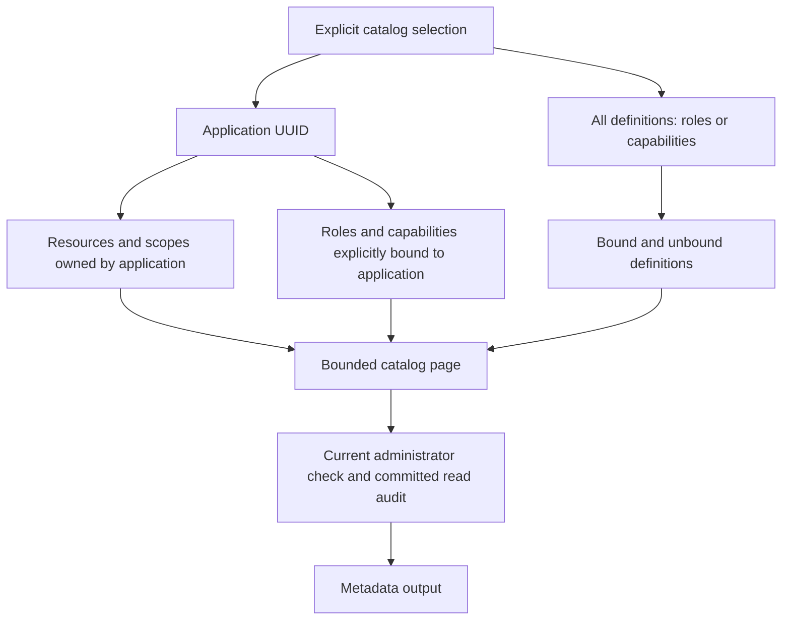

# Authenticated access-catalog operations

The Rust CLI lists protected resources, delegation scopes, roles, and capabilities
through the same primary database queries as the management console. Each invocation
requires a fresh password proof from a current platform administrator and a committed
read audit before releasing its page. Application ownership does not confer this
authority. The read and mutation commands implement another part of
[#26](https://github.com/OneTesseractInMultiverse/darkhorse-identity/issues/26).

## Selection and meaning

```sh
darkhorse-server --auth-stdin --output json operator resource list <application-uuid> < /private/path/authentication.json
darkhorse-server --auth-stdin --output json operator scope list <application-uuid> < /private/path/authentication.json
darkhorse-server --auth-stdin --output json operator role list --application <application-uuid> < /private/path/authentication.json
darkhorse-server --auth-stdin --output json operator capability list --application <application-uuid> --status active < /private/path/authentication.json
darkhorse-server --auth-stdin --output json operator role list --all-definitions < /private/path/authentication.json
darkhorse-server --auth-stdin --output json operator capability list --all-definitions < /private/path/authentication.json
```

Resources and scopes require a nonzero application UUID. Scope listing includes all
of that application's resources and identifies each scope's resource in the result.
Roles and capabilities require exactly one selection: `--application UUID` or
`--all-definitions`. There is no implicit selection when both are absent.

An application selection returns only definitions explicitly bound to that
application. All-definitions includes unbound definitions and definitions bound to
any application. It does not select only unbound definitions. A definition's
presence in either view establishes neither a principal assignment nor effective
resource access. Existing [authorization rules](authorization.md) still require
explicit application bindings, role grants, resource exposure, delegation limits,
and current principal authority.


```mermaid
flowchart TD
    Choice[Explicit catalog selection] --> App[Application UUID]
    Choice --> All[All definitions: roles or capabilities]
    App --> Resources[Resources and scopes owned by application]
    App --> Bound[Roles and capabilities explicitly bound to application]
    All --> Definitions[Bound and unbound definitions]
    Resources --> Page[Bounded catalog page]
    Bound --> Page
    Definitions --> Page
    Page --> Audit[Current administrator check and committed read audit]
    Audit --> Output[Metadata output]
```

Inactive applications remain inspectable. A missing application produces a fixed
not-found error after authentication. An existing application with no matching
records returns an empty page. List and show are read-only and do not change policy.
`access apply` below can create definitions and change bindings, but does not assign
principals or return effective-access decisions. Independent delegated management
permissions remain unfinished; current platform administrators are the only
supported actors.

## Inspect one definition

`show` reads one resource, scope, role, or capability together with its current
catalog relationships. Resources and scopes require the application and parent
identifiers. Roles and capabilities require the same explicit choice as listing:
`--application UUID` restricts the result to one application, while
`--all-definitions` explicitly requests all application bindings.

```sh
darkhorse-server --auth-stdin --output json operator resource show <application-uuid> <resource-uuid> < /private/path/authentication.json
darkhorse-server --auth-stdin --output json operator scope show <application-uuid> <resource-uuid> <scope-uuid> < /private/path/authentication.json
darkhorse-server --auth-stdin --output json operator role show --application <application-uuid> <role-uuid> < /private/path/authentication.json
darkhorse-server --auth-stdin --output json operator capability show --all-definitions <capability-uuid> < /private/path/authentication.json
```

The result includes the selected record, its current application bindings and
capability relationships, plus the primary policy revision observed in the same
transaction. Application-scoped role results include capabilities bound to that
application only. A role or capability that is not bound to the selected
application returns the fixed not-found outcome. Principal assignments and
effective access are not part of these detail views.

Each relationship list is capped at 25 records. Larger views fail closed so the
CLI never silently truncates a policy graph. Use the bounded catalog listings to
inspect large sets. Capability detail includes its human meaning; capability
references within other records contain only ID, key, and retired status. The read
commits an append-only audit before output. It records the actor, selected
identifiers, application scope, outcome, and time, but no returned names,
descriptions, email addresses, or credential material. A denied audit insert or
uncertain commit releases no detail response and is not retried.

The Compose launchers accept the same detail selectors:

```sh
make stack-catalog-run STACK=trial CATALOG_TARGET=role CATALOG_OPERATION=show CATALOG_APPLICATION_ID=<application-uuid> CATALOG_TARGET_ID=<role-uuid> < /private/path/authentication.json
make stack-catalog-exec STACK=trial CATALOG_TARGET=scope CATALOG_OPERATION=show CATALOG_APPLICATION_ID=<application-uuid> CATALOG_RESOURCE_ID=<resource-uuid> CATALOG_TARGET_ID=<scope-uuid> < /private/path/authentication.json
```

All identifiers are parsed as typed, nonzero UUIDs and passed literally. Detail
commands reject listing filters and unrelated catalog selectors.

## Input, pages and output

The protected JSON input contains `email` and `password`; `reason` is rejected for
these reads. The shared [account input contract](operator-accounts.md#inputs-and-dependencies)
limits input to 16 KiB and keeps passwords out of arguments and diagnostics.
Native human-mode commands can collect email and hidden password from the foreground
terminal. JSON output requires `--auth-stdin`. Reads need no mutation confirmation.

All lists accept `--limit 1..25` (default 25), `--after UUID`, and `--search PREFIX`.
Search is a case-insensitive literal prefix of the resource/role/scope name or
capability permission key. Its maximum is 100 Unicode characters; surrounding
whitespace and control characters are invalid. SQL wildcard characters remain
literal. Selectors can appear in process metadata and must not contain secrets.

Only capability listing accepts `--status active|inactive`: active means the
capability is not retired; inactive means it is retired. Omission includes both.
Resources, scopes and roles have no corresponding lifecycle flag and reject this
selector. The filter does not describe application, principal, or grant status.

The [CLI envelope](cli.md#output-and-exit-contract) contains `operation_id`, `items`,
`next` and a decimal-string `policy_revision`. Item fields are fixed:

| Catalog    | Fields                                        |
| ---------- | --------------------------------------------- |
| Resource   | `id`, `application_id`, `name`, `audience`    |
| Scope      | `id`, `application_id`, `resource_id`, `name` |
| Role       | `id`, `name`                                  |
| Capability | `id`, `key`, `retired`                        |

Capability descriptions are omitted from this metadata projection. The CLI's
64 KiB output limit and terminal-control escaping remain unchanged. These queries
never read client-secret values or verifiers. They do require the shared
administrator-password verifier to authenticate the actor.

Pass a non-null `next` as `--after` with the same selection and filters. UUID
ordering and an exclusive cursor bound each page; the query retrieves at most
one additional row to determine continuation. Pages are independent live reads,
not a transaction spanning multiple invocations. Concurrent edits can change page
membership, including additions behind the cursor. Each page uses another login
attempt. No automatic traversal or bulk export is provided.

## Authority, persistence and failure

The existing HTTP/CLI login budget charges every invocation. A primary shared
security fence orders the read against security writers. The transaction verifies
current principal status, password credential, credential epoch, administrator
membership and the 60-second proof lifetime after lock waits, after querying, and
after inserting a successful read audit. A change committed before a new read
therefore affects its authority and bindings. An in-flight reader already holding
the fence can finish before a waiting writer. Redis stores no positive decision.

Migration `0031` extends the existing `operator_catalog_audit` command and selector
constraints. It preserves historical rows and the append-only trigger. Resources
and scopes require an application in the audit; role/capability records use a null
application only for the explicitly selected all-definitions mode. Status filters
are permitted only for applications, clients and capabilities. Existing runtime
SELECT/INSERT grants remain sufficient; the nonowner deployment operator acquires
no catalog-audit access. Apply migrations explicitly with serving stopped under
the [database authority contract](database-authority.md).

Audit records retain command, selection, cursor, limit, status filter, whether a
search was supplied, actor/proof facts, outcome, count, time and database role.
They omit the search text, names, descriptions, email and credential material.
Audit insertion failure or suppression releases no page. Final authority failure
rolls the transaction back, including its attempted read audit.

A failed commit acknowledgement has an unknown outcome: the read audit might have
committed, but no page is returned and no retry occurs automatically. Closed stdout
can follow a committed read audit and returns exit `74`. Review the primary audit
using the operation ID when available, or the actor, command, target and time when
output was lost. Absence does not rule out an in-flight operation. Repeating a read
is an explicit new invocation with a new proof and audit; it is not recovery of the
previous response. Process connections, timeouts, signals and limiter failures
follow the shared [container execution contract](container-accounts.md).

## Apply a policy change

`operator access apply` applies one change supported by the management API. It
requires fresh password authentication by a current platform administrator,
`--auth-stdin`, JSON output, `--yes`, an expected primary policy revision, and a
reason. Application ownership is contact information and grants no authority.
Delegated management permissions and principal assignments are separate work;
this command does not add a CLI-specific authorization model.

Put the complete request in a protected file and pass it only through stdin:

```json
{
  "authentication": {
    "email": "admin@example.com",
    "password": "read-from-a-password-manager",
    "reason": "Grant the reporting role the read capability"
  },
  "policy_revision": "31",
  "change": {
    "operation": "role_capability",
    "role_id": "00000000-0000-0000-0000-000000000041",
    "capability_id": "00000000-0000-0000-0000-000000000052",
    "granted": true
  }
}
```

Use a file with owner-only permissions (for example, `chmod 600`) and remove it
after the operation. Avoid shell variables, command arguments, environment values,
terminal transcripts and shared temporary directories for credentials. The input
is capped at 32 KiB, rejects unknown fields, bounds the reason to 1–200 Unicode
characters and 512 UTF-8 bytes, and zeroizes the password when the parsed request
is dropped. The reason is retained in the audit and must not contain credentials.

The expected revision is the decimal-string `policy_revision` from a current
catalog read. The server checks it again under the exclusive primary security
fence. If any policy change commits first, the command returns a conflict; read
the catalog again and review the change before creating a new request.

`change.operation` is one of:

| Operation             | Required fields                                                          | Effect                                                                |
| --------------------- | ------------------------------------------------------------------------ | --------------------------------------------------------------------- |
| `create_capability`   | `key`, `meaning`, optional `application_id`                              | Create a shared capability, optionally binding it to one application. |
| `retire_capability`   | `capability_id`                                                          | Retire a capability so it cannot be newly granted.                    |
| `create_role`         | `name`, optional `application_id`                                        | Create a role, optionally binding it to one application.              |
| `capability_binding`  | `application_id`, `capability_id`, `bound`                               | Add or remove an explicit application binding.                        |
| `role_binding`        | `application_id`, `role_id`, `bound`                                     | Add or remove an explicit application binding.                        |
| `role_capability`     | `role_id`, `capability_id`, `granted`                                    | Grant or remove a capability from a role.                             |
| `resource_capability` | `application_id`, `resource_id`, `capability_id`, `exposed`              | Expose or remove a capability on an application resource.             |
| `scope_capability`    | `application_id`, `resource_id`, `scope_id`, `capability_id`, `included` | Include or remove a resource capability from a delegation scope.      |

All identifiers must be nonzero UUIDs and all referenced objects must satisfy the
same existence, binding, capacity and cross-application checks as the management
API. A definition's existence alone grants no access. Role, resource and scope
relationships continue to use the shared policy model in
[authorization](authorization.md).

The successful JSON `data` contains `completed`, `changed`, `operation_id`,
`target` and decimal-string `policy_revision`. `changed: false` means the requested
binding or retirement was already in the desired state; it is still audited.
Responses, diagnostics and audit records omit passwords, capability meanings and
role names. Fixed errors distinguish authentication denial, invalid policy,
missing references and stale revisions without returning submitted values.

For a local Compose deployment, the existing one-shot catalog command can run
while HTTP is stopped. It uses the account service and passes the file only to
stdin:

```sh
make stack-catalog-run STACK=local CATALOG_TARGET=access CATALOG_OPERATION=apply CATALOG_CONFIRM=yes < /private/path/access-change.json
```

Use `stack-catalog-exec` when the API container is running. These launchers require
`CATALOG_CONFIRM=yes` and reject catalog selectors that do not apply to a single
access change. The native command inside the container is also:

```sh
darkhorse-server --auth-stdin --output json --yes operator access apply < /private/path/access-change.json
```

### Mutation authority and audit

The CLI mutation shares the HTTP adapter's reference validation, capacity checks,
role-binding safety rules, and persistence. It uses the existing password
verification and shared login budget. PostgreSQL holds the exclusive shared
security fence, checks the administrator proof and expected policy revision,
applies the change under a savepoint, appends one operator audit, rechecks current
authority, and commits. A permission reduction that commits before a new
authorization check is visible to that check. No positive authority decision is
cached in Redis.

Migration `0039` adds the append-only `operator_access_catalog_audit` ledger.
Runtime receives only SELECT/INSERT access; the nonowner deployment operator has
no ledger access. Access-catalog CLI changes do not fabricate a browser session
or write `catalog_admin_audit`. Audit failure or suppression rolls back the
policy change and its revision. The ledger stores command, requested/resulting
revision, target and related UUIDs, requested state, reason, verified actor and
credential facts, result, time and database role. It does not store definition
names, capability meanings, email or passwords. Apply the migration and refreshed
reviewed grants with serving stopped under the
[database authority contract](database-authority.md).

A lost commit acknowledgement has an unknown outcome. The CLI returns a fixed
uncertain result and never retries automatically. Check the operation ID in the
primary audit and inspect the current target before deciding whether to submit a
new operation. The `changed` field is emitted only after the audit and mutation
commit. Closing stdout may still lose that response after a committed change.

## Compose and Kubernetes

The existing `stack-catalog-exec`, `stack-catalog-run`, `kube-catalog-exec`, and
`kube-catalog-run` targets accept these catalogs with protected stdin:

```sh
make stack-catalog-run STACK=trial CATALOG_TARGET=resource CATALOG_APPLICATION_ID=<application-uuid> < /private/path/authentication.json
make stack-catalog-run STACK=local CATALOG_TARGET=access CATALOG_OPERATION=apply CATALOG_CONFIRM=yes < /private/path/access-change.json
make kube-catalog-exec KUBE_CONFIG=/absolute/path/identity.json KUBE_ACCESS=/absolute/path/access.yaml KUBE_CONTEXT=reviewed-context ACCOUNT_POD=<reviewed-pod> CATALOG_TARGET=capability CATALOG_ALL_DEFINITIONS=yes CATALOG_STATUS=inactive < /private/path/authentication.json
```

For reads, set `CATALOG_TARGET` to `resource`, `scope`, `role`, or `capability`.
`CATALOG_OPERATION` is `list` (the default) or `show`. Listing supplies `CATALOG_APPLICATION_ID`,
or, for roles/capabilities, explicitly set `CATALOG_ALL_DEFINITIONS=yes`.
They are mutually exclusive. Optional `CATALOG_SEARCH`, `CATALOG_AFTER`,
`CATALOG_LIMIT`, and capability-only `CATALOG_STATUS` mirror native selectors.
For `show`, set `CATALOG_TARGET_ID`; scopes additionally require
`CATALOG_RESOURCE_ID`. Resource/scope details require an application ID; role and
capability details require either an application ID or all-definitions selection.

For access writes, set `CATALOG_TARGET=access`, `CATALOG_OPERATION=apply` and
`CATALOG_CONFIRM=yes`; provide the revision, change and authentication only in the
protected JSON stdin object. Account selectors, client/secret IDs, and catalog
filters or target IDs are rejected for this operation. Read commands reject write
selectors and unrelated `CATALOG_ALL_DEFINITIONS` settings. Make preserves selector
values literally; authentication flows only through stdin. One-shot execution works
with HTTP stopped. GNU Make reports failed recipes as `2`; direct native and Node
launcher execution retain their documented statuses.

[Verification](verification.md) records the tested boundaries and remaining
qualification work. This increment does not complete #26 or establish production
readiness.
