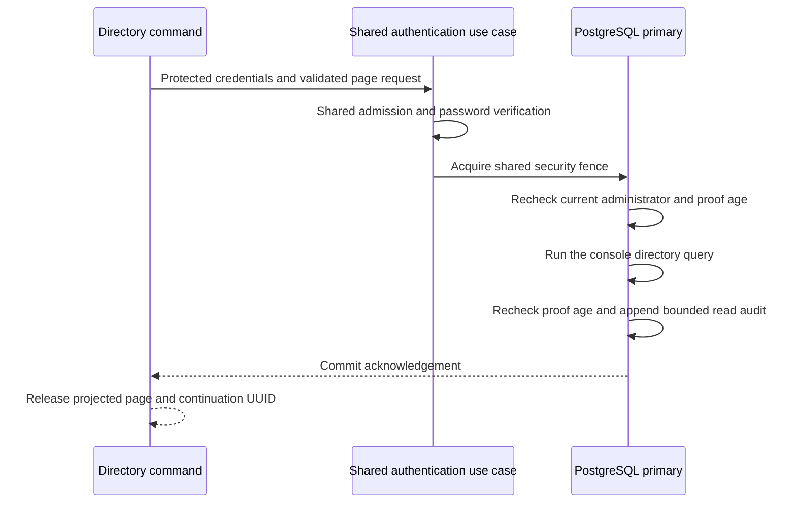
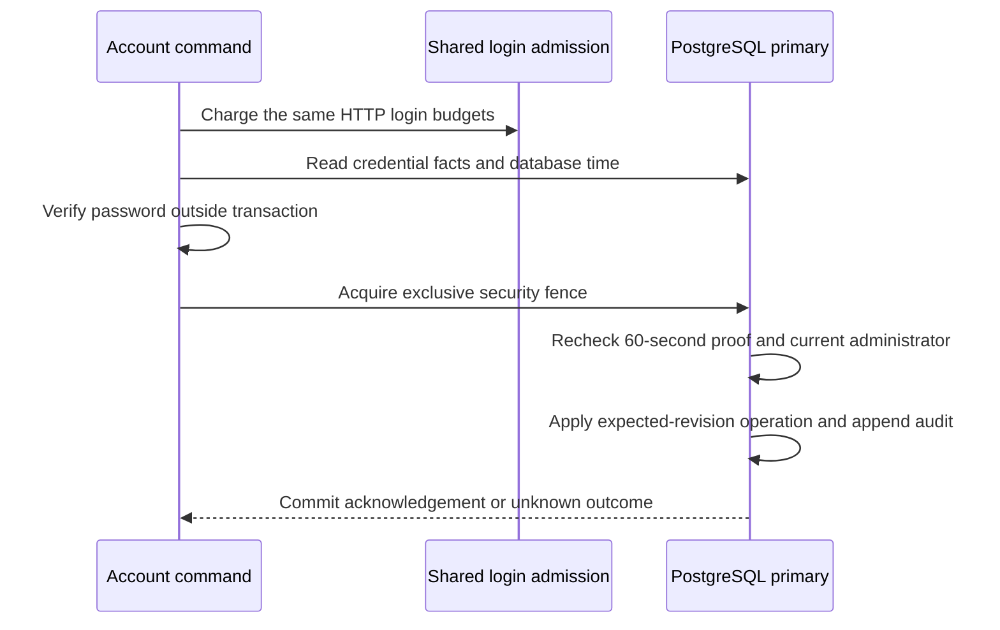

# Authenticated account commands

The `operator account` commands require a fresh administrator password for
every invocation. There is no saved CLI session, token file or login/logout
command. Canonical and legacy spellings use the same application service. HTTP
may be stopped. The CLI starts no listener or maintenance worker.

## Inputs and dependencies

Configure the primary database, runtime Redis limiter access,
`DARKHORSE_LOGIN_ENABLED=true` and the same protected `DARKHORSE_LOGIN_LIMIT_KEY`
used by HTTP. The database pins its fingerprint. Changing the key cannot create a
new attempt budget. The limiter must already have an active, validated generation.
A missing setting, mismatched key, unavailable limiter/database or audit failure
rejects the operation. Recovery is a separate deployment operation. Account
commands never initialize, reset or bypass the limiter.

By default the foreground terminal prompts for administrator email, a mutation
reason, and a hidden password. Mutations require confirmation. Automated
calls use `--auth-stdin`, protected JSON on stdin, and `--yes` for mutations:

```sh
darkhorse-server --auth-stdin --output json operator account show <principal-id> < protected-account.json
darkhorse-server --auth-stdin --output json --yes operator account revoke-all <principal-id> <revision> < protected-account.json
```

The input object contains `email`, `password`, and optional `reason`. A mutation
requires a reason. After trimming it must contain 1–200 characters and at most
512 UTF-8 bytes, without control characters or bidirectional overrides. Reasons
are retained as unverified caller text: never include secrets. Unknown or
duplicate fields, invalid UTF-8/JSON and input larger than 16 KiB are rejected.
Use your secret-management process to deliver stdin. Do not put passwords in
arguments, shell history, committed files or reason text. The raw input buffer and
successfully parsed password are cleared on drop. JSON output requires
`--auth-stdin` and never prompts.

## Bounded directory listing

```sh
darkhorse-server --auth-stdin --output json operator account list --status active --search 'Ada' --limit 25 < protected-account.json
```

For `list`, the protected input contains only `email` and `password`; omit
`reason`. This is a read and needs no confirmation. `--status` accepts `active`
or `inactive`; omitting it includes both. Search is a case-insensitive, literal
prefix of email, full name or last name, using the console's existing query.
Percent, underscore and backslash are ordinary search characters. Search permits
up to 100 Unicode characters, without controls or surrounding whitespace.
Search arguments may be visible in process listings and orchestration metadata;
never use credential material as a search value.

`--limit` accepts 1–25 and defaults to 25. The success envelope's `data` contains
`operation_id`, `items` and `next`. Each item contains `id`, `email`, `first_name`,
`last_name`, `active`, `administrator`, `email_verified` and `revision`.
Revision is a decimal string to preserve its full integer range in JSON clients.
No credential epoch, password verifier or extended profile is projected.
The maximum valid page fits the CLI's 64 KiB escaped-output limit.

Pass a non-null `next` UUID as `--after` for the following page, preserving the
same filters. Each invocation authenticates and consumes a login attempt again;
there is no automatic traversal. Results use the console's `(created_at, id)`
keyset ordering. Pages are live reads, not a point-in-time export: changes between
invocations can change membership. An unknown cursor produces an empty page.

All account commands cap their process-local PostgreSQL pool at two connections
(or the smaller configured limit) and their limiter pool at one. They create no
cache client. Input collection finishes before connecting. Query, lock and proof
lifetime limits still apply; bounded output alone does not guarantee a fast query
at every directory size. Load and query-plan qualification remain required.



## Authentication and authority

The CLI uses the same Argon2id verifier and `SharedLoginAdmission` policy as HTTP:
120 attempts/minute globally, 5/minute per normalized email and 30/15 minutes per
email. Successful and failed attempts consume the budget. A fresh process does
not reset it. CLI activity can temporarily limit web sign-in and vice
versa. Each process bounds its own hashing concurrency. This is not a distributed
concurrent-hash limit. Unknown/inactive credentials use the existing verification
path and receive the same generic denial. No account data is returned before
successful authentication, current authority checks and audit commit.

The application constructs a private, single-operation proof after password
verification. It captures the database time and credential facts before hashing.
Its lifetime is **60 seconds**, including hashing and waits. Inside the operation
transaction, the adapter takes the security fence and rechecks the
exact credential/verifier, current credential epoch, nonrevoked credential,
active principal and platform-administrator membership against the primary.
Expired proofs and clock rollback deny access. No positive authorization decision
is cached.

An active platform administrator can list or show accounts, deactivate, reactivate or revoke all
sessions/issued credentials for a selected principal. Expected revisions and the
last eligible administrator invariant still apply. Revoke-all advances the
credential epoch. It does not remove the password, so a later fresh password
proof may authenticate. No membership assignment, impersonation or application
resource access is granted. Committed demotion or credential changes invalidate
older proofs. Supported concurrent security operations serialize at the shared
fence. An operation that wins the fence may complete before a waiting revocation.
Single-target operations take the exclusive fence; listing takes its shared mode
and checks proof freshness again after the query. Both preserve actor/audit ordering. Keep this
low-volume administrative path out of high-frequency authorization checks.



The proof is private to one invocation. Reads require an audit commit too.
A failed output or commit acknowledgement does not prove rollback.

## Audit and uncertain outcomes

Migration `0022` adds `operator_account_audit`. Apply it and the reviewed runtime
grants with serving stopped as documented in [database authority](database-authority.md).
Successful reads, mutations, no-ops and logical denials record the operation,
target, generated correlation ID, verified actor/credential/epoch, authentication
observation time, requested/resulting revision, reason, outcome and database role.
Wrong-password, unknown or inactive-credential denials have no verified actor.
Input/configuration/admission failures occur before target access and are not
operator transaction records. Infrastructure failures roll back their transaction.
These records are not a complete event stream of every attempted process start.

State changes and both directory and operator audit records commit in one
transaction. Audit failure prevents success, including reads. A commit error is
reported as **outcome unknown** without automatic retry. Account execution results
include `operation_id`. Inspect that audit entry and the current target revision
using protected owner access before deciding whether to retry. Cancellation or a
failed output pipe may lose the correlation response. They are not proof of
rollback. No general audit export or automatic retention/deletion is added.

Migration `0025` adds the separate `operator_directory_audit` table. Apply the
migration and updated runtime grants with serving stopped before enabling listing.
A listing audit records correlation, verified actor/credential/epoch, proof time,
limit, optional status/cursor, whether search was used, outcome, returned count,
time and database role. It stores neither raw search text nor returned profiles.
Invalid authentication produces a denial with no verified actor. Audit insertion
must persist exactly one row; an error or trigger-suppressed insert releases no
page. A lost commit acknowledgement reports an unknown outcome even when the
read audit committed. There is no automatic retry or unaudited fallback.

Runtime may append/read these audit tables but cannot update/delete/truncate it.
Database owners remain trusted, and broad runtime DML still permits misleading
audit insertion outside the application. Per-command authentication does not
contain a compromised server or database credential. Migration, bootstrap,
signing and limiter operations retain their separate deployment-credential
boundaries. Emergency access, runtime-compromise containment,
production privileged assurance/MFA, external evidence and retention/export
remain open in #1/#23. There is no emergency password or audit-bypass switch.

## Verification

`make test-operator-accounts` runs disposable PostgreSQL and Redis suites plus real
CLI/terminal checks. Real command processes use the reviewed grants with a
nonowner runtime database login, including denied audit INSERT rollback.
It covers listing and the four single-target commands, generic denials, independent
processes sharing HTTP admission budgets, membership and credential reductions,
expired proofs, revision/last-administrator rules, audit rollback, commit failure,
and loss of an actual committed PostgreSQL response. Unit tests remain
self-contained and run through `make test-unit`. The [native interference benchmark](performance.md#native-cli-interference) measures
two concurrent authenticated read workers alongside HTTPS checks, then exercises
CLI revocation under paced traffic. It verifies actual overlap and committed
audits in a disposable owner-role fixture; production role, population and
container load qualification remain open. Full authored-code coverage and
independent security qualification remain open requirements.

The authentication and authorization boundaries follow
[OWASP authentication guidance](https://cheatsheetseries.owasp.org/cheatsheets/Authentication_Cheat_Sheet.html)
and [OWASP authorization guidance](https://cheatsheetseries.owasp.org/cheatsheets/Authorization_Cheat_Sheet.html).

## Source reference

[account use case](../crates/application/src/operator_accounts.rs),
[transaction authority](../crates/adapters/src/postgres/operator_accounts.rs),
[directory transaction](../crates/adapters/src/postgres/operator_directory.rs).
