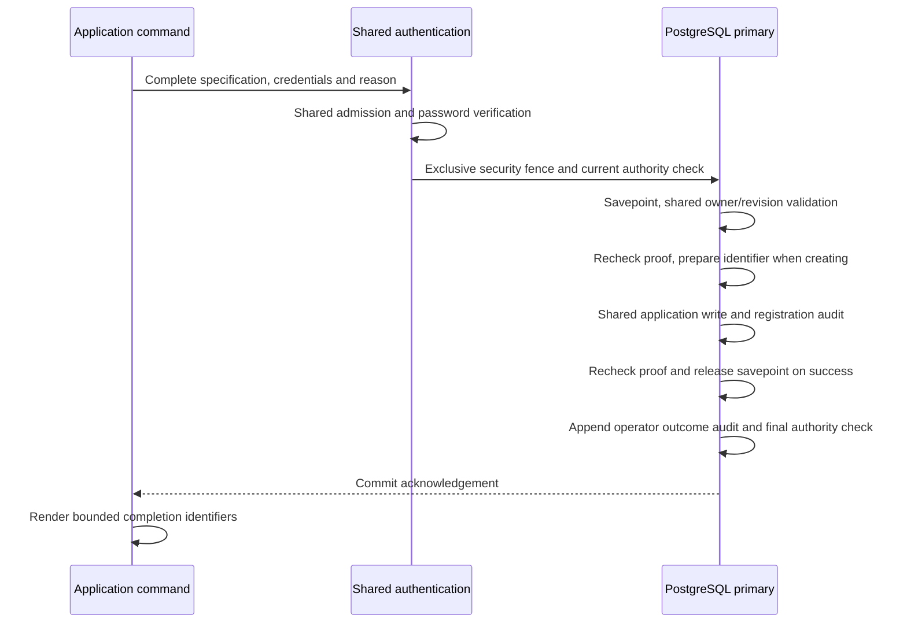

# Authenticated application writes

The local Rust CLI supports application creation and complete configuration updates.
Each invocation authenticates a current platform administrator and uses the same
owner validation, revision checks, SQL writes and registration audit as the HTTP
management API. Application ownership is contact metadata; it grants no
administrative or application-resource authority.

This is the application-write increment of
[#26](https://github.com/OneTesseractInMultiverse/darkhorse-identity/issues/26).
Client writes, secret delivery, access-catalog commands and delegated management
permissions remain separate work. Inspect existing configuration with
[application list/show](operator-catalog.md).

## Native commands

```sh
darkhorse-server --auth-stdin --output json --yes operator application create --name 'Employee portal' --owner <owner-uuid> --status active < /private/path/application-input.json
darkhorse-server --auth-stdin --output json --yes operator application update <application-uuid> <expected-revision> --name 'Employee portal' --owner <owner-uuid> --status inactive < /private/path/application-input.json
```

Both commands require all three specification flags:

| Argument         | Contract                                                                                                               |
| ---------------- | ---------------------------------------------------------------------------------------------------------------------- |
| `--name`         | Existing registration label: surrounding whitespace trimmed, 1–100 Unicode characters, no remaining control characters |
| `--owner`        | Nonzero principal UUID; the principal must currently exist and be active                                               |
| `--status`       | Explicit `active` or `inactive`                                                                                        |
| `APPLICATION_ID` | Required only for update; nonzero application UUID                                                                     |
| `REVISION`       | Required only for update; current decimal revision from `show`                                                         |

An update replaces all three fields. Read and review the current configuration
before constructing the replacement. Every successful update advances the revision
by one, even if the submitted values match. A stale revision or exhausted signed
bigint revision rejects the write. Creation returns revision `0` and a new random
application UUID. Use `--name=-prefix` for a name that begins with a hyphen.

The protected input is the [account authentication object](operator-accounts.md#inputs-and-dependencies),
with `email`, `password` and a required `reason`. The reason is trimmed, contains
1–200 Unicode characters and at most 512 UTF-8 bytes, and rejects controls and
specified bidirectional formatting characters. Do not put credentials or other
sensitive data in a reason; it is retained in the audit. Input is bounded to 16 KiB.
Unknown fields and missing reasons fail before database access.

Without `--auth-stdin`, the native foreground terminal collects credentials and
reason, hiding the password. Mutations require interactive confirmation or `--yes`.
JSON mode requires protected stdin and `--yes`. Parsing and confirmation precede
configuration or service access. Each attempt uses the shared HTTP login budget;
starting another process does not reset it. Names and owner IDs are nonsecret
command selectors, visible to trusted process/orchestration infrastructure.

Successful output contains only `completed`, `operation_id`, `application_id`
and decimal-string `revision`, inside the normal JSON envelope in JSON mode.
Names, owner email, passwords and reasons are absent from the mutation result.
Use a separately authenticated `show` to inspect the current configuration.

## Transaction and authority

The application authentication service constructs a private password proof for
one operation. The PostgreSQL adapter acquires the exclusive primary security
fence, verifies the exact credential, epoch, active principal, administrator
membership and 60-second proof lifetime, and applies the shared registration
rules. Owner/revision validation precedes identifier generation. No secret is
issued and no client-credential table is required by these commands.



Validation and mutation share the transaction. A savepoint rolls back unsuccessful
work before a supported denial/conflict outcome is audited. Suppressed application
writes, missing audit rows and persistence failures prevent success. Both the
existing registration audit and the new operator audit must commit with the write.
A late authority failure rolls back successful work rather than returning it.

Supported security writers use the same exclusive fence. An operation that obtains
the fence first may complete before a waiting demotion or revocation. A check that
starts after the reduction commits observes current primary state. Application
deactivation therefore rejects new checks for that application's existing tokens
and client authentication. Reactivation follows the existing registration lifecycle;
it is not a permanent credential revocation operation. Redis supplies attempt
admission, with no positive operator authorization cache.

## Migration, audit and reconciliation

Migration `0028` creates `operator_application_audit`. Apply migrations and reapply
the [reviewed runtime grants](database-authority.md) with serving stopped. The runtime
role receives SELECT/INSERT only. The nonowner deployment-operator role receives
no access; use the runtime account workload configuration for these commands.
Existing listing and detail audit tables retain their contracts.

Each outcome records the correlation, command, requested or created application,
expected and successful revision, requested owner reference, bounded reason,
verified actor/credential facts when available, result, database time and database
role. Unauthenticated creation has no application identifier. Unknown requested
application/owner references have no foreign keys that would prevent denial audit.
Names, returned profiles and authentication secrets are excluded. Database owners
remain trusted, and broad runtime DML still limits compromise containment as
explained in [operator authority](operator-authority.md).

A commit error reports an unknown outcome and correlation without retrying. A
closed output stream can follow a successful commit and returns exit `74`; it can
also prevent delivery of the correlation. Before repeating, an authorized operator
must inspect the primary mutation audit and application state. For example, query
`operator_application_audit` by the received `operation_id` through an approved
database inspection workflow, then inspect the recorded application with `show`.
If the correlation was lost, reconcile actor, command, time and owner against the
audit before considering another creation. An absent row cannot rule out an
in-flight transaction. There is no automatic retry, replayable creation receipt,
or uniqueness guarantee for application names. Repeating creation may create a
second application. Infrastructure/admission failures may occur before an outcome
can be recorded.

## Compose and Kubernetes

All four [catalog Make targets](operator-catalog.md#make-launchers) accept the new
application operations. They keep the existing protected stdin, workload identity,
connection bounds, deadlines, cancellation and cleanup behavior.

| Selector                 | Create                 | Update                    |
| ------------------------ | ---------------------- | ------------------------- |
| `CATALOG_TARGET`         | `application`          | `application`             |
| `CATALOG_OPERATION`      | `create`               | `update`                  |
| `CATALOG_NAME`           | Required complete name | Required complete name    |
| `CATALOG_OWNER_ID`       | Required owner UUID    | Required owner UUID       |
| `CATALOG_STATUS`         | `active` or `inactive` | `active` or `inactive`    |
| `CATALOG_CONFIRM`        | `yes`                  | `yes`                     |
| `CATALOG_APPLICATION_ID` | Omit                   | Required application UUID |
| `CATALOG_REVISION`       | Omit                   | Required current revision |

Omit client IDs, search/cursor/page-size selectors and all account-operation
selectors. Read commands reject the new write-only selectors. Values are passed
literally; they are not evaluated as Make expressions or shell code. Credentials
and the reason belong in protected stdin, never Make selectors.

```sh
make stack-catalog-run STACK=trial CATALOG_TARGET=application CATALOG_OPERATION=create CATALOG_NAME='Employee portal' CATALOG_OWNER_ID=<owner-uuid> CATALOG_STATUS=active CATALOG_CONFIRM=yes < /private/path/application-input.json
make kube-catalog-exec KUBE_CONFIG=/absolute/path/identity.json KUBE_ACCESS=/absolute/path/access.yaml KUBE_CONTEXT=reviewed-context ACCOUNT_POD=<reviewed-pod> CATALOG_TARGET=application CATALOG_OPERATION=update CATALOG_APPLICATION_ID=<application-uuid> CATALOG_REVISION=<revision> CATALOG_NAME='Employee portal' CATALOG_OWNER_ID=<owner-uuid> CATALOG_STATUS=inactive CATALOG_CONFIRM=yes < /private/path/application-input.json
```

One-shot workloads work with HTTP stopped. Each process uses at most two
PostgreSQL connections and one limiter connection, with no cache connection.
These bounds do not establish fleet-wide concurrency limits or production capacity.
The launcher never applies migrations, refreshes grants or retries a mutation.
GNU Make returns `2` for a failed recipe; direct native or documented Node launcher
execution preserves the underlying status.
