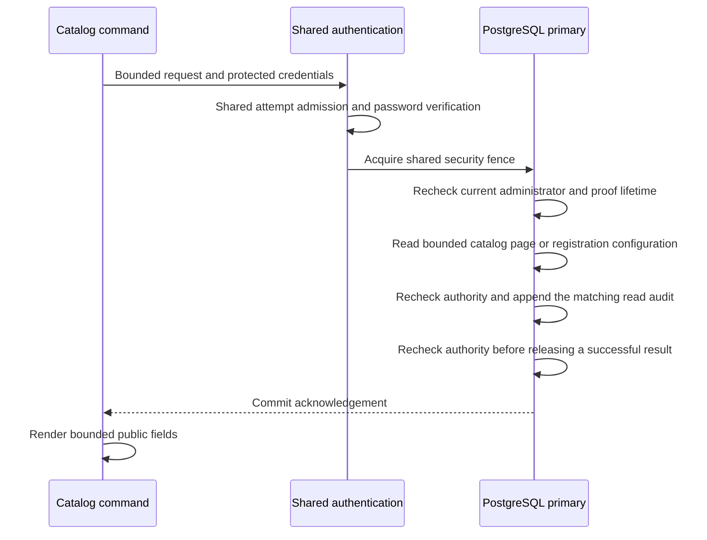

# Authenticated catalog reads

`operator application` and `operator client` support bounded `list` and `show`
reads through the same Rust binary that serves HTTP. They reuse the console's
catalog and registration queries and the account commands' fresh password
verification and shared login admission. A current platform administrator is
required for every invocation. Application ownership is contact metadata and grants no
administrative authority.

This implements catalog inspection in [#26](https://github.com/OneTesseractInMultiverse/darkhorse-identity/issues/26).
[Application create/update](operator-applications.md) supports owner and lifecycle changes
through the same command group and launchers. [Client configuration updates](operator-clients.md)
are also available. [Access-catalog listing](operator-access-catalog.md) adds explicit
resource, scope, role and capability views. Client creation, secret rotation and
access-catalog writes remain separate work. The reads described here never query
client credentials, including their nonsecret lifecycle metadata.

## Invocation and page contract

```sh
darkhorse-server --auth-stdin --output json operator application list --search 'Portal' --status active --limit 25 < /private/path/catalog-input.json
darkhorse-server --auth-stdin --output json operator client list <application-uuid> --limit 25 < /private/path/catalog-input.json
```

Supply a protected JSON object containing `email` and `password`; omit `reason`.
The [account input contract](operator-accounts.md#inputs-and-dependencies) defines
hidden terminal input, the 16 KiB input limit, password handling, configuration and
admission requirements. Without `--auth-stdin`, the foreground terminal collects
the email and hidden password. JSON output requires protected stdin. Reads need no
confirmation. Help and invalid syntax require no configuration or service access.

| Selector                    | Meaning                                                            |
| --------------------------- | ------------------------------------------------------------------ |
| `APPLICATION_ID`            | Required nonzero application UUID for client listing               |
| `--search PREFIX`           | Case-insensitive literal name prefix, up to 100 Unicode characters |
| `--status active\|inactive` | Optional lifecycle filter; omission includes both states           |
| `--after UUID`              | Exclusive continuation boundary from the preceding page            |
| `--limit N`                 | 1–25 items, default 25                                             |

Search rejects surrounding whitespace and control characters. Percent, underscore
and backslash have no wildcard meaning. Use `--search=-prefix` for a prefix that
begins with a hyphen. Search text can appear in process or orchestration metadata;
it must never contain credential material.

Successful JSON has the standard `schema_version`, `ok` and `data` envelope.
`data` contains `operation_id`, `items`, `next` and `policy_revision`. Item fields
are deliberately limited:

| Listing      | Item fields                                                   |
| ------------ | ------------------------------------------------------------- |
| Applications | `id`, `name`, `owner_id`, `owner_email`, `active`, `revision` |
| Clients      | `id`, `application_id`, `name`, `active`, `revision`          |

Both revision fields are decimal strings, preserving the full PostgreSQL integer
range for JSON consumers. A missing application returns a fixed not-found error
only after current administrator authentication. An existing application with no
matching clients returns an empty page. Inactive applications remain inspectable.
Client listing always constrains rows to the requested application.

Pass a non-null `data.next` as `--after` with the same target and filters. There is
no automatic traversal. Ordering is by UUID, with the cursor acting as an exclusive
boundary rather than a reference that must still exist. Pages are independent
live reads; concurrent edits can change their membership. Each invocation consumes
another shared login attempt. This interface is not a consistent bulk export.

## Application and client details

```sh
darkhorse-server --auth-stdin --output json operator application show <application-uuid> < /private/path/catalog-input.json
darkhorse-server --auth-stdin --output json operator client show <application-uuid> <client-uuid> < /private/path/catalog-input.json
```

Both commands require a nonzero application UUID. Client inspection also requires
a nonzero client UUID within that application. Listing selectors are rejected.
The protected input and output envelope are the same as for listing, but `data`
contains `operation_id` and a single `record`:

| Record      | Fields                                                                                                                                                     |
| ----------- | ---------------------------------------------------------------------------------------------------------------------------------------------------------- |
| Application | `kind`, `id`, `name`, `owner_id`, `owner_email`, `active`, `revision`                                                                                      |
| Client      | `kind`, `id`, `application_id`, `name`, `active`, `revision`, `token_endpoint_auth_method`, `refresh_tokens`, `redirect_uris`, `resource_ids`, `scope_ids` |

`kind` is `application` or `client`; `revision` is a decimal string. The client
method is `client_secret_basic`. Callback strings preserve the registered value
exactly. Resource and scope IDs describe the client configuration; they are not a
user's effective permissions. The result contains at most eight callbacks, 32
resource IDs and 128 scope IDs. No credential identifier, verifier, expiration or
secret field is included. The configuration reader does not access the client
secret table, while the HTTP registration reader retains its existing credential
metadata behavior.

Inactive applications and clients remain inspectable. A missing application,
missing client or client outside the requested application returns the same fixed
not-found error after current authority is verified. SQL reads at most one more
callback or allowance than the domain limit. An over-limit stored configuration
fails validation; it never becomes a successful truncated configuration. The
shared reader applies these bounds to HTTP registration reads as well.

## Authority, transaction and audit

The application creates a private proof after password verification. Its 60-second
lifetime includes hashing and waits. The adapter takes the shared primary security
fence and checks the exact credential, credential epoch, active principal,
administrator membership and proof age before and after querying, and again after
inserting a successful read audit. Supported
security writers take the exclusive fence. A read that acquired the fence first
may complete before a waiting revocation; checks beginning after committed
revocation or demotion reject access. No positive decision is cached in Redis.

Application and client detail commands also perform the final authority check for
an authenticated not-found result. Audit work can consume the remaining proof
lifetime. If authority is lost at this final check, the transaction rolls back its
detail audit and returns the fixed authentication/authority denial, without a
record or a target-existence result. The command does not retry. An earlier
authentication denial retains its existing denial-audit path.



Migration `0026` creates the listing ledger, `operator_catalog_audit`. Migration
`0027` adds `operator_catalog_detail_audit` for `application.show` and `client.show`.
The separate ledger preserves the existing listing contract. Apply the migrations
and reapply [the reviewed runtime grants](database-authority.md) with serving
stopped before using these commands. Runtime may append/read both tables, with no
update, delete or truncate privilege. The nonowner deployment-operator role
receives no access. Use the runtime account-command configuration and a valid
administrator password.

Each read, authenticated not-found result or authentication denial records a
correlation ID, command, requested application/client references, verified
actor/credential facts when available, outcome, database time and database role.
Listing additionally records query bounds, status/cursor, a search-present flag
and returned count. Detail audits contain the requested application and, for
client inspection, the requested client. Unknown identifiers remain requested
references without a foreign-key dependency on the target.

Neither ledger contains raw search text, returned catalog names, owner emails,
callback URLs, allowance lists or secret material. Actor IDs and credential IDs
identify the authenticating administrator, not a returned client credential.

Results are released only after exactly one audit row commits. An insert error or
a trigger that suppresses insertion prevents success. Commit acknowledgement loss
returns an unknown outcome with no result and no retry. Inspect the correlation in
the authoritative audit before deciding to repeat the read. Invalid input,
configuration or admission failures happen before catalog access and are not
transactional read-audit records. Database owners remain trusted; these records
are not tamper-proof and runtime-compromise containment remains open in #23.

## Make launchers

For application creation and updates, use the [write selectors and confirmation contract](operator-applications.md#compose-and-kubernetes).
For client configuration updates, use the [complete-input and revision contract](operator-clients.md#compose-and-kubernetes).
The four catalog targets reuse the account launcher's deployment selection,
protected stdin, bounded supervision and one-shot workload lifecycle. The native Rust command validates protected input and performs authentication
and catalog operations.

| Target               | Execution mode                                          | Required deployment selectors                               |
| -------------------- | ------------------------------------------------------- | ----------------------------------------------------------- |
| `stack-catalog-exec` | Existing Compose `api`, UID/GID `10001:10001`           | `STACK`                                                     |
| `stack-catalog-run`  | One-shot Compose `account` service, HTTP may be stopped | `STACK`                                                     |
| `kube-catalog-exec`  | Explicit running Pod and `api` container                | `KUBE_CONFIG`, `KUBE_ACCESS`, `KUBE_CONTEXT`, `ACCOUNT_POD` |
| `kube-catalog-run`   | Standalone account Pod, HTTP may be stopped             | `KUBE_CONFIG`, `KUBE_ACCESS`, `KUBE_CONTEXT`                |

`ACCOUNT_POD` is the shared existing-Pod selector. The one-shot target generates
its own Pod name. Read [container operation](container-accounts.md) for configuration
paths, required manifests, credentials, network policy, deadlines, cleanup and
trusted deployment permissions. The account workload name and resource limits
remain the same for catalog commands.

The following selectors describe read commands. Application mutations use the
separate [write specification](operator-applications.md#compose-and-kubernetes).

| Catalog selector         | Contract                                                                                        |
| ------------------------ | ----------------------------------------------------------------------------------------------- |
| `CATALOG_TARGET`         | Required: `application` or `client`                                                             |
| `CATALOG_OPERATION`      | `list` or `show`; omitted or empty defaults to `list`                                           |
| `CATALOG_APPLICATION_ID` | Required nonzero UUID for client listing and both detail commands; omit for application listing |
| `CATALOG_CLIENT_ID`      | Required nonzero UUID for client `show`; omit otherwise                                         |
| `CATALOG_SEARCH`         | Optional literal prefix, at most 100 Unicode characters                                         |
| `CATALOG_STATUS`         | Optional `active` or `inactive`                                                                 |
| `CATALOG_AFTER`          | Optional nonzero UUID from `data.next`                                                          |
| `CATALOG_LIMIT`          | 1–25; omitted or empty defaults to 25                                                           |

For read commands, `CATALOG_SEARCH`, `CATALOG_STATUS`, `CATALOG_AFTER` and
`CATALOG_LIMIT` apply only to `list`; omit them for `show`, including an explicit default limit.

These selectors contain no credentials. Make preserves their values literally;
search strings are not expanded as Make expressions or shell commands. Quote
values for the invoking shell. Reads reject account-operation selectors, revisions,
confirmations, names and owner selectors. Conflicting settings fail before configuration is read or a remote
process starts. Account launchers likewise reject catalog selectors. Unknown or
unsupported native command groups cannot be passed through these targets.

```sh
make stack-catalog-exec STACK=trial CATALOG_TARGET=application CATALOG_STATUS=active < /private/path/catalog-input.json
make stack-catalog-run STACK=trial CATALOG_TARGET=client CATALOG_OPERATION=show CATALOG_APPLICATION_ID=<application-uuid> CATALOG_CLIENT_ID=<client-uuid> < /private/path/catalog-input.json
make kube-catalog-exec KUBE_CONFIG=/absolute/path/identity.json KUBE_ACCESS=/absolute/path/access.yaml KUBE_CONTEXT=reviewed-context ACCOUNT_POD=<reviewed-pod> CATALOG_TARGET=application CATALOG_OPERATION=show CATALOG_APPLICATION_ID=<application-uuid> < /private/path/catalog-input.json
make kube-catalog-run KUBE_CONFIG=/absolute/path/identity.json KUBE_ACCESS=/absolute/path/access.yaml KUBE_CONTEXT=reviewed-context CATALOG_TARGET=client CATALOG_APPLICATION_ID=<application-uuid> < /private/path/catalog-input.json
```

All four targets require noninteractive protected stdin and produce JSON. No TTY
is allocated. Each read invocation authenticates a current administrator and reads one
page or record; the launcher neither traverses subsequent pages nor retries. Search
arguments remain visible to trusted process and orchestration infrastructure.
Protect output, which can contain owner emails, callbacks and allowance identifiers.
A read commits an audit record, so interruption can
leave an uncertain audit outcome even though catalog state was not changed.

The underlying launcher preserves the CLI exit status. GNU Make returns `2` when
a recipe fails, while retaining the CLI's redacted diagnostic on stderr. Automation
that needs the native exit code may invoke `node scripts/catalog.mjs compose-run`
(or `compose-exec`, `kube-exec`, `kube-run`) with the same environment and protected
stdin. Successful JSON is written only to stdout; workload identity and cleanup
messages use stderr. No target applies migrations or refreshes grants automatically.

## Process and container operation

Authenticated account and catalog commands share protected input and connection
setup. Each process uses at most two PostgreSQL connections (or the smaller
configured limit) and one limiter connection, and opens no cache client. No
transaction is held while collecting terminal input. SQL/lock timeouts and proof
expiry remain enforced. Reserve capacity for concurrent processes; these bounds
do not establish directory-scale throughput or a distributed concurrency limit.

The packaged binary can run inside a configured runtime container:

```sh
docker exec --interactive --user 10001:10001 <reviewed-container> /usr/local/bin/darkhorse-server --auth-stdin --output json operator application list < /private/path/catalog-input.json
kubectl --kubeconfig /absolute/path/access.yaml --context reviewed-context --namespace <reviewed-namespace> exec -i pod/<reviewed-pod> --container api -- /usr/local/bin/darkhorse-server --auth-stdin --output json operator client list <application-uuid> < /private/path/catalog-input.json
```

Select an initialized workload with the runtime database and active limiter
configuration. The CLI starts no HTTP listener and can run in a prepared account
workload while serving processes are stopped. Container/cluster control-plane
access remains a trusted deployment capability and can expose workload secrets.
Protect stdin and output as described in [container account operations](container-accounts.md).
The Make targets above provide the same four deployment paths under #27.

## Evidence and remaining scope

`make test-postgres` exercises shared-query parity, exact callback configuration,
over-limit stored configuration rejection, literal search, pagination,
application isolation, owner-only denial, demotion during a lock wait, proof
expiry, audit refusal/suppression and uncertain commits. `make test-redis` runs
real CLI processes with restricted runtime grants and shared HTTP attempt budgets.
The detail fixture removes SELECT on client secrets and still requires successful
application/client inspection, then removes detail-audit INSERT and requires failure.

Detail fault-injection cases reduce each current-authority fact during audit work
and let a live proof expire inside the audit statement. Existing and missing
targets both return a denial, with the detail audit rolled back. A native process
case verifies the denial and absent record after audit-time credential revocation
using the runtime database role.

`make test-cli` covers service-free help, parsing and redacted configuration failures.
`make test-catalog-launcher` exercises both launcher entrypoints and shared
process supervision, including selector redaction, literal Make values, protected
stdin, exit status, interruption, failed creation, Pod replacement and cleanup
failure. Compose and Kubernetes fixtures exercise application/client listing and
detail commands through all four Make targets, including read-audit provenance
and denial after administrator demotion. One-shot fixtures run with HTTP stopped.

These are correctness and boundary tests. Full provider conformance, privileged
assurance, delegated management permissions, query-plan/capacity qualification,
audit retention/export and the 100% authored-logic coverage target remain open.

Source: [listing policy](../crates/domain/src/operator_catalog.rs),
[CLI adapter](../crates/adapters/src/operator/catalog.rs),
[shared setup](../crates/adapters/src/operator/authenticated.rs),
[listing transaction](../crates/adapters/src/postgres/operator_catalog.rs),
[detail projection](../crates/adapters/src/operator/catalog_details.rs),
[detail transaction](../crates/adapters/src/postgres/operator_catalog_details.rs),
and [shared configuration reader](../crates/adapters/src/postgres/registration/records.rs).

## Client-secret lifecycle commands

[Client-secret inventory and retirement](operator-client-secrets.md) use an explicit
`operator client secret` subgroup and `CATALOG_TARGET=client-secret` in all four
launchers. Inventory selects only bounded lifecycle metadata, including historical
credentials. Retirement requires scoped identifiers, current revision, confirmation
and reason, and shares the HTTP registration transaction rules. Neither ordinary
client list/show nor configuration update acquires secret retrieval behavior.
