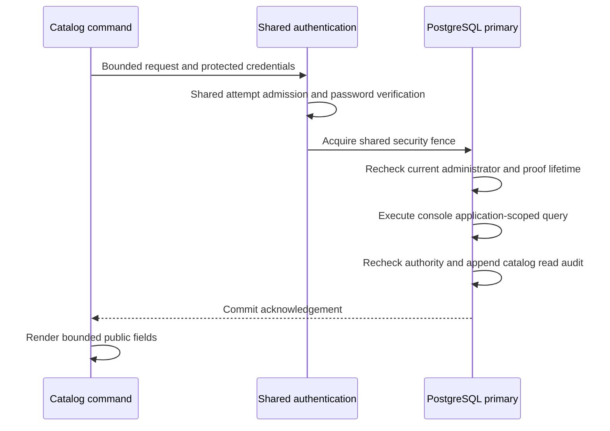

# Authenticated catalog reads

`operator application list` and `operator client list APPLICATION_ID` provide
bounded catalog inspection through the same Rust binary that serves HTTP.
They use the console's catalog query and the account commands' fresh password
verification and shared login admission. A current platform administrator is
required for every page. Application ownership is contact metadata and grants no
administrative authority.

This is the first increment of [#26](https://github.com/OneTesseractInMultiverse/darkhorse-identity/issues/26).
Creation, editing, disabling, secret rotation, detailed client views and access-catalog
writes remain separate work. The commands never retrieve a client secret or verifier.

## Invocation and page contract

```sh
darkhorse-server --auth-stdin --output json operator application list --search 'Portal' --status active --limit 25 < /private/path/catalog-input.json
darkhorse-server --auth-stdin --output json operator client list <application-uuid> --limit 25 < /private/path/catalog-input.json
```

Supply a protected JSON object containing `email` and `password`; omit `reason`.
The [account input contract](operator-accounts.md#inputs-and-dependencies) defines
hidden terminal input, the 16 KiB input limit, password handling, configuration and
admission requirements. Without `--auth-stdin`, the foreground terminal collects
the email and hidden password. JSON output requires protected stdin. Reads need no
confirmation. Help and invalid syntax require no configuration or service access.

| Selector                    | Meaning                                                            |
| --------------------------- | ------------------------------------------------------------------ |
| `APPLICATION_ID`            | Required nonzero application UUID for client listing               |
| `--search PREFIX`           | Case-insensitive literal name prefix, up to 100 Unicode characters |
| `--status active\|inactive` | Optional lifecycle filter; omission includes both states           |
| `--after UUID`              | Exclusive continuation boundary from the preceding page            |
| `--limit N`                 | 1–25 items, default 25                                             |

Search rejects surrounding whitespace and control characters. Percent, underscore
and backslash have no wildcard meaning. Use `--search=-prefix` for a prefix that
begins with a hyphen. Search text can appear in process or orchestration metadata;
it must never contain credential material.

Successful JSON has the standard `schema_version`, `ok` and `data` envelope.
`data` contains `operation_id`, `items`, `next` and `policy_revision`. Item fields
are deliberately limited:

| Listing      | Item fields                                                   |
| ------------ | ------------------------------------------------------------- |
| Applications | `id`, `name`, `owner_id`, `owner_email`, `active`, `revision` |
| Clients      | `id`, `application_id`, `name`, `active`, `revision`          |

Both revision fields are decimal strings, preserving the full PostgreSQL integer
range for JSON consumers. A missing application returns a fixed not-found error
only after current administrator authentication. An existing application with no
matching clients returns an empty page. Inactive applications remain inspectable.
Client listing always constrains rows to the requested application.

Pass a non-null `data.next` as `--after` with the same target and filters. There is
no automatic traversal. Ordering is by UUID, with the cursor acting as an exclusive
boundary rather than a reference that must still exist. Pages are independent
live reads; concurrent edits can change their membership. Each invocation consumes
another shared login attempt. This interface is not a consistent bulk export.

## Authority, transaction and audit

The application creates a private proof after password verification. Its 60-second
lifetime includes hashing and waits. The adapter takes the shared primary security
fence and checks the exact credential, credential epoch, active principal,
administrator membership and proof age before and after querying. Supported
security writers take the exclusive fence. A read that acquired the fence first
may complete before a waiting revocation; checks beginning after committed
revocation or demotion reject access. No positive decision is cached in Redis.



Migration `0026` creates `operator_catalog_audit`. Apply the migration and reapply
[the reviewed runtime grants](database-authority.md) with serving stopped before
using these commands. Runtime may append/read the table, with no update, delete
or truncate privilege. The nonowner deployment-operator role receives no access.
Use the runtime account-command configuration and a valid administrator password.

Each read, authenticated not-found result or authentication denial records a
correlation ID, command, optional requested application, verified actor/credential
facts when available, query bounds, status/cursor, search-present flag, outcome,
returned count, database time and database role. Raw search text, catalog names,
owner emails and secret material are excluded. An unknown application is retained
as a requested reference, without requiring a foreign-key match.

Results are released only after exactly one audit row commits. An insert error or
a trigger that suppresses insertion prevents success. Commit acknowledgement loss
returns an unknown outcome with no page and no retry. Inspect the correlation in
the authoritative audit before deciding to repeat the read. Invalid input,
configuration or admission failures happen before catalog access and are not
transactional read-audit records. Database owners remain trusted; these records
are not tamper-proof and runtime-compromise containment remains open in #23.

## Process and container operation

Authenticated account and catalog commands share protected input and connection
setup. Each process uses at most two PostgreSQL connections (or the smaller
configured limit) and one limiter connection, and opens no cache client. No
transaction is held while collecting terminal input. SQL/lock timeouts and proof
expiry remain enforced. Reserve capacity for concurrent processes; these bounds
do not establish directory-scale throughput or a distributed concurrency limit.

The packaged binary can run inside a configured runtime container:

```sh
docker exec --interactive --user 10001:10001 <reviewed-container> /usr/local/bin/darkhorse-server --auth-stdin --output json operator application list < /private/path/catalog-input.json
kubectl --kubeconfig /absolute/path/access.yaml --context reviewed-context --namespace <reviewed-namespace> exec -i pod/<reviewed-pod> --container api -- /usr/local/bin/darkhorse-server --auth-stdin --output json operator client list <application-uuid> < /private/path/catalog-input.json
```

Select an initialized workload with the runtime database and active limiter
configuration. The CLI starts no HTTP listener and can run in a prepared account
workload while serving processes are stopped. Container/cluster control-plane
access remains a trusted deployment capability and can expose workload secrets.
Protect stdin and output as described in [container account operations](container-accounts.md).
Dedicated catalog launcher targets remain part of the work tracked in #27.

## Evidence and remaining scope

`make test-postgres` exercises shared-query parity, literal search, pagination,
application isolation, owner-only denial, demotion during a lock wait, proof
expiry, audit refusal/suppression and uncertain commits. `make test-redis` runs
real CLI processes with restricted runtime grants and shared HTTP attempt budgets.
`make test-cli` covers service-free help, parsing and redacted configuration failures.
Compose and Kubernetes fixtures exercise the packaged commands with HTTP stopped,
including read-audit provenance and denial after administrator demotion.

These are correctness and boundary tests. Full provider conformance, privileged
assurance, delegated management permissions, query-plan/capacity qualification,
audit retention/export and the 100% authored-logic coverage target remain open.

Source: [request policy](../crates/domain/src/operator_catalog.rs),
[CLI adapter](../crates/adapters/src/operator/catalog.rs),
[shared setup](../crates/adapters/src/operator/authenticated.rs),
[catalog transaction](../crates/adapters/src/postgres/operator_catalog.rs).
