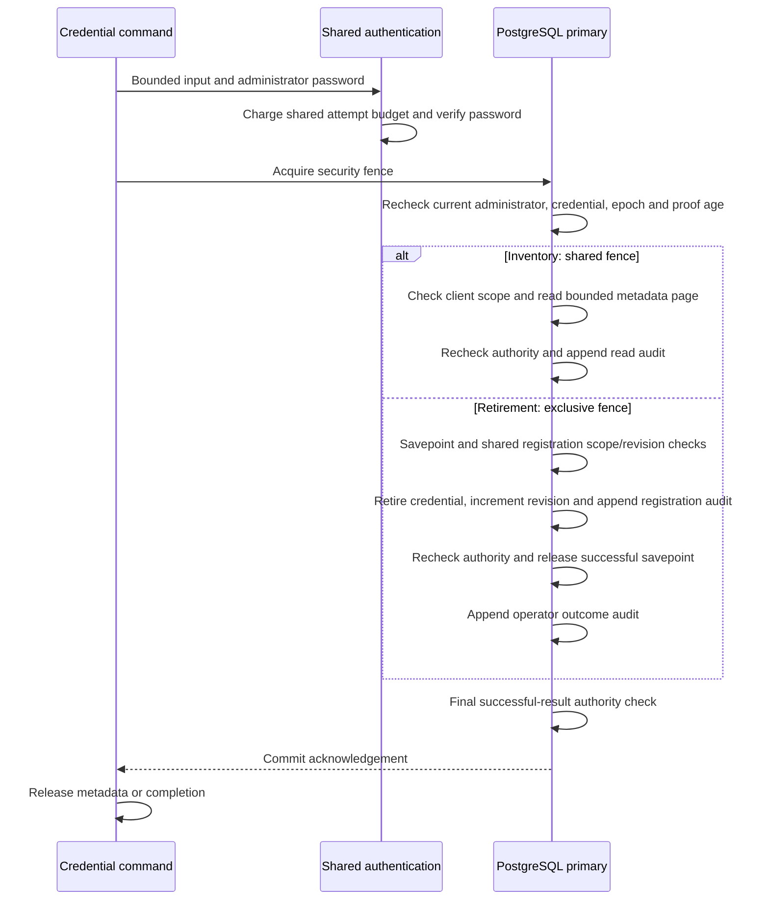

# Client-secret inventory and retirement

The Rust CLI supports bounded credential inventory and explicit retirement for a
confidential client. Both operations require a freshly authenticated platform
administrator. Retirement also requires the current client revision, confirmation
and an audit reason. Application ownership alone grants no administration.

These commands extend [issue #26](https://github.com/OneTesseractInMultiverse/darkhorse-identity/issues/26).
Client creation, secret issuance and rotation, protected one-time delivery and
recovery from delivery failure remain separate work. The existing
[HTTP registration API](registration.md) retains its documented operations.

## Inspect lifecycle metadata

```sh
darkhorse-server --auth-stdin --output json operator client secret list <application-uuid> <client-uuid> --limit 25 < /private/path/authentication.json
```

The protected input contains `email` and `password`. Omit `reason` for inventory.
For human output, omitting `--auth-stdin` uses the existing foreground terminal
and hidden password prompt. JSON output requires protected stdin. Input is bounded
to 16 KiB plus one byte for overflow detection; unknown and duplicate JSON fields
are rejected. Follow the [protected input contract](operator-accounts.md).

The application and client identifiers must be nonzero UUIDs. The database checks
that the client belongs to the application before reading credential metadata.
Inactive applications and clients remain inspectable. A page contains:

| Field                         | Meaning                                                                               |
| ----------------------------- | ------------------------------------------------------------------------------------- |
| `operation_id`                | Correlation identifier for this invocation's audit                                    |
| `application_id`, `client_id` | Requested, verified scope                                                             |
| `revision`                    | Current client revision as a decimal string                                           |
| `observed_ms`                 | Primary database observation time in Unix milliseconds                                |
| `items`                       | At most 25 records, each with `id`, `created_ms`, nullable `expires_ms` and `retired` |
| `next`                        | Last returned UUID when another page exists; otherwise null                           |

The query selects lifecycle metadata only. Secret plaintext and verifiers are
absent from both its SQL projection and output. Inventory includes expired and
retired history. `retired: false` alone does not establish that a credential can
authenticate: creation/expiry time and current client/application status also apply.
The inventory is an observation, not an authorization decision.

Supply `--after <next-uuid>` with the same application/client to continue. Each
invocation authenticates again and observes current primary state. Pages are
ordered by credential UUID, not creation time. The `(client_id, id)` index supports
keyset pagination; SQL requests at most the page limit plus one probe row.
Concurrent credential creation or retirement can change later pages. There is no
snapshot spanning several invocations and no automatic full-history export.

## Retire one credential

Use the inventory's client revision and the reviewed credential identifier:

```sh
darkhorse-server --auth-stdin --output json --yes operator client secret retire <application-uuid> <client-uuid> <secret-uuid> <revision> < /private/path/retirement.json
```

Protected input contains `email`, `password` and `reason`. The reason follows the
[account mutation rules](operator-accounts.md): 1–200 trimmed Unicode characters,
at most 512 UTF-8 bytes, without controls or specified bidirectional formatting
characters. Reasons enter the audit; keep credentials and other sensitive values
out of them. `--yes` confirms intent and provides no authority.

A successful retirement sets the selected credential's terminal retired state and
increments the client revision exactly once. The revision must fit a nonnegative
PostgreSQL bigint; stale or exhausted revisions fail. An already retired or foreign
credential cannot be retired again. Expired, unretired credentials can be retired.
Retiring the final usable credential is permitted and prevents new client
authentication until the existing registration flow supplies a usable replacement.

New authentication checks after commit reject the retired secret. Another valid
credential for the same client remains usable. This operation does not revoke
previously issued access tokens or grants. Use the relevant grant/session controls
when their revocation is required; credential retirement is not a substitute for
incident-wide access revocation.

Successful output contains `completed`, `operation_id`, `application_id`, `client_id`,
`secret_id` and the new decimal-string `revision`. It contains no credential value,
verifier, profile data or configuration. The common [CLI envelope and exit contract](cli.md#output-and-exit-contract)
applies.

## Authority and transaction boundary

Both commands use the shared HTTP/CLI login attempt budget and password verifier.
They create no browser session. PostgreSQL remains authoritative; Redis does not
cache a positive authentication or retirement decision. The process uses the
existing bounded runtime connections and deadlines.



The password proof lasts at most 60 seconds and must match the active principal,
current password credential, credential epoch and administrator membership. Checks
occur after fence waits, after reading or mutating state, and after a successful
result's audit insertion. In-flight work already holding the fence may finish
before a waiting authority reduction.

Retirement shares registration validation and actual credential/revision SQL with
HTTP. Both paths require exactly one credential update and one revision increment.
Suppressed writes, missing audit rows and persistence failures roll back the change.
The CLI's savepoint allows supported denials, missing targets and revision conflicts
to be audited without preserving partial mutation effects. Late authority loss
cannot release inventory or a successful retirement response.

## Audit, migration and reconciliation

Migration `0030` adds `operator_client_secret_audit` and the inventory index.
Stop serving, apply migrations explicitly and refresh the reviewed
[runtime grant policy](database-authority.md) before using these commands. Neither
server startup nor a launcher applies schema changes. The runtime role receives
SELECT/INSERT on the ledger; the nonowner deployment operator receives no access.
Normal runtime token authentication still needs client-secret verifier access.
The CLI's metadata-only projection does not remove that runtime requirement.

Each successful page or retirement requires a committed operator audit. Retirement
also requires the existing registration audit in the same transaction. The new
ledger records operation, scoped target, cursor/page size or retirement reason and
expected revision, verified authentication facts, result, resulting revision or
returned count, time and database role. It excludes passwords, secret values,
verifiers, client names and email addresses. Requested target identifiers lack
foreign keys so a missing-target attempt can still be recorded. Database owners
remain trusted; append-only grants are not tamper-proof storage.

A failed commit acknowledgement returns an unknown outcome and never triggers an
automatic retry. A broken output stream can follow a committed retirement and
returns exit `74`; it may also prevent delivery of the operation ID. Reconcile the
primary audit and current inventory before retrying. Use the operation ID if
received, otherwise the scoped identifiers, actor, expected revision and time.
An absent row does not rule out an in-flight transaction. Admission or infrastructure
failure can precede any audit record. This is manual reconciliation, not a durable
intent/receipt protocol for secret delivery.

## Compose and Kubernetes launchers

All four catalog targets support `CATALOG_TARGET=client-secret`:
`stack-catalog-exec`, `stack-catalog-run`, `kube-catalog-exec` and `kube-catalog-run`.

```sh
make stack-catalog-run STACK=trial CATALOG_TARGET=client-secret CATALOG_APPLICATION_ID=<application-uuid> CATALOG_CLIENT_ID=<client-uuid> CATALOG_LIMIT=25 < /private/path/authentication.json
make kube-catalog-exec KUBE_CONFIG=/absolute/path/identity.json KUBE_ACCESS=/absolute/path/access.yaml KUBE_CONTEXT=reviewed-context ACCOUNT_POD=<reviewed-pod> CATALOG_TARGET=client-secret CATALOG_OPERATION=retire CATALOG_APPLICATION_ID=<application-uuid> CATALOG_CLIENT_ID=<client-uuid> CATALOG_SECRET_ID=<secret-uuid> CATALOG_REVISION=<revision> CATALOG_CONFIRM=yes < /private/path/retirement.json
```

Inventory defaults to `CATALOG_OPERATION=list`; optional selectors are
`CATALOG_AFTER` and `CATALOG_LIMIT` from 1 to 25. Retirement requires operation
`retire`, `CATALOG_SECRET_ID`, `CATALOG_REVISION` and `CATALOG_CONFIRM=yes`.
Both require application and client IDs. Conflicting account, configuration, search
and status selectors are rejected. Inventory rejects retirement selectors;
retirement rejects pagination selectors. Credentials and reason travel through
protected stdin, never arguments or workload specifications.

The [container execution contract](container-accounts.md) defines reviewed targets,
restricted runtime credentials, deadlines, cleanup and uncertain execution.
One-shot commands work with HTTP stopped. GNU Make returns `2` for a failed recipe;
the native binary and documented Node launcher preserve their own exit statuses.
