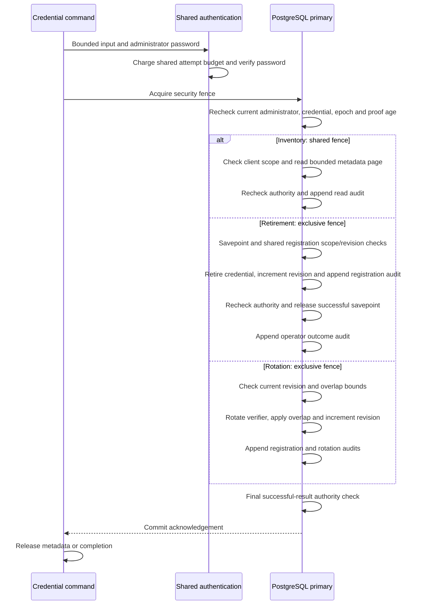

# Client-secret inventory and retirement

The Rust CLI supports bounded credential inventory, explicit retirement and
revision-fenced rotation for a confidential client. These operations require a
freshly authenticated platform administrator. Mutations also require the current
client revision, confirmation and an audit reason. Application ownership alone
grants no administration.

These commands extend [issue #26](https://github.com/OneTesseractInMultiverse/darkhorse-identity/issues/26).
Client creation with explicit one-time stdout delivery is documented in the
[client operator guide](operator-clients.md#create-a-client). Protected-file
delivery and full response-loss recovery remain separate work. The existing
[HTTP registration API](registration.md) retains its documented operations.

## Inspect lifecycle metadata

```sh
darkhorse-server --auth-stdin --output json operator client secret list <application-uuid> <client-uuid> --limit 25 < /private/path/authentication.json
```

The protected input contains `email` and `password`. Omit `reason` for inventory.
For human output, omitting `--auth-stdin` uses the existing foreground terminal
and hidden password prompt. JSON output requires protected stdin. Input is bounded
to 16 KiB plus one byte for overflow detection; unknown and duplicate JSON fields
are rejected. Follow the [protected input contract](operator-accounts.md).

The application and client identifiers must be nonzero UUIDs. The database checks
that the client belongs to the application before reading credential metadata.
Inactive applications and clients remain inspectable. A page contains:

| Field                         | Meaning                                                                               |
| ----------------------------- | ------------------------------------------------------------------------------------- |
| `operation_id`                | Correlation identifier for this invocation's audit                                    |
| `application_id`, `client_id` | Requested, verified scope                                                             |
| `revision`                    | Current client revision as a decimal string                                           |
| `observed_ms`                 | Primary database observation time in Unix milliseconds                                |
| `items`                       | At most 25 records, each with `id`, `created_ms`, nullable `expires_ms` and `retired` |
| `next`                        | Last returned UUID when another page exists; otherwise null                           |

The query selects lifecycle metadata only. Secret plaintext and verifiers are
absent from both its SQL projection and output. Inventory includes expired and
retired history. `retired: false` alone does not establish that a credential can
authenticate: creation/expiry time and current client/application status also apply.
The inventory is an observation, not an authorization decision.

Supply `--after <next-uuid>` with the same application/client to continue. Each
invocation authenticates again and observes current primary state. Pages are
ordered by credential UUID, not creation time. The `(client_id, id)` index supports
keyset pagination; SQL requests at most the page limit plus one probe row.
Concurrent credential creation or retirement can change later pages. There is no
snapshot spanning several invocations and no automatic full-history export.

## Retire one credential

Use the inventory's client revision and the reviewed credential identifier:

```sh
darkhorse-server --auth-stdin --output json --yes operator client secret retire <application-uuid> <client-uuid> <secret-uuid> <revision> < /private/path/retirement.json
```

Protected input contains `email`, `password` and `reason`. The reason follows the
[account mutation rules](operator-accounts.md): 1–200 trimmed Unicode characters,
at most 512 UTF-8 bytes, without controls or specified bidirectional formatting
characters. Reasons enter the audit; keep credentials and other sensitive values
out of them. `--yes` confirms intent and provides no authority.

A successful retirement sets the selected credential's terminal retired state and
increments the client revision exactly once. The revision must fit a nonnegative
PostgreSQL bigint; stale or exhausted revisions fail. An already retired or foreign
credential cannot be retired again. Expired, unretired credentials can be retired.
Retiring the final usable credential is permitted and prevents new client
authentication until the existing registration flow supplies a usable replacement.

New authentication checks after commit reject the retired secret. Another valid
credential for the same client remains usable. This operation does not revoke
previously issued access tokens or grants. Use the relevant grant/session controls
when their revocation is required; credential retirement is not a substitute for
incident-wide access revocation.

Successful output contains `completed`, `operation_id`, `application_id`, `client_id`,
`secret_id` and the new decimal-string `revision`. It contains no credential value,
verifier, profile data or configuration. The common [CLI envelope and exit contract](cli.md#output-and-exit-contract)
applies.

## Authority and transaction boundary

All commands use the shared HTTP/CLI login attempt budget and password verifier.
They create no browser session. PostgreSQL remains authoritative; Redis does not
cache a positive authentication or credential-change decision. The process uses the
existing bounded runtime connections and deadlines.


```mermaid
sequenceDiagram
    participant C as Credential command
    participant A as Shared authentication
    participant P as PostgreSQL primary
    C->>A: Bounded input and administrator password
    A->>A: Charge shared attempt budget and verify password
    C->>P: Acquire security fence
    P->>P: Recheck current administrator, credential, epoch and proof age
    alt Inventory: shared fence
        P->>P: Check client scope and read bounded metadata page
        P->>P: Recheck authority and append read audit
    else Retirement: exclusive fence
        P->>P: Savepoint and shared registration scope/revision checks
        P->>P: Retire credential, increment revision and append registration audit
        P->>P: Recheck authority and release successful savepoint
        P->>P: Append operator outcome audit
    else Rotation: exclusive fence
        P->>P: Check current revision and overlap bounds
        P->>P: Rotate verifier, apply overlap and increment revision
        P->>P: Append registration and rotation audits
    end
    P->>P: Final successful-result authority check
    P-->>C: Commit acknowledgement
    C->>C: Release metadata or completion
```

The password proof lasts at most 60 seconds and must match the active principal,
current password credential, credential epoch and administrator membership. Checks
occur after fence waits, after reading or mutating state, and after a successful
result's audit insertion. In-flight work already holding the fence may finish
before a waiting authority reduction.

Retirement and rotation share registration validation and actual credential/revision
SQL with HTTP. These paths require exactly one credential update and one revision increment.
Suppressed writes, missing audit rows and persistence failures roll back the change.
The CLI's savepoint allows supported denials, missing targets and revision conflicts
to be audited without preserving partial mutation effects. Late authority loss
cannot release inventory or a successful retirement response.

## Audit, migration and reconciliation

Migration `0030` adds `operator_client_secret_audit` and the inventory index;
migration `0040` adds `operator_client_secret_rotation_audit`.
Stop serving, apply migrations explicitly and refresh the reviewed
[runtime grant policy](database-authority.md) before using these commands. Neither
server startup nor a launcher applies schema changes. The runtime role receives
SELECT/INSERT on the ledger; the nonowner deployment operator receives no access.
Normal runtime token authentication still needs client-secret verifier access.
The CLI's metadata-only projection does not remove that runtime requirement.

Each successful page, retirement or rotation requires a committed operator audit.
Both mutations also require the existing registration audit in the same transaction.
The ledgers record operation, scoped target, cursor/page size or mutation reason
and expected revision, verified authentication facts, result, resulting revision,
returned count or new secret ID, time and database role. They exclude passwords,
secret values, verifiers, client names and email addresses. Requested target
identifiers lack foreign keys so a missing-target attempt can still be recorded.
Database owners remain trusted; append-only grants are not tamper-proof storage.

A failed commit acknowledgement returns an unknown outcome and never triggers an
automatic retry. A broken output stream can follow a committed mutation and
returns exit `74`; it may also prevent delivery of the operation ID. Reconcile the
primary audit and current inventory before retrying. Use the operation ID if
received, otherwise the scoped identifiers, actor, expected revision and time.
An absent row does not rule out an in-flight transaction. Admission or infrastructure
failure can precede any audit record. This is manual reconciliation, not a durable
intent/receipt protocol for secret delivery.

## Rotate one credential

Rotation creates a new random 256-bit client secret, stores only the existing
purpose-separated verifier, increments the client revision once and applies an
explicit overlap to the previously current secret. Use the revision from a fresh
inventory or client detail read:

```sh
darkhorse-server --auth-stdin --output json --yes operator client secret rotate <application-uuid> <client-uuid> <revision> --overlap-seconds 60 --secret-stdout < /private/path/rotation.json
```

Protected input contains `email`, `password` and `reason`. Rotation requires
`--auth-stdin`, `--output json`, `--yes`, an explicit `--overlap-seconds` from 0
through 300, and `--secret-stdout`. The last flag is a deliberate opt-in to write
the newly generated secret to stdout once. The secret is present only in the
successful JSON response as `data.client_secret`; ordinary rendering, errors,
audits, list/show responses and diagnostic output never include it. The secret
uses the operating system random source and is zeroized in process-owned buffers
after output handling. Protect stdout from terminal recording, shell capture and
automation logs just as you protect the input file.

The prior current secret remains valid until its stored `expires_ms` when overlap
is nonzero. An overlap of zero ends its validity at the rotation transaction's
database time. Any older secret already in an overlap period is retired as the
new rotation takes effect. The bound prevents an operator from accidentally
leaving old credentials valid indefinitely. This changes client authentication;
it does not revoke already issued access tokens or refresh-token families.

Successful output contains the scoped application/client IDs, operation ID,
new secret ID, new revision and overlap in addition to the one-time secret. A
stale revision, foreign client, denied administrator or failed audit cannot
change credentials or release secret material. The rotation and registration
audits commit with the credential update. Migration `0040` adds a separate
append-only outcome ledger and runtime SELECT/INSERT grants.

If stdout breaks after commit, the CLI reports `secret_delivery_failed` with
`committed: true` and the returned secret ID/revision, but the secret itself
cannot be recovered. Inspect the rotation audit and current client state. Do not
repeat the same stale revision: choose a deliberate follow-up rotation after
reconciling which credential can still authenticate. A lost commit acknowledgement
is also uncertain and never retries automatically. Migration `0040` and reviewed
runtime grants must be applied with serving stopped before deployment.

## Compose and Kubernetes launchers

All four catalog targets support `CATALOG_TARGET=client-secret`:
`stack-catalog-exec`, `stack-catalog-run`, `kube-catalog-exec` and `kube-catalog-run`.

```sh
make stack-catalog-run STACK=trial CATALOG_TARGET=client-secret CATALOG_APPLICATION_ID=<application-uuid> CATALOG_CLIENT_ID=<client-uuid> CATALOG_LIMIT=25 < /private/path/authentication.json
make stack-catalog-run STACK=trial CATALOG_TARGET=client-secret CATALOG_OPERATION=rotate CATALOG_APPLICATION_ID=<application-uuid> CATALOG_CLIENT_ID=<client-uuid> CATALOG_REVISION=<revision> CATALOG_OVERLAP_SECONDS=60 CATALOG_CONFIRM=yes CATALOG_SECRET_STDOUT=yes < /private/path/rotation.json
make kube-catalog-exec KUBE_CONFIG=/absolute/path/identity.json KUBE_ACCESS=/absolute/path/access.yaml KUBE_CONTEXT=reviewed-context ACCOUNT_POD=<reviewed-pod> CATALOG_TARGET=client-secret CATALOG_OPERATION=retire CATALOG_APPLICATION_ID=<application-uuid> CATALOG_CLIENT_ID=<client-uuid> CATALOG_SECRET_ID=<secret-uuid> CATALOG_REVISION=<revision> CATALOG_CONFIRM=yes < /private/path/retirement.json
```

Inventory defaults to `CATALOG_OPERATION=list`; optional selectors are
`CATALOG_AFTER` and `CATALOG_LIMIT` from 1 to 25. Retirement requires operation
`retire`, `CATALOG_SECRET_ID`, `CATALOG_REVISION` and `CATALOG_CONFIRM=yes`.
Both require application and client IDs. Conflicting account, configuration, search
and status selectors are rejected. Inventory rejects retirement selectors;
retirement and rotation reject pagination selectors. Rotation also requires
`CATALOG_OVERLAP_SECONDS` from 0 through 300, `CATALOG_CONFIRM=yes`, and
`CATALOG_SECRET_STDOUT=yes`; the result is one-time JSON on stdout. Credentials
and reason travel through protected stdin, never arguments or workload
specifications. Use this only where stdout is protected from capture. Kubernetes
launcher acceptance is covered by selector/process contract tests; full cluster
qualification for rotation remains outstanding.

The [container execution contract](container-accounts.md) defines reviewed targets,
restricted runtime credentials, deadlines, cleanup and uncertain execution.
One-shot commands work with HTTP stopped. GNU Make returns `2` for a failed recipe;
the native binary and documented Node launcher preserve their own exit statuses.
