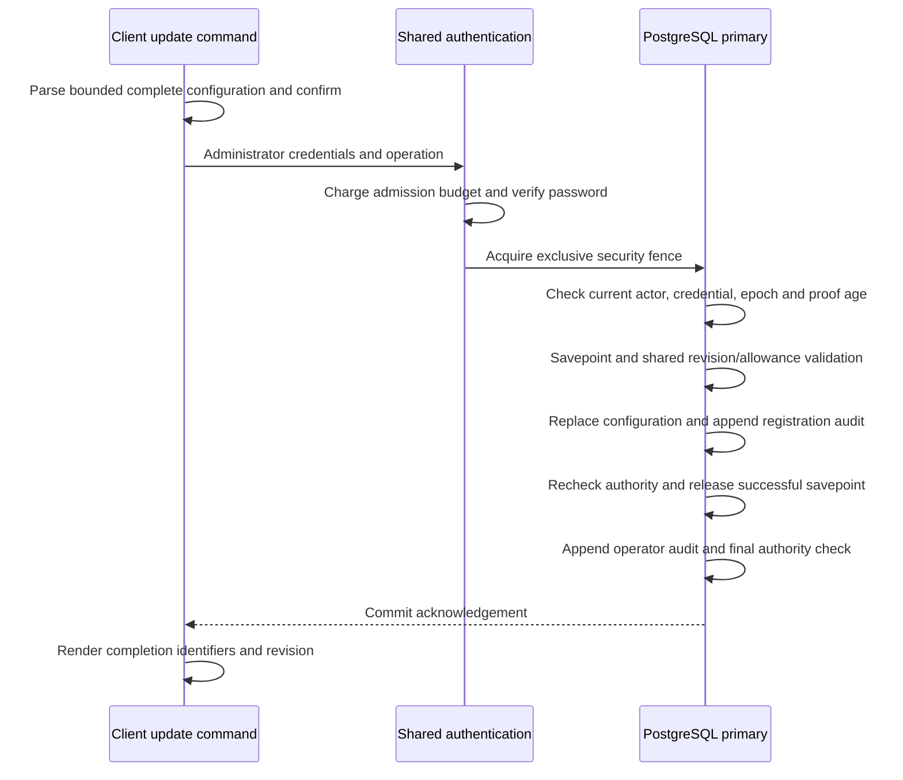

# Authenticated client configuration updates

The Rust CLI can replace a confidential client's configuration through the same
registration policy and SQL writes used by the HTTP management API. Each command
requires a current platform administrator's password, a reviewed replacement,
an expected revision, confirmation and an audit reason. Application ownership
alone grants no authority.

This is a focused increment of
[#26](https://github.com/OneTesseractInMultiverse/darkhorse-identity/issues/26).
Client creation, secret issuance/rotation and recovery of secret delivery remain
separate work. [Secret inventory and retirement](operator-client-secrets.md) are
available through distinct commands. This command neither reads client secrets nor changes their verifiers.

## Invocation and complete input

First inspect the target with [client show](operator-catalog.md). Then prepare a
protected JSON document through your secret-management workflow and invoke:

```sh
darkhorse-server --auth-stdin --output json --yes operator client update <application-uuid> <client-uuid> <expected-revision> < /private/path/client-input.json
```

`--auth-stdin` is required in both human and JSON output modes. There is no
interactive configuration editor. Both identifiers must be nonzero UUIDs; the
revision is a nonnegative decimal integer within PostgreSQL's signed bigint range.
A stale or exhausted revision rejects the update. Every successful replacement
increments the revision once, including a replacement with identical values.

The document has exactly two top-level objects:

```json
{
  "authentication": {
    "email": "administrator@example.com",
    "password": "replace-through-your-protected-input-workflow",
    "reason": "Apply reviewed callback and access configuration"
  },
  "client": {
    "name": "Employee portal",
    "active": true,
    "refresh_tokens": false,
    "redirect_uris": ["https://portal.example.com/callback"],
    "resource_ids": [],
    "scope_ids": [],
    "token_endpoint_auth_method": "client_secret_basic"
  }
}
```

The example is illustrative; do not use its password or commit actual input files.
The CLI reads at most 32 KiB plus one overflow-detection byte. Its input buffer and
parsed password are zeroized on release. Invalid JSON, unknown or duplicate fields,
missing fields, and null booleans fail before connecting to services. In particular,
`refresh_tokens` must be explicit. The HTTP API retains its existing omitted-field
default of `false`; it shares the same client parsing and validation.

| Field                        | Contract                                                                                                               |
| ---------------------------- | ---------------------------------------------------------------------------------------------------------------------- |
| `name`                       | Existing registration label, trimmed, 1–100 Unicode characters, no controls                                            |
| `active`                     | Explicit boolean                                                                                                       |
| `refresh_tokens`             | Explicit boolean; enables the existing refresh policy                                                                  |
| `redirect_uris`              | 1–8 distinct exact callback URLs, each at most 2,048 bytes, satisfying the [registration URL profile](registration.md) |
| `resource_ids`               | At most 32 distinct nonzero resource UUIDs belonging to the target application                                         |
| `scope_ids`                  | At most 128 distinct nonzero scope UUIDs, belonging to selected resources in the target application                    |
| `token_endpoint_auth_method` | Exactly `client_secret_basic`                                                                                          |

An empty resource/scope array removes that allowance. Callbacks, names, allowance
lists and refresh settings are a full replacement, not a patch. The total 32 KiB
document bound still applies when several fields approach their individual limits.
Callback values preserve exact query encoding; wildcards and URL normalization
that changes the registered value are not permitted.

The reason uses the [account mutation rules](operator-accounts.md): 1–200 trimmed
Unicode characters, at most 512 UTF-8 bytes, with controls and specified
bidirectional formatting characters rejected. Reasons are retained in the audit;
keep passwords, callback query secrets and other sensitive data out of them.

## Authority, transaction and immediate reductions

The command uses the shared login attempt budget and password verifier. It creates
no browser session. Its PostgreSQL adapter and the application-write adapter share
one transaction coordinator, with an exclusive primary security fence, a savepoint
for mutation work and mandatory audit persistence.



The proof is valid for at most 60 seconds and must still match the active principal,
current password credential, credential epoch and platform-administrator membership.
Checks occur after fence acquisition and around the mutation/audit boundary.
Suppressed parent updates, incomplete binding deletion/insertion, missing audit
rows and persistence failures roll back the replacement. The HTTP path uses the
same binding-write checks. Supported unsuccessful mutations roll back to the
savepoint before their denial, validation, missing-target or conflict outcome is
recorded. A late authority failure cannot produce a successful response.

Client deactivation and reduced resource/scope allowances affect checks that begin
after commit. These checks read primary authority; Redis does not cache a positive
authorization decision. Work already holding the security fence may finish before
a waiting reduction. Reactivation follows the existing registration lifecycle and
does not constitute permanent token or credential revocation.

## Output, audit and uncertain outcomes

Success contains only `completed`, `operation_id`, `application_id`, `client_id`
and a decimal-string `revision`, inside the [CLI envelope](cli.md#output-and-exit-contract).
Configuration values, email, password, reason and secret metadata are absent.
Use a separately authenticated `show` to inspect the current configuration.

Migration `0029` adds the append-only `operator_client_audit` ledger. With serving
stopped, apply migrations and reapply the [runtime grants](database-authority.md).
The runtime role receives SELECT/INSERT; the nonowner deployment-operator role
receives no access. Use runtime workload credentials for authenticated catalog
commands. Existing application/read audit tables retain their contracts.

The ledger records the operation, scoped target, expected and successful revision,
reason, verified actor/credential/epoch and observation time when available,
outcome, database time and database role. Requested target IDs have no foreign
keys that would prevent auditing an unknown target. Successful revisions must be
exactly one greater than the expected revision. The ledger excludes configuration
values and authentication secrets. Database owners remain trusted; see the
[runtime-compromise limits](operator-authority.md).

A failed commit acknowledgement reports an unknown outcome and never retries.
Output failure can follow a committed update and returns exit `74`; it may also
prevent delivery of the operation ID. Reconcile the primary audit and current
configuration before deciding to repeat. Use the received operation ID when
available, otherwise the scoped target, actor, expected revision and time. An
absent audit row does not rule out an in-flight transaction. Admission or
infrastructure failures may occur before any outcome is recorded.

## Compose and Kubernetes

All four [catalog launchers](operator-catalog.md#make-launchers) support the same
complete replacement through stdin:

```sh
make stack-catalog-run STACK=trial CATALOG_TARGET=client CATALOG_OPERATION=update CATALOG_APPLICATION_ID=<application-uuid> CATALOG_CLIENT_ID=<client-uuid> CATALOG_REVISION=<revision> CATALOG_CONFIRM=yes < /private/path/client-input.json
make kube-catalog-exec KUBE_CONFIG=/absolute/path/identity.json KUBE_ACCESS=/absolute/path/access.yaml KUBE_CONTEXT=reviewed-context ACCOUNT_POD=<reviewed-pod> CATALOG_TARGET=client CATALOG_OPERATION=update CATALOG_APPLICATION_ID=<application-uuid> CATALOG_CLIENT_ID=<client-uuid> CATALOG_REVISION=<revision> CATALOG_CONFIRM=yes < /private/path/client-input.json
```

The required selectors are target `client`, operation `update`, both IDs, current
revision and confirmation `yes`. Omit name, owner, status, search, cursor, page-size
and account selectors. Configuration and authentication belong in stdin, never
arguments, environment values or workload specifications.

The existing [container execution contract](container-accounts.md) applies:
bounded connections, deadlines, conditional cleanup and no automatic retry.
One-shot paths work with HTTP stopped. Launchers do not migrate the database or
refresh grants. GNU Make returns `2` for a failed recipe; the native binary and
documented Node launcher preserve their own exit statuses.
