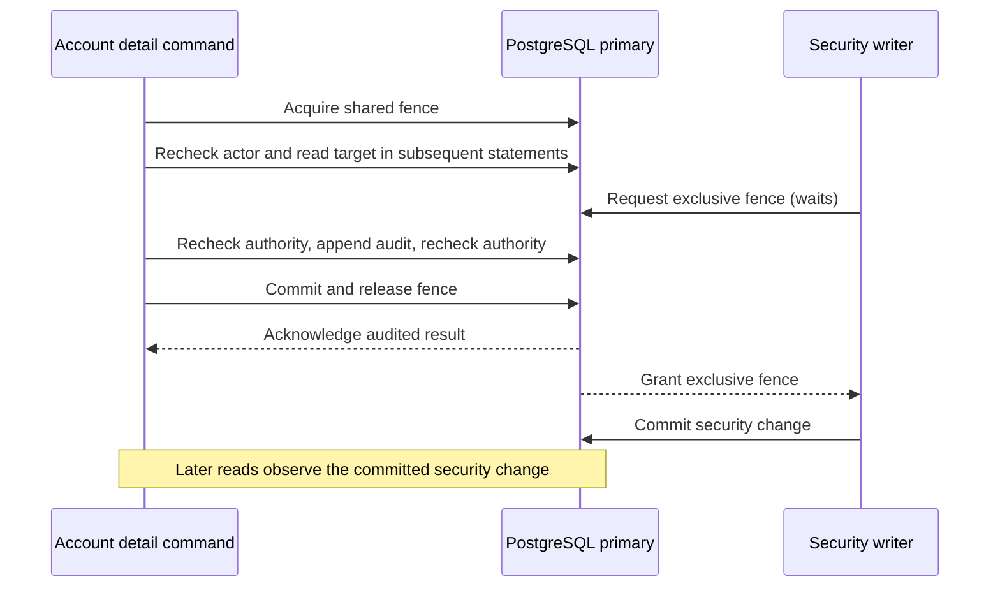

# Administrative detail reads and contention

Account detail reads use a shared primary security fence. They read the account
in a separate statement after acquiring that fence, without a target `FOR UPDATE`
lock. Account mutations retain the exclusive fence and target update lock.
The password proof, current-authority checks before and after audit, required
audit commit, timeout behavior and uncertain-outcome handling are unchanged.
No query is removed from the authority checks and no authorization result is cached.



The separate post-lock statement matters under PostgreSQL's default Read Committed
isolation: a statement starts with its own snapshot. A writer can commit while a
reader waits for its fence. Loading policy in the lock-acquisition statement would
not preserve the same snapshot contract. See PostgreSQL's
[locking](https://www.postgresql.org/docs/18/explicit-locking.html) and
[isolation](https://www.postgresql.org/docs/18/transaction-iso.html) references.

## Reproduce the bounded workload

```sh
make benchmark-operator-details          # four clients, three-second phases
make benchmark-operator-details-baseline # eight clients, ten-second phases
```

Both use the existing disposable HTTPS/Redis/PostgreSQL benchmark runner, a release
Rust binary and source-defined workload. Fixture setup and observation use the
disposable database owner. Before serving begins, the runner creates a separate
runtime login and applies `deploy/grant-runtime.sql`. The HTTP server and every
measured native command then use `darkhorse_runtime`. Successful CLI audits must
record that role; a role mismatch fails the run. No production URL or settings
file is accepted by this workload.

Two independent administrators each make four freshly authenticated commands:
`account show`, `application show`, `account show`, and `client show`. They inspect
the same fixture principal/application/client, exercising concurrent account reads.
Four attempts per actor fit the unchanged shared login budget. The commands use
Argon2id with 65,536 KiB, three iterations and one lane; the fixture copies the
normally generated verifier without changing its parameters. Every command retains
its normal authority checks and audit. Credentials travel through protected stdin
and are excluded from reports.

The detail fixture adds 1,000 principals without credentials or assignments, and
64 unassigned roles bound to the first application, each granting its two existing
capabilities. This increases stored population without changing the measured
principal's grants. It does not represent a large effective permission set.

HTTP introspection is scheduled at 200 arrivals/second, with control phases before
and after the CLI burst. The final paced phase performs authenticated revoke-all
halfway through and rejects any active response for a check dispatched after its
acknowledgement. Another 64 explicit checks must all deny access. The runner verifies
eight read audits and one committed revocation audit. Existing concurrency, lateness,
process deadline, output, connection and cleanup limits remain in force; see
[the full benchmark contract](performance.md#native-cli-interference).

## September 26, 2026 comparison

The hypothesis was that exclusive account reads cause avoidable short stalls for
other readers. The acceptance condition was repeatable improvement in the overlap
p95 beyond the observed baseline range, without adverse account-command latency,
errors, freshness failures or a worse driver-drop pattern. Unknown production
latency and capacity objectives remain unset.

Two exclusive-fence runs preceded two shared-fence runs, with fresh disposable
services each time. All used the same workload and protection settings on an Apple
M5 host with 10 logical CPUs and 24 GiB RAM. Docker 29.6.2 had 10 CPUs and
8,321,515,520 bytes of memory. The runtime used Rust 1.97.1, Node 24.19.0, Percona
PostgreSQL 18.6.1 and Redis 8.10.1. The HTTP pool limit was five; each of two CLI
processes allowed at most two database connections and one limiter connection.

| Variant / run | Whole burst HTTP p95 / p99 | HTTP overlapping CLI p95 / p99 | Account command p95 |
| ------------- | -------------------------- | ------------------------------ | ------------------- |
| Exclusive 1   | 6.80 / 10.59 ms            | 13.37 / 19.96 ms               | 127.08 ms           |
| Exclusive 2   | 6.55 / 10.38 ms            | 10.79 / 15.70 ms               | 128.49 ms           |
| Shared 1      | 6.72 / 10.52 ms            | 8.31 / 9.42 ms                 | 117.11 ms           |
| Shared 2      | 6.30 / 10.00 ms            | 8.65 / 10.75 ms                | 110.05 ms           |

Latencies are measured from scheduled HTTP arrival or scheduled CLI invocation. Each burst
authorized all 2,000 scheduled requests, with zero generator drops or server errors.
The HTTP overlap sample includes all command types; it does not isolate the database
lock wait itself. There are only four account commands per run, so their nearest-rank
p95 is the largest sample. One arrival was dropped as late in the first baseline's
control-before phase; the other phases had no drops. No run observed an authority
mismatch, and all audited read and post-commit revocation checks passed.

The reduction in overlap latency and the deterministic lock regression support this
narrow change for the measured fixture. Whole-phase latency changed little. This
does not establish production capacity or statistical confidence. The sequential
order, small command samples and variable control tails leave host drift and
hashing/scheduling contributions unresolved. Broader qualification remains in
[issue #32](https://github.com/OneTesseractInMultiverse/darkhorse-identity/issues/32).

A separate three-second `operator-smoke` compatibility run used the historical
listing workload and owner role. Its burst recorded 533 authorized and 61 unavailable
responses from 594 dispatched requests, plus six late generator drops out of 600
scheduled arrivals. The first unavailable response preceded the final CLI pair.
All eight read audits and the revocation checks passed, but the availability spike
remains unexplained. It is retained in the evidence as follow-up work under #32;
the runner's `passed` status verifies its correctness assertions, not an availability
SLO. This run is not a matched alternative to the detail workload and must not be
discarded or presented as another clean performance sample.

[Machine-readable evidence](measurements/operator-details-2026-09-26.json) retains
all phase outcomes, drops, selected percentiles, command samples, resource snapshots,
tool/topology/protection metadata and source/binary hashes. Measurements used working
trees based on `cbb1f036a586541865d4a31d806764eab24a281d`, not clean committed revisions;
the hashes distinguish the actual variants. Raw reports and request traces remain
in the ignored `.local/benchmarks/` directories; the published evidence includes
their digests and omits audit identifiers and credential/profile data.

## Security checks and remaining measurements

Real PostgreSQL regressions verify that account reads can share a fence, avoid an
unnecessary target update lock, exclude security writers while waiting at audit,
and read the writer's committed state after a fence wait. The existing authority
matrix covers demotion, credential/epoch changes, expiry, state-dependent errors,
audit failure and uncertain commit/output outcomes. Native process tests exercise
the published runtime grants and shared login admission.

The fixture's process/container snapshots are coarse. They include setup and
observer work and do not measure peak hashing memory, continuous CPU, exact WAL,
pool/fence/target wait or hold times, audit cost, SQL wire round trips or query plans.
Sustained administration, missing/denied CLI timing mixtures, cold storage, varied
effective policy sizes, cache alternatives and Compose/Kubernetes replica scheduling
still need measurement. No connection limit, rate limit or security control was
relaxed to obtain these results.
