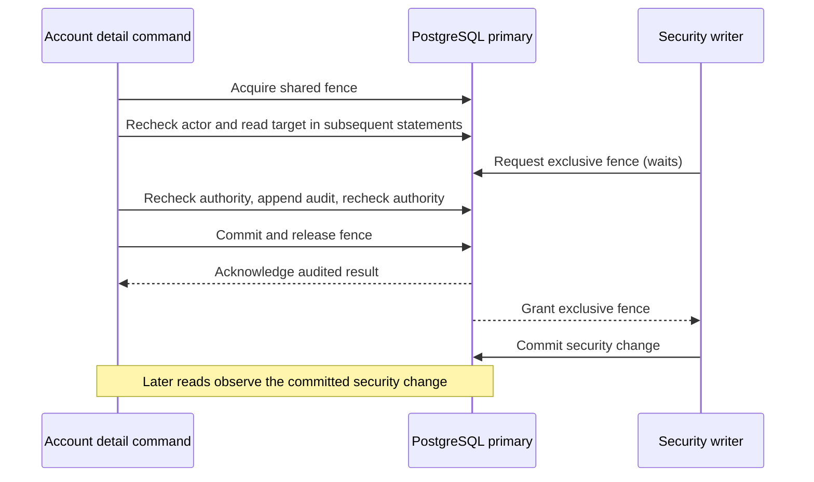

# Administrative detail reads and contention

Account detail reads use a shared primary security fence. They read the account
in a separate statement after acquiring that fence, without a target `FOR UPDATE`
lock. Account mutations retain the exclusive fence and target update lock.
The password proof, current-authority checks before and after audit, required
audit commit, timeout behavior and uncertain-outcome handling are unchanged.
No query is removed from the authority checks and no authorization result is cached.


```mermaid
sequenceDiagram
    participant C as Account detail command
    participant P as PostgreSQL primary
    participant W as Security writer
    C->>P: Acquire shared fence
    C->>P: Recheck actor and read target in subsequent statements
    W->>P: Request exclusive fence (waits)
    C->>P: Recheck authority, append audit, recheck authority
    C->>P: Commit and release fence
    P-->>C: Acknowledge audited result
    P-->>W: Grant exclusive fence
    W->>P: Commit security change
    Note over C,P: Later reads observe the committed security change
```

The separate post-lock statement matters under PostgreSQL's default Read Committed
isolation: a statement starts with its own snapshot. A writer can commit while a
reader waits for its fence. Loading policy in the lock-acquisition statement would
not preserve the same snapshot contract. See PostgreSQL's
[locking](https://www.postgresql.org/docs/18/explicit-locking.html) and
[isolation](https://www.postgresql.org/docs/18/transaction-iso.html) references.

## Reproduce the bounded workload

```sh
make benchmark-operator-details          # four clients, three-second phases
make benchmark-operator-details-baseline # eight clients, ten-second phases
```

Both use the existing disposable HTTPS/Redis/PostgreSQL benchmark runner, a release
Rust binary and source-defined workload. Fixture setup and observation use the
disposable database owner. Before serving begins, the runner creates a separate
runtime login and applies `deploy/grant-runtime.sql`. The HTTP server and every
measured native command then use `darkhorse_runtime`. Successful CLI audits must
record that role; a role mismatch fails the run. No production URL or settings
file is accepted by this workload.

The detail profile uses two separate authenticated processes and four commands
per actor, preserving the shared login budget. One current administrator performs
`account show`, `application show`, `account show` for a generated missing ID, and
`client show`. The second actor is an active, password-authenticated non-admin and
receives expected denials for account/application/client detail reads. The fixture
verifies every operation ID against its exact committed audit result (`read`,
`not_found`, or `denied`) and reports only aggregate outcome counts. The missing
identifier is generated and checked absent in the disposable primary before the
measurement. Password hashing remains Argon2id with 65,536 KiB, three iterations
and one lane; fixture credentials copy the normally generated verifier without
changing its parameters. Credentials travel through protected stdin and are
excluded from reports.

The detail fixture adds 1,000 principals without credentials or assignments, and
64 unassigned roles bound to the first application, each granting its two existing
capabilities. This increases stored population without changing the measured
principal's grants. It does not represent a large effective permission set.

HTTP introspection is scheduled at 200 arrivals/second, with control phases before
and after the CLI burst. The final paced phase performs authenticated revoke-all
halfway through and rejects any active response for a check dispatched after its
acknowledgement. Another 64 explicit probes must fail closed: no authorized or
stale result, no generator drops, and each response must be either `denied` or
`unavailable`. Unavailable responses stay visible and are not counted as successful
denials. The runner verifies three successful reads, one `not_found`, four denied
reads and one committed revocation audit. Existing concurrency, lateness, process
deadline, output, connection and cleanup limits remain in force; see
[the full benchmark contract](performance.md#native-cli-interference).

## September 26, 2026 comparison

These historical runs used the earlier all-administrator, successful-detail
command mix. Keep them as evidence for the shared-fence change; they are not a
matched before/after comparison against the newer missing/denied workload below.

The hypothesis was that exclusive account reads cause avoidable short stalls for
other readers. The acceptance condition was repeatable improvement in the overlap
p95 beyond the observed baseline range, without adverse account-command latency,
errors, freshness failures or a worse driver-drop pattern. Unknown production
latency and capacity objectives remain unset.

Two exclusive-fence runs preceded two shared-fence runs, with fresh disposable
services each time. All used the same workload and protection settings on an Apple
M5 host with 10 logical CPUs and 24 GiB RAM. Docker 29.6.2 had 10 CPUs and
8,321,515,520 bytes of memory. The runtime used Rust 1.97.1, Node 24.19.0, Percona
PostgreSQL 18.6.1 and Redis 8.10.1. The HTTP pool limit was five; each of two CLI
processes allowed at most two database connections and one limiter connection.

| Variant / run | Whole burst HTTP p95 / p99 | HTTP overlapping CLI p95 / p99 | Account command p95 |
| ------------- | -------------------------- | ------------------------------ | ------------------- |
| Exclusive 1   | 6.80 / 10.59 ms            | 13.37 / 19.96 ms               | 127.08 ms           |
| Exclusive 2   | 6.55 / 10.38 ms            | 10.79 / 15.70 ms               | 128.49 ms           |
| Shared 1      | 6.72 / 10.52 ms            | 8.31 / 9.42 ms                 | 117.11 ms           |
| Shared 2      | 6.30 / 10.00 ms            | 8.65 / 10.75 ms                | 110.05 ms           |

Latencies are measured from scheduled HTTP arrival or scheduled CLI invocation. Each burst
authorized all 2,000 scheduled requests, with zero generator drops or server errors.
The HTTP overlap sample includes all command types; it does not isolate the database
lock wait itself. There are only four account commands per run, so their nearest-rank
p95 is the largest sample. One arrival was dropped as late in the first baseline's
control-before phase; the other phases had no drops. No run observed an authority
mismatch, and all audited read and post-commit revocation checks passed.

The reduction in overlap latency and the deterministic lock regression support this
narrow change for the measured fixture. Whole-phase latency changed little. This
does not establish production capacity or statistical confidence. The sequential
order, small command samples and variable control tails leave host drift and
hashing/scheduling contributions unresolved. Broader qualification remains in
[issue #32](https://github.com/OneTesseractInMultiverse/darkhorse-identity/issues/32).

## September 28, 2026 Compose introspection stage profile

The earlier packaged Compose baseline offered 200 verified HTTPS introspections
per second for ten seconds in each of three phases. Its first two phases returned
2,000 HTTP 200 responses each; the final control phase returned 1,993 HTTP 200
and seven HTTP 503 responses. There were no dropped arrivals, transport errors,
or authorization mismatches. The 503s remain an availability failure, not a
successful denial.

To localize later runs, `make benchmark-compose-operator-details-profile` builds
a separate image with the existing compile-time-only `benchmark-profiling`
feature. It sends a private Unix signal between phases and retains only fixed
PostgreSQL stage histograms. The ordinary Docker build leaves profiling disabled;
the target removes its temporary image tag and Compose project, including named
volumes, after the run. Its bounded, identifier-free report remains under the
ignored `.local/benchmarks/` directory. The normal comparison command is
`make benchmark-compose-operator-details-baseline`.

The instrumented run kept the offered rate at 200 per second and measured three
eight-second phases. This schedules 4,800 requests, below the client's 6,000
requests-per-minute fixed-window allowance; the former ten-second phases alone
scheduled 6,000, before setup calls. Each measured phase returned 1,600 HTTP 200
responses. Scheduled p95 was 4.77 ms before the CLI reads, 6.86 ms during them,
and 4.87 ms afterwards. The profiler recorded exactly 1,600 successful samples
for each client-token introspection stage in each phase, with zero stage errors.
It covers PostgreSQL pool acquisition, transaction start, security fence, client
authentication, token inspection, commit, and their total duration. Thirty-four
serial database observations sampled at most nine runtime connections and no
waiting locks; these are samples, not continuous peaks.

This is diagnostic evidence, not a matched latency comparison: instrumentation
adds work and the profiled run is shorter. Its clean PostgreSQL stage profile does
not explain the seven HTTP 503s in the separate unprofiled ten-second run. Redis
admission and request stages before PostgreSQL are not included in these histograms.
No service pool, limiter, cache, or security setting was changed. Keep #32 open;
do not increase the connection pool based on these samples. The
[machine-readable results](measurements/operator-details-compose-profile-2026-09-28.json)
retain source and image fingerprints, exact HTTP status counts, scheduled latency,
stage outcomes, limits, and the measurement caveats.

A separate three-second `operator-smoke` compatibility run used the historical
listing workload and owner role. Its burst recorded 533 authorized and 61 unavailable
responses from 594 dispatched requests, plus six late generator drops out of 600
scheduled arrivals. The first unavailable response preceded the final CLI pair.
All eight read audits and the revocation checks passed, but the availability spike
remains unexplained. It is retained in the evidence as follow-up work under #32;
the runner's `passed` status verifies its correctness assertions, not an availability
SLO. This run is not a matched alternative to the detail workload and must not be
discarded or presented as another clean performance sample.

[Machine-readable evidence](measurements/operator-details-2026-09-26.json) retains
all phase outcomes, drops, selected percentiles, command samples, resource snapshots,
tool/topology/protection metadata and source/binary hashes. Measurements used working
trees based on `cbb1f036a586541865d4a31d806764eab24a281d`, not clean committed revisions;
the hashes distinguish the actual variants. Raw reports and request traces remain
in the ignored `.local/benchmarks/` directories; the published evidence includes
their digests and omits audit identifiers and credential/profile data.

## September 27, 2026 clean-source mixed-outcome baseline

`make benchmark-operator-details-baseline` ran on clean commit
`91800cb04d19a210aa069c6c5edd3c5209f999a2`, using the restricted
`darkhorse_runtime` database role and the pinned local Percona PostgreSQL and Redis
images. The profile offered 200 HTTPS introspection arrivals per second for each
10-second phase, used eight clients, and overlapped two authenticated CLI processes
with four reads each. The fixture added 1,000 principals and 64 unassigned roles.
The CLI outcome mix was three successful details, one missing account, and four
non-administrator denials; all eight results matched their committed audit rows.

| Phase                 | HTTP outcomes                               | Authorized scheduled p95 / p99 | Driver drops |
| --------------------- | ------------------------------------------- | ------------------------------ | ------------ |
| Before CLI            | 1,982 authorized, 18 unavailable            | 13.77 / 35.74 ms               | 0            |
| Detail reads overlap  | 1,981 authorized, 18 unavailable            | 15.73 / 65.96 ms               | 1 late       |
| After CLI             | 2,000 authorized                            | 13.21 / 20.77 ms               | 0            |
| Concurrent revocation | 1,018 authorized, 975 denied, 6 unavailable | 9.05 / 11.11 ms                | 1 late       |
| 64 post-commit probes | 0 authorized, 47 denied, 17 unavailable     | 22.14 / 24.41 ms overall       | not paced    |

The detail-overlap subset contained 114 HTTP requests and had authorized scheduled
p95/p99 of 18.10/18.82 ms. The eight CLI reads had a scheduled p95 of 151.95 ms;
that percentile is just the maximum of this small command sample. Every post-commit
probe failed closed, with no stale authorization, transport error or invariant
violation. The 18 unavailable outcomes in both the pre-CLI control and detail phase,
the 17 unavailable post-commit checks, and one late arrival in each of the detail
and revocation phases remain visible; this run does not establish an availability
target or explain their causes.

This is one clean-source sample, not a repeatability estimate, a matched comparison
with the September 26 workload, or evidence of an additional performance gain. No
cache or security control was relaxed. The [redacted machine-readable results](measurements/operator-details-2026-09-27.json)
retain phase outcomes, percentiles, command result timings, source/binary hashes,
topology and protection settings. The [redacted request-level trace](measurements/operator-details-2026-09-27-requests.jsonl)
retains each scheduled sample's phase, latency, HTTP status and outcome. Operation
identifiers, identities, credentials, tokens, client slots, raw timestamps and
machine paths are omitted. Detailed resource-stage timings, cold and sustained load,
varied effective policy sizes, and Compose or Kubernetes runtime scheduling remain
unmeasured.

## September 27, 2026 database-pool sensitivity repeats

Four further runs varied only the API database-pool maximum, in the sequence
5, 10, 5, 10, on clean source commit `7913a4072c8dad56492b695779c9095a0d423957`.
Each run used the same eight-client profile, with 200 scheduled introspection
arrivals per second during each ten-second control/detail/revocation phase, two
CLI readers, a 1,000-principal/64-role fixture, TLS verification, shared Redis
admission, and the restricted `darkhorse_runtime` role. No positive authorization
cache was enabled. Each fixed-arrival phase delivered all 2,000 scheduled requests
without generator drops. The configured database connection envelope for the
read phase rose from 9 to 14 connections when the API pool changed from 5 to 10;
the four CLI connections are included in those maxima.

| Phase                                      | Pool 5, run 1 | Pool 10, run 1 | Pool 5, run 2 | Pool 10, run 2 |
| ------------------------------------------ | ------------- | -------------- | ------------- | -------------- |
| Warmup, unavailable / 64                   | 19            | 6              | 19            | 9              |
| Control before, unavailable / 2,000        | 7             | 0              | 76            | 4              |
| CLI detail overlap, unavailable / 2,000    | 3             | 0              | 19            | 0              |
| Control after, unavailable / 2,000         | 19            | 0              | 2             | 7              |
| Concurrent revocation, unavailable / 2,000 | 2             | 4              | 4             | 0              |
| Post-commit probes, unavailable / 64       | 15            | 13             | 18            | 15             |
| Detail overlap authorized p95 / p99 (ms)   | 13.95 / 32.26 | 16.28 / 23.89  | 25.76 / 69.76 | 13.33 / 17.97  |

Every unavailable sample in the four request traces was HTTP 503; the traces
contained no 429s. The runs also reported zero transport errors, generator drops,
or authorization violations. Pool 10 produced no unavailable outcomes in either
detail-overlap phase, compared with 3 and 19 at pool 5. Across the three steady
control/detail phases, pool 5 recorded 126 unavailable outcomes and pool 10
recorded 11. The control phases varied substantially between repeats, and detail
latency did not improve consistently across both matched pairs. Pool size therefore
appears to contribute to some availability pressure in this local profile, but
these results do not isolate its cause or establish a general latency/capacity
gain. Startup and 64-request post-commit bursts still produced 503 responses at
both pool sizes. No deployment default or security setting was changed.

The aggregate [pool-sensitivity results](measurements/operator-details-pool-sensitivity-2026-09-27.json)
retain the source and binary fingerprints, environment, per-phase outcomes,
percentiles, trace digests, and pool setting. The raw local traces remain outside
the repository. Attribution still needs bounded measurements for database-pool
acquisition, limiter queue/deadline outcomes, Redis calls, and request-stage
latency. Larger sustained profiles and deployment-runtime resource budgets also
remain unmeasured; do not raise the pool limit without a fleet-wide connection
budget.

## Security checks and remaining measurements

Real PostgreSQL regressions verify that account reads can share a fence, avoid an
unnecessary target update lock, exclude security writers while waiting at audit,
and read the writer's committed state after a fence wait. The existing authority
matrix covers demotion, credential/epoch changes, expiry, state-dependent errors,
audit failure and uncertain commit/output outcomes. Native process tests exercise
the published runtime grants and shared login admission.

The fixture's process/container snapshots are coarse. They include setup and
observer work and do not measure peak hashing memory, continuous CPU, exact WAL,
pool/fence/target wait or hold times, audit cost, SQL wire round trips or query plans.
Sustained administration, cold storage, varied effective policy sizes, cache
alternatives and Compose/Kubernetes replica scheduling still need measurement.
No connection limit, rate limit or security control was relaxed to obtain these
results.

## September 27, 2026 packaged Compose runtime smoke

`make benchmark-compose-operator-details` prepares a fresh packaged Compose
stack, provisions its disposable administrator and OIDC client, and then drives
verified HTTPS introspection alongside two authenticated CLI readers executed
inside the restricted `api` container. PostgreSQL audit queries confirm the
runtime database role for each result. The command removes its project, network,
named volumes, secrets, and certificates on exit. Its bounded, identifier-free
report remains under the ignored `.local/benchmarks/` directory.

This run used source commit `c12b702d83b4070fb30b215c83f3a02178b04bb3`,
Docker image `sha256:926afb30adfca1e88f1e1d7f8d6e51e175ef85ebd210ad61c2416840973d233f`,
Apple M5, Docker 29.6.2 (10 CPUs, 7.75 GiB), Percona PostgreSQL 18.6.1,
Redis 8.10.1, and the deployment's 2-CPU/512-MiB service limits. The API and
each CLI process use the configured five-connection maximum; no pool or rate
limit was raised. A 1,000-principal/64-role synthetic population was installed
before the measured phases, leaving the tested administrator's authority
unchanged.

Each of the three four-second HTTP phases offered 25 authenticated introspection
requests per second. All 300 requests were authorized; there were no unavailable
responses, errors, authority mismatches, or generator drops. Scheduled p95 was
14.43 ms before the CLI reads, 13.41 ms during them, and 15.78 ms afterwards.
The eight CLI outcomes were three reads, one not-found, and four expected
non-administrator denials. Their execution p95 was 393.06 ms; with only eight
commands, that percentile is the slowest sample, not a stable tail estimate.

Sixteen serial PostgreSQL activity samples during the overlap observed at most
six `darkhorse_runtime` connections and no waiting locks. They observed zero
active connections at sample instants; short active statements between samples
could be missed. This sampling is not a measured connection peak. Container CPU
and memory values were captured only at phase boundaries and are not reported as
peak usage. This one low-rate smoke demonstrates that the packaged runtime-role
read path, audit, and HTTPS introspection can operate together under the tested
container limits. It does not establish a performance gain, production capacity,
or an explanation for the earlier unavailable responses. Repeated load, larger
effective policy graphs, resource-stage timings, lock/pool wait attribution,
and investigation of those unavailable outcomes remain open under
[issue #32](https://github.com/OneTesseractInMultiverse/darkhorse-identity/issues/32).
