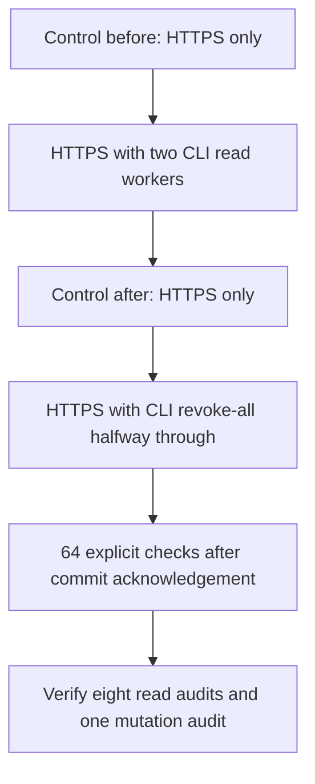
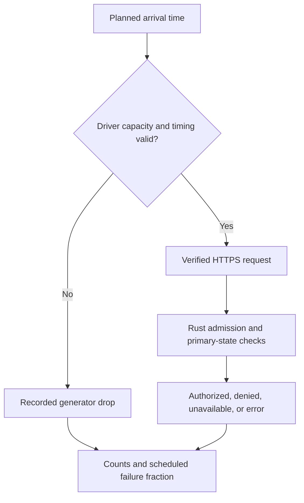

# Performance baseline

[Issue #10](https://github.com/OneTesseractInMultiverse/darkhorse-identity/issues/10) tracks performance qualification before authorization computation caching. The initial harness measures the complete HTTPS introspection request against a release Rust server. It provisions credentials through real browser login, consent, PKCE code exchange and independent ID-token verification.

## Reproduce

Install the [repository toolchain](../README.md#quick-start), Docker, OpenSSL and the pinned browser, then run:

```sh
make deps-install
make browser-install
make benchmark          # smoke: four resource clients, 128 requests per main phase
make benchmark-baseline # baseline: eight resource clients, 2,048 requests per main phase
make benchmark-arrivals # paced traffic: four clients, two seconds per arrival phase
make benchmark-arrivals-baseline # eight clients, ten seconds per arrival phase
make benchmark-profile # same paced smoke with diagnostic instrumentation
make benchmark-profile-baseline # same paced baseline with diagnostic instrumentation
```

These commands build the static console and release server with locked dependencies. They create disposable Percona PostgreSQL and separate Redis limiter/cache containers, a temporary TLS certificate, a Rust server and Chromium. They require neither existing local settings nor host certificate trust. The existing development database, credentials and volumes are untouched. Owned processes, containers, anonymous volumes and temporary secrets are cleaned up on exit. The browser fixture advances only disposable recovery/key-publication setup timestamps. Runtime authorization and limiting remain active.

The client verifies the temporary CA and localhost name. The TLS endpoint is the test harness's Node TLS proxy, with one Rust backend over loopback. This is a single-host measurement, including the host/container database boundary, with different networking from the packaged Compose and Kubernetes fixtures. Database and Redis links are plaintext over isolated local test infrastructure. The PostgreSQL pool defaults to five connections and can be varied explicitly for controlled comparisons. The token-route admission limit remains 16 concurrent requests per server process. No positive decisions or authorization computations are cached. Redis shared login limiting is active. A shared introspection-attempt limiter is **not implemented**.

Use the same revision, profile, hardware, Docker resource allocation and idle-host conditions for comparisons. Do not run other load tests alongside the benchmark. Repeat runs to assess variability. The runner bounds workers and total attempts. It has no production-target URL option.

### Controlled connection-pool comparisons

```sh
make benchmark-arrivals-baseline BENCH_POOL_SIZE=10
make benchmark-profile-baseline BENCH_POOL_SIZE=10
make benchmark-pools # eight short runs: 2, 5, 10, 16, 16, 10, 5, 2 connections
make benchmark-pools-baseline # same sequence with complete arrival-baseline workloads
make benchmark-pools BENCH_POOL_PROFILE=profile-baseline # separate diagnostic series
```

`BENCH_POOL_SIZE` accepts canonical decimal integers from 1 through 32, matching the server's supported range. Invalid values fail before creating test services. The runner parses workload and pool settings once and passes them explicitly to the browser fixture. The report's `metadata.protections.databasePoolConnections` records the limit passed to the Rust server. This is a configured maximum, not a measurement of active connections. Deployment environment settings cannot silently override this benchmark value. Normal browser integration tests still use five connections.

The matrix builds the frontend once, then runs each complete fixture sequentially with fresh disposable services and the same profile. Every run includes concurrent permission reduction, revocation and explicit post-commit checks. A failed run stops the sequence after that run's cleanup. Each run prints its pool size and report directory. All eight reports must have `status: passed` before describing the matrix as completed. The reverse repeat helps expose order effects. Two samples per size cannot establish statistical confidence or eliminate host drift.

Compare only reports with matching source/binary digests, workload profile, host/Docker resources, versions, images and protection settings other than pool size. Compare normal and diagnostic series separately. For each size and offered rate, retain authorized throughput and scheduled authorized p95/p99 alongside unavailable responses and generator drops. Diagnostic runs expose pool acquisition and adapter timings. A smaller acquisition time alone does not prove an improvement: more database concurrency can move waiting into statement execution or locking. Inspect the full request latency, useful throughput, security checks and failure counts together. Before/after activity snapshots help confirm connections were used but do not capture their peak.

These commands change only disposable benchmark configuration. Choosing a deployment pool requires the connection budget across all server replicas, other database clients and the target database. The production default, token-route admission limit and strict primary-state freshness contract remain unchanged.

## Native CLI interference

```sh
make benchmark-operators          # four clients; three seconds per paced phase
make benchmark-operators-baseline # eight clients; ten seconds per paced phase
make test-benchmark-tools         # real subprocess bounds and failure behavior
```

These profiles measure a small administrative burst while HTTPS introspection
continues at **200 scheduled requests/s**. They use the same release executable
for the server and native CLI. After provisioning and a 64-request warmup, the
runner executes these phases in order:



Each read worker makes four calls, alternating `operator account list --limit 25`
and `operator application list --limit 25`. Calls are scheduled at the start and
at each quarter of the phase. A worker waits for its current command to finish
before starting another. The two workers have separate fixture administrators;
each command verifies a password through the real Argon2id and shared Redis
admission path, rechecks authority on the primary, and commits its read audit.
Four calls per actor fit the existing five-attempt minute budget. No measured
phase resets the limiter or reuses an authenticated CLI session.

The controls before and after the burst use the same tokens, offered rate,
connection reuse and phase duration. Compare their authorized scheduled p95/p99,
throughput, unavailable responses and generator drops with the read-burst phase.
The two controls help reveal host drift; they do not remove order effects.
The revocation phase is a separate correctness experiment: at its midpoint the
original administrator invokes `operator account revoke-all` with the expected
revision and a reason. All fixture tokens share that principal and session.
Checks dispatched after successful CLI acknowledgement must return exactly
`{"active":false}`. All 64 explicit post-commit checks must also deny access.
Earlier checks may observe either state while the mutation overlaps them.
Do not compare the mixed active/inactive revocation latency with normal access
checks as evidence of an optimization.

Every native command has a 30-second deadline and a combined stdout/stderr bound
of 64 KiB. Protected input goes through stdin; command arguments contain no
password. Output is reduced in memory to a validated audit correlation ID.
Failure, interruption or output overflow stops the command without retrying it;
started HTTP requests and both CLI lanes drain before fixture cleanup. A killed
command may already have committed. Its failure is not evidence of rollback.
Reports retain timing and audit identifiers, not credentials or returned profiles.
The separate process test exercises input delivery, exit failures, output
limits, cancellation and deadlines; isolated unit tests use in-memory fakes.

Each phase reports command start/end times, scheduled times, latency percentiles,
and the count of HTTP requests dispatched during each command. It also reports
HTTP latency percentiles restricted to dispatches during commands, because
whole-phase percentiles can hide short bursts. Overlapping
commands do not double-count the phase total. A run fails if any command has no
observed request overlap. `operatorAudit` confirms the eight successful read
records and one committed revocation record. `operatorLimits` records two read
workers, four calls per worker, one Redis limiter connection per CLI and at most
two PostgreSQL connections per CLI. With the default server pool of five, the
read phase permits at most nine configured application connections. These are
configured limits, not observed concurrent connection or memory peaks.

The fixture uses a small directory and policy graph, a database owner connection,
and native host processes. It does not qualify restricted-role query plans,
container/Kubernetes scheduling, remote terminal behavior, large directories,
sustained administrative traffic, fleet-wide concurrent password hashing or peak
memory consumption. Four successful calls per actor are a bounded burst, not a
sustained CLI throughput measurement. The ordinary before/after resource snapshots
remain coarse; these profiles do not enable statement or stage instrumentation.
[Operator container qualification](container-accounts.md) and
[account security boundaries](operator-accounts.md) remain separate requirements.

### Initial native interference measurements

Two sequential `operator-baseline` runs on September 24, 2026 used an Apple M5
host with 10 logical CPUs and 24 GiB RAM; Docker 29.6.2 had 10 CPUs and
8,321,515,520 bytes of memory. Both used Rust 1.97.1, Node 24.19.0, Percona
PostgreSQL 18.6.1, the default five-connection server pool and the same release
binary. Each control and burst phase scheduled 2,000 requests over ten seconds.

| Run | Control before p95 / p99 | Read-burst phase p95 / p99 | Control after p95 / p99 | Dispatches during CLI p95 / p99 |
| --- | ------------------------ | -------------------------- | ----------------------- | ------------------------------- |
| 1   | 5.76 / 8.29 ms           | 5.53 / 7.68 ms             | 5.38 / 7.92 ms          | 7.27 / 7.97 ms                  |
| 2   | 5.63 / 8.00 ms           | 5.64 / 8.35 ms             | 5.91 / 8.60 ms          | 11.70 / 17.18 ms                |

All latency columns describe authorized requests measured from their scheduled
arrival. Each burst phase dispatched and authorized all 2,000 requests; 80 were
dispatched during CLI execution. The eight read commands had p95 durations of
98.56 and 105.19 ms respectively. With eight samples, nearest-rank p95 is the
largest observation, not a stable population estimate. Run 1 had no generator
drops. Run 2 missed one arrival in each control phase (0.05% per control), with no
drops in the read or revocation phases. Neither run observed a server-unavailable
response, transport error, other request error or authority mismatch.

CLI revoke-all completed in 102.65 and 93.18 ms, overlapping 21 and 19 request
dispatches. The paced phases included 979 and 981 checks dispatched after its
acknowledgement; every one denied access, as did all 64 explicit post-commit
checks in each run. Both runs verified eight successful read audits and one
committed revocation audit.

These samples establish a reproducible small-burst baseline and preserve the
revocation invariant in that fixture. Whole-phase percentiles hide the more
variable tail during CLI execution. Two runs do not isolate CPU, hashing,
transaction-lock or host-scheduling effects, establish statistical significance,
or justify a production capacity/SLO claim. Larger populations, stronger offered
loads and real deployment topologies still require measurement.

The local report identifiers are `run-QKnDYO` and `run-vnqxsi`. Both recorded
source SHA-256 `e29cc667cadec028aba5fbad939eedb77c2f00d533b9211fa1c314d195872dd9`
and binary SHA-256 `c8dc9b69a773b0b654508c3f66177e18c9fbd8e59dfd24a31cc23621774329ae`.
They were measured before commit, with the implementation changes present;
use these digests and the issue-linked change set rather than their parent
commit alone. Raw reports stay in the ignored benchmark directory and can be
reproduced with the public target above.

## Workloads and interpretation

Every fixture has its own application, confidential OAuth client, resource, introspection credential, `operate` scope and role with read/write capabilities. They share one signed-in principal and SSO session. This small policy graph is a reproducible initial fixture, not a realistic large-organization population.

| Phase                            | Purpose                                                                                                                                                            |
| -------------------------------- | ------------------------------------------------------------------------------------------------------------------------------------------------------------------ |
| Browser login and SSO            | One valid password login, followed by one authorization-code flow per application using the same session. Includes browser automation overhead.                    |
| First pass, new TLS connections  | First measured checks with connection reuse disabled. Provisioning already warmed database state. This is **not** a cold-storage measurement.                      |
| Warmup                           | 64 checks at concurrency eight, reported separately.                                                                                                               |
| Repeated and diverse credentials | Repeated checks of one token versus round-robin clients/tokens at concurrency 1, 8 and 32. The baseline adds 64.                                                   |
| Noisy invalid client             | Six eighths invalid Basic secrets, one eighth valid introspection and one eighth health requests at concurrency 32. Outcomes and latency remain grouped by client. |
| Concurrent permission reduction  | Remove a role capability in an actual committed transaction during concurrent checks. Retain only the read capability on subsequent checks.                        |
| Concurrent revocation            | Revoke a token through the authenticated HTTPS endpoint during concurrent checks. Subsequent checks must return only `active: false`.                              |
| Explicit post-commit checks      | 64 requests after each change acknowledgement. Require useful successful responses so unavailable responses cannot pass the freshness check vacuously.             |
| Unaffected resource              | Confirm another application's token remains usable.                                                                                                                |

`make benchmark` and `make benchmark-baseline` use workers that send the next request after the previous response completes. This **closed-loop** model measures behavior at a bounded concurrency. Slow responses reduce offered traffic. Its percentiles omit time an open-loop arrival would spend waiting before dispatch (coordinated omission). Do not present its throughput as a maximum capacity or an arrival-rate SLO.

### Fixed-arrival workloads

`make benchmark-arrivals` and `make benchmark-arrivals-baseline` add an **open-loop** schedule: the next arrival is determined by its planned time, independently of whether earlier responses have finished. After a 64-request warmup, the smoke profile offers 200 and 1,200 arrivals/s for two seconds each. The baseline offers 200, 800 and 1,600 arrivals/s for ten seconds each. Both run the same invalid-client/healthy-client/health-route mixture at 1,200 arrivals/s. Permission reduction and token revocation each run during a separate 200-arrivals/s phase, followed by explicit post-commit checks and the unaffected-resource check. Rates are test inputs, not declared capacity or SLOs.

The schedule is deterministic and evenly spaced. It is anchored to a monotonic clock rather than accumulating timer delays. A single scheduler limits active requests to 128, matching the HTTP agent socket bound. Every planned arrival gets one record:

- Arrivals observed within five milliseconds of their planned time are dispatched, retaining both actual dispatch delay and response latency.
- A late timer, or an arrival observed after the phase's planned end, produces `generator_late`. The request is not sent.
- A full driver concurrency budget produces `generator_full`. The request is not queued or retried.

The five-millisecond tolerance is a driver setting, not an application latency budget. Small catch-up groups within that tolerance are possible. Larger backlogs are recorded and discarded. No unbounded pending queue is created. The scheduler waits through the complete planned window and drains outstanding requests on completion or failure. Configuration computations bound each phase to 30 seconds, 2,000 arrivals/s, 30,000 scheduled arrivals and 128 active requests. Published profiles use tighter limits.

Security changes begin near the middle of the paced phase. Reports retain their actual start and commit-acknowledgement times. Expectations are captured at actual dispatch, not at the earlier scheduled time. A delayed request dispatched after a committed reduction must observe the reduced state. HTTP credentials, primary-state checks, admission and error semantics match the closed-loop workloads.

Scheduled latency runs from planned arrival through response parsing, so it includes driver delay for dispatched requests. Unsent arrivals have no invented HTTP latency. Their drop counts remain alongside all percentiles and failure fractions. Driver drops mean the server did not receive the complete offered schedule. A passing correctness run with drops or server rejections does not establish that the configured arrival rate is sustainable. The driver, TLS proxy and server share the host. This is still not a production capacity measurement. Longer endurance tests, varied arrival distributions and a separate load-generator host remain qualification work.

Each attempt is timed from immediately before the HTTPS request through response parsing. The reference client has a five-second socket inactivity timeout. The server retains its ten-second route deadline. Classification verifies issuer, audience, subject, issuing client, scope and exact live capabilities. A new request always goes to the server. Inactive results must contain only `active: false`. Unexpected successful authorization fails the run. Expected 401 responses and inactive tokens are denials, never counted as authorized throughput. Admission 429/503 responses are separately retained as unavailable. Transport errors, unexpected responses or authority mismatches fail the run. A passing run can still have severe overload rejection. Inspect its outcome counts.

For a concurrent change, checks dispatched before the change acknowledgement can legitimately see either state. The runner captures the expected state at dispatch. Every check dispatched after acknowledgement requires the reduced/inactive state. Request start times, epochs and change-start/acknowledgement times are recorded. The acknowledgement is a conservative observable boundary after database commit. Inspect timestamps to determine how much load actually overlapped each mutation. The explicit post-commit phases always run. This evidence does not make a consuming application's later business transaction atomic with introspection.



Unsent arrivals receive no invented latency. Reports retain driver drops and
server failures beside successful-request percentiles.

## Reports

Each invocation creates a private `.local/benchmarks/run-*/` directory:

- `report.json`: schema version (currently 2), completion status, profile, timestamp, commit, dirty-source flag, source/binary SHA-256, Rust/Node/database versions, pinned container images, host/Docker resources, topology, protection settings, SSO samples and per-phase/per-client summaries.
- `requests.jsonl`: one redacted record per dispatched request or planned paced arrival with phase, request index, synthetic client index, dispatch epoch, start offset, elapsed milliseconds, HTTP status and classified outcome. Paced rows contain planned arrival time, dispatch delay and scheduled latency. Unsent rows have null HTTP status/start/latency, the observation time and a driver-drop outcome. No passwords, tokens, Basic headers, signing keys, response bodies or real principal identifiers are saved.

Reports are written after each phase and on exit. An incomplete report must not be interpreted as a passing benchmark. Source hashing includes public application, crate, tooling, configuration and dependency inputs, including untracked implementation files. It excludes private planning and generated output. If the source was dirty, the recorded commit alone cannot reproduce the run. Use the source digest and the exact change set. Reports remain ignored by Git. Selectively publish reviewed, redacted measurements with an issue update when useful.

Summaries include nearest-rank p50/p95/p99 for all attempts and separately for authorized checks, total and authorized throughput, denial/error fractions and outcome counts. Per-client throughput uses the whole phase duration. Keep error counts beside latency: rapid overload rejections can make the all-attempt p95 look deceptively good.

Fixed-arrival summaries include configured and scheduled rates, planned duration, peak in-flight requests, driver drops, dispatch-delay percentiles, and scheduled-latency percentiles for dispatched/authorized checks. `attempts` counts only dispatched requests. `scheduled` includes driver drops. Throughput uses the full phase duration including response draining. `scheduledFailureRate` includes driver drops, unavailability, unexpected errors and authority violations over all planned arrivals. Expected security denials remain separate. Per-client scheduled rates use that client's own planned arrivals and the same phase duration. No latency percentile includes an unsent arrival.

Before/after observations include server cumulative CPU time/RSS, database-container CPU/memory/block I/O, cumulative PostgreSQL transaction/buffer/tuple counters, and snapshots of activity waits/ungranted locks. These are coarse observations, not a continuously sampled profiler. PostgreSQL statistics can lag. Counters include fixture/observer work. Tuple changes and container block I/O are not an exact WAL/write-volume measurement. Boundary lock snapshots cannot exclude contention during the workload.

## Opt-in stage and database profiling

`make benchmark-profile` and `make benchmark-profile-baseline` use the same source-defined arrival workloads as their `benchmark-arrivals` counterparts. They activate the `benchmark-profiling` Cargo feature and preload `pg_stat_statements` **only in the disposable benchmark database**. Normal builds and deployment configurations do not activate either facility. Use normal runs for latency comparisons. Profiling changes overhead and phase spacing. Repeat matching profiles on an otherwise idle host to assess variability before interpreting differences as instrumentation cost.

The feature adds fixed-size, process-local timing histograms to the PostgreSQL resource-introspection adapter. A signal handler returns and resets aggregate counters over the owned child's stdout. There is no diagnostics HTTP route. Only the harness signals its own child, after HTTP readiness and between drained workload phases. It waits for application database sessions to become idle, including rollback cleanup, before taking boundaries. Missing, oversized, malformed, unsolicited or inconsistent frames fail collection. It never echoes frame contents in errors. A five-second response deadline bounds collection. No token, principal, resource identifier, SQL text or parameter becomes a timing label.

Each phase gains a `profiling` object. `rust.stages` contains:

| Stage             | Meaning                                                                                                             |
| ----------------- | ------------------------------------------------------------------------------------------------------------------- |
| `total`           | PostgreSQL adapter call, excluding HTTP parsing, TLS and pre-admission rejection.                                   |
| `pool_acquire`    | Complete SQLx acquisition, including queued time, connection creation and liveness checks. Not a queue-only metric. |
| `begin`, `commit` | Transaction operations as observed by Rust.                                                                         |
| `fence`           | Primary shared security-fence read, including database/transport time and any locking delay.                        |
| `authenticate`    | Resource credential lookup and freshness check.                                                                     |
| `inspect`         | Token, code, session, client, consent and policy inspection.                                                        |
| `policy_load`     | Bounded policy SQL reads, decoding and catalog assembly.                                                            |
| `decision`        | Pure effective-capability evaluation and response-value construction.                                               |

Stages are nested: `inspect` includes `policy_load` and `decision`. `total` includes the others plus unlabelled coordination/final freshness checks. Do not add nested timings. Histograms mix outcomes, retaining `ok`, `error` and `cancelled` counts separately. A stage error can be an expected denial: revoked token inspection returns an error internally that the outer adapter maps to a successful inactive response. The surrounding HTTP outcome counts remain authoritative for request classification. Health requests, identity-client introspection and rejections before the adapter are outside these counters.

Times use integer microseconds, rounding individual durations down. `sum_us`, `max_us`, non-cumulative buckets, count and mean are retained. `percentile_upper_us` reports the inclusive **bucket upper bound**, not an exact latency percentile. Null means an empty population or overflow beyond the ten-second top bucket (distinguish with count/buckets). Very small computations may round to zero. Counters have fixed memory/cardinality, but their mutex and clock reads add measurement overhead. A normal build compiles out these effects. Cancellation accounting and signal-failure scenarios still need broader real-process qualification.

The SQL observer resets statistics for the disposable fixture database before each phase. It saves fixed statement-category aggregates: calls, execution milliseconds, rows, buffer hits/reads/dirties/writes, WAL records/full-page images and WAL bytes. Classification occurs inside PostgreSQL. Query text, fingerprints and parameters are not returned. Unknown statements remain in `other`. Observer statements are excluded. Calls include transaction commands, concurrent security mutations and SQLx cleanup. They count completed top-level SQL statements, **not wire-protocol round trips**. Parsing, preparation, failed executions and nested trigger operations need separate attribution. Planning timing is disabled. Statement eviction invalidates a phase. See [PostgreSQL's statement statistics](https://www.postgresql.org/docs/18/pgstatstatements.html) for counter semantics and overhead.

`clusterWalBytes` separately measures the database cluster's WAL insertion-position difference across the phase. It includes commit/abort records and any background or unrelated work in that disposable cluster. It is not a per-request attribution or disk-flush measurement. Per-statement WAL and this cluster total have different scopes. Row-locking reads can generate WAL, so an introspection path without logical data updates is not necessarily free of write activity. PostgreSQL documents that [row locks may cause disk writes](https://www.postgresql.org/docs/18/explicit-locking.html#LOCKING-ROWS). SQL execution time does not isolate network, pool or lock waits. Query plans, protocol tracing and continuous wait/CPU/memory sampling remain separate qualification work.

## Bounded policy reads

Resource policy loading uses one parameterized PostgreSQL statement, shared by consent, resource-token issuance and introspection. The query is embedded at compile time from [projection.sql](../crates/adapters/src/postgres/resource_authority/projection.sql). No runtime SQL file or schema migration is needed. It fetches the target registration, exposed capabilities, assigned roles, requested scopes and historical ceiling definitions together. PostgreSQL binary record arrays preserve empty and unequal role/scope capability sets without JSON serialization or multiplying independent collections into a large joined result.

The query retains overflow sentinels: at most 257 exposed capabilities, 65 roles, 33 requested scopes and 257 historical definitions are returned. Each nested role/scope binding is filtered to the bounded exposed set. The adapter still rejects oversized authority instead of granting a truncated subset. Historical definitions allow a removed or retired capability to remain recognizable in an older token ceiling. They never restore its current authority. Catalog validation and effective-permission decisions remain Rust computations.

The caller acquires the shared primary security fence **in a preceding statement**, then holds it through the complete authorization transaction. Do not fold that lock into the projection query: after waiting for a writer, a later statement must obtain the committed policy snapshot. PostgreSQL documents the [statement snapshot behavior of Read Committed](https://www.postgresql.org/docs/18/transaction-iso.html#XACT-READ-COMMITTED). Token/session/client/consent checks, final expiration checks and commit handling remain in place. No positive decision is cached.

For the small steady introspection fixture, combining the five policy reads removes four top-level statements per authorized check. Verify the actual count and performance using `make benchmark-profile-baseline`. Statement counts are not wire-protocol round-trip counts. Hold pool size and existing admission limits constant when comparing query changes. Vary only pool size in a separate controlled series. Larger policy populations, query plans and different topologies still need qualification before generalizing any measured gain.

## Remaining qualification

The harness establishes a repeatable uncached starting point. Issue #10 stays open for larger user/policy populations, genuinely cold database state, longer endurance and production arrival distributions, multi-host/production proxy measurements, SQL query plans and wire-protocol round-trip attribution, continuous lock-wait/CPU/memory sampling, longer WAL and pool-acquisition observations, and shared-limiter overhead comparisons. SSO samples currently cover one principal, not password-login saturation or a latency distribution.

Latency, capacity and error budgets remain unset until workload goals and repeated measurements support them. Freshness has an explicit security requirement: no stale grant on a check started after the acknowledged commit. Authorization caching must retain the same authentication, admission, failure and freshness semantics when compared with this baseline. The current measurements do not justify activating it yet.
