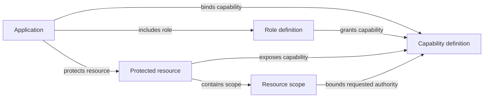

# Application policy map

The management console's **Policy map** is a read-only view of one application's
stored authorization catalog. It helps administrators review how definitions
and bindings fit together. It does not evaluate whether a user, client, token,
or request is authorized.

## Policy relationships

The map uses only these stored relationships:



Role and capability definitions may be shared. The graph contains a shared
definition only when it is explicitly bound to the selected application; it
never follows bindings from another application. Application ownership does
not grant an administrative bypass. Retired capability definitions and empty
roles, resources, and scopes remain visible when they belong to the selected
application.

A path through the graph is not proof of effective access. Actual checks also
consider current user assignments, client and resource policy, active status,
requested scopes, consent where required, credential state, and the current
policy revision. The graph intentionally omits people, credentials, secrets,
and effective-access simulation.

## Snapshot and limits

`GET /api/admin/console/applications/{app}/policy-map` requires the current
platform-administrator session. It reads the primary PostgreSQL database in
one transaction under the shared security-state fence, checks administrator
authority before and after the projection, and reports the corresponding
policy revision. Responses use `Cache-Control: no-store`; the browser does not
persist graph data. A successful result is one complete snapshot.

The server bounds a snapshot to 2,048 nodes, 8,192 edges, and 16 MiB of
serialized JSON. It returns `413 policy_map_too_large` with no partial graph or
continuation cursor when any bound is exceeded. The graph reader uses a fixed
14 SQL statement budget (excluding `BEGIN` and `COMMIT`): one authority-fence
read, two current-session checks with their database-clock reads, one
application read, four bounded entity reads, three bounded relationship reads,
and one policy-revision read. Each entity or relationship query uses a
parameterized application identifier and reads at most the remaining bound
plus one row to detect overflow. These are query-count and work bounds, not
throughput guarantees.

The frontend strictly validates the response before rendering it. It preserves
the server's complete snapshot, labels every supported edge, filters without
changing the stored policy, and cancels an old request on navigation or
application change. A failure or observed session/authority loss clears the
graph. The visible load time and policy revision describe the snapshot, not a
live feed. Refresh to observe later changes.

The interactive Svelte Flow view is capped at 512 visible nodes and 2,048
visible relationships. High-degree application bindings can make all edges
cross the viewport, so viewport culling alone does not guarantee bounded DOM
work. When the filtered view exceeds either graph limit, Darkhorse explains
the counts and offers the complete, 50-row-paginated item and relationship
tables. Administrators can also narrow the graph with the existing filters.
The server snapshot and table view retain their independent limits above.

## Console behavior and accessibility

The page supports application selection, search, relationship and entity
filters, direct-neighbor focus, a deterministic layered layout, pan/zoom,
fit controls, a minimap, and a reset action when the filtered view is within
the interactive limit. Svelte Flow is pinned as `@xyflow/svelte` 1.7.0 (MIT);
its browser code is route-scoped. Darkhorse owns the layout projection and does
not run an unbounded force simulation. Graph content is rendered as text.

The accessible table view exposes both policy items and labeled relationships
with keyboard-operable selection and pagination. The inspector describes the
selected item and links to the existing management form with application and
record context preserved. Graph operations do not write policy. Changes stay
in the existing authorized, revision-checked management workflows.

## Verification and performance evidence

Run the isolated logic and transport checks with:

```sh
make test-catalog
pnpm --filter @darkhorse/console exec vitest run \
  tests/unit/lib/admin/policy-map.test.ts \
  tests/unit/lib/admin/policy-map-api.test.ts \
  tests/unit/lib/admin/policy-flow.test.ts \
  tests/unit/routes/console/policies/page.test.ts
```

`make test-browser` exercises the real authorized API and console, then renders
a deterministic synthetic fixture at the interactive graph limit and the
server snapshot limit. It reports response bytes and local HTTPS read time,
time until the small graph is usable, representative graph render time,
large-snapshot fallback time, visible graph DOM nodes, paginated table rows,
and browser heap when Chromium exposes that measurement. Synthetic UI-fixture
timings do not represent database throughput or production-browser
performance. The measurements for the checked build are recorded in
[`measurements/policy-map-2026-09-26.json`](measurements/policy-map-2026-09-26.json).

The hard regression ceilings are 16 MiB for a response and the stated graph
cardinalities. Runtime timing and memory results are environment-specific
observations; repeat the browser run on the target deployment hardware before
using them for capacity planning. No positive authorization decision is cached
to support this visualization.
