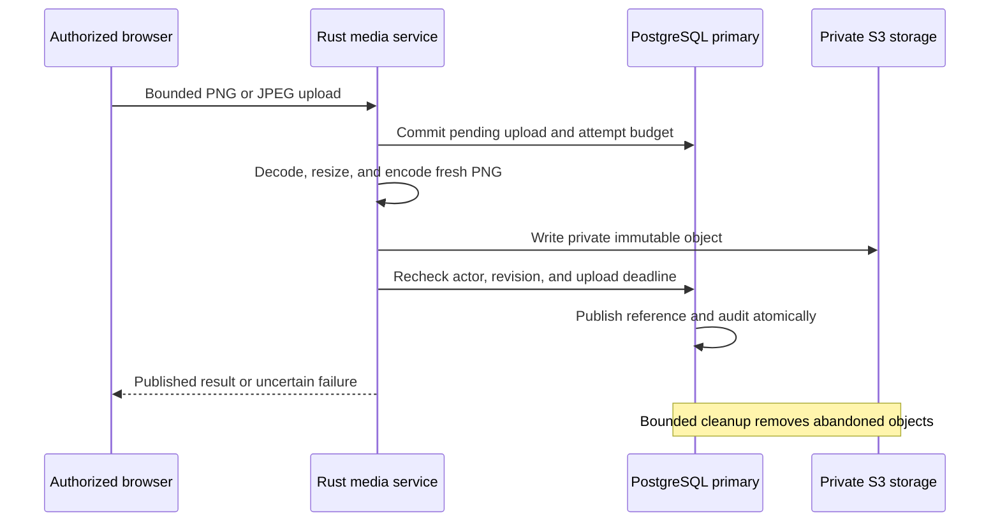

# Profiles, images, and login branding

The account page at `/account/profile` lets a signed-in user view and edit their descriptive profile. Administrators can open a user's full profile from the directory. `/console/settings` manages the public login logo and background.

## Profile contract

| Attribute                        | Validation and access                                                                                                                                                                                                                             |
| -------------------------------- | ------------------------------------------------------------------------------------------------------------------------------------------------------------------------------------------------------------------------------------------------- |
| Email / username                 | Required existing account identity. Read-only here. Email ownership changes require the planned verified email-change workflow.                                                                                                                   |
| First and last name              | Required, trimmed Unicode strings, 1–100 Unicode scalar values each, no remaining control characters.                                                                                                                                             |
| Second name and second last name | Optional, separate components with the same name limits. No automatic transliteration or family-name reordering.                                                                                                                                  |
| Status                           | Existing active/inactive state. Changes use the administrator directory workflow.                                                                                                                                                                 |
| Country                          | Optional ISO 3166-1 alpha-2 code, selected from the bundled dropdown. Residence and phone numbering are independent.                                                                                                                              |
| Calling code and national number | Both absent or both present. Digits only. Validated together against bundled phone metadata and stored as an E.164-compatible number of at most 15 digits. Meaningful leading zeros are preserved. These numbers are **unverified contact data**. |
| Bio                              | Optional plain text, up to 2,000 Unicode scalar values and 8,000 UTF-8 bytes. LF and tab are permitted. Other control characters are rejected.                                                                                                    |
| Picture                          | Optional, private image. A bundled avatar is the default.                                                                                                                                                                                         |

Country names/codes come from pinned `isocountry` 0.3.2. Phone metadata comes from `rlibphonenumber` 2.2.12 with libphonenumber 9.0.39 metadata. Both are compiled into the application. Unit tests need no data downloads or runtime files. Updates to either dataset require review and compatibility tests. Phone metadata validation establishes numbering plausibility, not ownership, reachability, or suitability for authentication.

New writes require the selected calling code to match the parsed international code exactly. National dialling prefixes, formatting, extensions, and values that would change during canonical E.164 formatting are rejected. The calling-code dropdown includes international service codes such as `800`. Residence remains independent. Existing stored contacts retain structural validation when read but are not revalidated against changing numbering metadata. An older number can still be viewed and corrected. Saving a profile requires correcting or clearing a number rejected by current rules. Upgrading does not rewrite stored values or require a schema migration. See the [dependency compatibility review](dependencies.md#phone-validator-replacement).

PostgreSQL must use UTF-8. Migration 20 rejects other server encodings before changing the schema. New development and disposable test clusters explicitly initialize UTF-8. Existing non-UTF-8 deployments need a backed-up, verified database conversion before this migration. Changing a client encoding is insufficient.

The Rust HTTP boundary rejects unknown JSON fields and bounds profile requests at 16 KiB. Users cannot set their email, active state, verified flags, administrator membership, roles, or permissions through profile fields. The stable principal identifier is the OIDC subject and remains unchanged by profile edits.

### Claim minimization and extensions

Existing OIDC disclosure remains unchanged: `openid` exposes `sub`. An approved `profile` scope exposes the existing `name`, `given_name`, and `family_name`. An approved `email` scope exposes email and its actual verification state. Existing token claim ceilings are preserved. The additional second-name components, country, phone, bio, and private image are available through the protected first-party profile API and are **not automatically added to UserInfo or ID tokens**. The `phone` and `address` OAuth scopes and a client-consumable private picture claim are not introduced by this increment.

Adding an attribute requires an explicit typed domain field, validation, a migration, editable-input and readable-output allowlists, and documented ownership/disclosure rules. Adding client disclosure requires protocol scope/claim and consent changes, with tests for already-issued credentials. Arbitrary JSON extensions and user-editable authorization attributes are unsupported.

## Authorization and concurrency

Every profile or portrait read checks the original live password-backed browser session against primary PostgreSQL. The owner or a current platform administrator may access a profile. Every write requires a sign-in within five minutes. API keys and OAuth tokens do not authorize these management endpoints.

Writes require the exact principal revision as a decimal string. A profile edit and a portrait replacement compete on the same revision. The global security fence precedes principal locks and authority reads, preserving the project's committed-revocation contract. Profile values, revision advancement, and an immutable actor/session audit record commit together. Audit records contain references and event metadata, not copies of profile values or image bytes. No-op writes do not advance the revision or append an event.

Branding writes require a current platform administrator, recent authentication, and the branding revision. Changes are audited in the same transaction. Public login branding is an explicit exception to private image access: only the two currently published branding references can be read anonymously.

All browser mutations require the configured origin and `X-Darkhorse-CSRF: 1`. Image writes use `X-Darkhorse-Revision`. Forms never retry a mutation automatically. A failed or uncertain response requires a fresh read before another change.

## HTTP contract

`target` is `me` or a canonical nonzero principal UUID. Owner and administrator
checks determine which record is readable or writable. A supplied UUID never
establishes authority.

| Endpoint                                | Contract                                                            |
| --------------------------------------- | ------------------------------------------------------------------- |
| `GET /api/profiles/options`             | Authenticated country and calling-code lists with metadata versions |
| `GET /api/profiles/{target}`            | Current profile and decimal-string revision                         |
| `POST /api/profiles/{target}`           | Complete editable field set and expected revision                   |
| `GET /api/profiles/{target}/picture`    | Authorized portrait or placeholder                                  |
| `POST /api/profiles/{target}/picture`   | Raw PNG/JPEG body and `X-Darkhorse-Revision`                        |
| `DELETE /api/profiles/{target}/picture` | Remove the published portrait with expected revision                |
| `GET /api/admin/branding`               | Administrator storage and branding metadata                         |
| `POST /api/admin/branding/{kind}`       | Publish a `logo` or `background` image                              |
| `DELETE /api/admin/branding/{kind}`     | Remove the selected branding image                                  |
| `GET /api/branding`                     | Public login-branding metadata                                      |
| `GET /api/branding/{kind}`              | Current public logo or background                                   |

Profile writes supply `revision`, `first_name`, `second_name`, `last_name`,
`second_last_name`, `country`, `calling_code`, `national_number`, and `bio`.
Optional text uses an empty string. Both phone components must be empty or present.
The input rejects unknown fields. Profile responses include identity metadata
but no bearer credentials or password verifiers.

Profile errors distinguish malformed input (`400`), missing authentication (`401`),
insufficient or stale authority (`403`), unknown target (`404`), stale revision
(`409`), and unavailable storage (`503`). The public error contains no internal
storage details. An authentication failure clears the stale cookie.

## Image pipeline

1. Authenticate and authorize, check revision and the per-actor budget, then commit a pending upload record with a new random object key. At most four upload attempts per actor per minute are admitted.
2. Accept only PNG/JPEG bodies up to 4 MiB and verify the detected format against the declared media type. Decode with strict 2,048-pixel width/height limits and a 32 MiB best-effort decoder allocation limit.
3. Resize within 512 pixels for portraits, 1,024 for logos, or 1,920 for backgrounds. Encode a new PNG from decoded pixels, with a bounded 4 MiB output writer. Original filenames, appended payloads, animation, EXIF, and other source metadata are not carried into the output.
4. Upload the rewritten bytes to private S3-compatible storage. Cloud requests use explicit credentials, TLS in production, bounded connection/request times, and no automatic request retries. No SQL transaction spans cloud I/O.
5. Recheck current authority, revision, and the 60-second upload lifetime before atomically publishing the reference and audit event. An upload that loses authority or a revision race stays unpublished.

Two decoder jobs per process are admitted. Their permits stay with the blocking jobs even when the HTTP request is cancelled. Decoder allocation limits are not a hard process-memory or CPU-time isolation guarantee. Image fuzzing and workload-specific capacity tests remain necessary. Supported format features are restricted to PNG/JPEG.

Reads obtain the current authorized reference from PostgreSQL before accessing image bytes. A process-local cache retains at most 32 immutable images and 8 MiB of verified content. It caches bytes, not authorization decisions. Cold reads check stored size and SHA-256 integrity. The response uses `image/png`, `nosniff`, a restrictive image CSP, same-origin resource policy, and `no-store`. No bucket URLs, arbitrary redirects, or bearer image links are issued. The bucket must remain private.

Removed/replaced assets and interrupted uploads are collected by a bounded sweep of 32 records. Pending uploads have a one-hour cleanup grace period. Terminal tombstones are revisited daily so a delayed remote write can be removed later. Failed deletion remains retryable. Metadata/audit retention is currently indefinite. Versioned buckets need a separately configured noncurrent-version lifecycle. Database and object-storage backups must be coordinated. Do not delete or restore one side independently during image publication.



The object write holds no SQL transaction. A later authorization failure leaves
an unpublished object for cleanup, not a public image.

## Storage configuration

Supply the following through deployment environment/secrets. The web console never accepts storage credentials, endpoint URLs, CSS, HTML, or remote image URLs.

| Setting                                                         | Purpose                                                                                                                                           |
| --------------------------------------------------------------- | ------------------------------------------------------------------------------------------------------------------------------------------------- |
| `DARKHORSE_OBJECTS_ENABLED`                                     | Explicit opt-in. Defaults to false.                                                                                                               |
| `DARKHORSE_OBJECTS_ENDPOINT`                                    | HTTPS S3 API origin. No credentials, path, query, or fragment.                                                                                    |
| `DARKHORSE_OBJECTS_BUCKET`                                      | Dedicated private bucket. Lowercase letters, digits, and hyphens, 3–63 characters.                                                                |
| `DARKHORSE_OBJECTS_REGION`                                      | Signing region. Default `us-east-1`.                                                                                                              |
| `DARKHORSE_OBJECTS_ACCESS_KEY` / `DARKHORSE_OBJECTS_SECRET_KEY` | Deployment secrets. Grant only the required object read/write/delete permissions under `darkhorse/media/`. Bucket creation is an operator action. |
| `DARKHORSE_OBJECTS_LOCAL_HTTP`                                  | Development-only opt-in to HTTP on a literal loopback endpoint or `localhost`. Remote HTTP endpoints are rejected.                                |

The first startup with storage configured pins endpoint, bucket, and region to the database. A mismatching storage identity fails startup. It cannot silently strand or reinterpret existing references. Credential rotation on the same storage identity does not change the binding. Moving buckets/providers requires a future explicit migration workflow with verified object transfer. The settings page shows only active status and bucket name.

The first adapter uses the Apache `object_store` S3 implementation. Local development and integration use pinned RustFS 1.0.0. Compatibility with an individual cloud provider, IAM policy, versioning configuration, TLS trust environment, and disaster recovery procedure must be qualified before deployment.

## Local commands

With the database, Redis, login key, HTTPS proxy, and administrator setup described in [development](development.md):

```sh
make db-migrate
make objects-setup
make objects-up
make dev-media CADDY=/path/to/caddy
```

`objects-setup` preserves an existing owner-only `.local/objects.json`. `objects-up` starts workspace-owned storage on loopback port 9009 and provisions a private development bucket. Development uses dedicated local service credentials. Production uses scoped deployment secrets. `objects-down` preserves its volume and credentials. `dev-media` runs the Rust server, static frontend development tooling, and HTTPS proxy with storage active. Administrator bootstrap remains interactive.

`make test-profiles` runs isolated profile tests. `make test-media` runs the verified-HTTPS browser suite with disposable PostgreSQL, Redis, SMTP, and S3 storage, including a real S3 image-adapter test. `make test-unit` needs none of these services. `make docker-build` packages the static profile/settings pages and Rust image/storage adapters.

## Qualification still required

The functional paths have isolated, PostgreSQL, provider, and browser tests. Remaining qualification includes broader decoder fuzzing, hard resource isolation, sustained upload/read capacity, independent-process failure/recovery tests, complete authored adapter coverage, exhaustive accessibility review, retention/erasure operations, and coordinated database/object restore drills. OIDC exposure of the new private attributes and storage migration are separate explicit changes. The feature is not a production-readiness certification.

## Source reference

[profile policy](../crates/domain/src/profiles.rs),
[image conversion](../crates/adapters/src/media/images.rs),
[publication transactions](../crates/adapters/src/postgres/media/mod.rs).

## Account language

The profile includes an optional English or Spanish preference. **My profile →
Change language** explicitly saves or clears it after recent authentication.
Administrators can read it through existing profile authority; the language action
edits only the signed-in account. Name/contact edits preserve it. See
[language preferences](localization.md#saving-an-account-language) for revision,
audit, fallback, cross-device and uncertain-write behavior.
