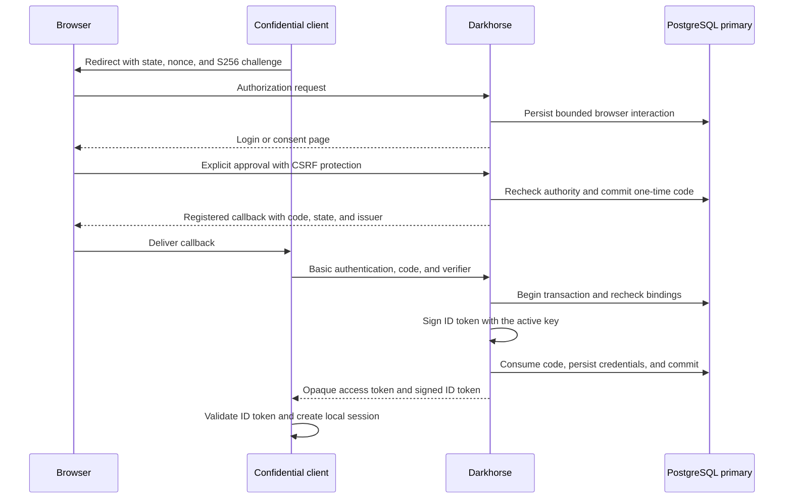
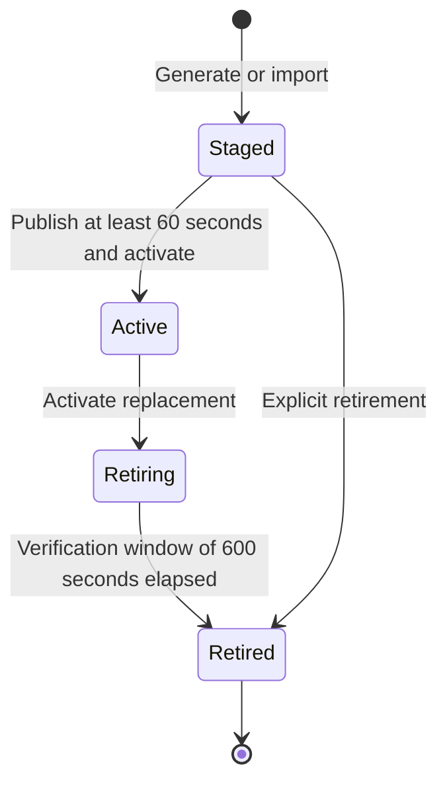

# OpenID Connect code flow

The initial provider supports confidential clients using `client_secret_basic`,
mandatory PKCE S256, browser consent, one-time authorization codes, opaque access
tokens and RS256 ID tokens. Identity scopes are `openid`, `profile` and `email`.
UserInfo returns only the approved claims. Authenticated introspection and revocation are available to
the issuing client. See the [identity check contract](token-checks.md). Discovery
advertises these implemented capabilities when an active signing key is available. Otherwise it returns HTTP 503.

A separate [resource issuance profile](resource-issuance.md) connects persisted role
assignments to the existing authorization engine and freezes permission ceilings at
consent, code issuance and redemption. [Resource-server introspection](resource-introspection.md)
recomputes live capabilities within those ceilings. Opted-in clients support
[session-bound refresh rotation](refresh-tokens.md). [Catalog management](catalog-administration.md) and
[extended profiles](profiles-and-media.md) are implemented. Back-channel notification
delivery remains incomplete. Registration allowances never grant user capabilities.
New ID tokens carry [application-specific session references](backchannel-logout.md)
as the prerequisite for targeted logout. Notification delivery is still pending.
[Issue #8](https://github.com/OneTesseractInMultiverse/darkhorse-identity/issues/8)
retains failure, coverage and operational qualification. No OIDC conformance or
production-readiness claim is made.



Client state and nonce appear here as recommended caller inputs. The provider
accepts their bounded optional forms. Refresh tokens require explicit client opt-in.

## Configuration and development

Apply embedded migrations explicitly with `make db-migrate`. Prepare the
[password portal](authentication.md#configuration-and-development), including its
safely recovered limiter. Then:

```sh
make provider-setup
make signing-status
make signing-generate REVISION=0
# Wait at least 60 seconds; use the returned key ID and current revision.
make signing-activate KID=<public-key-id> REVISION=1
make dev-provider
```

`provider-setup` creates `.local/signing-wrap.key` with owner-only permissions and
preserves an existing file. The operator targets read that file and the local
protected database configuration. `dev-provider` starts the HTTPS proxy, frontend
and Rust server with login and the code flow active. Ordinary `make dev`
and `make dev-login` retain their prior behavior. Existing local deployments are
not automatically migrated or active by tests/builds.

Outside these helpers, set `DARKHORSE_PROVIDER_ENABLED=true` and
`DARKHORSE_SIGNING_WRAP_KEY` to a separate, uniformly random 256-bit key encoded as
64 lowercase hex characters. Keep this key in deployment secret storage, separate
from database backups, the login budget key and TLS keys. Active serving requires `DARKHORSE_LOGIN_ENABLED=true` and its database/Redis configuration.

The canonical issuer is the HTTPS origin from `DARKHORSE_PUBLIC_ORIGIN`, serialized
without a trailing slash. Its exact value and a purpose-separated digest of the
wrapping key are pinned in PostgreSQL. A conflicting replica fails startup.
Changing the issuer or wrapping key requires a future explicit migration/recovery
workflow. Replacing an environment value cannot silently change either.
`Forwarded` and `X-Forwarded-*` headers never establish issuer trust. The HTTPS
proxy must forward the canonical Host header and restrict direct backend access.

## Signing keys

- AWS-LC generates RSA keys with a 3072-bit modulus and exponent 65537. Imports
  accept the same profile as binary PKCS#8 DER, through bounded standard input:
  `make signing-import REVISION=<revision> < private-key.der`. PEM and secret
  command-line arguments are unsupported. Imports are at most 8192 bytes.
- The signature algorithm is RS256. Key IDs are SHA-256 JWK thumbprints
  over canonical public `e`, `kty`, and `n` members. `/jwks` publishes only
  `kid`, `kty`, `n`, `e`, `use=sig`, and `alg=RS256`.
- Private material is encrypted with AES-256-GCM and an OS-generated 96-bit nonce.
  Authenticated data binds the envelope to this issuer, key ID and format version.
  Nonces remain uniquely reserved even after retirement. The database receives
  ciphertext. The wrapping key remains outside it. Decryption rejects envelope
  tampering, issuer/key substitution and a changed public projection.
- A staged key is published for at least 60 seconds before activation. Activation
  atomically makes the previous active key retiring for 600 seconds. There is one
  active key and at most four nonretired keys. Revision checks serialize concurrent
  operator changes. Uncertain failures are not retried automatically.
- `make signing-retire KID=<id> REVISION=<revision>` can remove an unused staged
  key immediately, or a retiring key after its verification window. It cannot
  retire the active key. Retiring public keys disappear from JWKS at the deadline.
  Explicit retirement erases their encrypted private material. Public identities
  and audit records are retained and cannot be reused or rewritten.
- Reserved message lifetimes are at most 300 seconds, within the 600-second
  verification overlap. ID-token headers use `typ=JWT`. Back-channel Logout Tokens
  use `typ=logout+jwt`. Future issuing/validating adapters must keep their claim
  schemas separate: ID tokens bind nonce/authentication context. Logout
  Tokens require the logout event and session/subject targeting and prohibit nonce.
  This milestone issues ID tokens. Logout Token issuance/delivery remains later
  work. Access credentials are opaque. Refresh credentials use the separate [rotation contract](refresh-tokens.md).

Key operations and their audit write commit together. Failed audit writes roll back
all lifecycle changes. The initial implementation uses non-FIPS AWS-LC and does not
claim FIPS certification. Emergency compromise revocation, KMS/HSM integration,
wrapping-key rotation, retained-record archival and recovery drills remain required
release work. Staging/retirement is an ordinary rotation workflow, not emergency
key revocation. JWKS responses currently use `no-store`. No positive authorization
decision or private key is cached in Redis.

## Authorization request profile

`GET /authorize` accepts a bounded query for an active, administrator-registered
confidential client. HEAD does not create transactions. The supported
profile is `response_type=code`, query response mode, and mandatory PKCE S256.
The challenge must be canonical unpadded base64url encoding of exactly 32 bytes.
Plain PKCE, implicit/password grants, request objects, request URIs, claims,
`id_token_hint`, `acr_values`, `login_hint` and `select_account` are unsupported.
No supplied URI is fetched.

Callback matching uses the exact registered string, including query encoding.
Callbacks containing reserved response query names (`code`, `state`, `error`,
`error_description`, `error_uri`, `iss`) cannot start a transaction. State and nonce
are optional, immutable, and bounded to 512 and 256 printable ASCII bytes respectively.
Clients should supply unpredictable state and nonce. The server returns accepted
state verbatim through URL encoding on success and safe error redirects, together
with the canonical `iss` response parameter. Clients must check state, issuer and
nonce and bind their callback to the flow they started.

Identity requests require `openid` and may add `profile` and `email`, without a
resource audience. Resource requests require one registered resource and `openid`
plus at least one explicitly allowed resource scope. These profiles cannot be
mixed. See [resource issuance](resource-issuance.md) for fresh consent, live role
assignments and immutable capability ceilings. UserInfo credentials have no
resource capabilities and cannot authorize application APIs. Their scope/claim
ceilings and consent-reduction rules are described in the
[identity check contract](token-checks.md).

Requests accept `prompt=none`, `login`, `consent`, or `login consent`. Absent prompt
uses the current session and, for identity requests, remembered consent. Resource
requests always require a fresh approval. `prompt=none` returns `consent_required`
when a session exists. `none` cannot be combined with
other values and never displays interaction: it returns `login_required`,
`consent_required`, or a code when the current session and consent suffice.
`max_age` accepts integer seconds from zero through 28800. Zero and `prompt=login` require a new session created after request start,
different from the session presented at the start. A bound transaction cannot be
transferred to a different session, even for the same user.

Consent is required on first use for every client, including administrator-created
clients. For identity requests, a current matching consent can cover an equal or narrower request.
Expanded access, a different resource, or a changed client/application revision
requires consent again. Explicit `prompt=consent` requires a new approval for this
transaction. Approval replaces remembered scope consent for that principal/client/
resource. It does not union scopes or increase permissions. Approval and an
immutable consent audit record commit together. Denial terminates the transaction.

Malformed queries, duplicated recognized parameters, invalid encoding, unknown
clients and unregistered callbacks fail locally without redirecting. Only a
validated current callback can receive protocol errors. Other bounded unknown
parameters are ignored. A query is at most 8192 bytes and 32 parameters. Malformed
or unsupported request syntax currently gets a local error even when a callback
could otherwise be valid. Broader protocol error interoperation remains part of
conformance qualification.



This signing-key lifecycle describes normal rotation. Active keys cannot be
retired directly. Emergency compromise recovery requires a separate contract.

## Exchange and token contract

Approval atomically creates a 60-second code, consumes the pending request and
writes an audit event before redirecting. `POST /token` accepts a bounded
`application/x-www-form-urlencoded` body with `grant_type=authorization_code`,
`code`, the exact original `redirect_uri`, and a 43–128 character unreserved-ASCII
`code_verifier`. An optional `resource` must exactly match the resource bound to
the code. Omission uses that stored resource. Client authentication is a single HTTP Basic header containing
form-encoded client ID and secret. Duplicate fields/authentication headers, body
client authentication, unsupported grants, query credentials, Origin and Cookie headers
are rejected. This is a confidential backend endpoint with no browser CORS support.

Codes and access tokens each contain 256 random bits from the OS, encoded as
lowercase hex with distinct `dc_` and `da_` prefixes. PostgreSQL stores only
purpose-bound SHA-256 verifiers. An access token has a five-minute maximum lifetime,
and exactly one audience. Identity credentials target `<issuer>/userinfo`, with
immutable approved identity scopes, a matching claim ceiling and no resource
capabilities. Resource credentials target their registered audience, with an
immutable capability ceiling and no UserInfo claims. Refresh tokens are returned only to clients that explicitly activate the
[refresh profile](refresh-tokens.md).

ID tokens use RS256, `typ=JWT` and the active public `kid`. Claims are canonical
`iss`, client UUID `aud`, principal UUID `sub`, `iat`, `exp`, original session
`auth_time`, application-specific `sid`, and the original `nonce` when supplied.
Lifetimes are 300 seconds.
Signing runs in at most four blocking workers per process. Private keys are
unwrapped for each exchange. JWKS exposes only public material.

A transaction authenticates the current client, locks the code, checks its client,
redirect and S256 proof, revalidates the original session and current registration,
locks the active provider key, signs the ID token, consumes the code, creates its
access credential and appends the audit event. Commit precedes the response.
Signing, storage or audit failure rolls everything back. Retry is possible only
when that attempt did not commit. A lost committed response requires a new
browser flow. Correctly bound replay (including after code expiry) is rejected
and revokes the associated access token. Wrong authentication or binding cannot
revoke another flow's token. Replay cannot retract an ID token already received
and accepted by a client. Downstream session logout is separate unfinished work.
Token responses/errors carry `Cache-Control: no-store` and `Pragma: no-cache`.

`GET /userinfo` accepts only an opaque access credential in a single Bearer header.
It returns the subject plus the current profile/email fields allowed by the immutable
claim ceiling. Each check reads the PostgreSQL primary and revalidates token
lifetime/revocation, audience, client/application revisions, the original live
session/credential epoch and current consent. Logout, credential revocation,
account deactivation, changed registration or consent reduction invalidate new
checks after commit. No positive authorization result is cached. UserInfo does not
extend browser idle lifetime. ID tokens, Logout Tokens, codes and browser handles
are not access tokens. See [introspection, revocation and freshness](token-checks.md)
for the complete supported identity-check contract.

## Transaction and transport integrity

An OS-generated 256-bit browser handle lives only in a `Secure`, `HttpOnly`,
`SameSite=Lax`, host-only cookie, with path `/` and a five-minute maximum age.
Only its purpose-separated SHA-256 digest is stored. Neither handles nor protocol
credentials enter frontend storage. A separate public confirmation identifier
binds each consent submission to the request actually displayed: replacing the
cookie from another tab cannot redirect an old approval to a new request.

`/api/authorization` reads the current interaction. The decision endpoint accepts
only that confirmation identifier and `approve`/`deny`. The actor, client, callback,
challenge, nonce and requested access come from the cookie-bound stored request.
Unsafe methods require exact Origin, the CSRF header and same-origin Fetch Metadata
when supplied. Route admission is bounded and responses carry `no-store`,
`no-referrer`, frame protection and the existing CSP. There is no frontend server.

PostgreSQL is authoritative. Each begin/resume shares the security-state lock
before catalog/request/session locks, validates the current active client and
application, exact allowances, live credential epoch/session, request lifetime and
immutable binding. Revoked, expired or changed bindings fail closed. Redis cannot
make them valid. Requests started after a committed change observe it.

Requests expire after five minutes. Capacity is atomically limited to 100 retained
requests per client and 5000 overall, with indexed cleanup of at most 100 expired
rows per new request. A separate capacity row serializes creation. Resumes lock
only their request after the shared authority lock. These conservative limits bound
memory and work but are not a throughput guarantee or abuse-rate limiter. Ingress
flood protection, production sizing and contention/load benchmarks remain release
work. Sustained quotas can deny new requests. Code, access-token, consent and audit retention need
an operational policy. Expiry cleanup does not erase those records. Expired refresh families have [bounded cleanup](refresh-tokens.md#migration-and-maintenance).
Other code and token records currently accumulate. Retention and sustained-load qualification are release
requirements. Token HTTP admission is capped at 16 concurrent requests per replica
with a 4096-byte body limit and the shared transport deadline. These are bounds,
not a distributed token-endpoint abuse limiter or a measured throughput guarantee.

## Verification

`make test-provider` runs isolated policy/parser/crypto/operator/code-exchange
contracts with source-defined inputs, including a public test-only RSA key. No
files, settings or services are needed for unit tests. `make test-postgres` covers
atomic issuance/redemption, one-winner races, replay after expiry, wrong proofs,
current-state revocation, immutable ceilings and signing/audit rollback alongside
the earlier persistence contracts. It exercises the resource HTTP flow, frozen
consent, permission-change races and bounded policy projections. See
[resource verification](resource-issuance.md#verification-and-remaining-work).

`make test-browser` runs the static portal through verified HTTPS with real Rust,
PostgreSQL and Redis. Its test-only confidential reference client lives in
`scripts/lib/reference-client.mjs`. It keeps secrets in test-process memory,
checks callback state/issuer, exchanges the code with Basic and S256, independently
verifies the RS256 signature with Node crypto and published JWKS, checks ID claims,
calls UserInfo, and verifies JWT/code substitution rejection and replay revocation.
It disconnects after committed response headers without reading the body and
checks that retry cannot redeem the code again.
It is an interoperability probe, not a deployed application or production client SDK.
Rust owns all deployed server behavior.

Current evidence and coverage limits are recorded in
[verification](verification.md). The unchanged 100%
authored-code target and full-provider interoperability remain open. Passing these
checks does not establish OIDC conformance or production throughput. Resource
issuance qualification, retention and further failure paths remain tracked in issues #8 and #9
and release qualification.

## Protocol references

The choices and narrower project profile above use the
[OIDC authentication request](https://openid.net/specs/openid-connect-core-1_0.html#AuthRequest),
[discovery metadata](https://openid.net/specs/openid-connect-discovery-1_0.html#ProviderMetadata),
[token endpoint](https://openid.net/specs/openid-connect-core-1_0.html#TokenEndpoint),
[one-time codes](https://www.rfc-editor.org/rfc/rfc6749.html#section-4.1.2),
[PKCE verification](https://www.rfc-editor.org/rfc/rfc7636.html#section-4.6),
[resource indicators](https://www.rfc-editor.org/rfc/rfc8707.html#section-2.1),
[JWK thumbprints](https://www.rfc-editor.org/rfc/rfc7638.html#section-3.1), and
[back-channel Logout Tokens](https://openid.net/specs/openid-connect-backchannel-1_0.html#LogoutToken).

## Source reference

[OIDC policy](../crates/domain/src/oidc.rs),
[token transactions](../crates/adapters/src/postgres/tokens/mod.rs),
[signing adapter](../crates/adapters/src/signing/crypto.rs).
