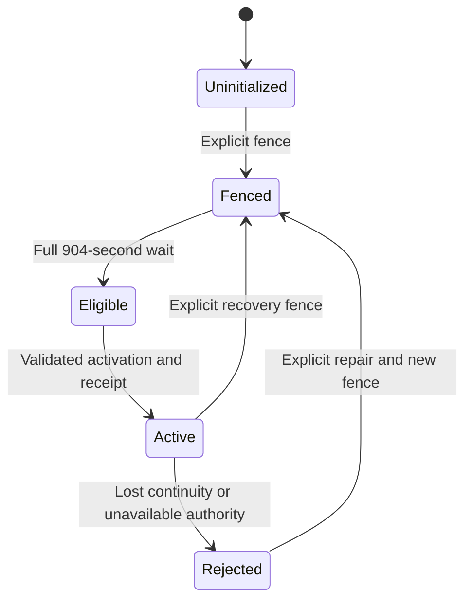

# Redis infrastructure and shared attempt limiting

Darkhorse separates cache storage from shared attempt limiting. `RedisLimiter`
implements the application-owned `AttemptLimiter` port. HTTP password login and
authenticated account commands share its deployment and account budgets.
PostgreSQL controls enforcement generations. Redis performs atomic counter updates.
Authorization computation caching remains planned. No positive authorization
decision comes from Redis.

## Local workflow

Start Docker and install the locked dependencies. Ordinary unit tests need neither Redis nor PostgreSQL.

```sh
make db-up db-migrate
make redis-setup
# Existing installations: stop Redis and upgrade ACLs without rotating credentials.
make redis-down redis-acl-update
make redis-up
make redis-status
make limiter-fence
make limiter-status
# Wait at least 15 minutes 4 seconds after fencing, then:
make limiter-activate
make limiter-status
make redis-down db-down
```

Every new enforcement generation, including the first, has the same mandatory wait. `limiter-fence` commits an inactive generation immediately and starts a new wait. Repeating it extends the interruption. `limiter-activate` requires the wait to have elapsed and protected operator credentials. There is no skip-wait flag or runtime test switch. Activation binds the generation to the observed Redis process and replication identity. Repeating activation cannot reset an active generation's counters.

Activation now commits a durable intent before initializing Redis and an atomic
PostgreSQL completion receipt. Use `make limiter-inspect OPERATION_ID=<id>` to
inspect an uncertain attempt without Redis. Read the [activation evidence and
upgrade procedure](limiter-activation.md) before upgrading existing operators.

Setup creates owner-only `.local/redis-cache.acl`, `.local/redis-limiter.acl` and `.local/redis.env`. Four independent random credentials cover the two runtime users and two operators. Complete existing settings are preserved. Partial settings, symlinks and broad permissions are rejected. `redis-acl-update` rewrites ACL policy with the same credentials. Restart services to load it. Keep limiter data and credentials together. Private files remain excluded from Git, images and exports.

Each service has a separate bridge network, credentials and memory allocation. Host ports bind only to loopback: cache `63791`, limiter `63792`. Different workspace projects still share these default port numbers. Change both port settings and corresponding URLs in the protected settings file when needed. These are development networks, not production network-policy qualification.

| Role    | Redis memory | Container memory | Eviction      | Storage                                         |
| ------- | ------------ | ---------------- | ------------- | ----------------------------------------------- |
| Cache   | 64 MiB       | 128 MiB          | `allkeys-lru` | Temporary memory-backed data                    |
| Limiter | 64 MiB       | 128 MiB          | `noeviction`  | Dedicated volume. AOF with `appendfsync always` |

Stopping the local stack preserves limiter data and credentials. A restart still requires fencing and a waited activation. Persistence alone is not continuity proof. Never delete the durable PostgreSQL authority to shorten recovery. Restore/rebuild procedures must stop admission and fence before service resumes. Restoring an older PostgreSQL authority during live traffic is unsupported.

## Admission and recovery contract

The Rust core computes one to four distinct fixed-window budgets from explicit snapshots and time. Limits are 1–1,000,000 admitted attempts. Windows are 1–900 seconds. A window starts with its first admitted attempt and expires at its exact end. Exhaustion charges none of the requested budgets and returns the longest remaining exhausted window. Policy changes do not silently reset stored counters.

Budget keys are caller-owned 32-byte keyed digests. Future login code must derive them from trusted server policy. Raw emails, addresses, tokens and user-controlled thresholds must not enter keys or metric labels. Shared limiting counts admitted attempts. Edge/local admission limits still need to bound rejected traffic and expensive password work.

An admitted request follows these steps:

1. Read the active generation and Redis identity from the PostgreSQL primary.
2. Read a bounded Redis snapshot, validating the generation, process/replication identity, memory policy, record count and server clock.
3. Compute the budget proposal in Rust. Atomically compare the exact prior records and write every proposed counter in one Redis `HSET`.
4. Read PostgreSQL again. Return allowed only if the same active generation and identity remain authoritative and the operation deadline still holds.

No PostgreSQL transaction or global database write lock is held across a Redis call. There are two database reads per admitted request. This cost is deliberate. A committed fence invalidates subsequent checks. In-flight operations that already completed their authority check are covered by the recovery wait and bounded operation lifetime.

Only explicit, nonmutating compare/exchange conflicts or capacity rejections may retry, at most three rounds within a one-second overall deadline. A timeout, disconnect or uncertain write rejects the attempt without automatic retry. A new submitted attempt may conservatively consume another charge. `NOSCRIPT` permits one load and re-execution. The missing script did not run. Other Redis errors do not. [Redis script cache behavior](https://redis.io/docs/latest/develop/programmability/eval-intro/)

A single bounded Redis hash holds generation metadata and at most **16,384 counter records**. Its recorded count must match its actual length. Missing fields, a missing hash or incomplete cleanup cause rejection. Records have logical window expiry. The hash has no eviction or native key/field TTL that could erase continuity evidence. When capacity is reached, bounded scanning removes expired records using exact-value comparisons. Live records are retained. An unresolved capacity limit rejects new budgets. Physical removal is incremental and does not promise immediate deletion at logical expiry.

The Lua adapter contains storage guards and compare/exchange operations. Rust owns budget arithmetic and expiry decisions. Counter charging uses one write command. Cleanup can remove fields before updating metadata. A failure between these commands leaves an inconsistent count and blocks admission. Scripts are atomic with respect to concurrent clients, but runtime errors are not treated as transactional rollback. [Redis scripting semantics](https://redis.io/docs/latest/develop/programmability/lua-api/)

Redis server time is authoritative for budget windows and must remain within one second of the PostgreSQL observation. Stored clock movement cannot go backward. Apply/cleanup reject a clock earlier than their snapshot. Application replica wall clocks do not select windows. This assumes correctly managed database/Redis clocks. Common-mode clock faults are outside the tested guarantee. The recovery wait is the maximum 900-second window plus four seconds for bounded operations and clock tolerance.

Redis process restart, primary-role changes or replication identity changes reject admission even when a connection reconnects successfully. Redis replication can lose acknowledged writes during failover. **Automatic failover is unsupported**: fence durably, repair/select the intended standalone primary, wait, then activate a new generation. Tests verify rejection after restart/promotion and state loss. They do not claim lossless Redis replication. [Redis replication guarantees](https://redis.io/docs/latest/operate/oss_and_stack/management/replication/)



Rejected admission is an observed runtime condition, not a separate durable
PostgreSQL phase. Recovery never resets counters in an active generation.

## Connections, trust and permissions

Redis Open Source **8.10.1** is pinned by image digest. **redis-rs 1.7.0** has default features disabled. Active features are `tokio-rustls-comp`, `tls-rustls-webpki-roots` and `script`. Connection-manager retries, cluster and sentinel are disabled. The script's SHA-1 identifier is a Redis cache key, not an authentication primitive. [Client documentation](https://docs.rs/redis/1.7.0/redis/)

| Variable                              | Default / requirement                                               |
| ------------------------------------- | ------------------------------------------------------------------- |
| `DARKHORSE_REDIS_CACHE_URL`           | Required authenticated URL                                          |
| `DARKHORSE_REDIS_LIMITER_URL`         | Required authenticated URL                                          |
| `DARKHORSE_REDIS_CACHE_CONNECTIONS`   | 2, range 1–16                                                       |
| `DARKHORSE_REDIS_LIMITER_CONNECTIONS` | 4, range 1–16. Bounds concurrent limiter calls per instance         |
| `DARKHORSE_REDIS_TIMEOUT_MS`          | 250 ms, range 10–1000 ms, per Redis operation                       |
| `DARKHORSE_REDIS_INSECURE`            | false. Local setup explicitly activates plaintext                   |
| `DARKHORSE_REDIS_CACHE_CA_PEM`        | Optional PEM trust bundle, at most 16 KiB, only with `rediss://`    |
| `DARKHORSE_REDIS_LIMITER_CA_PEM`      | Optional PEM trust bundle, at most 16 KiB, only with `rediss://`    |
| `DARKHORSE_REDIS_LIMITER_ADMIN_URL`   | Operator-only URL for activation. Not read by runtime configuration |

Configuration uses envbind. URLs are bounded to 4096 bytes and require named, nondefault ACL users, explicit distinct passwords and database zero. Query strings, fragments and encoded socket hosts are rejected. TLS verifies certificates and hostnames. An explicit private trust bundle replaces public roots for that connection. There is no insecure TLS verification option, and the development plaintext switch never downgrades `rediss://`. Client-certificate authentication is not implemented.

Separate lazy pools reject immediately when their slots are occupied. Each operation's deadline includes connection establishment. Connections idle for at least 30 seconds are dropped before sending the next operation, ahead of the supplied Redis server's 60-second idle timeout. This adds no liveness round trip to warm requests and never retries an uncertain operation. An external proxy/server may still close a younger connection. Its failed operation is rejected and clears that slot for a later request. The limiter adds an immediate-admission semaphore and a one-second deadline around all PostgreSQL/Redis work. There is no unbounded request queue. Size total connections across replicas against server budgets. Capacity or dependency failures reduce availability. They never authorize an attempt.

The cache runtime user has diagnostic permissions only. The limiter runtime user can inspect Redis and execute the counter script's hash/time operations on exactly `darkhorse:limiter:v1`. It cannot delete the hash, flush the database, initialize a generation, modify ACLs or configure Redis. Operator credentials are supplied only to activation. Redis command ACLs do not enforce script identity: runtime credentials remain security-sensitive and trusted application code must use the reviewed adapter. The image entrypoint prepares the private ACL file and delegates privilege dropping to the official Redis entrypoint.

`redis-status` reports connection health and `shared_enforcement: not_checked`. `limiter-status` separately reports the durable phase, wait deadline and validated counter count. These are observations at the time of the command, not reusable admission decisions. Each `RedisLimiter` exposes aggregate completed-call counts for allowed, limited and unavailable outcomes, without identity labels. A future metrics endpoint can export them. Cancelled futures do not produce completed-call outcome counters. CLI errors redact URLs and credentials.

## Verification and limits

```sh
make test-limiting
make test-redis
make coverage-core
make coverage-integration
make test-mutation-limiting
make test-mutation-recovery
make docker-build docker-redis-smoke
```

Unit tests use source-defined inputs, fake ports and explicit clocks, with no services or settings. Integration tests require Docker and OpenSSL. The runner owns random Redis/PostgreSQL services, credentials, networks, ports, a private TLS test CA and a proxy that drops a committed write response. It cleans up only its resources. Private CA verification, wrong-host/untrusted-chain rejection, real socket ambiguity, multi-replica budgets, expiry, script reload, cardinality, partial cleanup, durable fence races, ACL/memory/partition/restart/promotion failures and lost state are exercised.

Recovery boundary tests use explicit times. The disposable SQL owner's fixture advances the wait only after proving premature activation fails. No production configuration or command can bypass it. Host and image smoke checks exercise actual operator commands. `docker-redis-smoke` uses the non-root application image with a read-only filesystem and dropped capabilities.

A development sample of 100 warm sequential admissions, using local Docker services on an arm64 macOS host, measured approximately 1.4 ms p50, 1.5 ms p95 and 1.6 ms p99, including both PostgreSQL authority reads. This is a reproducible diagnostic sample printed by the integration suite, not an SLO, throughput/capacity result, cross-machine comparison or demonstrated Redis speedup. Full load/cold/overload benchmarking remains in P01.

Coverage reports retain their existing denominators and 100% line gates. `coverage-core` measures only the framework-free domain/application crates. Combined Rust coverage includes real PostgreSQL, Redis and operator execution. Lua and tooling execution do not become Rust coverage. Overall authored-code qualification remains open in #2/#3 and must not be inferred from the core report. Login and deployment integrations have their own tests. Their passing fixtures
do not complete production qualification. See [verification](verification.md).

## Source reference

[application admission](../crates/application/src/shared_limiting.rs),
[Redis adapter](../crates/adapters/src/redis_limiter/mod.rs),
[atomic script](../crates/adapters/src/redis_limiter/atomic.lua).

## Introspection attempt admission

The provider requires [shared introspection budgets](introspection-admission.md).
They use the same durable enforcement generation and keyed identity secret as
login, with different counter namespaces. They add no dynamic Redis key per
submitted identifier. The HTTP provider creates a separate limiter pool with
`DARKHORSE_REDIS_LIMITER_CONNECTIONS` permits, in addition to the login pool.
Budget **twice** that setting per provider-enabled HTTP replica; operator commands
still create only their existing pool. Cache connections are separate. Shared
Redis/database capacity and the 16,384-counter hash ceiling remain finite; separate
local permits do not guarantee latency isolation. Existing recovery commands
initialize and fence all counters together. No schema or ACL change is required.
