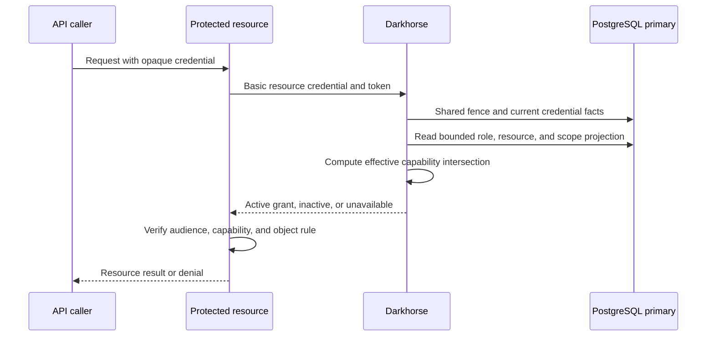

# Resource-server introspection

[Personal API keys](personal-api-keys.md) use this authenticated endpoint, with their own application/resource ceilings and lifetime policy. Their active response omits OAuth client and scope fields. Expiring keys include `exp` and nonexpiring keys omit it.

A protected API can now authenticate to `POST /introspect` with a dedicated
resource credential. Darkhorse returns the intersection of current role grants,
resource exposure, delegated scopes and the token's immutable capability ceiling.
The API checks that result for each protected request. Application ownership,
client registration and administrator membership confer no resource capabilities.

This complements [resource issuance](resource-issuance.md). OAuth clients retain
[identity introspection and owned-token revocation](token-checks.md). Resource
credentials have a separate authentication purpose and cannot redeem codes,
revoke tokens or administer the server. UserInfo rejects resource access tokens.

## Register and rotate an introspection credential

First register an application and protected resource using the
[registration API](registration.md). A live platform-administrator browser session
is required to manage its introspection credential. Writes require authentication
within the last five minutes, the configured Origin and `X-Darkhorse-CSRF: 1`.
They recheck that authority inside the committing transaction.

Send JSON to `POST /api/admin/resource-introspection`:

```json
{
  "operation": "register",
  "application_id": "<application UUID>",
  "resource_id": "<resource UUID>"
}
```

The response contains `application_id`, `resource_id`, `introspection_client_id`,
`active`, `revision`, `secrets` and a one-time `secret`. The client ID is
`rs_<resource UUID>`. The secret contains 256 random bits encoded as 64 lowercase
hexadecimal characters. Only its purpose-separated SHA-256 verifier is persisted.
Store the secret in the resource server's protected configuration. Never put it in
frontend code, browser storage, command-line arguments or logs.

`GET /api/admin/applications/{application}/resources/{resource}/introspection`
returns the same metadata without the secret. Secret metadata includes only its
public ID, creation time and optional expiry in Unix milliseconds. Neither reads
nor errors reveal a secret or verifier. All these responses forbid caching.

| Operation    | Additional JSON fields        | Result                                                                           |
| ------------ | ----------------------------- | -------------------------------------------------------------------------------- |
| `register`   | None                          | One active resource identity and a new secret. Duplicate registration conflicts. |
| `rotate`     | `revision`, `overlap_seconds` | New secret. Previous current secret expires after 0–300 seconds.                 |
| `set_active` | `revision`, `active`          | Disable or activate the identity. Disabling retires all secrets.                 |

Every operation includes both target IDs. Revisions start at zero. Supply the
latest revision for updates. A stale revision returns 409. An application/resource
mismatch returns 404. Unknown fields and malformed IDs return 400. Unauthenticated
requests return 401. Insufficient or stale administrator authority returns 403.
Unavailable storage returns 503.

Rotation retains at most one current and one overlapping secret. A subsequent
rotation retires any earlier overlap. Zero overlap immediately invalidates the
previous secret after commit. To restore a disabled identity, rotate it in the disabled state, then activate it using the returned revision. Retired secrets never become
valid again. A lost one-time response requires a new rotation after reading the
current revision. Concurrent rotations have one winner.

Registration, rotation and active-state changes commit with an immutable audit
record identifying the verified administrator, resource, revision, event and time.
Audit failure rolls back the entire change. IDs and owning application are immutable.
The body limit is 2048 bytes, with 16 concurrent administrator-route admissions
per replica. There is no management console form for this lifecycle yet.

## Backend protocol and authorization

Use TLS and HTTP Basic with the `rs_` client ID and resource secret. Send one
`token` field in an `application/x-www-form-urlencoded` body. The common
[introspection transport limits](token-checks.md#protocol-endpoints) apply, including
rejection of Origin/Cookie headers, query credentials, duplicate fields and body
authentication. Token hints cannot change a credential's purpose.

A successful response has this shape:

```json
{
  "active": true,
  "token_type": "Bearer",
  "iss": "https://identity.example",
  "aud": "urn:darkhorse:resource:<resource UUID>",
  "client_id": "<issuing OAuth client UUID>",
  "sub": "<principal UUID>",
  "scope": "openid operate",
  "iat": 1789747200,
  "exp": 1789747500,
  "capabilities": ["<effective capability UUID>"]
}
```

The capability IDs are sorted and represent current effective permissions. Scope
text is the immutable delegation request, not proof of current permission. Do not
infer permissions from a role name, scope name or `active` alone. Verify the exact
issuer and audience, expiry and required capability. Apply object-specific rules
in the consuming service. Treat any failed or unavailable check as denial.

The resource can inspect tokens issued by registered OAuth clients for exactly its
own audience. Tokens for another resource or UserInfo, revoked/expired credentials,
invalid sessions, removed consent and empty effective grants return only
`{"active":false}`. JWT ID/Logout Tokens, codes and unknown strings receive that
same inactive response. Invalid resource authentication returns 401 even for an
unknown token. Unavailable authoritative state returns 503. There are no profile,
role, secret or verifier fields. This endpoint implements the authenticated
resource-server boundary described in [RFC 7662](https://www.rfc-editor.org/rfc/rfc7662.html#section-2).



The resource performs a new check for each protected request. Its later business
write remains a separate transaction.

## Freshness, persistence and performance

Apply migration `0011_resource_introspection.sql` explicitly with `make db-migrate`.
It adds dedicated resource identities, verifier lifecycle and audit tables, and a
public internal credential ID to existing access rows. It grants no new permissions
to existing tokens. Runtime needs SELECT/INSERT/UPDATE on the resource identity
and secret tables, INSERT on their audit table and the existing primary authority/read permissions.
Identity columns require no direct sequence grant. Apply the complete
[reviewed grant policy](database-authority.md). Keep schema ownership and audit
update/delete privileges separate from runtime. The backfill and unique index require deployment planning for
large token tables. Zero-downtime migration is not established.

Each check starts a primary PostgreSQL transaction and acquires the shared security
state fence before authenticating the resource. It locks the token's code and
access record, then rechecks registration, the original session/credential epoch,
consent and current bounded policy. It calls the existing pure
`effective_capabilities` computation. The token and resource-secret time limits are
checked after potentially blocking reads. Policy writes acquire the exclusive
fence before changing authority. Token revocation locks the same code first.

A check begun after a revocation or permission reduction commits observes it.
Overlapping checks can finish under the earlier state before that mutation commits.
Introspection does not make an application's later business write atomic with the
identity check. Never reuse a positive result for a new authorization check.

No Redis positive cache, stale replica or per-check usage/audit write is used.
Checks do not extend the browser session's idle lifetime. Projection limits remain
256 currently exposed capabilities, 64 assigned roles and 32 requested scopes.
Historical ceiling IDs are bounded to 256. Retained definitions allow retired
capabilities to disappear from an effective set without discarding unrelated valid
permissions. Oversized or unreadable policy returns 503 instead of truncated access.

The shared fence, multiple database reads and catalog construction need sustained
load/contended-write measurement before cache work. Token routes have bounded HTTP
admission and deadlines, but no distributed introspection attempt budget yet.
Retention, ingress abuse controls and production resource sizing remain required.

## Verification

`make test-resource-introspection` runs source-defined application, entropy,
transport and projection tests without services. `make test-postgres` exercises
live role/scope/binding reductions, frozen ceilings, retirement, revocation,
audience separation, administrator revalidation, lifecycle races, audit rollback,
expired authentication after a blocked read and unavailable/oversized policy.

`make test-browser` registers two applications and resources, obtains consent and
opaque tokens through one HTTPS browser session, and checks both from a test-only
backend reference client. It verifies cross-audience denial, live capability loss,
rotation, disablement and committed revocation. Selected policy fixtures are constructed in the disposable database. The
[catalog API and console](catalog-administration.md) provide authenticated management.
Broader CLI catalog commands remain planned. The test reports ten sequential complete HTTPS/Basic/primary-policy timings
with the existing login limiter and HTTP admission retained. These local samples
are instrumentation evidence, not a throughput claim or production SLO.

See [verification](verification.md) for the current dated baseline and coverage scope.

Full authored-code coverage, provider conformance, broader failure/secret-log
qualification, retention and production-load evidence remain tracked in
[issue #9](https://github.com/OneTesseractInMultiverse/darkhorse-identity/issues/9).

## Source reference

[resource token checks](../crates/adapters/src/postgres/tokens/resources.rs),
[HTTP protocol](../crates/adapters/src/token_http/mod.rs).
