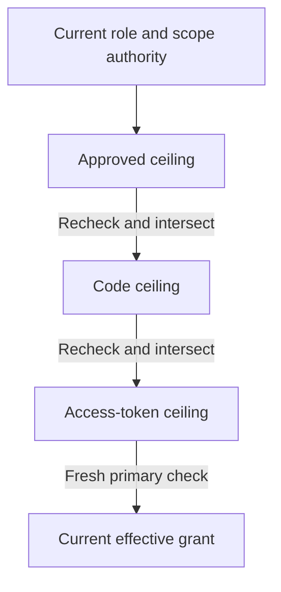

# Resource token issuance

Resource authorization requests now use persisted roles, capabilities and scope
mappings to issue opaque access credentials for one registered resource. The
adapter calls the existing pure `plan_oauth` engine. Client registration, application
ownership and platform-administrator status cannot grant resource permissions.

[Resource-server introspection](resource-introspection.md) now authenticates dedicated
resource credentials and recomputes effective capabilities for API authorization.
[Catalog interfaces](catalog-administration.md) manage policy definitions and
application bindings. UserInfo rejects
resource credentials. Issuing-client identity introspection returns inactive for
them. The issuing client can revoke them. See [identity checks](token-checks.md).

## Request and grant profile

- A request includes `openid`, at least one registered resource scope, and exactly
  one `resource` matching the registered `urn:darkhorse:resource:<UUID>` audience.
  Clients are currently restricted to resources in their owning application.
- The resource profile accepts up to 32 scopes, each at most 100 ASCII bytes. It
  cannot include `profile`, `email`, `address`, `phone` or `offline_access`. Obtain
  UserInfo credentials through the separate identity profile.
- Consent displays the registered client, requested scopes and resource. Every
  resource request requires fresh approval. Remembered scope consent alone cannot
  approve a new capability grant. A logged-in `prompt=none` request returns `consent_required`.
- Approval evaluates current assignments and freezes their intersection with the
  resource capabilities and registered scope limits. It records the resource,
  principal credential epoch and nonempty capability ceiling in the same
  transaction as approval and its audit event.
- Code issuance evaluates current authority against the approval ceiling. Token
  redemption evaluates it again against the code ceiling. Permissions can narrow
  at each stage. Later additions cannot broaden the earlier approval. Empty grants
  fail. Changed registration, withdrawn scope consent or invalid sessions deny.
- The token request may omit `resource` or repeat the exact bound audience. Another
  target returns `invalid_target` before code consumption or replay revocation. Multiple
  resource parameters are rejected.
- A resource access credential has a five-minute lifetime, one audience, immutable
  scopes and capabilities, and no UserInfo claim ceiling. The signed ID token still
  describes the authentication event for the client. Opted-in clients can receive [session-bound refresh tokens](refresh-tokens.md).
  Each rotation can only retain or narrow the previous grant.

Scope text identifies the selected delegation limits. It is not proof that a user
holds every capability named by a scope. Resource introspection returns
only the effective intersection of current authority and the token's immutable
ceiling. Consuming APIs must check that result and the intended audience.

The single-resource profile and optional token-request resource follow the
[resource indicator specification](https://www.rfc-editor.org/rfc/rfc8707.html).
Basic client authentication, mandatory S256, single-use codes, issuer binding and
replay handling remain as described in the [provider contract](provider.md).

Each transition can retain or reduce authority. Later additions cannot exceed
an earlier immutable ceiling.

## Persistence and consistency

Migration `0010_resource_authority.sql` adds explicit capability/application and
role/application bindings, role capabilities, resource capabilities, scope
capabilities and principal/application/role assignments. Foreign keys prevent
cross-application substitutions. Deferred checks require every capability in a
role to be bound to each application where that role is available. Role identities
are immutable. Capability identities and meanings retain their existing immutable
and terminal-retirement constraints.

Access-token inserts require a consumed code, the same identity/resource profile
and target, and scopes and capabilities within that code's ceilings. PostgreSQL
enforces this independently of the application computation, including the nullable
identity profile. Existing code/token immutability prevents later grant rewrites.

New graph writes acquire the shared authority mechanism's exclusive writer lock
before changing rows. Their revision advancement and immutable policy audit commit
together. Audit failure rolls the change back. Low-level policy audit identifies the database role. The implemented catalog
commands add verified browser actor and session attribution within their committing
transaction. Raw SQL remains a deployment trust boundary, not a supported
management interface. Integration fixtures construct selected policy states directly.

An authorization request captures the policy revision at creation. If it changes
before approval, approval fails and the user must start a new request. This prevents
changed scope meanings or role grants from expanding what was presented. The
revision is currently global, so unrelated policy changes can invalidate a
pending resource request. After approval, later changes are evaluated within its
frozen ceiling rather than invalidating from the global revision alone.

Consent, code issuance and redemption read the PostgreSQL primary under a shared
security-state lock. Graph writers serialize against those reads. A redemption
started after a permission reduction commits observes the reduction. One already
holding the shared lock can finish before that change commits. No positive decision
or permission ceiling is loaded from Redis. This does not close the separate gap
between a resource authorization check and an application's protected write.

Apply migrations explicitly using `make db-migrate`. Existing identity codes and
tokens retain their identity-only constraints. Old pending resource requests without
a recorded policy revision cannot be approved. The runtime never seeds role assignments automatically. Its protected
[administrative APIs](catalog-administration.md) manage the catalog after login.

## Bounds and performance

The adapter loads a target-specific projection rather than the entire organization:
up to 256 nonretired resource capabilities, 64 assigned roles for that principal and
application, and the requested registered scopes. Queries fetch one extra result
to detect an oversized projection and fail closed. They never truncate authority
into an apparently valid grant. Role and scope capability arrays are intersected
with the bounded resource set before transfer from PostgreSQL.

Indexes support target, assignment and reverse binding lookups. Deferred role
validation inspects bindings affected by the changed row. The shared security-state
fence still serializes policy writes against issuance transactions, including
signing. These bounds provide predictable input sizes, not a throughput guarantee.
Contention, database query plans at scale and sustained-load behavior require
measurement before changing the consistency design or adding caching.

## Verification and remaining work

The latest combined results, including resource-server checks, are recorded in
[resource introspection verification](resource-introspection.md#verification).

`make test-provider` exercises source-defined scope and binding tests without
services. `make test-postgres` verifies frozen consent, permission reduction and
expansion, role requirements, retirement, scope/consent withdrawal, replay,
cross-application constraints, audit rollback, a concurrent permission reduction,
oversized projections and an HTTP authorization/consent/exchange flow. That flow
verifies wrong-resource rejection, UserInfo/ID-token separation, inactive
identity introspection and resource-token revocation. `make test-browser` verifies identity and two-resource checks through the static
portal over HTTPS. See [resource introspection verification](resource-introspection.md#verification).

[Verification](verification.md) records current evidence and incomplete coverage.
Remaining issuance qualification belongs to [issue #8](https://github.com/OneTesseractInMultiverse/darkhorse-identity/issues/8).
Resource checks belong to [#9](https://github.com/OneTesseractInMultiverse/darkhorse-identity/issues/9).
The catalog console is implemented under [#16](https://github.com/OneTesseractInMultiverse/darkhorse-identity/issues/16).
Broader operator commands remain in [#26](https://github.com/OneTesseractInMultiverse/darkhorse-identity/issues/26).
Issuance tests do not establish provider conformance or production readiness.

## Source reference

[resource authority](../crates/adapters/src/postgres/resource_authority/mod.rs),
[bounded projection](../crates/adapters/src/postgres/resource_authority/projection.sql).
