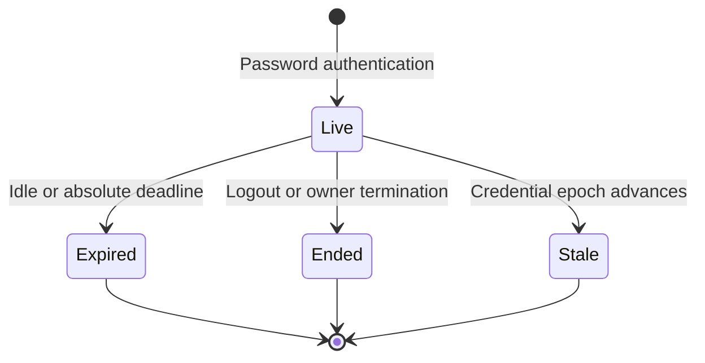

# Self-service session management

Signed-in users can open **Manage sessions** from the portal to review their own
Darkhorse sign-ins at `/security/sessions`. The table shows start time, last
session activity, current-session identity and active/inactive status. Times are
shown in UTC. Each active row has a confirmation dialog for ending that session.
No device identity is inferred from browser headers. This feature does not collect
IP addresses or user agents.

## Authority and browser contract

A live browser session authorizes listing and ending sessions belonging to the
same principal. Request bodies cannot select the acting user. Public session UUIDs
are references independent of the secret browser handle and its stored verifier.
A UUID cannot authenticate a request. The directory never returns either secret.

This initial self-service action requires no additional password prompt. It only
reduces access: possession of a stolen live session can end that user's other
sessions. Credential changes, recovery, email changes, privileged administration
and operator access require their separate assurance contracts. This endpoint
provides no bulk, administrator or cross-user termination operation.

| Endpoint                                    | Contract                                                                                     |
| ------------------------------------------- | -------------------------------------------------------------------------------------------- |
| `GET /api/security/sessions`                | Current public session ID, up to 25 history records, optional continuation cursor.           |
| `GET /api/security/sessions?after=<cursor>` | Next older page for the same authenticated owner.                                            |
| `POST /api/security/sessions/end`           | JSON `{"session_id":"<public UUID>"}`. Success is `{"current":true}` or `{"current":false}`. |

Unsafe methods require the configured HTTPS origin, canonical Host and
`X-Darkhorse-CSRF: 1`, using the existing first-party browser protections. Cookies
are Secure, HttpOnly, SameSite=Lax and host-only. Responses use `Cache-Control:
no-store`. Inputs reject extra body fields, ambiguous cookies and malformed IDs.
Each route group has 16 process-local request slots, a ten-second deadline and a
1 KiB body limit. These bounds are admission controls, not deployment-wide rate
limits. Sustained abuse/load qualification remains open.

An invalid or stale actor returns `401` and clears its cookie. Unknown and foreign
session references both return the same `404`. Ending another session preserves
the caller's cookie. Ending the current session clears it and removes the table.
Dependency/transaction failures return fixed errors without internal details.

A lost response does not establish whether the transaction committed. The console
never retries termination automatically. It disables further terminations until a
successful fresh session list reconciles current state. A failed refresh cannot
remove that restriction. Repeating an already-ended owned session from a different
live session succeeds without another audit event. A revoked actor cannot use this
idempotency behavior to authenticate itself.

A fresh password login creates a new session. Reactivating an account does not
restore an earlier epoch or ended session.

## Consistency and persistence

Policy computations live in the domain. The application exposes a narrow
`SessionManagement` port. The PostgreSQL adapter coordinates transactions and the
Axum adapter translates the first-party HTTP contract. The static TypeScript
console uses injected API ports. Future console/CLI account workflows must reuse
shared policy and use cases and enforce their own approved actor assurance.

Management reads first acquire the shared security fence in a separate statement,
then read current primary state and verify the actor. Mutations use a short
read-only preflight to reject unknown/foreign targets or resolve an already-ended
session without taking the global exclusive fence. The preflight is never final
mutation authority: a new transaction acquires the exclusive fence, rechecks the
actor and owner, locks the target and rechecks actor expiry after lock waits.
Revocation and its audit record commit together. An audit failure rolls back the
whole transition.

Login establishment/replacement and ordinary logout use the same exclusive fence.
The current-session check takes the shared fence and reads database time after
its session row lock before updating activity. Existing token issuance,
introspection and refresh paths already consult the original session under the
shared fence. Once termination commits, new checks reject its codes, access and
refresh credentials. No positive authorization cache or read replica can accept
revoked state. A check serialized before termination may finish first. This does
not retract a response already in flight.

Ending a session does not remove another application's cookie, retract an issued
ID token or deliver a logout notification. Signed back-channel logout and its
reliable delivery remain [issue #14](https://github.com/OneTesseractInMultiverse/darkhorse-identity/issues/14).

The directory uses a `(principal_id, created_ms DESC, public_id DESC)` index and
fetches at most 26 records to return 25 plus a continuation indicator. The cursor
is the last returned timestamp and canonical UUID. It is bounded to 128 query
bytes and cannot change ownership scope. New sessions appear after refreshing the
newest page. Each page is a current view, not a stable snapshot across requests.
Listing never extends the idle lifetime. Table metadata never authorizes access.

Global writer serialization favors immediate revocation correctness. These
additional authentication writes and primary round trips need workload benchmarks
before a throughput claim. Redis continues to serve shared login attempt limiting.
It does not cache these positive security decisions.

### Audit semantics

Session audit records contain event, principal, public target/actor session IDs
and database time. They contain no raw handle, token, password or verifier.

- `created`: password-verified session establishment. Actor session is absent.
- `replaced`: the prior handle presented during successful password login was
  ended. Its own public ID records handle possession, including an expired handle.
  It does not assert a live authenticated actor for that previous account.
- `signed_out`: the presented handle was ended. The actor reference identifies
  that handle's session, including expired handles without authentication authority.
- `session_ended`: a currently authenticated owner ended the selected session.

Owner-bound foreign keys protect references. Session identifiers, ownership,
credential bindings, creation time and absolute expiry are immutable. Activity
cannot move backward and revocation is terminal. Ordinary DML cannot update or
delete audit records. Schema owners can bypass supported operations. This is not
an externally tamper-evident audit system.

## Upgrade and operations

Apply `0013_session_management.sql` explicitly with the migration command before
starting the new version. Use a maintenance window and validate the migration on
a restored backup. Mixed old/new application versions are unsupported. The
migration assigns independent public IDs to existing sessions without rotating
their cookies. Historical events are not fabricated for pre-existing sessions.
The new index and UUID backfill require storage and can lock a large table.

Runtime requires the existing session permissions, SELECT/INSERT on
`session_audit` and lock-capable access to `security_state`. Identity columns
require no direct sequence privileges. Use the implemented
[database role separation](database-authority.md). Migration ownership stays separate
from routine application access.

Only queries and individual transitions are bounded today. Session history and
audit storage still grow. No automatic retention or deletion is implemented.
Audit foreign keys retain referenced sessions, so retention must account for these
references and existing code/token bindings. Monitor storage growth and qualify a
retention/export policy before long-running production deployment.

## Verification and remaining work

`make test-sessions` runs source-defined, service-free policy, transport and UI
tests. `make test-postgres` exercises owner isolation, indexed pagination,
atomic audit rollback, no resurrection, concurrent termination, actor revocation
between preflight and mutation, expiry during lock waits and immediate token
invalidation. `make test-browser` verifies the static HTTPS page in two browser
contexts, confirmation/cancellation, lost-response reconciliation, cookie removal
and mobile overflow bounds. The browser scenario lets the real login budget expire
naturally before additional sign-ins. It does not disable the limiter.

This implements the session-management part of
[issue #13](https://github.com/OneTesseractInMultiverse/darkhorse-identity/issues/13).
[Invitations](invitations.md), [verification](email-verification.md), and protected
SMTP delivery are implemented. Recovery, email changes, account-security
notifications, and privileged assurance remain open. Complete
authored-code coverage, cross-browser/accessibility testing, restart/failure
qualification, sustained concurrency benchmarks and retention remain unfinished.

Security basis: [OWASP session management](https://cheatsheetseries.owasp.org/cheatsheets/Session_Management_Cheat_Sheet.html)
and [authentication guidance](https://cheatsheetseries.owasp.org/cheatsheets/Authentication_Cheat_Sheet.html).

## Source reference

[session policy](../crates/domain/src/sessions.rs),
[session transactions](../crates/adapters/src/postgres/sessions/mod.rs).
