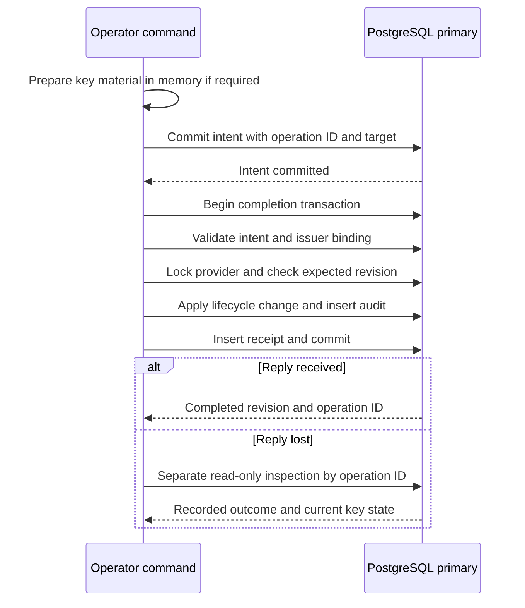

# Signing operation reconciliation

Key generation, import, activation, and retirement record durable intent before
changing provider state. The key change, existing lifecycle audit, and completion
receipt commit in one PostgreSQL transaction. This contract addresses interrupted
commands and lost commit replies under
[#23](https://github.com/OneTesseractInMultiverse/darkhorse-identity/issues/23).

The journal identifies a database login. It does not authenticate a human or grant
emergency authority. [Operator authority](operator-authority.md) and
[database grants](database-authority.md) define the remaining trust boundary.

## Transaction boundaries



An intent contains the command, issuer, public key ID, expected revision, operation
UUID, database session role, and preparation time. PostgreSQL supplies the role and
time. The journal stores no private key, wrapping digest, password, or token.
Generation and import prepare their encrypted material in memory before intent.
An unsuccessful preparation has no durable provider effect.

The completion transaction checks the recorded fields and session role. It creates
or validates the issuer binding, then locks the provider row. Revision and clock
checks run after lock acquisition. Lifecycle policy retains the publication wait,
verification overlap, key capacity, and active-key retirement restrictions described
in [the provider guide](provider.md).

A receipt references the lifecycle audit. Database constraints bind its target,
revision, event, issuer, role, and timestamps to the intent and provider state.
Audit or receipt failure rolls back the binding and key change. A lost commit reply
returns an uncertain outcome and the operation ID. No automatic retry occurs.

`operator signing status` retains its existing behavior. It can initialize the
provider binding and requires confirmation. HTTP startup validates the same binding.
Neither path creates a signing-operation receipt. Historical changes receive no
invented receipts during migration.

## Inspection

Use the `operation_id` from success or failure output:

```sh
darkhorse-server --output json operator signing inspect <operation-id>
make signing-inspect OPERATION_ID=<operation-id>
make stack-signing-inspect STACK=<stack-name> OPERATION_ID=<operation-id>
```

Direct inspection needs only database configuration and the reviewed operator
SELECT grants. It requires no confirmation, public-origin setting, wrapping key,
Redis, or running HTTP server. The local Make target reads the prepared database
configuration. The Compose target uses the existing operator workload and its
mounts. Inspection never reads its signing secret.

The query reads one primary snapshot. Its fields distinguish historical evidence
from current state:

| Field                                | Interpretation                                                                |
| ------------------------------------ | ----------------------------------------------------------------------------- |
| `recorded_outcome=pending`           | Intent exists, no receipt is visible in this snapshot                         |
| `recorded_outcome=completed`         | Binding, lifecycle change, audit, and receipt committed through this workflow |
| `expected_revision`                  | Revision requested by the original command                                    |
| `completed_revision`, `completed_ms` | Historical completion, or null for pending intent                             |
| `current_revision`, `current_phase`  | Current matching provider and key, or null before creation                    |
| `database_role`, `prepared_ms`       | Login boundary and database preparation time                                  |
| `database_ms`                        | Time of this observation                                                      |

A completed activation can now refer to a retired key. A pending record does not
prove a stopped operation: a concurrent completion might still commit. An absent
record does not prove a running intent transaction will never commit. Stop or
establish completion of the original process and transaction before considering
another mutation. Inspect the original ID again and read current signing status.
Use a fresh operation and revision only after resolving that uncertainty.

If the process lost all output, an authorized operator can find recent intent IDs
through a protected database session. The CLI has no bulk export command:

```sql
SELECT operation_id, operation, issuer, kid, expected_revision, prepared_ms
FROM signing_operation_intents
ORDER BY prepared_ms DESC, operation_id
LIMIT 20;
```

Correlate the command, target, revision, login, and time with the original execution.
Similar concurrent commands may require external execution records. A missing
receipt never justifies bypassing a lifecycle wait or blindly repeating an import.

## Upgrade and access

Stop serving and finish operator jobs before migrating. Apply embedded migration
`0024` as the schema owner, then reapply `deploy/grant-runtime.sql`. Review both
changes before restarting. Existing databases are not migrated by builds or tests.

The nonowner operator receives journal SELECT and column-scoped INSERT. PostgreSQL
owns role and timestamp fields. Runtime receives no journal grants. Neither
nonowner can edit, delete, or truncate these records. Reapplying grants removes
unexpected direct privileges in the same transaction.

Operator credentials still permit direct provider/key/audit writes. Constraints do
not prove a human used the CLI, and privileged SQL can fabricate evidence. Database
owners and hosts remain trusted. Inspection has no per-read actor authentication
or audit. Protected audit access, retention, export, independent evidence, migration
reconciliation, and privileged assurance remain unfinished in #23.

## Verification

`make test-unit` checks coordinator ordering, no retry, metadata validation, output,
CLI parsing, and launcher arguments without external services. `make test-postgres`
checks real transactions, concurrent revision conflicts, lifecycle waits, upgrade,
audit rollback, receipt rollback, failed commits, and discarded COMMIT replies.
It runs authenticated operator/runtime CLI and grant checks through
`make test-db-authority`'s fixture. Deployment suites exercise the packaged commands.
These checks do not establish production qualification or tamper-proof evidence.
