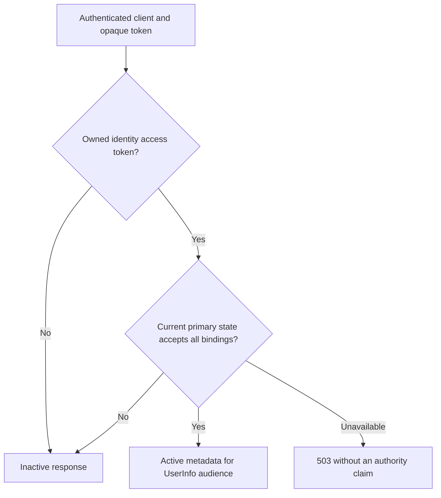

# Identity claims, introspection and revocation

The implemented profile covers opaque access credentials whose audience is the
canonical issuer followed by `/userinfo`. A confidential client can introspect or
revoke only the credentials issued to that client. These credentials have no
resource capabilities and cannot authorize an application's protected API.
The separate [resource issuance profile](resource-issuance.md) creates credentials
with capability ceilings. UserInfo rejects them and this identity introspection
profile returns inactive for them. Dedicated [resource-server credentials](resource-introspection.md)
provide current capability checks for protected APIs.
The issuing client can revoke its resource credentials through the same endpoint.

## Shared introspection admission

`/introspect` requires the [deployment and authenticated-caller budgets](introspection-admission.md)
in addition to transport bounds. An exhausted budget returns HTTP 429 with a
bounded `Retry-After`; uncertain or unavailable enforcement returns HTTP 503.
Clients must deny the protected operation when a current decision is unavailable.
Honor the retry delay and apply bounded backoff; never replace an unavailable check
with a previously accepted positive result. Invalid client authentication keeps
the generic HTTP 401 contract. UserInfo, code exchange and revocation do not consume
these introspection quotas.

## Approved identity claims

Every identity authorization request includes `openid`. It may request
`profile` and `email`. Resource scopes use the separate resource profile.
Consent displays the requested scopes. Both the code and access credential retain
immutable approved scopes, and the access credential records its claim ceiling.
Adding scope support never expands an already-issued credential: migration 0009
preserves existing codes/tokens as `openid` and `sub` only.

| Scope     | UserInfo claims                         |
| --------- | --------------------------------------- |
| `openid`  | `sub`                                   |
| `profile` | `name`, `given_name`, `family_name`     |
| `email`   | `email`, authoritative `email_verified` |

Profile values come from the current directory record. Email ownership comes from the current persisted [email verification](email-verification.md) state. Existing accounts start unverified and changing an email clears its proof. Country, phone, secondary names,
bio, and pictures exist in the [private profile API](profiles-and-media.md).
The current UserInfo projection does not disclose those fields. Unapproved fields are omitted from the
response and are not selected by the profile query. ID tokens retain their
existing authentication-event claims. These new profile values appear in UserInfo.
The mapping follows [OIDC scope claims](https://openid.net/specs/openid-connect-core-1_0.html#ScopeClaims).

A broader remembered consent does not broaden old token ceilings. Replacing that
consent with narrower scopes invalidates tokens needing a removed scope. Those
access tokens stay invalid. The server does not silently rewrite their immutable
grant. Opted-in clients may explicitly request narrower scopes through the
[refresh flow](refresh-tokens.md), or complete a new authorization flow. Removing a consent record likewise invalidates its
tokens. Consent reduction is rechecked at redemption, UserInfo and introspection.

## Protocol endpoints

Both `POST /introspect` and `POST /revoke` require HTTPS,
`client_secret_basic`, and an `application/x-www-form-urlencoded` body containing
one nonempty `token`. The optional `token_type_hint` is accepted as a hint and
ignored when identifying the actual opaque credential format. It cannot
convert an ID token, Logout Token, code or session handle into an access token.
Opted-in clients receive [refresh credentials](refresh-tokens.md). Introspection
returns inactive for them. Authenticated revocation terminates the owning family
and invalidates all of its access tokens.

The body is capped at 4096 bytes and 16 pairs. Token text is capped at 2048 bytes.
Duplicate parameters/authentication headers, body client authentication, query
credentials, Origin and Cookie headers are rejected. These are backend endpoints,
with no browser CORS support. The route group retains 16 concurrent admissions per
replica and the transport deadline. It does not yet have a distributed token-route
attempt budget. Discovery advertises only the implemented endpoints and Basic
method. All outcomes use `no-store` and `Pragma: no-cache`.

Introspection authenticates the client even for unknown or wrong-purpose token
values. Invalid client authentication returns 401. An authenticated caller receives
only `{ "active": false }` for a foreign, unknown, revoked, expired or stale token.
An active response contains `active`, `token_type`, `iss`, `aud`, `client_id`, `sub`,
`scope`, `iat` and `exp`. It contains no names, email, roles or capabilities.
Unavailable primary state returns 503, rather than a guessed active/inactive result.
Clients must enforce the returned audience. Active does not grant access to another
API. See [RFC 7662](https://www.rfc-editor.org/rfc/rfc7662.html#section-2).

Revocation authenticates the caller and verifies token ownership. Revocation and its
critical audit event commit atomically. Audit failure rolls back and returns 503.
A successful response is empty HTTP 200. Unknown, foreign, wrong-purpose and
already-revoked credentials get the same response without changing another
client's state. Concurrent revocations write one audit event. Revocation covers owned resource credentials and works even
when the owned token has expired or its consent is no longer valid. The response
contract follows [RFC 7009](https://www.rfc-editor.org/rfc/rfc7009.html#section-2).
Revoking access does not retract an accepted ID token or terminate the identity
browser session. Signed back-channel logout remains separate work.

This diagram covers client identity introspection. Resource credentials and
personal keys use the separate resource-server projection.

## Freshness and transaction contract

A check begins a fresh PostgreSQL primary transaction and takes the shared security
state lock. It locates the credential under the required issuer/audience and caller
binding, then locks its code and access record in that order. It rechecks current
client/application revisions, live original browser session and credential epoch,
and the current consent row. Token time validity is checked after those potentially
blocking reads. UserInfo reads the approved profile fields in the same transaction.

Registration and directory mutations acquire the security state lock first.
Revocation takes the code update lock before changing access state. Checks use the
same order with shared locks. Consent rows are held with shared locks during a
check. The coherence contract depends on preserving this order in future mutation
ports. Replicas in recovery cannot supply authority. Redis and stale read replicas
are not consulted for positive access decisions.

A request begun after a relevant change commits observes the new state. A check
that overlaps a mutation may finish under the earlier state. The mutation cannot
invalidate facts halfway through that check's protected reads. An application
must not cache or reuse a positive introspection response for a new authorization
check. The response cannot close the gap between that check and an unrelated
application's later write. Object-specific rules remain in the consuming service.

Introspection and UserInfo perform no synchronous usage/audit writes and do not
extend browser idle lifetime. There is no last-used telemetry presented as exact
accounting. This avoids a write and hot counter on every read without weakening
revocation. Retention, ingress abuse controls, fault qualification, and sustained-load
measurement remain release requirements. Catalog management is implemented in the
[administrative console](catalog-administration.md).

## Verification

The latest combined results, including resource-server checks, are recorded in
[resource introspection verification](resource-introspection.md#verification).

`make test-provider` runs isolated policy, parser, projection and credential tests.
`make test-postgres` covers claim ceilings, consent reduction, caller isolation,
expiry and dependency failures, idempotent/concurrent revocation, audit rollback,
and a reader blocked on an uncommitted revocation followed by checks after commit.
It verifies introspection does not append token-audit rows.

`make test-browser` exercises two independently registered applications sharing one
login through verified HTTPS. One receives `sub` only. The other explicitly approves
names/email. It verifies signatures, scope separation, client-bound introspection,
foreign revocation isolation, wrong token types, CSRF boundaries and immediate
post-commit denial. The test-only reference client reports ten sequential full
HTTPS/Basic/primary-state timings. The login uses the existing Redis limiter.
Token routes retain their admission controls during the measurement. This small
development sample is instrumentation evidence, not a throughput benchmark or SLO.

The [consolidated verification reference](verification.md) records dated counts,
coverage denominators, and remaining qualification. Functional identity tests do
not establish complete provider conformance or production capacity.
