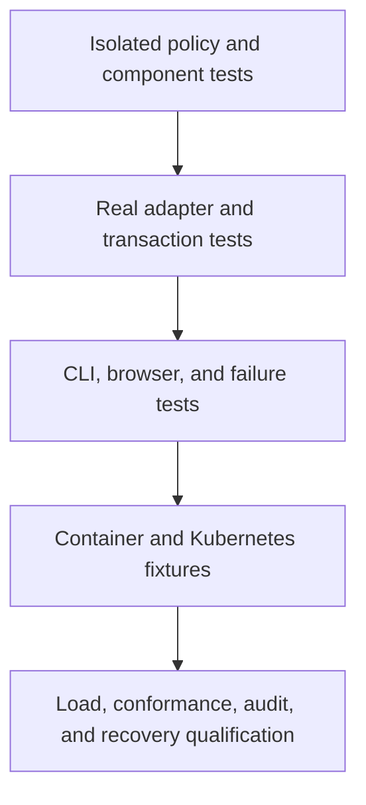

# Verification and evidence

Tests support specific claims at specific boundaries. Code coverage reports executed
paths. Neither metric proves protocol conformance, resistance to every attack, or
production readiness.

This guide separates reproducible commands from dated evidence. Run the relevant
checks after a behavior change. Documentation-only changes require formatting,
link, diagram, command-reference, and source-consistency checks.

## Test structure



Each level adds evidence. Passing a lower level does not imply success at a higher
one. The final level remains incomplete.

Unit tests mirror production paths under `tests/unit`. They define inputs and fakes
in source. Installed dependencies suffice. Unit tests do not read fixtures or local
settings, change process environment, call networks, or start services.

Rust module inclusion preserves access to private implementation details without
publishing test-only APIs. Frontend components use jsdom and fake API ports.
Integration suites own disposable services and clean only their own resources.

## Command map

| Command                       | Evidence                                                        | Prerequisites                               |
| ----------------------------- | --------------------------------------------------------------- | ------------------------------------------- |
| `make check`                  | Format, lint, types, architecture, isolated tests               | Installed locked dependencies               |
| `make ci`                     | Fast checks plus release and static builds                      | Same toolchain                              |
| `make test-postgres`          | SQL constraints, transactions, races, operator persistence      | Docker with Compose                         |
| `make test-db-authority`      | Reviewed grants and denied database operations                  | Docker                                      |
| `make test-redis`             | Shared budgets, continuity loss, TLS, uncertain writes, login   | Docker and OpenSSL                          |
| `make test-cli`               | Real parser, pipes, terminal restoration, cancellation          | Python 3 and POSIX host                     |
| `make test-operator-accounts` | Fresh operator authentication and shared budgets                | Database, Redis, and CLI test prerequisites |
| `make test-account-launcher`  | Account/catalog input, literal selectors, deadlines and cleanup | Local process toolchain                     |
| `make test-browser`           | Static console and protocol flows over verified HTTPS           | Pinned Chromium, Docker, OpenSSL            |
| `make test-media`             | Browser and real S3 adapter paths                               | Browser prerequisites                       |
| `make test-compose`           | Packaged HTTPS, roles, failure handling, isolated restore       | Built application image and Docker          |
| `make test-kubernetes`        | Two replicas, policies, Jobs, isolation, runtime behavior       | kind, kubectl, built images                 |
| `make test-release-tools`     | Git archives and release-tool failure handling                  | Git and Node                                |
| `make source-package-check`   | Selected Git tree and archive contents                          | Git and Node                                |
| `make audit-dependencies`     | Current Rust and JavaScript advisories                          | Network and pinned audit tools              |

`make help` lists focused policy suites and benchmark targets. `make browser-install`
installs the pinned browser. Integration prerequisites never become unit-test prerequisites.

## Security properties under test

| Property                | Representative evidence                                             | Practical limit                                             |
| ----------------------- | ------------------------------------------------------------------- | ----------------------------------------------------------- |
| Permission intersection | Exhaustive small-set properties and mutation checks                 | Does not prove transport authentication                     |
| Immediate revocation    | Primary reads, shared/exclusive fences, concurrent writers          | Does not control work already accepted by a resource server |
| One-time consumption    | Code, proof, and refresh transaction races                          | Lost responses still create caller uncertainty              |
| Shared login budgets    | Separate processes, boundary times, Redis failures                  | No multi-host capacity or adversarial traffic certification |
| Credential isolation    | Purpose-separated digests, redacted output, role-denial tests       | Database owners remain trusted                              |
| Browser boundaries      | Origin, CSRF, cookies, secret clearing, HTTPS checks                | Chromium coverage is not cross-browser certification        |
| External effects        | Media orphan cleanup, SMTP leases, limiter journal faults           | No atomic commit across independent services                |
| Packaging               | Nonroot, read-only runtime, dropped capabilities, isolated recovery | Fixture success does not qualify every production platform  |

The browser harness verifies its temporary certificate chain and hostname. Chromium
pins only that fixture's leaf key. Tests do not install global trust or disable all
certificate checks. Captured screenshots omit credentials. The suite does not retain
secret-bearing traces or videos.

## Coverage denominators

| Target                      | Scope                                                    | Interpretation                                                      |
| --------------------------- | -------------------------------------------------------- | ------------------------------------------------------------------- |
| `make coverage-core`        | Domain and application crates                            | Framework-free policy and orchestration only                        |
| `make coverage-rust`        | Rust libraries under isolated tests                      | External effects remain unexecuted                                  |
| `make coverage-web`         | Authored frontend unit/component scope                   | Excludes upstream button code and static build/layout configuration |
| `make coverage-postgres`    | Rust units, PostgreSQL, host operator, server executable | Does not cover every Redis or browser path                          |
| `make coverage-integration` | Rust units, PostgreSQL, Redis, operator execution        | Rust instrumentation does not measure JavaScript or Lua             |
| `make coverage-unit`        | Separate Rust and frontend unit reports                  | Not a whole-system percentage                                       |

The target remains **100% of authored executable logic**. Existing Rust line gates
remain at 100%. Partial reports must retain uncovered entrypoints and coordination
paths. Stable Rust's report does not provide branch coverage. Regions, functions,
lines, statements, and branches are different denominators.

Install optional instrumentation explicitly:

```sh
cargo install cargo-llvm-cov --version 0.9.1 --locked
rustup component add llvm-tools-preview
cargo install cargo-mutants --version 27.1.0 --locked
```

Mutation targets run an unmodified baseline first, then test selected source mutations.
A missed mutation requires investigation. A passing coverage percentage cannot clear it.

## Catalog detail authority after audit

A focused correction in [#26](https://github.com/OneTesseractInMultiverse/darkhorse-identity/issues/26)
adds a final current-authority check after audit insertion for application/client
`show`. Both a returned record and an authenticated not-found response require
that check. Failure rolls back the detail audit and returns a fixed denial.
No schema, grants, command syntax or launcher change is required.

On **2026-09-25**, `make ci` passed **614 isolated tests**, formatting, strict lint,
type and architecture checks, and release/static builds. The instrumented boundary
suites passed **241 PostgreSQL**, **5 Redis infrastructure**, and **31 limiter/native
operator** tests. The process-worker entry remains separately invoked and intentionally
ignored in ordinary enumeration. CLI subprocess and terminal checks also passed.

Two new PostgreSQL regressions failed before the correction. They now verify
membership removal, credential revocation, credential-epoch advancement, account
deactivation and proof expiry during audit execution. Each covers existing and
missing application/client targets. The expiry fixture starts with a live proof
and uses a nontransactional sequence to prove that audit execution was reached.
The native executable also rejects audit-time credential revocation under the
runtime role, without exposing a record or retaining a success/not-found audit.
Existing denial, suppressed-audit and lost-commit tests remain passing.

Combined Rust coverage is **16,131/16,956 lines (95.13%)**,
**2,251/2,324 functions (96.86%)**, and **26,742/29,775 regions (89.81%)**.
The unchanged **100% line gate fails**. Entrypoints and unexecuted coordination
remain in the denominator; stable Rust provides no branch report here. The detail
transaction module covers 87/87 lines, 18/18 functions and 165/173 regions. These
are combined execution measurements, not isolated unit or complete branch coverage.

The unchanged Compose/Kubernetes launchers were not requalified in this focused
correction; their preceding evidence is dated below. Persistent development data
is outside the disposable test fixtures. See the [catalog transaction contract](operator-catalog.md#authority-transaction-and-audit)
for output, rollback and uncertainty semantics. Broader catalog administration and
independent security/release qualification remain open.

## Authenticated CLI access-catalog listing

The next increment in [#26](https://github.com/OneTesseractInMultiverse/darkhorse-identity/issues/26)
adds resource/scope lists within an application and role/capability lists with an
explicit application or all-definitions selection. On **2026-09-24**, `make ci`
passed **614 isolated tests**: 214 adapters, 35 application, 111 domain, 143 frontend,
and 111 tooling tests, together with formatting, strict linting, type and architecture
checks and release/static builds. Tests cover invalid or ambiguous selection,
unsupported status filters, bounded pages, terminal escaping and metadata-only output.

The combined instrumented suites passed **239 PostgreSQL**, **5 Redis infrastructure**
and **30 limiter/native operator** cases. The separately invoked process-worker entry
remains intentionally ignored in the ordinary test enumeration. Native commands
succeed with client-secret SELECT revoked, require read-audit INSERT, deny demoted
application owners, share HTTP login admission and return exit `74` after a committed
read audit when stdout is closed. No command retries automatically.

PostgreSQL cases compare all six selections with the console's existing queries,
walk multiple bounded pages, distinguish bound, foreign and unbound definitions,
escape literal searches, filter retirement state and observe committed binding
removal. Missing targets, audit refusal/suppression and an actually lost commit reply
release no page. A regression case removes administrator membership during audit
insertion and verifies rollback before output for all catalogs, including existing
application/client lists. Migration `0031` preserves a historical ledger row,
retains append-only enforcement and rejects incoherent command/selector combinations.
Migration interruption/receipt expectations include the new step.

CLI terminal, launcher subprocess and release-tooling checks passed. Documentation
checks resolved **455 local links** and rendered **42 Mermaid diagrams**; the new
selection diagram was inspected. The focused Node unit report records 100% lines,
branches and functions for `access-catalog-plan.mjs`, `catalog-plan.mjs` and
`operator-options.mjs`. Transport, filesystem and orchestration effects are outside
that isolated Node report.

The rebuilt image passed full Compose and Kubernetes 1.36.4 qualification. All four
catalog Make targets exercised the six new selections, metadata fields, runtime-role
audits and demotion; one-shot commands succeeded with HTTP stopped. Compose's
quarantined restore retained 14 fixture principals and 20 catalog, 6 detail,
8 application, 6 client and 10 client-secret audit records. The Kubernetes run also
passed replicated OIDC, primary/limiter outages, rolling replacement, 18 fresh-Pod
backend denials with positive controls, and conditional cleanup. These local
fixtures do not establish production capacity, multi-host fault tolerance or
independent release/security qualification. The 792-file source archive also
passed its inventory/private-path checks.

The unchanged **100% combined Rust line gate fails**: measured scope is
**16,128/16,960 lines (95.09%)**, **2,251/2,326 functions (96.78%)**, and
**26,736/29,779 regions (89.78%)**. The report combines unit, PostgreSQL, Redis and
instrumented native-command execution; entrypoints and unexecuted coordination
remain in the denominator. Stable Rust reports no branch coverage here. The
initial native fixture used an incorrect secret-table name; it was corrected and
the full Redis/native suite rerun before reporting these results.

| Rust module                        | Lines   | Functions | Regions |
| ---------------------------------- | ------- | --------- | ------- |
| Domain catalog request/selection   | 21/21   | 4/4       | 26/26   |
| CLI catalog projection/coordinator | 91/91   | 11/11     | 184/187 |
| PostgreSQL catalog read/audit      | 119/121 | 23/23     | 220/231 |
| Shared CLI translation             | 196/200 | 15/15     | 232/237 |

These are combined module results, not claims of complete isolated unit or branch
coverage. Client creation, secret delivery/recovery, access-catalog detail/write and
binding commands, delegated management permissions and broader load/security
qualification remain open. See [access-catalog commands](operator-access-catalog.md)
for the supported interface and failure contract.

## Authenticated CLI client-secret inventory and retirement

The next [#26](https://github.com/OneTesseractInMultiverse/darkhorse-identity/issues/26)
increment adds explicit lifecycle inventory and revision-checked retirement, with
all four catalog Make launchers. On **2026-09-24**, isolated suites passed **608
tests**: 211 adapter, 35 application, 110 domain, 143 frontend and 109 tooling cases.

The combined instrumentation run passed **234 PostgreSQL**, **five Redis
infrastructure** and **29 limiter/operator** cases. The separately invoked child
worker is exercised by its parent multiprocess scenario. Tests cover historical
keyset pages, exact scope, current administrator authority, exhausted/stale and
competing HTTP/CLI revisions, terminal retirement, remaining-secret authentication,
proof expiry and demotion during fence waits, late authority loss, failed/suppressed
credential/revision/audit writes, deferred commit errors and actual lost commit
acknowledgements without retry. Migration `0030` preserves credential and prior
audit history; database checks reject incoherent actor/query/result facts.

Restricted-role native processes successfully list and retire with only lifecycle
columns readable from the client-secret table; an explicit verifier SELECT fails.
Denied audit INSERT rolls back retirement. The shared admission budget, demotion,
absence of browser-session creation and closed output after exactly one committed
retirement are exercised. CLI/terminal and launcher process suites pass bounded
input, confirmations, secret redaction, single execution, cleanup and both Make
argument-entry paths. Release-tool checks pass. Initial test fixtures violated
existing current-secret and verifier uniqueness constraints; corrected fixtures
preserve those production constraints and pass the combined run.

`make ci` passes formatting, strict lint, type/architecture checks and release/static
builds. The full HTTPS browser suite and rebuilt Docker image pass. Full Compose
and Kubernetes fixtures exercise inventory, retirement, stale revisions, observed
terminal status and administrator demotion through all four catalog Make targets,
including one-shot operation with HTTP stopped. Compose's quarantined restore
preserves ten fixture principals, four listing audits, six detail audits, eight
application mutation audits, six client mutation audits and ten client-secret
operation audits. Kubernetes also passes its two-replica, backend isolation,
outage, rolling-replacement and conditional-cleanup checks. These are local
fixture results, not production capacity or remote interruption qualification.

`make coverage-integration` **fails the unchanged 100% line gate** after its
behavioral suites pass. Combined Rust scope reports **16,055/16,880 lines
(95.11%)**, **2,244/2,318 functions (96.81%)** and **26,604/29,637 regions
(89.77%)**. Entrypoints and unexecuted coordination/failure paths remain in the
denominator; stable Rust provides no branch report here.

| New file scope       | Lines  | Functions | Regions |
| -------------------- | ------ | --------- | ------- |
| Domain request       | 27/27  | 4/4       | 32/32   |
| Application outcome  | 5/5    | 1/1       | 7/7     |
| Native command       | 88/89  | 11/12     | 148/152 |
| PostgreSQL operation | 98/103 | 19/19     | 148/159 |
| PostgreSQL audit     | 59/59  | 10/10     | 139/145 |
| PostgreSQL inventory | 51/52  | 5/5       | 108/120 |

These are measured file scopes, not complete subsystem qualification. Focused Node
unit coverage reports 100% lines, branches and functions for `catalog-plan.mjs`,
`client-secret-plan.mjs` and `operator-options.mjs`; it excludes deployment and
process effects. The global coverage gate remains open in #2. See
[client-secret operations](operator-client-secrets.md) for exact command, authority,
audit, migration and reconciliation contracts.

## Authenticated CLI client configuration updates

The client-update increment in [#26](https://github.com/OneTesseractInMultiverse/darkhorse-identity/issues/26)
adds complete configuration replacement through protected stdin and the four
catalog Make launchers. Verification on **2026-09-24** passed **598 isolated
tests**: 203 adapter, 35 application, 109 domain, 143 frontend and 108 tooling
checks. `make ci` passed formatting, strict linting, type/architecture checks and
release/static builds. Native CLI, terminal, launcher and release-tool checks passed.

The combined instrumentation run passed **224 PostgreSQL**, **five Redis
infrastructure** and **27 limiter/operator** cases. The separately invoked child
worker remains exercised by its parent multiprocess test. Cases verify shared
HTTP/CLI configuration rules, exact callback encoding, explicit refresh settings,
foreign/missing targets and allowances, owner-only denial, stale and competing
revisions, expiry/demotion during fence waits, authority loss during writes/audit,
suppressed parent/binding/audit writes, failed and actually lost commit replies,
and immediate rejection after client deactivation or allowance reduction.
Migration `0029` preserves earlier configuration and application audit history;
real runtime/operator grant checks preserve the privilege boundary.

Restricted-role native processes succeed after client-secret SELECT is revoked,
roll back when client-audit INSERT is denied and reject a demoted administrator.
Closing stdout after a successful update returns exit `74` with exactly one
revision increment and one successful operator audit. Default output excludes
configuration, credentials and secret metadata. Process tests also reject malformed,
oversized, incomplete and unconfirmed input before service access, and preserve
exact launcher arguments through both Make entry paths.

The rebuilt image passed the full Compose and Kubernetes fixtures. All four catalog
Make targets passed running-container and stopped-HTTP one-shot updates,
stale-revision rejection, administrator demotion and both committed audits.
Compose's quarantined restore retains eight fixture principals, four listing audits, six
detail audits, eight application mutation audits and six client mutation audits.
Kubernetes also passed its two-replica, outage, rolling-replacement and network-policy
checks. These fixtures do not establish production capacity or remote interruption
qualification.

The initial Redis run timed out during fault-fixture setup while builds ran in
parallel; subsequent runs passed without changing production limits. An earlier
browser run stopped on a boolean assertion in the directory checks; the traced
rerun passed the full HTTPS/browser suite without changing assertions or production code.

`make coverage-integration` **failed the unchanged 100% line gate** after all
behavioral suites passed. Combined Rust scope reports **15,666/16,484 lines
(95.04%)**, **2,190/2,263 functions (96.77%)** and **25,942/28,944 regions
(89.63%)**. Server entrypoints and unexecuted coordination/failure paths remain in
the denominator. Stable Rust supplies no branch report here.

| Measured new or extracted file         | Lines | Functions | Regions |
| -------------------------------------- | ----- | --------- | ------- |
| Domain client request                  | 22/22 | 3/3       | 30/30   |
| CLI client command                     | 68/68 | 11/11     | 106/107 |
| CLI protected input                    | 14/14 | 2/2       | 20/21   |
| Shared client input                    | 39/39 | 6/6       | 48/49   |
| PostgreSQL client mutation             | 72/74 | 15/15     | 90/94   |
| PostgreSQL client audit                | 37/38 | 8/8       | 88/95   |
| Shared catalog transaction coordinator | 54/57 | 6/7       | 83/92   |

These are measured file scopes, not complete subsystem coverage. Focused Node
unit coverage reports 100% lines, branches and functions for `catalog-plan.mjs`
and `operator-options.mjs`; process supervision and deployment effects are outside
that denominator. The global coverage gate remains open in #2. Client creation,
secret delivery/recovery and rotation, access catalogs, delegated permissions,
remote interruption, production capacity and independent security qualification
remain outside this increment. See the [client update contract](operator-clients.md).

## Authenticated CLI application writes

The application-write increment in [#26](https://github.com/OneTesseractInMultiverse/darkhorse-identity/issues/26)
adds complete create/update commands and extends all four catalog Make launchers.
Verification on **2026-09-24** passed 588 isolated tests: 195 adapter, 35 application,
108 domain, 143 frontend and 107 tooling checks. `make ci` also passed formatting,
strict linting, type and architecture checks, and release/static builds. The full
HTTPS browser, native CLI, terminal, launcher and release-tool suites passed.

The combined instrumentation run passed 216 PostgreSQL cases, five Redis
infrastructure cases and 25 limiter/operator cases. The ignored child-worker entry
is executed by its parent multiprocess scenario. Tests exercise shared HTTP/CLI
registration rules, concurrent edits at one revision, inactive/missing owners,
owner-only denial, proof expiry and demotion during lock waits, authority loss
during writes and audit insertion, entropy failure/collision, suppressed writes,
both audit failures and actual lost commit replies. Application deactivation
rejects previously issued tokens and client authentication after commit. Real
runtime/operator grants and migration `0028` preserve the authority separation and
historical configuration/audit records.

A real Rust subprocess verifies that closing stdout after creation returns exit
`74` with one committed application and one successful operator audit, without a
retry. Restricted-role process tests require rollback when audit INSERT is denied
and rejection after administrator demotion. Output checks exclude credentials,
application names, owner emails and reasons from mutation results. Separate launcher
process tests preserve literal Make environment and command-line selectors for
both create and update.

The full Compose and Kubernetes fixtures passed against the rebuilt application
image. All four catalog Make targets create an application, update its owner and
status, reject a stale revision and deny a demoted administrator. Both required
audits commit with each successful mutation. One-shot commands work with HTTP
stopped. Compose's quarantined restore retains six fixture principals, four listing
audits, six detail audits and eight application mutation audits. Kubernetes also
passes its existing two-replica, outage, rolling-replacement and network-policy
checks. These deployment fixtures do not qualify remote interruption, production
capacity or independent security review.

`make coverage-integration` **failed the unchanged 100% line gate** after the
behavioral suites passed. Its combined Rust scope records 15,330/16,140 lines
(94.98%), 2,135/2,207 functions (96.74%) and 25,445/28,438 regions (89.48%).
Server entrypoints and unexecuted coordination paths remain in the denominator.
The new domain request reports 100% lines/functions/regions; the CLI mutation
module reports 100% lines/functions and 96.77% regions. PostgreSQL mutation and
audit modules report 98.29%/98.39% lines, 100% functions and 93.22%/94.12% regions,
respectively. These are measured file scopes, not a whole-system coverage claim.
Stable Rust provides no branch report here. The global qualification gate remains
open in #2.

Focused Node unit coverage reports 100% lines, branches and functions for the
catalog selector and shared operator-options modules. The account selector reports
100% lines/functions and 95.31% branches in the same selected run. Host supervision
and deployment effects are outside that denominator. See the
[application-write contract](operator-applications.md) for migration, grants,
authority, output and manual reconciliation requirements. At this checkpoint, client
writes, secret delivery/recovery, access catalogs, delegated management permissions and broader
qualification remain open in #26/#27.

## Authenticated CLI configuration details

The detail-read increment in [#26](https://github.com/OneTesseractInMultiverse/darkhorse-identity/issues/26)
adds application and scoped-client `show` commands and extends the four catalog
Make launchers. Verification on **2026-09-24** passed 577 isolated tests: 186
adapter, 35 application, 107 domain, 143 frontend and 106 tooling checks. The CLI,
terminal, release-tool and launcher process suites passed. Help and invalid input
remain service-free; detail commands reject listing selectors and require protected
stdin for JSON automation.

The instrumented PostgreSQL suite passed 205 cases, including historical catalog
and listing-audit preservation across migration `0027`, shared HTTP/CLI configuration
reads, exact callback values, foreign-client denial, proof expiry/demotion during
lock waits, over-limit stored configuration, audit suppression and actual lost commit
acknowledgements. Real runtime/operator grants and migration receipts were checked.
Redis verification passed five infrastructure and 23 limiter/operator cases; its
ignored child-worker entry is executed by the parent multiprocess scenario. A real
CLI fixture removes client-secret SELECT while requiring successful details, then
removes detail-audit INSERT while requiring failure. It also verifies shared HTTP
login budgets and owner-only denial.

`make coverage-integration` executed the unit, PostgreSQL, Redis and native process
suites successfully, then **failed the unchanged 100% line gate**. Its measured Rust
scope records 15,027/15,843 lines (94.85%), 2,091/2,164 functions (96.63%) and
24,979/27,975 regions (89.29%). Server entrypoints and other unexecuted paths remain
in the denominator. This is a combined Rust report, not isolated coverage or a
whole-system measure. The new CLI and PostgreSQL detail modules each reached 100%
lines/functions, with 97.66% and 95.18% regions respectively; the shared registration
record reader reached 100% lines/functions and 88.94% regions. Stable Rust does not
report branch coverage here. The global qualification gate remains open in #2.

The full Compose and Kubernetes fixtures passed against the rebuilt application
image. Both execute application/client listing and details through all four public
Make targets, verify runtime-role audits and demotion denial, and run the one-shot
commands with HTTP stopped. The Compose quarantine restore retains four fixture
principals, four listing audits and six detail audits. Kubernetes also rechecks
its existing two-replica protocol, outage, rolling replacement and network policy
contracts. These fixtures do not establish production capacity or independent
security qualification.

Focused Node unit coverage records 100% lines, branches and functions in the catalog
selector module. The shared operator-options module records 100% lines/functions
and 95.65% branches in that selected run. Host supervision and deployment effects
are outside this report. See [catalog reads](operator-catalog.md) for the authority,
output, query-bound and migration contracts. At this checkpoint, application/client writes, secret
delivery and delegated management permissions remain open in #26.

## Catalog container launcher increment

The launcher increment in [#27](https://github.com/OneTesseractInMultiverse/darkhorse-identity/issues/27)
adds four public Make targets for the existing Rust catalog commands. Verification
on **2026-09-24** includes 564 isolated checks (183 adapters, 35 application,
107 domain, 143 frontend and 96 tooling), plus real launcher/terminal/release checks.
The process fixture runs both account and catalog entrypoints through Kubernetes
creation, identity replacement, protected input, signal and cleanup failures.
A failing Make-expression regression was fixed by preserving selectors literally;
both environment and command-line Make assignments are exercised.

Focused Node unit coverage records 100% lines, branches and functions in
`catalog-plan.mjs` and `operator-options.mjs`. The existing `account-plan.mjs`
has 100% lines/functions and 95.31% branches in this selected run. This report
excludes process orchestration and cannot stand in for overall coverage; real
launcher and deployment evidence is reported separately.

Full Compose and Kubernetes fixtures run application/client listing through all
four public Make targets with current runtime authority, audited reads and denial
after administrator demotion. The one-shot paths run with HTTP stopped. The Compose
restore checks all four fixture principals and six catalog audit records. No Rust,
SQL schema, dependency or image payload changes belong to this increment. The
existing migration and runtime-grant requirements remain in force.

The launcher process preserves native exit status; Make wraps recipe failures as
`2`. Tests distinguish those boundaries. Coverage and capacity remain scoped to
their actual evidence; this increment does not close #27's load, temporary-credential,
remote-terminal, upgrade or independent security-review gates.

## Authenticated CLI catalog increment

The first catalog increment in [#26](https://github.com/OneTesseractInMultiverse/darkhorse-identity/issues/26)
adds application and application-scoped client listing. Verification on **2026-09-24**
includes 558 isolated tests (183 adapter, 35 application, 107 domain, 143 frontend,
90 tooling), 198 PostgreSQL scenarios, five Redis infrastructure scenarios and
22 limiter/operator scenarios. The child-process helper is intentionally ignored
as a standalone case and exercised by its parent.

Cases cover parity with console pagination, literal search, application isolation,
owner-only denial, current authority after lock waits, expired proofs, missing
applications, refused/suppressed audit inserts and lost commit acknowledgements.
Real CLI processes verify runtime grants and shared HTTP login budgets. Existing
account, terminal, launcher, release, type, lint and architecture checks pass after
the shared input/connection setup extraction. Full Compose and Kubernetes
fixtures run both catalog commands with HTTP stopped and verify runtime-role audit
and denial after demotion. The Compose restore also preserves the catalog audit.
See [catalog reads](operator-catalog.md)
for the exact interface and migration `0026`.

Fresh core instrumentation reports 2042/2042 lines, 323/323 functions and
2814/2820 regions (99.79%). This covers domain/application crates, including the
new bounded request. No new whole-system or combined-effects coverage percentage
is claimed; the authored-logic target and remaining qualification work are unchanged.

## Authenticated CLI directory increment

The directory increment in [#25](https://github.com/OneTesseractInMultiverse/darkhorse-identity/issues/25)
adds bounded list/search through the existing account authentication service and
console query. Verification on **2026-09-24** includes 554 isolated tests
(180 adapter, 35 application, 106 domain, 143 frontend and 90 tooling), 193
PostgreSQL scenarios, five Redis infrastructure scenarios and 21 limiter/operator
scenarios. The Redis child-process helper remains intentionally ignored as a
standalone test and runs through its parent scenario.

The new cases exercise pagination parity, literal wildcard handling, current
administrator checks after lock waits, expired proofs, anonymous denials, audit
errors, trigger-suppressed inserts, failed commits and loss of an actual committed
response. Real CLI processes use restricted runtime grants and share the HTTP
password-attempt budget. Existing terminal, launcher, release, formatting, lint,
type and architecture checks also pass. Full Compose and Kubernetes fixtures
exercise directory listing with HTTP stopped and verify the committed runtime-role
read audit. See [account commands](operator-accounts.md)
for the released interface and required migration `0025`.

A fresh instrumentation directory for `make coverage-core` reports **2029/2029
lines**, **320/320 functions** and **2798/2804 regions** (99.79%). It measures only
the domain and application crates. Targeted Node coverage for `account-plan.mjs`
reports 100% lines/functions and 96.34% branches. These results do not establish
whole-system coverage; no new combined Rust-effects percentage is claimed. The
100% authored-logic target and remaining qualification work in #2 stay unchanged.

## Recorded implementation baseline

This historical consolidated baseline covers
commit [`9e34da4`](https://github.com/OneTesseractInMultiverse/darkhorse-identity/commit/9e34da49cd38e79dfa8cf2095bfba099690dfcf1)
on **2026-09-23**.

| Check                | Recorded result                                                                     |
| -------------------- | ----------------------------------------------------------------------------------- |
| Isolated tests       | 521 passing: 162 adapter, 34 application, 105 domain, 143 frontend, 77 tooling      |
| PostgreSQL scenarios | 167 passing                                                                         |
| Redis scenarios      | Five infrastructure and 20 limiter/operator scenarios passing                       |
| CLI and packaging    | CLI/terminal/launcher, Compose, Kubernetes, image and packaged Redis checks passing |
| Core Rust coverage   | 2006/2006 lines, 315/315 functions, 2770/2776 regions, or 99.78% regions            |
| Dependency scan      | 351 Rust and 336 JavaScript dependencies, no findings at scan time                  |
| Hosted checks        | Source and dependency jobs passed for the cited commit                              |

One Redis child-process helper is ignored as a standalone test and invoked by its
parent scenario. The counts above do not claim another independent passing test.
Whole-system authored coverage remains below target. No fresh combined coverage
percentage was produced for that increment.

The public [issue evidence](https://github.com/OneTesseractInMultiverse/darkhorse-identity/issues/23#issuecomment-5803032077)
and [hosted run](https://github.com/OneTesseractInMultiverse/darkhorse-identity/actions/runs/35921067178)
record this baseline. Advisory results are time-bound. Rescan before release.
The historical measurements in [performance](performance.md) describe different,
explicitly dated runs and must not be treated as new measurements.

## Migration reconciliation increment

The migration increment on **2026-09-23** passed 538 isolated tests: 175 adapter,
35 application, 105 domain, 143 frontend, and 80 tooling tests. The real PostgreSQL
suite passed 186 scenarios. New scenarios cover fresh setup and adoption, partial
batches, checksum and history rejection, concurrent migrators, receipt rollback,
cancellation, and discarded intent/step/final commit replies. Actual TCP logins
verify owner-only migration and inspection and grant-policy reapplication.
CLI/terminal and launcher process checks passed. See [migration reconciliation](migration-operations.md)
for the scope and operational limits. The owning issue records the committed
revision and packaged/hosted results.

The combined Rust unit/PostgreSQL/CLI report measured **14,087/15,244 lines
(92.41%)**, **1,929/2,052 functions (94.01%)**, and **23,397/26,914 regions
(86.93%)**. The unchanged 100% line gate fails. The five new migration Rust modules
measured 237/237 lines and 41/41 functions, with 397/419 regions (94.75%). These
figures do not measure JavaScript, SQL, Lua, or every runtime path. They do not
replace the whole-system coverage qualification in #2.

## Release interpretation

Open requirements include complete coverage, privileged authentication assurance,
provider conformance, broader accessibility, audit retention, coordinated restoration,
external security review, and sustained multi-host capacity. Read
[release qualification](release-readiness.md) before making readiness claims.
