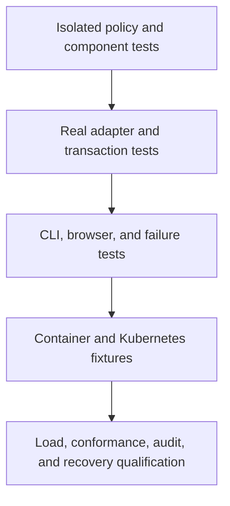

# Verification and evidence

Tests support specific claims at specific boundaries. Code coverage reports executed
paths. Neither metric proves protocol conformance, resistance to every attack, or
production readiness.

This guide separates reproducible commands from dated evidence. Run the relevant
checks after a behavior change. Documentation-only changes require formatting,
link, diagram, command-reference, and source-consistency checks.

## Test structure



Each level adds evidence. Passing a lower level does not imply success at a higher
one. The final level remains incomplete.

Unit tests mirror production paths under `tests/unit`. They define inputs and fakes
in source. Installed dependencies suffice. Unit tests do not read fixtures or local
settings, change process environment, call networks, or start services.

Rust module inclusion preserves access to private implementation details without
publishing test-only APIs. Frontend components use jsdom and fake API ports.
Integration suites own disposable services and clean only their own resources.

## Command map

| Command                       | Evidence                                                       | Prerequisites                               |
| ----------------------------- | -------------------------------------------------------------- | ------------------------------------------- |
| `make check`                  | Format, lint, types, architecture, isolated tests              | Installed locked dependencies               |
| `make ci`                     | Fast checks plus release and static builds                     | Same toolchain                              |
| `make test-postgres`          | SQL constraints, transactions, races, operator persistence     | Docker with Compose                         |
| `make test-db-authority`      | Reviewed grants and denied database operations                 | Docker                                      |
| `make test-redis`             | Shared budgets, continuity loss, TLS, uncertain writes, login  | Docker and OpenSSL                          |
| `make test-cli`               | Real parser, pipes, terminal restoration, cancellation         | Python 3 and POSIX host                     |
| `make test-operator-accounts` | Fresh operator authentication and shared budgets               | Database, Redis, and CLI test prerequisites |
| `make test-account-launcher`  | Protected stdin, deadlines, exit status, owned process cleanup | Local process toolchain                     |
| `make test-browser`           | Static console and protocol flows over verified HTTPS          | Pinned Chromium, Docker, OpenSSL            |
| `make test-media`             | Browser and real S3 adapter paths                              | Browser prerequisites                       |
| `make test-compose`           | Packaged HTTPS, roles, failure handling, isolated restore      | Built application image and Docker          |
| `make test-kubernetes`        | Two replicas, policies, Jobs, isolation, runtime behavior      | kind, kubectl, built images                 |
| `make test-release-tools`     | Git archives and release-tool failure handling                 | Git and Node                                |
| `make source-package-check`   | Selected Git tree and archive contents                         | Git and Node                                |
| `make audit-dependencies`     | Current Rust and JavaScript advisories                         | Network and pinned audit tools              |

`make help` lists focused policy suites and benchmark targets. `make browser-install`
installs the pinned browser. Integration prerequisites never become unit-test prerequisites.

## Security properties under test

| Property                | Representative evidence                                             | Practical limit                                             |
| ----------------------- | ------------------------------------------------------------------- | ----------------------------------------------------------- |
| Permission intersection | Exhaustive small-set properties and mutation checks                 | Does not prove transport authentication                     |
| Immediate revocation    | Primary reads, shared/exclusive fences, concurrent writers          | Does not control work already accepted by a resource server |
| One-time consumption    | Code, proof, and refresh transaction races                          | Lost responses still create caller uncertainty              |
| Shared login budgets    | Separate processes, boundary times, Redis failures                  | No multi-host capacity or adversarial traffic certification |
| Credential isolation    | Purpose-separated digests, redacted output, role-denial tests       | Database owners remain trusted                              |
| Browser boundaries      | Origin, CSRF, cookies, secret clearing, HTTPS checks                | Chromium coverage is not cross-browser certification        |
| External effects        | Media orphan cleanup, SMTP leases, limiter journal faults           | No atomic commit across independent services                |
| Packaging               | Nonroot, read-only runtime, dropped capabilities, isolated recovery | Fixture success does not qualify every production platform  |

The browser harness verifies its temporary certificate chain and hostname. Chromium
pins only that fixture's leaf key. Tests do not install global trust or disable all
certificate checks. Captured screenshots omit credentials. The suite does not retain
secret-bearing traces or videos.

## Coverage denominators

| Target                      | Scope                                                    | Interpretation                                                      |
| --------------------------- | -------------------------------------------------------- | ------------------------------------------------------------------- |
| `make coverage-core`        | Domain and application crates                            | Framework-free policy and orchestration only                        |
| `make coverage-rust`        | Rust libraries under isolated tests                      | External effects remain unexecuted                                  |
| `make coverage-web`         | Authored frontend unit/component scope                   | Excludes upstream button code and static build/layout configuration |
| `make coverage-postgres`    | Rust units, PostgreSQL, host operator, server executable | Does not cover every Redis or browser path                          |
| `make coverage-integration` | Rust units, PostgreSQL, Redis, operator execution        | Rust instrumentation does not measure JavaScript or Lua             |
| `make coverage-unit`        | Separate Rust and frontend unit reports                  | Not a whole-system percentage                                       |

The target remains **100% of authored executable logic**. Existing Rust line gates
remain at 100%. Partial reports must retain uncovered entrypoints and coordination
paths. Stable Rust's report does not provide branch coverage. Regions, functions,
lines, statements, and branches are different denominators.

Install optional instrumentation explicitly:

```sh
cargo install cargo-llvm-cov --version 0.9.1 --locked
rustup component add llvm-tools-preview
cargo install cargo-mutants --version 27.1.0 --locked
```

Mutation targets run an unmodified baseline first, then test selected source mutations.
A missed mutation requires investigation. A passing coverage percentage cannot clear it.

## Recorded implementation baseline

This historical consolidated baseline covers
commit [`9e34da4`](https://github.com/OneTesseractInMultiverse/darkhorse-identity/commit/9e34da49cd38e79dfa8cf2095bfba099690dfcf1)
on **2026-09-23**.

| Check                | Recorded result                                                                     |
| -------------------- | ----------------------------------------------------------------------------------- |
| Isolated tests       | 521 passing: 162 adapter, 34 application, 105 domain, 143 frontend, 77 tooling      |
| PostgreSQL scenarios | 167 passing                                                                         |
| Redis scenarios      | Five infrastructure and 20 limiter/operator scenarios passing                       |
| CLI and packaging    | CLI/terminal/launcher, Compose, Kubernetes, image and packaged Redis checks passing |
| Core Rust coverage   | 2006/2006 lines, 315/315 functions, 2770/2776 regions, or 99.78% regions            |
| Dependency scan      | 351 Rust and 336 JavaScript dependencies, no findings at scan time                  |
| Hosted checks        | Source and dependency jobs passed for the cited commit                              |

One Redis child-process helper is ignored as a standalone test and invoked by its
parent scenario. The counts above do not claim another independent passing test.
Whole-system authored coverage remains below target. No fresh combined coverage
percentage was produced for that increment.

The public [issue evidence](https://github.com/OneTesseractInMultiverse/darkhorse-identity/issues/23#issuecomment-5803032077)
and [hosted run](https://github.com/OneTesseractInMultiverse/darkhorse-identity/actions/runs/35921067178)
record this baseline. Advisory results are time-bound. Rescan before release.
The historical measurements in [performance](performance.md) describe different,
explicitly dated runs and must not be treated as new measurements.

## Migration reconciliation increment

The migration increment on **2026-09-23** passed 538 isolated tests: 175 adapter,
35 application, 105 domain, 143 frontend, and 80 tooling tests. The real PostgreSQL
suite passed 186 scenarios. New scenarios cover fresh setup and adoption, partial
batches, checksum and history rejection, concurrent migrators, receipt rollback,
cancellation, and discarded intent/step/final commit replies. Actual TCP logins
verify owner-only migration and inspection and grant-policy reapplication.
CLI/terminal and launcher process checks passed. See [migration reconciliation](migration-operations.md)
for the scope and operational limits. The owning issue records the committed
revision and packaged/hosted results.

The combined Rust unit/PostgreSQL/CLI report measured **14,087/15,244 lines
(92.41%)**, **1,929/2,052 functions (94.01%)**, and **23,397/26,914 regions
(86.93%)**. The unchanged 100% line gate fails. The five new migration Rust modules
measured 237/237 lines and 41/41 functions, with 397/419 regions (94.75%). These
figures do not measure JavaScript, SQL, Lua, or every runtime path. They do not
replace the whole-system coverage qualification in #2.

## Release interpretation

Open requirements include complete coverage, privileged authentication assurance,
provider conformance, broader accessibility, audit retention, coordinated restoration,
external security review, and sustained multi-host capacity. Read
[release qualification](release-readiness.md) before making readiness claims.
